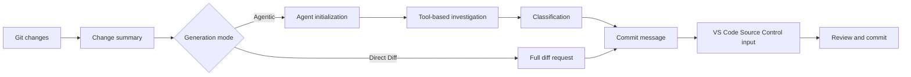

<!-- markdownlint-disable MD001 MD013 MD026 MD033 MD036 MD041 -->

<div align="center">


# Commit-Copilot

### Agentic commit messages that understand your code—not just your diff.

Commit-Copilot is a VS Code extension that investigates your repository with a multi-step AI agent, classifies changes using strict Conventional Commits rules, and writes polished commit messages directly into Source Control.

[](https://marketplace.visualstudio.com/items?itemName=JeremySu0818.commit-copilot)
[](https://open-vsx.org/extension/JeremySu0818/commit-copilot)
[](#requirements)
[](#development)
[](#conventional-commits-classification)
[](LICENSE)

**Agentic investigation · 9 built-in providers · Custom endpoints · Local Ollama support · 20 languages**

</div>

---

## Why Commit-Copilot?

Most AI commit tools send a raw diff to a model and hope for a good one-line summary.

Commit-Copilot takes a different approach.

It begins with lightweight change metadata, then lets an autonomous agent decide what it needs to inspect: diffs, file contents, symbols, references, project-wide patterns, and recent commits. Only after understanding the change does it classify and generate the message.

| Capability                                  | Basic diff-to-prompt tools | Commit-Copilot |
| ------------------------------------------- | :------------------------: | :------------: |
| Reads the complete diff immediately         |            Yes             |    Optional    |
| Selectively investigates relevant files     |             No             |      Yes       |
| Understands code structure                  |          Limited           |      Yes       |
| Finds symbol references through LSP         |             No             |      Yes       |
| Searches hidden string/config relationships |             No             |      Yes       |
| Learns from recent commit style             |           Rarely           |      Yes       |
| Uses index-aware staged analysis            |           Rarely           |      Yes       |
| Supports native and local agent workflows   |          Limited           |      Yes       |
| Applies strict commit-type boundaries       |      Model-dependent       |      Yes       |
| Never stages without consent                |           Varies           |      Yes       |

> [!TIP]
> Use **Agentic** mode for accuracy and context. Use **Direct Diff** mode when speed matters more than deep investigation.

---

## Highlights

<table>
<tr>
<td width="50%" valign="top">

<h3>Repository-aware agent</h3>

The agent starts with file names, change types, line counts, and project structure—then chooses the tools required to understand the change.

</td>
<td width="50%" valign="top">

<h3>Git index accuracy</h3>

For staged changes, repository tools prefer content from the Git index. LSP reference analysis uses a temporary workspace reconstructed from the staged state.

</td>
</tr>
<tr>
<td width="50%" valign="top">

<h3>Multi-provider by design</h3>

Use Google Gemini, OpenAI, Anthropic, xAI, Groq, OpenRouter, DeepSeek, Alibaba Qwen, Ollama, or a custom compatible endpoint.

</td>
<td width="50%" valign="top">

<h3>Strict Conventional Commits</h3>

The prompt allows all 11 Conventional Commit types and applies priority-ordered classification rules with explicit boundary guidance. Scope, body, footer, and Gitmoji are independently configurable.

</td>
</tr>
<tr>
<td width="50%" valign="top">

<h3>Local-model agent workflow</h3>

Ollama models can use the same investigation tools through Commit-Copilot's built-in text tool protocol—even without native tool-calling support.

</td>
<td width="50%" valign="top">

<h3>Safe, review-first workflow</h3>

Commit-Copilot writes the result into the Source Control input box. You remain in control of staging, editing, and committing.

</td>
</tr>
</table>

---

## Table of Contents

- [How It Works](#how-it-works)
- [Agent Tools](#agent-tools)
- [Features](#features)
- [Supported Providers](#supported-providers)
- [Requirements](#requirements)
- [Installation](#installation)
- [Configuration](#configuration)
- [Usage](#usage)
- [Conventional Commits Classification](#conventional-commits-classification)
- [Change Detection](#change-detection)
- [Localization](#localization)
- [Security and Privacy](#security-and-privacy)
- [Development](#development)
- [Testing](#testing)
- [FAQ](#faq)
- [Contributing](#contributing)
- [License](#license)

---

## How It Works



### Agentic workflow

1. **Collect change metadata**
   Commit-Copilot gathers file names, change types, line counts, and a project structure tree.

2. **Initialize the agent**
   The model receives the summary and an instruction set for autonomous commit-message generation. Raw diff content is not included initially.

3. **Investigate with tools**
   The agent selectively inspects the repository, requesting only the context it considers useful.

4. **Classify the change**
   Priority-ordered rules determine the commit type. When scope output is enabled, the agent also selects the affected module or area.

5. **Generate the message**
   The final message is written to the Source Control input box for review and editing.

> [!NOTE]
> When **Hybrid Generation** is enabled, existing Source Control input is treated as reference text for wording and intent. Instruction-like content inside that draft cannot override the generation rules.

### Direct Diff workflow

Direct Diff skips the investigation loop and sends the complete diff to the selected model in a single request. It is faster, available for every provider, and useful for small or obvious changes.

---

## Agent Tools

The agent can combine the following tools across multiple investigation steps:

| Tool                   | Purpose                                                                                        |
| ---------------------- | ---------------------------------------------------------------------------------------------- |
| `get_diff`             | Retrieves the actual diff for a specific file.                                                 |
| `read_file`            | Reads file content, optionally within a line range. Staged analysis prefers Git-index content. |
| `get_file_outline`     | Returns structural information such as functions, classes, and exports.                        |
| `find_references`      | Uses VS Code's Language Server Protocol to locate syntax-aware symbol references.              |
| `get_recent_commits`   | Reads recent commit messages to infer the repository's existing style.                         |
| `search_code`          | Searches the workspace for strings or patterns that imports alone cannot reveal.               |
| `write_commit_message` | Submits the final structured commit message.                                                   |

Gemini, Anthropic, and OpenAI-compatible routes use structured tool calls. Ollama uses an equivalent text protocol with support for batched calls, application-assigned call IDs, structured results, per-call errors, and final submission.

---

## Features

### Generation and analysis

- **Agentic and Direct Diff modes**
- **Configurable maximum agent steps**
- **Cancellable investigation loop**
- **Automatic retries** for retryable remote API failures and rate limits
- **Cross-project pattern search** for environment variables, event names, configuration keys, and other string-based relationships
- **LSP reference impact radar** for syntax-aware symbol analysis
- **Recent commit inspection** to better match project conventions
- **Hybrid Generation** using existing Source Control text as a safe reference draft

### Git-aware behavior

- Detects staged, unstaged, mixed, untracked, and untracked-only scenarios
- Prompts before staging untracked files
- Never auto-stages without explicit consent
- Prefers Git-index content when staged files are inspected
- Creates a temporary staged-state workspace snapshot for LSP reference analysis
- Updates the main view in real time as repository state changes

### Commit output controls

Independently toggle:

- **Scope**
- **Body**
- **Footer**
- **Gitmoji prefix**

Defaults:

| Element | Default |
| ------- | :-----: |
| Scope   |   On    |
| Body    |   On    |
| Footer  |   Off   |
| Gitmoji |   Off   |

### VS Code integration

Launch Commit-Copilot from:

- The **Activity Bar**
- The **Source Control navigation bar**
- The **Command Palette**

Generated messages are inserted into the standard Source Control input box, where they can be reviewed and edited before committing.

### Provider validation and model management

- API keys are validated against the selected provider's real endpoint before being saved
- Provider-specific authentication, quota, and connection errors are surfaced with actionable guidance
- OpenRouter, Alibaba Qwen, Ollama, and custom providers can fetch model lists dynamically
- Ollama and custom providers support manually adding or removing model IDs when discovery is incomplete
- Custom providers support OpenAI-compatible and Anthropic-compatible APIs

---

## Supported Providers

| Provider            | Highlights                                                             |
| ------------------- | ---------------------------------------------------------------------- |
| **Google Gemini**   | Native structured tools and multiple Gemini generations                |
| **OpenAI**          | Reasoning, general-purpose, compact, and GPT-5-series models           |
| **Anthropic**       | Claude Haiku, Sonnet, Opus, and Fable families                         |
| **xAI Grok**        | Reasoning and non-reasoning Grok variants                              |
| **Groq**            | Fast hosted Llama, Qwen, and `gpt-oss` models                          |
| **OpenRouter**      | Dynamic access to compatible models with tool-support filtering        |
| **DeepSeek**        | Chat, Reasoner, and V4 variants                                        |
| **Alibaba Qwen**    | DashScope integration with dynamic model discovery                     |
| **Ollama**          | Local models with dynamic discovery and a built-in agent tool protocol |
| **Custom Provider** | OpenAI-compatible or Anthropic-compatible endpoints                    |

<details>
<summary><strong>View the model families listed by Commit-Copilot</strong></summary>

### Google Gemini

- Gemini 2.5 Flash-Lite, Flash, and Pro
- Gemini 3 Flash
- Gemini 3.1 Flash-Lite and Pro
- Gemini 3.5 Flash

### OpenAI

- o3 and o3-mini
- o4-mini
- GPT-4o mini and GPT-4o
- GPT-4.1 nano, mini, and GPT-4.1
- GPT-5 nano, mini, and GPT-5
- GPT-5.1
- GPT-5.2
- GPT-5.4 nano, mini, and GPT-5.4
- GPT-5.5
- GPT-5.6 Luna, Terra, and Sol

### Anthropic

- Claude Sonnet 4 and Opus 4
- Claude Opus 4.1
- Claude Haiku, Sonnet, and Opus 4.5
- Claude Sonnet and Opus 4.6
- Claude Opus 4.7
- Claude Opus 4.8
- Claude Sonnet 5 and Fable 5

### xAI Grok

- Grok 4.20, reasoning and non-reasoning
- Grok 4.3

### Groq

- Llama 3.1 8B
- Llama 3.3 70B
- Llama 4 Scout
- `gpt-oss-20B`
- `gpt-oss-120B`
- `gpt-oss-safeguard-20B`
- Qwen 3 32B

### DeepSeek

- DeepSeek Chat
- DeepSeek R1 / Reasoner
- DeepSeek V4 Flash and Pro

> [!IMPORTANT]
> Model availability depends on the provider, account, region, endpoint, and current provider catalog. OpenRouter, Qwen, Ollama, and custom-provider lists may be discovered dynamically.

</details>

---

## Requirements

- **VS Code** `1.91.0` or newer
- **Git**, available through VS Code's built-in Git extension
- One of the following:
  - A valid API key for a supported remote provider
  - A reachable local or remote Ollama instance
  - Credentials for a compatible custom endpoint

For development:

- **Node.js** `20+`
- **npm**

---

## Installation

Install Commit-Copilot from either:

- [**Visual Studio Code Marketplace**](https://marketplace.visualstudio.com/items?itemName=JeremySu0818.commit-copilot)
- [**Open VSX Registry**](https://open-vsx.org/extension/JeremySu0818/commit-copilot)

After installation, open a Git repository in VS Code and select the **Commit Copilot** icon in the Activity Bar.

---

## Configuration

### Basic setup

1. Open the **Commit Copilot** view from the Activity Bar.
2. Select a provider.
3. Enter the provider API key, or an Ollama host URL.
4. Select **Save**.
5. Wait for real-time credential validation.
6. Choose a model when model selection is available.

> [!IMPORTANT]
> Ollama generation always runs `ollama pull` for the selected model before generation and reports download progress in the notification area. This may re-download model layers even when the model already exists locally.

### Options

| Option                      | Default | Description                                                                                           |
| --------------------------- | ------- | ----------------------------------------------------------------------------------------------------- |
| **Generate Mode**           | Agentic | `Agentic` runs a multi-step investigation loop. `Direct Diff` sends the complete diff in one request. |
| **Hybrid Generation**       | Off     | Uses existing Source Control text as reference content while isolating it from prompt instructions.   |
| **Max Agent Steps**         | `0`     | Maximum tool-call iterations. Set to `0` for no limit.                                                |
| **Include Scope**           | On      | Requires a Conventional Commits scope in the subject when enabled.                                    |
| **Include Body**            | On      | Requires a descriptive body section when enabled.                                                     |
| **Include Footer**          | Off     | Requires a footer section when enabled; unsupported facts are never fabricated.                       |
| **Include Gitmoji**         | Off     | Requires exactly one mapped Gitmoji prefix when enabled.                                              |
| **Extension Language**      | Auto    | Follows VS Code's display language unless manually pinned.                                            |
| **Commit Message Language** | English | Controls the generated subject, body, and footer language independently.                              |

### Custom provider

To add an OpenAI-compatible or Anthropic-compatible endpoint:

1. Open provider settings.
2. Select **Add Custom Provider**.
3. Choose the API format.
4. Enter a display name and base URL.
5. Save the provider.
6. Enter and validate the API key.
7. Select a discovered model or add a model ID through **Manage Models...**.

For Anthropic-compatible endpoints, the maximum output token value can also be configured.

---

## Usage

### Method A: Activity Bar

1. Open the **Commit Copilot** view.
2. Confirm that the repository contains staged, unstaged, or untracked changes.
3. Select **Generate Commit Message**.
4. Respond to any staging or change-selection prompt.

### Method B: Source Control

1. Open Source Control with `Ctrl+Shift+G`.
2. Select the Commit-Copilot wand icon in the navigation bar.

### Method C: Command Palette

1. Open the Command Palette:
   - Windows/Linux: `Ctrl+Shift+P`
   - macOS: `Cmd+Shift+P`
2. Run **Commit-Copilot: Generate Commit Message**.

### Review and commit

The generated message appears in the Source Control input box.

You can edit it, then commit with VS Code's standard Source Control commit action.

---

## Conventional Commits Classification

Commit-Copilot allows the following 11 Conventional Commit types:

| Type       | Intended use                                               |
| ---------- | ---------------------------------------------------------- |
| `feat`     | Introduces a user-visible capability                       |
| `fix`      | Corrects faulty behavior                                   |
| `docs`     | Changes documentation only                                 |
| `style`    | Changes formatting without affecting behavior              |
| `refactor` | Restructures code without adding a feature or fixing a bug |
| `perf`     | Improves performance                                       |
| `test`     | Adds or updates tests                                      |
| `build`    | Changes the build system or external dependencies          |
| `ci`       | Changes continuous integration configuration               |
| `chore`    | Performs maintenance not covered by another type           |
| `revert`   | Reverts an earlier change                                  |

Output follows Conventional Commits syntax:

```text
type(scope): concise description

Explanatory body describing what changed and why.
```

Depending on configuration, scope, body, footer, and Gitmoji can be required or omitted. The first line is limited to 72 characters and is ideally kept under 50.

---

## Change Detection

Commit-Copilot recognizes five repository states:

| Scenario                 | Behavior                                   |
| ------------------------ | ------------------------------------------ |
| **Staged only**          | Uses the staged diff and index-aware tools |
| **Unstaged only**        | Analyzes working-tree changes              |
| **Mixed**                | Prompts for the intended change set        |
| **Unstaged + untracked** | Presents contextual options                |
| **Untracked only**       | Offers to stage the files and generate     |

No file is staged automatically without explicit confirmation.

---

## Localization

The extension UI can follow VS Code automatically or be pinned to one of 20 languages:

<table>
<tr>
<td>العربية</td>
<td>Čeština</td>
<td>Deutsch</td>
<td>English</td>
</tr>
<tr>
<td>Español</td>
<td>Français</td>
<td>हिन्दी</td>
<td>Magyar</td>
</tr>
<tr>
<td>Bahasa Indonesia</td>
<td>Italiano</td>
<td>日本語</td>
<td>한국어</td>
</tr>
<tr>
<td>Nederlands</td>
<td>Polski</td>
<td>Português (Brasil)</td>
<td>Русский</td>
</tr>
<tr>
<td>Türkçe</td>
<td>Tiếng Việt</td>
<td>简体中文</td>
<td>繁體中文</td>
</tr>
</table>

The **commit message language** is configured separately from the extension UI language, so each can use a different language.

---

## Security and Privacy

- API keys are stored with **VS Code Secret Storage**
- Keys are validated directly against the selected provider before being saved
- Commit-Copilot never stages files without explicit consent
- Hybrid Generation treats existing Source Control text as untrusted reference content
- Remote-provider requests may include repository metadata, diffs, or file content selected during analysis
- Ollama can keep model inference within your own environment, depending on your Ollama deployment

> [!CAUTION]
> Review your selected provider's data-handling policy before sending proprietary or sensitive repository content to a remote API.

---

## Development

### Install dependencies

```bash
npm install
```

### Compile for development

```bash
npm run compile
```

For continuous TypeScript and esbuild rebuilds:

```bash
npm run watch
```

### Package a VSIX

```bash
npm run build
```

The build script installs dependencies, runs the VS Code packaging pipeline, and produces a `.vsix` package.

### Code quality

Check lint rules:

```bash
npm run lint
```

Format source files:

```bash
npm run format
```

Verify formatting without modifying files:

```bash
npm run check-format
```

---

## Testing

Run the complete unit-test pipeline:

```bash
npm test
```

This runs:

1. `npm run test:build`
2. `node --test --test-concurrency=1 "out/test/**/*.test.js"`

Current coverage includes:

- All agent tools:
  - `get_diff`
  - `read_file`
  - `get_file_outline`
  - `find_references`
  - `get_recent_commits`
  - `search_code`
- Native structured-tool agent loops
- Ollama text-protocol agent loops
- Batched calls and localized tool schemas
- Malformed-response recovery
- Final tool submission
- Tool dispatch through `executeToolCall`
- Context parsing and construction
- Staged workspace snapshot utilities
- Retry behavior
- Localized errors
- Main view provider behavior
- Custom model management
- State managers

---

## FAQ

<details>
<summary><strong>Does Commit-Copilot commit automatically?</strong></summary>

No. It writes the generated message into the Source Control input box. You can review, edit, and commit it yourself.

</details>

<details>
<summary><strong>Does the agent receive my entire repository?</strong></summary>

In Agentic mode, it starts with change metadata and the tracked project file tree—not the contents of every file. It then requests specific diffs, files, references, or searches as needed. Direct Diff mode sends the complete selected diff in one request.

</details>

<details>
<summary><strong>Can Ollama models use agent tools without native tool calling?</strong></summary>

Yes. Commit-Copilot includes a text tool protocol that gives Ollama models access to the same multi-step investigation workflow.

</details>

<details>
<summary><strong>What does Max Agent Steps = 0 mean?</strong></summary>

It removes the tool-call iteration cap. Any positive value limits how many investigation steps the agent can take before producing the final result.

</details>

<details>
<summary><strong>Can I use an endpoint that is not built in?</strong></summary>

Yes. Add it as an OpenAI-compatible or Anthropic-compatible custom provider, then fetch or manually configure its model IDs.

</details>

<details>
<summary><strong>Why does Ollama pull the model every time?</strong></summary>

The extension intentionally runs `ollama pull` before each generation to ensure the selected model is available and current. Depending on the local state, this may download model layers again.

</details>

---

## Contributing

Contributions are welcome.

A good contribution flow is:

1. Create a focused branch.
2. Make the change.
3. Run linting, formatting checks, and tests.
4. Describe the motivation and behavior clearly in the pull request.
5. Include relevant test coverage for behavioral changes.

Before submitting:

```bash
npm run lint
npm run check-format
npm test
```

For bug reports, include the provider, model, generation mode, repository change state, relevant logs, and reliable reproduction steps. Never include API keys or sensitive repository content.

---

## License

Commit-Copilot is released under the [MIT License](LICENSE).

---

<div align="center">

Built for developers who want commit messages with context—not guesswork.

</div>
