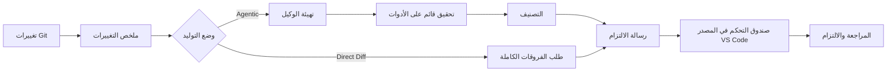

<!-- markdownlint-disable MD001 MD013 MD026 MD033 MD036 MD041 -->

<div align="center">


# Commit-Copilot

### رسائل التزام وكيلية (Agentic) تفهم شفرتك البرمجية بالكامل—وليس فقط الفروقات (diff).

Commit-Copilot هي إضافة لـ VS Code تقوم بفحص مستودعك البرمجي عبر وكيل ذكاء اصطناعي مستقل متعدد الخطوات، وتصنف التغييرات وفقاً لقواعد Conventional Commits الصارمة، وتكتب رسائل التزام احترافية مباشرة في صندوق التحكم في المصدر (Source Control).

تعمل الإضافة بسلاسة مع كبرى نماذج الذكاء الاصطناعي السحابية (Gemini و OpenAI و Anthropic Claude و DeepSeek)، ونماذج Ollama المحلية التي تركز على الخصوصية، بالإضافة إلى أي نقاط نهاية مخصصة (متوافقة مع تنسيقات OpenAI و Anthropic).

[](https://marketplace.visualstudio.com/items?itemName=JeremySu0818.commit-copilot)
[](https://open-vsx.org/extension/JeremySu0818/commit-copilot)
[](https://open-vsx.org/extension/JeremySu0818/commit-copilot)
[](#المتطلبات)
[](#التطوير)
[](#تصنيف-conventional-commits)
[](../../LICENSE)

**تحقيق وكيلي · 9 مزودين مدمجين · نقاط نهاية مخصصة · دعم Ollama المحلي · 20 لغة**

<p align="center">
  <b>Translations:</b>
  <a href="https://github.com/JeremySu0818/Commit-Copilot#readme">English</a> |
  <a href="https://github.com/JeremySu0818/Commit-Copilot/blob/main/docs/readme/README-zh-tw.md">繁體中文</a> |
  <a href="https://github.com/JeremySu0818/Commit-Copilot/blob/main/docs/readme/README-zh-cn.md">简体中文</a> |
  <a href="https://github.com/JeremySu0818/Commit-Copilot/blob/main/docs/readme/README-ja.md">日本語</a> |
  <a href="https://github.com/JeremySu0818/Commit-Copilot/blob/main/docs/readme/README-ko.md">한국어</a> |
  <a href="https://github.com/JeremySu0818/Commit-Copilot/blob/main/docs/readme/README-de.md">Deutsch</a> |
  <a href="https://github.com/JeremySu0818/Commit-Copilot/blob/main/docs/readme/README-fr.md">Français</a> |
  <a href="https://github.com/JeremySu0818/Commit-Copilot/blob/main/docs/readme/README-es.md">Español</a> |
  <a href="https://github.com/JeremySu0818/Commit-Copilot/blob/main/docs/readme/README-pt-br.md">Português (Brasil)</a> |
  <a href="https://github.com/JeremySu0818/Commit-Copilot/blob/main/docs/readme/README-ru.md">Русский</a> |
  <a href="https://github.com/JeremySu0818/Commit-Copilot/blob/main/docs/readme/README-it.md">Italiano</a> |
  <a href="https://github.com/JeremySu0818/Commit-Copilot/blob/main/docs/readme/README-nl.md">Nederlands</a> |
  <a href="https://github.com/JeremySu0818/Commit-Copilot/blob/main/docs/readme/README-pl.md">Polski</a> |
  <a href="https://github.com/JeremySu0818/Commit-Copilot/blob/main/docs/readme/README-tr.md">Türkçe</a> |
  <a href="https://github.com/JeremySu0818/Commit-Copilot/blob/main/docs/readme/README-vi.md">Tiếng Việt</a> |
  <a href="https://github.com/JeremySu0818/Commit-Copilot/blob/main/docs/readme/README-id.md">Bahasa Indonesia</a> |
  <a href="https://github.com/JeremySu0818/Commit-Copilot/blob/main/docs/readme/README-hu.md">Magyar</a> |
  <a href="https://github.com/JeremySu0818/Commit-Copilot/blob/main/docs/readme/README-cs.md">Čeština</a> |
  <a href="https://github.com/JeremySu0818/Commit-Copilot/blob/main/docs/readme/README-hi.md">हिन्दी</a> |
  <a href="https://github.com/JeremySu0818/Commit-Copilot/blob/main/docs/readme/README-ar.md">العربية</a>
</p>

</div>

---

## لماذا Commit-Copilot؟

ترسل معظم أدوات الالتزام بالذكاء الاصطناعي الفروقات الخام (raw diff) إلى النموذج وتأمل في الحصول على ملخص جيد في سطر واحد.

لكن Commit-Copilot يتخذ نهجاً مختلفاً تماماً.

يبدأ ببيانات وصفية خفيفة عن التغييرات، ثم يمنح وكيلاً مستقلاً القدرة على تحديد ما يحتاج إلى فحصه: الفروقات، محتويات الملفات، الرموز البرمجية، المراجع، الأنماط الشاملة في المشروع، وتاريخ الالتزامات السابقة. وفقط بعد الفهم العميق للتغيير وسياقه، يقوم بتصنيفه وإنشاء الرسالة.

| القدرة                                      | أدوات diff-to-prompt التقليدية | Commit-Copilot |
| ------------------------------------------- | :----------------------------: | :------------: |
| قراءة الفروقات الكاملة فوراً                |              نعم               |    اختياري     |
| فحص الملفات ذات الصلة بشكل انتقائي          |               لا               |      نعم       |
| فهم بنية الشفرة والرموز                     |             محدود              |      نعم       |
| العثور على مراجع الرموز عبر LSP             |               لا               |      نعم       |
| البحث عن العلاقات النصية والإعدادات المخفية |               لا               |      نعم       |
| التعلّم من أسلوب الالتزامات السابقة         |             نادراً             |      نعم       |
| تحليل دقيق بالاعتماد على فهرس Git (staged)  |             نادراً             |      نعم       |
| دعم سير العمل المحلي والوكيلي               |             محدود              |      نعم       |
| تطبيق حدود صارمة لأنواع الالتزامات          |       يعتمد على النموذج        |      نعم       |
| عدم تجهيز (stage) أي ملف دون موافقة صريحة   |             متباين             |      نعم       |

> [!TIP]
> استخدم وضع **الوكيل (Agentic)** للحصول على أعلى درجات الدقة والسياق الكامل. واستخدم وضع **الفروقات المباشرة (Direct Diff)** عندما تكون السرعة أهم من التحقيق المتعمق.

---

## أبرز المميزات

<table>
<tr>
<td width="50%" valign="top">

<h3>وكيل مدرك للمستودع</h3>

يبدأ الوكيل بأسماء الملفات، وأنواع التغييرات، وعدد الأسطر، وهيكل المشروع—ثم يختار الأدوات اللازمة لفهم التغيير بدقة.

</td>
<td width="50%" valign="top">

<h3>دقة فهرس Git</h3>

بالنسبة للتغييرات المجهزة (staged)، تفضل أدوات المستودع قراءة المحتوى من فهرس Git. يتم تشغيل تحليل مراجع LSP في مساحة عمل مؤقتة مُعاد بناؤها من الحالة المجهزة.

</td>
</tr>
<tr>
<td width="50%" valign="top">

<h3>دعم أصيل لمزودين متعددين</h3>

استخدم Google Gemini أو OpenAI أو Anthropic أو xAI أو Groq أو OpenRouter أو DeepSeek أو Alibaba Qwen أو Ollama أو أي نقطة نهاية مخصصة متوافقة.

</td>
<td width="50%" valign="top">

<h3>التزام صارم بمعايير Conventional Commits</h3>

يدعم جميع أنواع Conventional Commits الإحدى عشرة، مع تطبيق قواعد تصنيف مرتبة حسب الأولوية وتوجيهات واضحة لحدود الأنواع. يمكن تكوين Scope و Body و Footer و Gitmoji بشكل مستقل.

</td>
</tr>
<tr>
<td width="50%" valign="top">

<h3>سير عمل وكيلي للنماذج المحلية</h3>

يمكن لنماذج Ollama استخدام أدوات التحقيق نفسها من خلال بروتوكول الأدوات النصي المدمج في Commit-Copilot—حتى دون دعم استدعاء الأدوات الأصلي (tool calling).

</td>
<td width="50%" valign="top">

<h3>سير عمل آمن قائم على المراجعة</h3>

يكتب Commit-Copilot النتيجة في صندوق إدخال التحكم في المصدر. تحتفظ بالتحكم الكامل في تجهيز الملفات وتعديل الرسالة وتأكيد الالتزام.

</td>
</tr>
</table>

---

## جدول المحتويات

- [كيف يعمل؟](#كيف-يعمل)
- [أدوات الوكيل](#أدوات-الوكيل)
- [الميزات](#الميزات)
- [المزودون المدعومون](#المزودون-المدعومون)
- [المتطلبات](#المتطلبات)
- [التثبيت](#التثبيت)
- [التكوين](#التكوين)
- [طريقة الاستخدام](#طريقة-الاستخدام)
- [تصنيف Conventional Commits](#تصنيف-conventional-commits)
- [اكتشاف التغييرات](#اكتشاف-التغييرات)
- [التعريب واللغات](#التعريب-واللغات)
- [الأمان والخصوصية](#الأمان-والخصوصية)
- [التطوير](#التطوير)
- [الاختبار](#الاختبار)
- [الأسئلة الشائعة (FAQ)](#الأسئلة-الشائعة-faq)
- [المساهمة](#المساهمة)
- [الترخيص](#الترخيص)

---

## كيف يعمل؟



### سير العمل الوكيلي (Agentic)

1. **جمع البيانات الوصفية للتغييرات**
   يجمع Commit-Copilot أسماء الملفات وأنواع التعديلات وعدد الأسطر وشجرة هيكل المشروع.

2. **تهيئة الوكيل**
   يتلقى النموذج الملخص المنظم وتوجيهات الإنشاء الذاتي. لا يتم إرسال الفروقات الخام في البداية.

3. **التحقيق باستخدام الأدوات**
   يقوم الوكيل بفحص المستودع بشكل انتقائي، ويطلب فقط السياق الذي يراه ضرورياً.

4. **تصنيف التغيير**
   تحدد القواعد المحددة بالأولويات نوع الالتزام. وعند تمكين خيار النطاق (Scope)، يحدد الوكيل أيضاً الوحدة أو المنطقة المتأثرة.

5. **توليد الرسالة**
   تتم كتابة الرسالة النهائية في صندوق التحكم في المصدر (Source Control) لمراجعتها وتعديلها.

> [!NOTE]
> عند تمكين **التوليد الهجين (Hybrid Generation)**، يُعامل النص الحالي في صندوق التحكم في المصدر كمسودة مرجعية للصياغة والقصد فقط. ولا يمكن لأي تعليمات داخل تلك المسودة تجاوز قواعد التوليد.

### سير عمل الفروقات المباشرة (Direct Diff)

يتجاوز وضع Direct Diff حلقة التحقيق ويرسل الفروقات الكاملة إلى النموذج المحدد في طلب واحد. وهو أسرع ومتاح لجميع المزودين ومناسب للتغييرات البسيطة أو الواضحة.

---

## أدوات الوكيل

يمكن للوكيل الجمع بين الأدوات التالية عبر خطوات تحقيق متعددة:

| الأداة                 | الغرض                                                                                          |
| ---------------------- | ---------------------------------------------------------------------------------------------- |
| `get_diff`             | استرداد الفروقات الكاملة والدقيقة لملف واحد أو ملفات متعددة مطلوبة.                            |
| `read_file`            | قراءة محتوى الملف (اختيارياً ضمن نطاق أسطر محدد). يفضل قراءة محتوى فهرس Git للتغييرات المجهزة. |
| `get_file_outline`     | إرجاع المعلومات الهيكلية مثل الدوال، الفئات، الواجهات، والعناصر المصدرة.                       |
| `find_references`      | استخدام بروتوكول خادم اللغة (LSP) في VS Code لتحديد مراجع الرموز المدركة للقواعد اللغوية.      |
| `get_recent_commits`   | قراءة رسائل الالتزام الأخيرة للتعرف على أسلوب الكتابة المعتمد في المشروع.                      |
| `search_code`          | البحث في مساحة العمل عن سلاسل نصية أو أنماط لا تكشفها الاستيرادات بمفردها.                     |
| `write_commit_message` | إرسال رسالة الالتزام النهائية المنظمة وإنهاء الجلسة.                                           |

تستخدم مسارات Gemini و Anthropic و OpenAI المتوافقة استدعاءات الأدوات المنظمة الأصلية (tool calling). وتستخدم Ollama بروتوكولاً نصياً مكافئاً مع دعم الاستدعاءات المجمعة، ومعرفات الاستدعاء المخصصة من التطبيق، والنتائج المنظمة، ومعالجة أخطاء كل استدعاء، والتسليم النهائي.

تقبل أداة `get_diff` إما مساراً واحداً `path` أو مصفوفة مسارات غير فارغة `paths`. تقلل الطلبات متعددة الملفات من جولات الاتصال مع إعادة الفروقات الكاملة والدقيقة لكل ملف مطلوب دون اختصار.

يمكن للتوليد الوكيلي اختيارياً فرض تغطية كاملة للفروقات. عند التمكين في الإعدادات، يتم رفض استدعاء `write_commit_message` حتى يتم فحص كل ملف معدل بنجاح بواسطة `get_diff`. هذا الخيار معطل افتراضياً لتوفير الرموز والوقت.

---

## الميزات

### التوليد والتحليل

- **وضعا Agentic و Direct Diff**
- **حد أقصى قابل للتكوين لخطوات الوكيل (Max Agent Steps)**
- **إمكانية إلغاء عملية التحقيق في أي وقت**
- **إعادة المحاولة التلقائية (retries)** عند حدوث أخطاء شبكية مؤقتة أو تجاوز حدود المعدل (rate limits)
- **بحث شامل عن الأنماط في المشروع** لمتغيرات البيئة، وأسماء الأحداث، ومفاتيح الإعدادات، والعلاقات النصية
- **رادار تأثير مراجع LSP** للتحليل اللغوي الدقيق لتغييرات الرموز
- **فحص الالتزامات الأخيرة** لمطابقة تقاليد المشروع بدقة
- **التوليد الهجين (Hybrid Generation)** باستخدام نص SCM الحالي كمسودة مرجعية آمنة

### سلوك مدرك لـ Git

- اكتشاف 5 حالات للمستودع: المجهزة فقط (staged)، غير المجهزة فقط (unstaged)، المختلطة (mixed)، التي تتضمن ملفات غير متتبعة، وغير المتتبعة فقط (untracked-only)
- طلب التأكيد قبل تجهيز الملفات غير المتتبعة
- عدم تجهيز أي ملف تلقائياً دون موافقة صريحة
- تفضيل محتوى فهرس Git عند فحص الملفات المجهزة
- إنشاء لقطة مساحة عمل مؤقتة لتحليل مراجع LSP في الحالة المجهزة
- تحديث الواجهة في الوقت الفعلي مع تغير حالة المستودع

### التحكم في مخرجات الالتزام

التبديل المستقل بين العناصر التالية:

- **Scope** (النطاق)
- **Body** (المتن / التفاصيل)
- **Footer** (التذييل / Breaking Changes)
- **بادئة Gitmoji**

القيم الافتراضية:

| العنصر  | الحالة الافتراضية |
| ------- | :---------------: |
| Scope   |       مفعل        |
| Body    |       مفعل        |
| Footer  |       معطل        |
| Gitmoji |       معطل        |

### التكامل مع VS Code

تشغيل Commit-Copilot بسهولة من:

- أيقونة **شريط النشاط (Activity Bar)**
- أيقونة العصا السحرية في شريط تنقل **التحكم في المصدر (Source Control)**
- **لوحة الأوامر (Command Palette)**

تُدرج الرسالة الناتجة في صندوق إدخال التحكم في المصدر القياسي، حيث يمكنك مراجعتها وتعديلها بحرية قبل الالتزام.

### التحقق من المزودين وإدارة النماذج

- التحقق من مفاتيح API مباشرة على نقطة النهاية الحقيقية للمزود قبل حفظها
- توفير إرشادات واضحة وتفاعلية عند أخطاء المصادقة والحصص والاتصال
- جلب قوائم النماذج ديناميكياً لـ OpenRouter و Alibaba Qwen و Ollama والمزودين المخصصين
- إضافة وحذف معرفات النماذج يدوياً لـ Ollama والمزودين المخصصين
- دعم تنسيقات واجهات برمجة التطبيقات المتوافقة مع OpenAI و Anthropic

---

## المزودون المدعومون

| المزود            | أبرز الخصائص                                                       |
| ----------------- | ------------------------------------------------------------------ |
| **Google Gemini** | أدوات منظمة أصلية ودعم لأجيال Gemini المتعددة                      |
| **OpenAI**        | نماذج التفكير (reasoning)، ونماذج عامة، ونماذج مدمجة، وسلسلة GPT-5 |
| **Anthropic**     | عائلات Claude Haiku و Sonnet و Opus و Fable                        |
| **xAI Grok**      | إصدارات Grok الداعمة للتفكير والإصدارات القياسية                   |
| **Groq**          | استضافة فائقة السرعة لنماذج MiniMax و Qwen و `gpt-oss`             |
| **OpenRouter**    | وصول ديناميكي إلى كتالوج نماذج واسع مع تصفية دعم استدعاء الأدوات   |
| **DeepSeek**      | DeepSeek V4.1 Flash                                                |
| **Alibaba Qwen**  | تكامل DashScope مع استكشاف النماذج ديناميكياً                      |
| **Ollama**        | نماذج محلية مع قائمة ديناميكية وبروتوكول أدوات نصي مدمج            |
| **مزود مخصص**     | أي نقطة نهاية متوافقة مع معايير OpenAI أو Anthropic                |

<details>
<summary><strong>عرض عائلات النماذج المدعومة في Commit-Copilot</strong></summary>

### Google Gemini

- Gemini 2.5 Flash-Lite و Flash و Pro
- Gemini 3 Flash
- Gemini 3.1 Flash-Lite و Pro
- Gemini 3.5 Flash-Lite و Flash
- Gemini 3.6 Flash
- Gemini 3.7 Flash
- Gemini 3.8 Flash

### OpenAI

- o3 و o3-mini
- o4-mini
- GPT-4o mini و GPT-4o
- GPT-4.1 nano و mini و GPT-4.1
- GPT-5 nano و mini و GPT-5
- GPT-5.1
- GPT-5.2
- GPT-5.4 nano و mini و GPT-5.4
- GPT-5.5
- GPT-5.6 Luna و Terra و Sol
- GPT-6 Astra

### Anthropic

- Claude Sonnet 4 و Opus 4
- Claude Opus 4.1
- Claude Haiku و Sonnet و Opus 4.5
- Claude Sonnet و Opus 4.6
- Claude Opus 4.7
- Claude Opus 4.8
- Claude Sonnet 5 و Opus 5 و Fable 5
- Claude Fable 5.1

### xAI Grok

- Grok 4.20 (مع تفكير وبدون)
- Grok 4.3
- Grok 4.5
- Grok 4.6

### Groq

- `gpt-oss-20B`
- `gpt-oss-120B`
- `gpt-oss-safeguard-20B`
- MiniMax M2.7
- Qwen 3.6 27b

### DeepSeek

- DeepSeek V4.1 Flash

> [!IMPORTANT]
> يعتمد توفر النماذج على المزود وحسابك ومنطقتك وكتالوج واجهة برمجة التطبيقات الحالي. يمكن استكشاف قوائم نماذج OpenRouter و Qwen و Ollama والمزودين المخصصين ديناميكياً.

</details>

---

## المتطلبات

- **VS Code** بالإصدار `1.91.0` أو أحدث
- **Git** (متاح عبر إضافة Git المدمجة في VS Code)
- أحد خيارات الوصول التالية:
  - مفتاح API صالح لمزود بعيد مدعوم
  - نسخة Ollama محلية أو بعيدة يمكن الوصول إليها
  - بيانات اعتماد لنقطة نهاية مخصصة متوافقة

للتطوير:

- **Node.js** بالإصدار `20+`
- **npm**

---

## التثبيت

ثبّت Commit-Copilot من المتجر المفضل لديك:

- [**سوق Visual Studio Code**](https://marketplace.visualstudio.com/items?itemName=JeremySu0818.commit-copilot)
- [**سجل Open VSX**](https://open-vsx.org/extension/JeremySu0818/commit-copilot)

بعد التثبيت، افتح أي مستودع Git في VS Code وانقر على أيقونة **Commit Copilot** في شريط النشاط (Activity Bar).

---

## التكوين

### الإعداد الأساسي

1. افتح لوحة **Commit Copilot** من شريط النشاط.
2. اختر مزود الخدمة.
3. أدخل مفتاح API الخاص بالمزود أو عنوان URL لمضيف Ollama.
4. انقر على **حفظ**.
5. انتظر التحقق المباشر من صحة الاتصال وبيانات الاعتماد.
6. اختر نموذجاً عند توفر قائمة النماذج.

> [!IMPORTANT]
> عند استخدام Ollama، تقوم الإضافة بتشغيل أمر `ollama pull` للنموذج المحدد قبل كل عملية توليد وتعرض التقدم في منطقة الإشعارات. يضمن ذلك حداثة النموذج، ولكنه قد يعيد تنزيل الطبقات حتى لو كان النموذج موجوداً محلياً.

### خيارات التكوين

| الخيار                     | الافتراضي  | الوصف                                                                                            |
| -------------------------- | ---------- | ------------------------------------------------------------------------------------------------ |
| **وضع التوليد**            | Agentic    | وضع `Agentic` ينفذ حلقة تحقيق متعددة الخطوات. وضع `Direct Diff` يرسل الفروقات كاملة في طلب واحد. |
| **التوليد الهجين**         | معطل       | يستخدم نص صندوق التحكم في المصدر كمسودة مرجعية مع عزله تماماً عن تعليمات التوجيه.                |
| **أقصى خطوات للوكيل**      | `0`        | الحد الأقصى لخطوات استدعاء الأدوات بواسطة الوكيل. أدخل `0` لجعله غير محدود.                      |
| **تضمين النطاق (Scope)**   | مفعل       | يشترط تضمين نطاق Conventional Commits في سطر الموضوع عند التمكين.                                |
| **تضمين النص (Body)**      | مفعل       | يشترط إنشاء نص وصفي مفصل عند التمكين.                                                            |
| **تضمين التذييل (Footer)** | معطل       | ينشئ قسماً للتذييل (مثل Breaking Changes)؛ ولا يتم اختلاق أي حقائق غير موثقة أبداً.              |
| **تضمين Gitmoji**          | معطل       | يضيف بادئة Gitmoji مطابقة واحدة بالضبط قبل سطر الموضوع.                                          |
| **لغة الإضافة**            | تلقائي     | تتبع لغة عرض VS Code ما لم يتم تثبيتها يدوياً.                                                   |
| **لغة رسالة الالتزام**     | الإنجليزية | تتحكم في لغة سطر الموضوع والنص والتذييل بشكل مستقل تماماً عن لغة واجهة الإضافة.                  |

### مزود مخصص (Custom Provider)

لإضافة نقطة نهاية متوافقة مع OpenAI أو Anthropic:

1. افتح إعدادات المزود في اللوحة.
2. انقر على **+ إضافة مزود...**.
3. اختر تنسيق API (`OpenAI-compatible` أو `Anthropic-compatible`).
4. أدخل الاسم المعروض والرابط الأساسي لـ API (Base URL).
5. احفظ المزود.
6. أدخل مفتاح API وتحقق منه.
7. اختر نموذجاً من القائمة المكتشفة أو أضف معرف النموذج يدوياً عبر **إدارة النماذج...**.

بالنسبة لنقاط النهاية المتوافقة مع Anthropic، يمكن أيضاً تكوين الحد الأقصى لرموز الإخراج (`max_tokens`).

---

## طريقة الاستخدام

### الطريقة أ: شريط النشاط (Activity Bar)

1. افتح لوحة **Commit Copilot**.
2. تأكد من وجود تغييرات مجهزة أو غير مجهزة أو غير متتبعة في المستودع.
3. انقر على **توليد رسالة الالتزام**.
4. استجب لأي مطالبة باختيار مجموعة الملفات إن وُجدت.

### الطريقة ب: التحكم في المصدر (Source Control)

1. افتح واجهة التحكم في المصدر باستخدام الاختصار `Ctrl+Shift+G` (على macOS: `Cmd+Shift+G`).
2. انقر على أيقونة العصا السحرية لـ Commit-Copilot في شريط التنقل.

### الطريقة ج: لوحة الأوامر (Command Palette)

1. افتح لوحة الأوامر:
   - Windows/Linux: `Ctrl+Shift+P`
   - macOS: `Cmd+Shift+P`
2. نفّذ الأمر **Commit-Copilot: Generate Commit Message**.

### المراجعة والالتزام

تظهر الرسالة المنشأة تلقائياً في صندوق إدخال التحكم في المصدر القياسي.

يمكنك مراجعة النص، وإجراء أي تعديلات مرغوبة، ثم إتمام الالتزام عبر زر الالتزام القياسي في VS Code.

---

## تصنيف Conventional Commits

يطبق Commit-Copilot بصرامة أنواع Conventional Commits الإحدى عشرة التالية:

| النوع      | الغرض من الاستخدام                                            |
| ---------- | ------------------------------------------------------------- |
| `feat`     | إضافة ميزة جديدة أو وظيفة مرئية للمستخدم                      |
| `fix`      | إصلاح خطأ برمجي أو سلوك غير سليم                              |
| `docs`     | تغييرات تقتصر على الوثائق والمستندات فقط                      |
| `style`    | تعديلات في التنسيق والمسافات لا تؤثر على منطق الشفرة البرمجية |
| `refactor` | إعادة هيكلة الشفرة دون إضافة ميزة جديدة ودون إصلاح خطأ        |
| `perf`     | تحسينات في الأداء أو كفاءة استهلاك الموارد                    |
| `test`     | إضافة أو تعديل أو استكمال الاختبارات                          |
| `build`    | تغييرات تؤثر على نظام البناء أو التبعيات الخارجية             |
| `ci`       | تعديل إعدادات التكامل المستمر (CI) ونشر التطبيقات             |
| `chore`    | أعمال الصيانة والتنظيف الدورية التي لا تندرج تحت فئات أخرى    |
| `revert`   | التراجع عن التزام سابق                                        |

تتبع الرسالة الناتجة بناء جملة Conventional Commits:

```text
type(scope): وصف موجز وواضح

نص تفصيلي يشرح ما الذي تم تغييره ولماذا.
```

وفقاً للتكوين، يمكن اشتراط أو استبعاد Scope و Body و Footer و Gitmoji. السطر الأول مقيد بـ 72 حرفاً كحد أقصى (ويُفضل أن يكون في حدود 50 حرفاً).

---

## اكتشاف التغييرات

يتعرف Commit-Copilot على 5 حالات لمستودع Git:

| السيناريو                           | السلوك                                                             |
| ----------------------------------- | ------------------------------------------------------------------ |
| **المجهزة فقط (Staged only)**       | يستخدم فروقات المرحلة المجهزة والأدوات المدركة لفهرس Git           |
| **غير المجهزة فقط (Unstaged only)** | يحلل التعديلات في شجرة العمل الحالية                               |
| **التغييرات المختلطة (Mixed)**      | يعرض نافذة حوارية تسأل المستخدم عن نطاق التغييرات المطلوب معالجتها |
| **غير مجهزة + غير متتبعة**          | يعرض خيارات معالجة متوافقة مع السياق                               |
| **غير متتبعة فقط (Untracked only)** | يقترح تجهيز الملفات الجديدة وبدء التوليد                           |

لا يتم تجهيز أي ملف تلقائياً دون موافقتك الصريحة.

---

## التعريب واللغات

يمكن لواجهة الإضافة أن تتبع لغة VS Code تلقائياً أو يتم تثبيتها يدوياً على إحدى اللغات العشرين المدعومة:

<table>
<tr>
<td><a href="README-ar.md">العربية</a></td>
<td><a href="README-cs.md">Čeština</a></td>
<td><a href="README-de.md">Deutsch</a></td>
<td><a href="../../README.md">English</a></td>
</tr>
<tr>
<td><a href="README-es.md">Español</a></td>
<td><a href="README-fr.md">Français</a></td>
<td><a href="README-hi.md">हिन्दी</a></td>
<td><a href="README-hu.md">Magyar</a></td>
</tr>
<tr>
<td><a href="README-id.md">Bahasa Indonesia</a></td>
<td><a href="README-it.md">Italiano</a></td>
<td><a href="README-ja.md">日本語</a></td>
<td><a href="README-ko.md">한국어</a></td>
</tr>
<tr>
<td><a href="README-nl.md">Nederlands</a></td>
<td><a href="README-pl.md">Polski</a></td>
<td><a href="README-pt-br.md">Português (Brasil)</a></td>
<td><a href="README-ru.md">Русский</a></td>
</tr>
<tr>
<td><a href="README-tr.md">Türkçe</a></td>
<td><a href="README-vi.md">Tiếng Việt</a></td>
<td><a href="README-zh-cn.md">简体中文</a></td>
<td><a href="README-zh-tw.md">繁體中文</a></td>
</tr>
</table>

تتم تهيئة **لغة رسالة الالتزام** بشكل مستقل عن لغة واجهة الإضافة، مما يتيح لك استخدام واجهة باللغة العربية مع توليد رسائل الالتزام باللغة الإنجليزية.

---

## الأمان والخصوصية

- تُحفظ مفاتيح API مشفرة بشكل آمن عبر **VS Code Secret Storage**
- يتم التحقق من المفاتيح مباشرة على نقطة النهاية للمزود المحدد قبل الحفظ
- لا يقوم Commit-Copilot بتجهيز الملفات دون موافقة صريحة منك
- يعامل التوليد الهجين نص SCM الحالي كمحتوى مرجعي غير موثوق به
- تتضمن الطلبات البعيدة فقط البيانات الوصفية أو الفروقات أو أجزاء الملفات المحددة أثناء التحقيق
- عند استخدام Ollama المحلي، تظل جميع البيانات والاستدلال داخل بيئتك الخاصة بالكامل

> [!CAUTION]
> راجع سياسة الخصوصية ومعالجة البيانات للمزود المختار قبل إرسال شفرة برمجية سرية أو خاصة إلى واجهة برمجة تطبيقات بعيدة.

---

## التطوير

### تثبيت التبعيات

```bash
npm install
```

### التجميع لأغراض التطوير

```bash
npm run compile
```

للمراقبة وإعادة البناء التلقائي المستمر لـ TypeScript و esbuild:

```bash
npm run watch
```

### حزم إضافة VSIX

```bash
npm run build
```

يقوم برنامج البناء بتثبيت التبعيات وتشغيل مسار تحزيم VS Code وإنتاج حزمة `.vsix` جاهزة.

### جودة الشفرة البرمجية

فحص قواعد التدقيق اللغوي (lint):

```bash
npm run lint
```

تنسيق ملفات المصدر:

```bash
npm run format
```

التحقق من التنسيق دون تعديل الملفات:

```bash
npm run check-format
```

---

## الاختبار

تشغيل مجموعة اختبارات الوحدة الكاملة:

```bash
npm test
```

ينفذ هذا الأمر بالتتابع:

1. `npm run test:build`
2. `node --test --test-concurrency=1 "out/test/**/*.test.js"`

تتضمن تغطية الاختبارات الحالية:

- جميع أدوات التحقيق للوكيل:
  - `get_diff`
  - `read_file`
  - `get_file_outline`
  - `find_references`
  - `get_recent_commits`
  - `search_code`
- حلقات الوكيل ذات الاستدعاء المنظم الأصلي للأدوات
- حلقات الوكيل المعتمدة على بروتوكول Ollama النصي
- الاستدعاءات المجمعة ومخططات الأدوات المعربة
- التعافي التلقائي من الردود غير المنسقة
- التحقق من تسليم رسالة الالتزام النهائية
- توجيه استدعاء الأدوات عبر `executeToolCall`
- تحليل وبناء السياق
- أدوات لقطات مساحة العمل المجهزة
- منطق إعادة المحاولة التلقائية (retries)
- رسائل الخطأ المعربة
- سلوك مزود العرض الرئيسي (Webview)
- إدارة النماذج المخصصة
- مديرو الحالة

---

## الأسئلة الشائعة (FAQ)

<details>
<summary><strong>هل يقوم Commit-Copilot بتنفيذ الالتزام (commit) تلقائياً؟</strong></summary>

لا. يقوم فقط بكتابة الرسالة المنشأة في صندوق إدخال التحكم في المصدر (Source Control). يمكنك مراجعتها وتعديلها واعتماد الالتزام بنفسك.

</details>

<details>
<summary><strong>هل يرسل الوكيل مستودعي بالكامل إلى الذكاء الاصطناعي؟</strong></summary>

في الوضع الوكيلي، يتم في البداية إرسال البيانات الوصفية وشجرة الملفات المتتبعة فقط—وليس محتويات جميع الملفات. بعد ذلك، يطلب الوكيل بصورة هادفة فروقات أو ملفات أو مراجع أو نتائج بحث معينة حسب الحاجة. ويرسل وضع Direct Diff الفروقات الكاملة للتغييرات المحددة فقط.

</details>

<details>
<summary><strong>هل يمكن لنماذج Ollama استخدام الأدوات دون دعم tool-calling الأصلي؟</strong></summary>

نعم. يتضمن Commit-Copilot بروتوكول أدوات نصياً مخصصاً يتيح لنماذج Ollama الاستفادة الكاملة من سير عمل التحقيق متعدد الخطوات.

</details>

<details>
<summary><strong>ماذا يعني "أقصى خطوات للوكيل = 0"؟</strong></summary>

القيمة `0` تلغي الحد الأقصى لعدد خطوات استدعاء الأدوات. بينما يحدد أي رقم موجب الحد الأقصى لخطوات التحقيق التي يمكن للوكيل اتخاذها قبل تقديم الرسالة النهائية.

</details>

<details>
<summary><strong>هل يمكنني استخدام نقطة نهاية API مخصصة غير مدرجة؟</strong></summary>

نعم. يمكنك إضافتها كمزود مخصص متوافق مع OpenAI أو Anthropic، ثم جلب النماذج ديناميكياً أو إدخال معرفات النماذج يدوياً.

</details>

<details>
<summary><strong>لماذا يقوم Ollama بسحب (pull) النموذج قبل كل عملية توليد؟</strong></summary>

تقوم الإضافة بتشغيل `ollama pull` قبل كل عملية للتأكد من أن النموذج المختار متاح ومحدث في نظامك. وفقاً للحالة المحلية، قد يؤدي هذا إلى إعادة التحقق من الطبقات أو تنزيلها.

</details>

---

## المساهمة

نرحب بجميع المساهمات والمقترحات لتطوير المشروع!

خطوات المساهمة المقترحة:

1. أنشئ فرعاً (branch) مخصصاً للتغيير.
2. قم بإجراء تعديلاتك البرمجية.
3. شغّل الفحص والتنسيق واختبارات الوحدة.
4. اشرح بوضوح الدافع وطبيعة التعديلات في طلب السحب (Pull Request).
5. أضف اختبارات تغطي التغييرات والسلوكيات الجديدة.

قبل الإرسال، شغّل:

```bash
npm run lint
npm run check-format
npm test
```

عند الإبلاغ عن أخطاء، يرجى ذكر المزود، والنموذج، ووضع التوليد، وحالة تغييرات Git، والسجلات ذات الصلة، وخطوات إعادة إنتاج الخطأ. تجنب تماماً تضمين مفاتيح API أو شفرات سرية.

---

## الترخيص

يتم توزيع Commit-Copilot بموجب [ترخيص MIT](../../LICENSE).

---

<div align="center">

صُمم للمطورين الذين يفضلون رسائل التزام قائمة على السياق الحقيقي—وليس التخمين.

</div>
