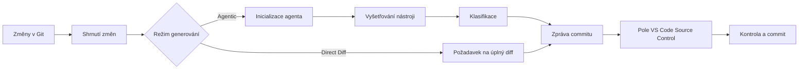

<!-- markdownlint-disable MD001 MD013 MD026 MD033 MD036 MD041 -->

<div align="center">


# Commit-Copilot

### Agentické zprávy ke commitům, které chápou váš kód – nikoli jen samotný diff.

Commit-Copilot je rozšíření pro VS Code, které prozkoumává váš repozitář pomocí vícestupňového autonomního AI agenta, klasifikuje změny podle přísných pravidel Conventional Commits a zapisuje vyladěné zprávy ke commitům přímo do pole Správy zdrojového kódu (Source Control).

Bezproblémově spolupracuje s předními cloudovými LLM (Gemini, OpenAI, Anthropic Claude, DeepSeek), lokálními modely Ollama zaměřenými na soukromí i vlastními koncovými body (kompatibilními s formáty OpenAI a Anthropic).

[](https://marketplace.visualstudio.com/items?itemName=JeremySu0818.commit-copilot)
[](https://open-vsx.org/extension/JeremySu0818/commit-copilot)
[](https://open-vsx.org/extension/JeremySu0818/commit-copilot)
[](#požadavky)
[](#vývoj)
[](#klasifikace-conventional-commits)
[](../../LICENSE)

**Agentické vyšetřování · 9 integrovaných poskytovatelů · Vlastní koncové body · Podpora lokální Ollama · 20 jazyků**

<p align="center">
  <b>Translations:</b>
  <a href="https://github.com/JeremySu0818/Commit-Copilot#readme">English</a> |
  <a href="https://github.com/JeremySu0818/Commit-Copilot/blob/main/docs/readme/README-zh-tw.md">繁體中文</a> |
  <a href="https://github.com/JeremySu0818/Commit-Copilot/blob/main/docs/readme/README-zh-cn.md">简体中文</a> |
  <a href="https://github.com/JeremySu0818/Commit-Copilot/blob/main/docs/readme/README-ja.md">日本語</a> |
  <a href="https://github.com/JeremySu0818/Commit-Copilot/blob/main/docs/readme/README-ko.md">한국어</a> |
  <a href="https://github.com/JeremySu0818/Commit-Copilot/blob/main/docs/readme/README-de.md">Deutsch</a> |
  <a href="https://github.com/JeremySu0818/Commit-Copilot/blob/main/docs/readme/README-fr.md">Français</a> |
  <a href="https://github.com/JeremySu0818/Commit-Copilot/blob/main/docs/readme/README-es.md">Español</a> |
  <a href="https://github.com/JeremySu0818/Commit-Copilot/blob/main/docs/readme/README-pt-br.md">Português (Brasil)</a> |
  <a href="https://github.com/JeremySu0818/Commit-Copilot/blob/main/docs/readme/README-ru.md">Русский</a> |
  <a href="https://github.com/JeremySu0818/Commit-Copilot/blob/main/docs/readme/README-it.md">Italiano</a> |
  <a href="https://github.com/JeremySu0818/Commit-Copilot/blob/main/docs/readme/README-nl.md">Nederlands</a> |
  <a href="https://github.com/JeremySu0818/Commit-Copilot/blob/main/docs/readme/README-pl.md">Polski</a> |
  <a href="https://github.com/JeremySu0818/Commit-Copilot/blob/main/docs/readme/README-tr.md">Türkçe</a> |
  <a href="https://github.com/JeremySu0818/Commit-Copilot/blob/main/docs/readme/README-vi.md">Tiếng Việt</a> |
  <a href="https://github.com/JeremySu0818/Commit-Copilot/blob/main/docs/readme/README-id.md">Bahasa Indonesia</a> |
  <a href="https://github.com/JeremySu0818/Commit-Copilot/blob/main/docs/readme/README-hu.md">Magyar</a> |
  <a href="https://github.com/JeremySu0818/Commit-Copilot/blob/main/docs/readme/README-cs.md">Čeština</a> |
  <a href="https://github.com/JeremySu0818/Commit-Copilot/blob/main/docs/readme/README-hi.md">हिन्दी</a> |
  <a href="https://github.com/JeremySu0818/Commit-Copilot/blob/main/docs/readme/README-ar.md">العربية</a>
</p>

</div>

---

## Proč Commit-Copilot?

Většina AI nástrojů pro tvorbu commitů posílá nezpracovaný diff modelu v naději, že vygeneruje výstižné jednorázové shrnutí.

Commit-Copilot volí zcela jiný přístup.

Začíná lehkými metadaty o změnách a poté nechá autonomního agenta rozhodnout, co potřebuje prozkoumat: diffy, obsahy souborů, symboly, reference, celoprojektové vzory a historii nedávných commitů. Teprve po úplném pochopení změny provede přesnou klasifikaci a vytvoří výslednou zprávu.

| Schopnost                                       | Běžné nástroje diff-to-prompt | Commit-Copilot |
| ----------------------------------------------- | :---------------------------: | :------------: |
| Okamžitě čte celý diff                          |              Ano              |   Volitelně    |
| Selektivně prozkoumává relevantní soubory       |              Ne               |      Ano       |
| Rozumí struktuře a symbolům kódu                |            Omezeně            |      Ano       |
| Vyhledává reference symbolů přes LSP            |              Ne               |      Ano       |
| Vyhledává skryté řetězcové/konfigurační vazby   |              Ne               |      Ano       |
| Učí se ze stylu nedávných commitů               |            Zřídka             |      Ano       |
| Provádí analýzu s ohledem na Git index (staged) |            Zřídka             |      Ano       |
| Podporuje lokální a agentické pracovní postupy  |            Omezeně            |      Ano       |
| Aplikuje přísné hranice typů commitů            |          Dle modelu           |      Ano       |
| Nikdy nepřipravuje soubory bez vašeho souhlasu  |             Různě             |      Ano       |

> [!TIP]
> Pro maximální přesnost a úplný kontext použijte režim **Agentic**. Režim **Direct Diff** zvolte v případech, kdy je rychlost důležitější než hloubková analýza.

---

## Hlavní přednosti

<table>
<tr>
<td width="50%" valign="top">

<h3>Agent vnímající repozitář</h3>

Agent začíná s názvy souborů, typy změn, počty řádků a strukturou projektu – poté sám vybere nástroje potřebné k pochopení změn.

</td>
<td width="50%" valign="top">

<h3>Přesnost Git indexu</h3>

U připravených (staged) změn nástroje preferují obsah přímo z Git indexu. Analýza referencí LSP probíhá v dočasném pracovním prostoru rekonstruovaném z připraveného stavu.

</td>
</tr>
<tr>
<td width="50%" valign="top">

<h3>Nativní podpora mnoha poskytovatelů</h3>

Využijte Google Gemini, OpenAI, Anthropic, xAI, Groq, OpenRouter, DeepSeek, Alibaba Qwen, Ollama nebo jakýkoli kompatibilní vlastní koncový bod.

</td>
<td width="50%" valign="top">

<h3>Přísná pravidla Conventional Commits</h3>

Podporuje všech 11 typů Conventional Commits a uplatňuje pravidla klasifikace seřazená podle priorit s jasným vymezením hranic. Scope, Body, Footer a Gitmoji lze konfigurovat zcela nezávisle.

</td>
</tr>
<tr>
<td width="50%" valign="top">

<h3>Agentický postup pro lokální modely</h3>

Modely Ollama mohou využívat stejné vyšetřovací nástroje prostřednictvím vestavěného textového protokolu Commit-Copilot – i bez nativní podpory volání nástrojů (tool calling).

</td>
<td width="50%" valign="top">

<h3>Bezpečný postup založený na kontrole</h3>

Commit-Copilot zapíše výsledek přímo do pole Správy zdrojového kódu. Plnou kontrolu nad indexací, úpravami a potvrzením máte vždy vy.

</td>
</tr>
</table>

---

## Obsah

- [Jak to funguje](#jak-to-funguje)
- [Nástroje agenta](#nástroje-agenta)
- [Funkce](#funkce)
- [Podporovaní poskytovatelé](#podporovaní-poskytovatelé)
- [Požadavky](#požadavky)
- [Instalace](#instalace)
- [Konfigurace](#konfigurace)
- [Použití](#použití)
- [Klasifikace Conventional Commits](#klasifikace-conventional-commits)
- [Detekce změn](#detekce-změn)
- [Lokalizace](#lokalizace)
- [Zabezpečení a soukromí](#zabezpečení-a-soukromí)
- [Vývoj](#vývoj)
- [Testování](#testování)
- [Často kladené otázky (FAQ)](#často-kladené-otázky-faq)
- [Jak přispět](#jak-přispět)
- [Licence](#licence)

---

## Jak to funguje



### Agentický pracovní postup (Agentic)

1. **Sběr metadat o změnách**
   Commit-Copilot shromáždí názvy souborů, typy úprav, počty řádků a stromovou strukturu projektu.

2. **Inicializace agenta**
   Model obdrží strukturované shrnutí a instrukce pro autonomní tvorbu zpráv. Nezpracovaný diff se v úvodu neposílá.

3. **Vyšetřování pomocí nástrojů**
   Agent selektivně zkoumá repozitář a vyžaduje pouze kontext, který považuje za nezbytný.

4. **Klasifikace změn**
   Pravidla řazená dle priorit určí typ commitu. Je-li povolen výstup Scope, agent určí i zasažený modul či oblast.

5. **Generování zprávy**
   Výsledná zpráva je zapsána do pole Správy zdrojového kódu (Source Control) pro vaši kontrolu a úpravy.

> [!NOTE]
> Je-li zapnuto **Hybridní generování (Hybrid Generation)**, stávající text v poli Source Control slouží pouze jako referenční koncept; instrukce v něm obsažené nemohou přepsat systémová pravidla generování.

### Pracovní postup Direct Diff

Režim Direct Diff přeskakuje vyšetřovací smyčku a posílá kompletní diff zvolenému modelu v jediném požadavku. Je rychlejší, dostupný pro všechny poskytovatele a ideální pro malé či zřejmé změny.

---

## Nástroje agenta

Agent může během jednotlivých kroků vyšetřování kombinovat následující nástroje:

| Nástroj                | Účel                                                                                          |
| ---------------------- | --------------------------------------------------------------------------------------------- |
| `get_diff`             | Načte kompletní a přesný diff pro jeden nebo více požadovaných souborů.                       |
| `read_file`            | Čte obsah souboru (volitelně v rozsahu řádků). U staged změn preferuje obsah z Git indexu.    |
| `get_file_outline`     | Vrací strukturální informace: funkce, třídy, rozhraní a exporty.                              |
| `find_references`      | Využívá Language Server Protocol (LSP) ve VS Code k nalezení syntaktických referencí symbolů. |
| `get_recent_commits`   | Čte nedávné zprávy commitů za účelem přizpůsobení se zavedenému stylu projektu.               |
| `search_code`          | Prohledává pracovní prostor na výskyt řetězců nebo vzorů, které importy samy o sobě neodhalí. |
| `write_commit_message` | Odešle konečnou strukturovanou zprávu commitu a ukončí relaci.                                |

Modely Gemini, Anthropic a OpenAI kompatibilní používají nativní volání nástrojů (tool calling). Ollama využívá rovnocenný textový protokol s podporou dávkových volání, aplikačních ID, strukturovaných výsledků, dílčího ošetření chyb a finálního odeslání.

Nástroj `get_diff` přijímá buď jeden parametr `path`, nebo neprázdné pole `paths`. Dávkové požadavky minimalizují počet síťových dotazů a zároveň vrací kompletní a přesný diff každého souboru bez krácení.

V agentickém režimu lze volitelně vynutit úplné pokrytí diffů. Po zapnutí v Nastavení je volání `write_commit_message` blokováno, dokud každý změněný soubor z platného Git diffu není prozkoumán úspěšným voláním `get_diff`. Ve výchozím stavu je toto nastavení vypnuto z důvodu úspory tokenů a času.

---

## Funkce

### Generování a analýza

- **Režimy Agentic a Direct Diff**
- **Konfigurovatelný limit maximálního počtu kroků agenta (Max Agent Steps)**
- **Kdykoli přerušitelný proces vyšetřování**
- **Automatické opakování pokusů (retries)** při dočasných chybách API a překročení rychlostních limitů
- **Vyhledávání vzorů napříč projektem** pro proměnné prostředí, názvy událostí, konfigurační klíče a textové vazby
- **Radar dopadu referencí LSP** pro syntaktickou analýzu změn kódu
- **Inspekce nedávných commitů** pro zachování jednotného stylu projektu
- **Hybridní generování (Hybrid Generation)** bezpečně využívající stávající text v SCM jako koncept

### Práce s Git

- Detekce 5 stavů repozitáře: pouze připravené (staged), pouze nepřipravené (unstaged), smíšené (mixed), s nesledovanými soubory a pouze nesledované (untracked-only)
- Dotaz na potvrzení před indexací nesledovaných souborů
- Zásadní zákaz automatické indexace bez výslovného souhlasu uživatele
- Přednostní čtení obsahu z Git indexu při zkoumání připravených souborů
- Vytvoření dočasného snímku pracovního prostoru pro LSP analýzu v připraveném stavu
- Aktualizace hlavního panelu v reálném čase při změnách v repozitáři

### Nastavení výstupu commitu

Nezávislé přepínání jednotlivých prvků:

- **Scope** (rozsah)
- **Body** (tělo)
- **Footer** (patička / Breaking Changes)
- **Předpona Gitmoji**

Výchozí hodnoty:

| Prvek   | Výchozí stav |
| ------- | :----------: |
| Scope   |   Zapnuto    |
| Body    |   Zapnuto    |
| Footer  |   Vypnuto    |
| Gitmoji |   Vypnuto    |

### Integrace s VS Code

Spusťte Commit-Copilot odkudkoli:

- Ikona na **Panelu aktivit (Activity Bar)**
- Ikona kouzelné hůlky v záhlaví **Správy zdrojového kódu (Source Control)**
- Příkaz v **Paletě příkazů (Command Palette)**

Vygenerovaná zpráva se vloží do standardního vstupního pole Source Control, kde ji lze před potvrzením zkontrolovat a upravit.

### Ověřování poskytovatelů a správa modelů

- API klíče se před uložením ověřují vůči reálnému koncovému bodu poskytovatele
- Detailní a srozumitelná hlášení při chybách autentizace, vyčerpání kvót i problémech se spojením
- Dynamické načítání seznamu modelů pro OpenRouter, Alibaba Qwen, Ollama a vlastní poskytovatele
- Ruční přidávání a odebírání ID modelů pro Ollama a vlastní poskytovatele
- Podpora formátů API kompatibilních s OpenAI i Anthropic

---

## Podporovaní poskytovatelé

| Poskytovatel             | Hlavní přednosti                                                         |
| ------------------------ | ------------------------------------------------------------------------ |
| **Google Gemini**        | Nativní strukturované nástroje a podpora několika generací modelů Gemini |
| **OpenAI**               | Modely uvažování (reasoning), univerzální, kompaktní i řada GPT-5/6      |
| **Anthropic**            | Rodiny modelů Claude Haiku, Sonnet, Opus a Fable                         |
| **xAI Grok**             | Modely Grok s podporou uvažování i standardní varianty                   |
| **Groq**                 | Vysoce rychlý hosting modelů Qwen a `gpt-oss`                            |
| **OpenRouter**           | Dynamický přístup k rozsáhlému katalogu s filtrováním podpory nástrojů   |
| **DeepSeek**             | DeepSeek V4.1 Flash                                                      |
| **Alibaba Qwen**         | Integrace s DashScope a dynamické objevování modelů                      |
| **Ollama**               | Lokální modely s dynamickým seznamem a vestavěným protokolem nástrojů    |
| **Vlastní poskytovatel** | Jakékoli koncové body kompatibilní se standardy OpenAI nebo Anthropic    |

<details>
<summary><strong>Zobrazit rodiny modelů podporované v Commit-Copilot</strong></summary>

### Google Gemini

- Gemini 2.5 Flash-Lite, Flash a Pro
- Gemini 3 Flash
- Gemini 3.1 Flash-Lite a Pro
- Gemini 3.5 Flash-Lite a Flash
- Gemini 3.6 Flash
- Gemini 3.7 Flash
- Gemini 3.8 Flash

### OpenAI

- o3 a o3-mini
- o4-mini
- GPT-4o mini a GPT-4o
- GPT-4.1 nano, mini a GPT-4.1
- GPT-5 nano, mini a GPT-5
- GPT-5.1
- GPT-5.2
- GPT-5.4 nano, mini a GPT-5.4
- GPT-5.5
- GPT-5.6 Luna, Terra a Sol
- GPT-6 Luna, Sol a Astra
- GPT-6.1 Sol

### Anthropic

- Claude Sonnet 4 a Opus 4
- Claude Opus 4.1
- Claude Haiku, Sonnet a Opus 4.5
- Claude Sonnet a Opus 4.6
- Claude Opus 4.7
- Claude Opus 4.8
- Claude Sonnet 5, Opus 5 a Fable 5
- Claude Fable 5.1
- Claude Opus 5.5

### xAI Grok

- Grok 4.20 (s uvažováním i standardní)
- Grok 4.3
- Grok 4.5
- Grok 4.6
- Grok 4.7

### Groq

- `gpt-oss-20B`
- `gpt-oss-120B`
- `gpt-oss-safeguard-20B`
- Qwen 3.8 27b

### DeepSeek

- DeepSeek V4.1 Flash

> [!IMPORTANT]
> Dostupnost modelů závisí na poskytovateli, účtu, regionu a aktuálním katalogu API. Seznamy modelů pro OpenRouter, Qwen, Ollama a vlastní poskytovatele lze zjišťovat dynamicky.

</details>

---

## Požadavky

- **VS Code** `1.91.0` nebo novější
- **Git** (přístupný prostřednictvím vestavěného rozšíření Git ve VS Code)
- Jedna z následujících možností:
  - Platný API klíč podporovaného vzdáleného poskytovatele
  - Dostupná lokální či vzdálená instance Ollama
  - Přihlašovací údaje ke kompatibilnímu vlastnímu koncovému bodu

Pro vývoj:

- **Node.js** `20+`
- **npm**

---

## Instalace

Nainstalujte Commit-Copilot z preferovaného katalogu:

- [**Visual Studio Code Marketplace**](https://marketplace.visualstudio.com/items?itemName=JeremySu0818.commit-copilot)
- [**Open VSX Registry**](https://open-vsx.org/extension/JeremySu0818/commit-copilot)

Po instalaci otevřete v prostředí VS Code libovolný Git repozitář a klikněte na ikonu **Commit Copilot** na Panelu aktivit (Activity Bar).

---

## Konfigurace

### Základní nastavení

1. Otevřete zobrazení **Commit Copilot** z Panelu aktivit.
2. Vyberte poskytovatele.
3. Zadejte API klíč poskytovatele nebo URL hostitele Ollama.
4. Klikněte na **Uložit**.
5. Počkejte na ověření přihlašovacích údajů v reálném čase.
6. Vyberte model ze seznamu dostupných modelů.

> [!IMPORTANT]
> Při použití Ollama rozšíření před každým generováním spustí příkaz `ollama pull` pro vybraný model a zobrazí průběh v oznamovací oblasti. Tím je zajištěna aktuálnost modelu, ale může dojít k opětovnému stažení vrstev, i když model lokálně existuje.

### Možnosti nastavení

| Možnost                     | Výchozí    | Popis                                                                                                |
| --------------------------- | ---------- | ---------------------------------------------------------------------------------------------------- |
| **Režim generování**        | Agentic    | `Agentic` spouští vícestupňový vyšetřovací cyklus. `Direct Diff` odesílá celý diff v jediném dotazu. |
| **Hybridní generování**     | Vypnuto    | Využívá stávající text v SCM jako referenční koncept a izoluje jej od systémových instrukcí.         |
| **Max. počet kroků agenta** | `0`        | Horní limit volání nástrojů agentem. Nastavením `0` limit zrušíte.                                   |
| **Zahrnout Scope**          | Zapnuto    | Vyžaduje uvedení rozsahu (Scope) podle Conventional Commits v předmětu commitu.                      |
| **Zahrnout Body**           | Zapnuto    | Vyžaduje vytvoření podrobného popisného těla zprávy.                                                 |
| **Zahrnout Footer**         | Vypnuto    | Vytváří sekci patičky (např. Breaking Changes); nepodložené informace se nikdy nevymýšlejí.          |
| **Zahrnout Gitmoji**        | Vypnuto    | Vloží přesně jednu odpovídající předponu Gitmoji před předmět zprávy.                                |
| **Jazyk rozšíření**         | Auto       | Řídí se jazykem prostředí VS Code, pokud není nastaven ručně.                                        |
| **Jazyk zpráv commitu**     | Angličtina | Nezávisle určuje jazyk vygenerovaného předmětu, těla i patičky zprávy commitu.                       |

### Vlastní poskytovatel (Custom Provider)

Pro přidání koncového bodu kompatibilního s OpenAI nebo Anthropic:

1. Otevřete nastavení poskytovatele v panelu.
2. Klikněte na **+ Přidat poskytovatele...**.
3. Zvolte formát API (`OpenAI-compatible` nebo `Anthropic-compatible`).
4. Zadejte zobrazovaný název a základní URL adresu API (Base URL).
5. Poskytovatele uložte.
6. Zadejte a ověřte API klíč.
7. Vyberte model ze seznamu nebo přidejte ID modelů ručně přes **Spravovat modely...**.

U koncových bodů kompatibilních s Anthropic lze rovněž nastavit maximální limit výstupních tokenů (`max_tokens`).

---

## Použití

### Metoda A: Panel aktivit (Activity Bar)

1. Otevřete panel **Commit Copilot**.
2. Zkontrolujte, že repozitář obsahuje připravené, nepřipravené nebo nesledované změny.
3. Klikněte na **Generovat zprávu k potvrzení**.
4. Pokud se zobrazí výzva k výběru souborů, zvolte požadovanou možnost.

### Metoda B: Správa zdrojového kódu (Source Control)

1. Otevřete Source Control pomocí zkratky `Ctrl+Shift+G` (na macOS: `Cmd+Shift+G`).
2. Klikněte na ikonu kouzelné hůlky Commit-Copilot na navigační liště.

### Metoda C: Paleta příkazů (Command Palette)

1. Otevřete Paletu příkazů:
   - Windows/Linux: `Ctrl+Shift+P`
   - macOS: `Cmd+Shift+P`
2. Spusťte příkaz **Commit-Copilot: Generate Commit Message**.

### Kontrola a potvrzení

Vygenerovaná zpráva se automaticky vyplní do standardního pole Správy zdrojového kódu.

Můžete ji zkontrolovat, upravit a poté standardním tlačítkem VS Code potvrdit (commit).

---

## Klasifikace Conventional Commits

Commit-Copilot striktně dodržuje následujících 11 typů Conventional Commits:

| Typ        | Účel použití                                                            |
| ---------- | ----------------------------------------------------------------------- |
| `feat`     | Přidává novou uživatelsky viditelnou funkci                             |
| `fix`      | Opravuje chybu nebo neočekávané chování                                 |
| `docs`     | Změny výhradně v dokumentaci                                            |
| `style`    | Úpravy formátování, mezer a stylu, které neovlivňují logiku kódu        |
| `refactor` | Úprava struktury kódu bez přidání nové funkce a bez opravy chyby        |
| `perf`     | Zlepšení výkonu nebo spotřeby systémových prostředků                    |
| `test`     | Přidání, úprava nebo doplnění testů                                     |
| `build`    | Změny ovlivňující sestavovací systém nebo externí závislosti            |
| `ci`       | Úpravy konfigurace kontinuální integrace (CI) a automatizačních procesů |
| `chore`    | Běžná údržba a servisní práce nespadající pod ostatní kategorie         |
| `revert`   | Vrácení dřívějšího commitu                                              |

Výsledná zpráva odpovídá standardní syntaxi Conventional Commits:

```text
type(scope): stručný a výstižný popis

Podrobný popis vysvětlující, co se změnilo a z jakého důvodu.
```

V závislosti na konfiguraci mohou být prvky Scope, Body, Footer a Gitmoji povinné nebo vynechané. První řádek je omezen na 72 znaků (doporučuje se délka kolem 50 znaků).

---

## Detekce změn

Commit-Copilot spolehlivě rozpoznává 5 stavů repozitáře Git:

| Scénář                                 | Chování                                                          |
| -------------------------------------- | ---------------------------------------------------------------- |
| **Pouze připravené (Staged only)**     | Používá staged diff a nástroje beroucí v úvahu Git index         |
| **Pouze nepřipravené (Unstaged only)** | Analyzuje změny v pracovním stromu                               |
| **Smíšené změny (Mixed)**              | Zobrazí dialogové okno s dotazem na požadovanou sadu změn        |
| **Nepřipravené + nesledované**         | Nabízí kontextové možnosti zpracování                            |
| **Pouze nesledované (Untracked only)** | Nabízí přípravu nových souborů k potvrzení a spuštění generování |

Bez vašeho výslovného souhlasu se žádný soubor automaticky nepřipraví (neprovede se stage).

---

## Lokalizace

Uživatelské rozhraní rozšíření může automaticky sledovat jazyk prostředí VS Code nebo může být pevně nastaveno na jeden z 20 jazyků:

<table>
<tr>
<td><a href="README-ar.md">العربية</a></td>
<td><a href="README-cs.md">Čeština</a></td>
<td><a href="README-de.md">Deutsch</a></td>
<td><a href="../../README.md">English</a></td>
</tr>
<tr>
<td><a href="README-es.md">Español</a></td>
<td><a href="README-fr.md">Français</a></td>
<td><a href="README-hi.md">हिन्दी</a></td>
<td><a href="README-hu.md">Magyar</a></td>
</tr>
<tr>
<td><a href="README-id.md">Bahasa Indonesia</a></td>
<td><a href="README-it.md">Italiano</a></td>
<td><a href="README-ja.md">日本語</a></td>
<td><a href="README-ko.md">한국어</a></td>
</tr>
<tr>
<td><a href="README-nl.md">Nederlands</a></td>
<td><a href="README-pl.md">Polski</a></td>
<td><a href="README-pt-br.md">Português (Brasil)</a></td>
<td><a href="README-ru.md">Русский</a></td>
</tr>
<tr>
<td><a href="README-tr.md">Türkçe</a></td>
<td><a href="README-vi.md">Tiếng Việt</a></td>
<td><a href="README-zh-cn.md">简体中文</a></td>
<td><a href="README-zh-tw.md">繁體中文</a></td>
</tr>
</table>

**Jazyk zpráv commitu** se konfiguruje odděleně od jazyka rozhraní, takže můžete mít rozhraní v češtině a zprávy ke commitům generovat v angličtině.

---

## Zabezpečení a soukromí

- API klíče jsou bezpečně šifrovány pomocí služby **VS Code Secret Storage**
- Klíče se před uložením ověřují přímo u vybraného poskytovatele
- Commit-Copilot nikdy nepřipravuje soubory do indexu bez vašeho souhlasu
- Hybridní generování považuje stávající text v SCM za nedůvěryhodný referenční obsah
- Vzdálené požadavky obsahují pouze metadata repozitáře, diffy nebo části souborů vyžádané agentem
- Při použití lokální Ollama zůstávají veškerá data a odvozování modelů výhradně ve vašem prostředí

> [!CAUTION]
> Před odesláním proprietárního nebo citlivého kódu do vzdáleného API se seznamte se zásadami zpracování dat vybraného poskytovatele.

---

## Vývoj

### Instalace závislostí

```bash
npm install
```

### Kompilace pro vývoj

```bash
npm run compile
```

Pro průběžné sledování změn TypeScript a esbuild:

```bash
npm run watch
```

### Vytvoření balíčku VSIX

```bash
npm run build
```

Sestavovací skript nainstaluje závislosti, spustí proces balení VS Code a vytvoří výsledný balíček `.vsix`.

### Kontrola kvality kódu

Kontrola pravidel linteru:

```bash
npm run lint
```

Formátování zdrojových souborů:

```bash
npm run format
```

Ověření formátování bez změny souborů:

```bash
npm run check-format
```

---

## Testování

Spuštění kompletní sady jednotkových testů:

```bash
npm test
```

Příkaz postupně vykoná:

1. `npm run test:build`
2. `node --test --test-concurrency=1 "out/test/**/*.test.js"`

Aktuální pokrytí testy zahrnuje:

- Všechny nástroje agenta:
  - `get_diff`
  - `read_file`
  - `get_file_outline`
  - `find_references`
  - `get_recent_commits`
  - `search_code`
- Smyčky agenta s nativním voláním strukturovaných nástrojů
- Smyčky agenta s textovým protokolem Ollama
- Dávková volání a lokalizovaná schémata nástrojů
- Zotavení z chybných odpovědí modelu
- Ověřování konečného odeslání zprávy commitu
- Směrování volání přes `executeToolCall`
- Parsování a sestavování kontextu
- Nástroje snímků připraveného pracovního prostoru
- Logiku automatického opakování požadavků (retries)
- Lokalizované chybové zprávy
- Chování poskytovatele hlavního webview panelu
- Správu vlastních modelů
- Správce stavu

---

## Často kladené otázky (FAQ)

<details>
<summary><strong>Provádí Commit-Copilot potvrzení (commit) automaticky?</strong></summary>

Ne. Vygenerovanou zprávu pouze zapíše do vstupního pole Správy zdrojového kódu (Source Control). Můžete ji zkontrolovat, upravit a potvrdit sami.

</details>

<details>
<summary><strong>Odesílá agent do AI celý můj repozitář?</strong></summary>

V agentickém režimu se v úvodu odesílají pouze metadata o změnách a strom sledovaných souborů – nikoli obsah všech souborů. Následně si agent podle potřeby cíleně vyžaduje diffy, soubory, reference či výsledky hledání. Režim Direct Diff posílá pouze úplný diff vybraných změn.

</details>

<details>
<summary><strong>Mohou modely Ollama používat nástroje bez nativního tool-calling?</strong></summary>

Ano. Commit-Copilot obsahuje vlastní textový protokol nástrojů, který modelům Ollama umožňuje plnohodnotné využití vícestupňového vyšetřovacího procesu.

</details>

<details>
<summary><strong>Co znamená nastavení „Max. počet kroků agenta = 0“?</strong></summary>

Hodnota `0` odstraňuje omezení na počet kroků volání nástrojů. Jakékoli kladné číslo nastaví limit, kolik kroků smí agent provést před odesláním konečné zprávy.

</details>

<details>
<summary><strong>Lze použít koncový bod API, který není v integrovaném seznamu?</strong></summary>

Ano. Přidejte jej jako vlastního poskytovatele kompatibilního s OpenAI nebo Anthropic a poté načtěte modely dynamicky nebo zadejte ID modelů ručně.

</details>

<details>
<summary><strong>Proč Ollama stahuje (pull) model před každým generováním?</strong></summary>

Rozšíření spouští `ollama pull` před každým generováním, aby ověřilo dostupnost a aktuálnost zvoleného modelu v systému. V závislosti na lokálním stavu to může znamenat opětovnou kontrolu nebo dotažení vrstev modelu.

</details>

---

## Jak přispět

Jakékoli příspěvky do projektu jsou velmi vítány!

Doporučený postup:

1. Vytvořte novou tematickou větev (branch).
2. Proveďte úpravy.
3. Spusťte linter, kontrolu formátování a testy.
4. V Pull Requestu jasně popište motivaci a podstatu změn.
5. Doplňte odpovídající testy pro nové nebo upravené chování.

Před odesláním spusťte:

```bash
npm run lint
npm run check-format
npm test
```

Při hlášení chyb uveďte poskytovatele, model, režim generování, stav změn v Git, relevantní protokoly a kroky k reprodukci. Nikdy nepřikládejte API klíče ani citlivý kód repozitáře.

---

## Licence

Commit-Copilot je vydán pod [licencí MIT](../../LICENSE).

---

<div align="center">

Vytvořeno pro vývojáře, kteří chtějí zprávy ke commitům s reálným kontextem – nikoli náhodné odhady.

</div>
