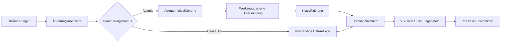

<!-- markdownlint-disable MD001 MD013 MD026 MD033 MD036 MD041 -->

<div align="center">


# Commit-Copilot

### Agentenbasierte Commit-Nachrichten, die Ihren Code verstehen – nicht nur Ihr Diff.

Commit-Copilot ist eine VS Code-Erweiterung, die Ihr Repository mit einem mehrstufigen KI-Agenten untersucht, Änderungen nach strengen Conventional Commits-Regeln klassifiziert und ausgefeilte Commit-Nachrichten direkt in die Quellcodeverwaltung (Source Control) schreibt.

Es funktioniert nahtlos mit führenden Cloud-LLMs (Gemini, OpenAI, Anthropic Claude, DeepSeek), datenschutzorientierten lokalen Ollama-Modellen und benutzerdefinierten Endpunkten (OpenAI- und Anthropic-kompatible Formate).

[](https://marketplace.visualstudio.com/items?itemName=JeremySu0818.commit-copilot)
[](https://open-vsx.org/extension/JeremySu0818/commit-copilot)
[](https://open-vsx.org/extension/JeremySu0818/commit-copilot)
[](#anforderungen)
[](#entwicklung)
[](#konventionelle-commit-klassifizierung)
[](../../LICENSE)

**Agentenbasierte Untersuchung · 9 integrierte Anbieter · Benutzerdefinierte Endpunkte · Lokale Ollama-Unterstützung · 20 Sprachen**

<p align="center">
  <b>Übersetzungen:</b>
  <a href="https://github.com/JeremySu0818/Commit-Copilot#readme">English</a> |
  <a href="https://github.com/JeremySu0818/Commit-Copilot/blob/main/docs/readme/README-zh-tw.md">繁體中文</a> |
  <a href="https://github.com/JeremySu0818/Commit-Copilot/blob/main/docs/readme/README-zh-cn.md">简体中文</a> |
  <a href="https://github.com/JeremySu0818/Commit-Copilot/blob/main/docs/readme/README-ja.md">日本語</a> |
  <a href="https://github.com/JeremySu0818/Commit-Copilot/blob/main/docs/readme/README-ko.md">한국어</a> |
  <a href="https://github.com/JeremySu0818/Commit-Copilot/blob/main/docs/readme/README-de.md">Deutsch</a> |
  <a href="https://github.com/JeremySu0818/Commit-Copilot/blob/main/docs/readme/README-fr.md">Français</a> |
  <a href="https://github.com/JeremySu0818/Commit-Copilot/blob/main/docs/readme/README-es.md">Español</a> |
  <a href="https://github.com/JeremySu0818/Commit-Copilot/blob/main/docs/readme/README-pt-br.md">Português (Brasil)</a> |
  <a href="https://github.com/JeremySu0818/Commit-Copilot/blob/main/docs/readme/README-ru.md">Русский</a> |
  <a href="https://github.com/JeremySu0818/Commit-Copilot/blob/main/docs/readme/README-it.md">Italiano</a> |
  <a href="https://github.com/JeremySu0818/Commit-Copilot/blob/main/docs/readme/README-nl.md">Nederlands</a> |
  <a href="https://github.com/JeremySu0818/Commit-Copilot/blob/main/docs/readme/README-pl.md">Polski</a> |
  <a href="https://github.com/JeremySu0818/Commit-Copilot/blob/main/docs/readme/README-tr.md">Türkçe</a> |
  <a href="https://github.com/JeremySu0818/Commit-Copilot/blob/main/docs/readme/README-vi.md">Tiếng Việt</a> |
  <a href="https://github.com/JeremySu0818/Commit-Copilot/blob/main/docs/readme/README-id.md">Bahasa Indonesia</a> |
  <a href="https://github.com/JeremySu0818/Commit-Copilot/blob/main/docs/readme/README-hu.md">Magyar</a> |
  <a href="https://github.com/JeremySu0818/Commit-Copilot/blob/main/docs/readme/README-cs.md">Čeština</a> |
  <a href="https://github.com/JeremySu0818/Commit-Copilot/blob/main/docs/readme/README-hi.md">हिन्दी</a> |
  <a href="https://github.com/JeremySu0818/Commit-Copilot/blob/main/docs/readme/README-ar.md">العربية</a>
</p>

</div>

---

## Warum Commit-Copilot?

Die meisten KI-Commit-Tools senden ein rohes Diff an ein Modell und hoffen auf eine gute einzeilige Zusammenfassung.

Commit-Copilot verfolgt einen grundlegend anderen Ansatz.

Es beginnt mit schlanken Änderungs-Metadaten und lässt dann einen autonomen Agenten entscheiden, was inspiziert werden muss: Diffs, Dateiinhalte, Symbole, Referenzen, projektweite Muster und letzte Commits. Erst nach dem vollständigen Verständnis der Änderung wird diese klassifiziert und die Nachricht generiert.

| Fähigkeit                                                 | Einfache Diff-zu-Prompt-Tools | Commit-Copilot |
| --------------------------------------------------------- | :---------------------------: | :------------: |
| Liest das vollständige Diff sofort                        |              Ja               |    Optional    |
| Untersucht selektiv relevante Dateien                     |             Nein              |       Ja       |
| Versteht die Codestruktur                                 |         Eingeschränkt         |       Ja       |
| Findet Symbolreferenzen über LSP                          |             Nein              |       Ja       |
| Durchsucht verborgene Zeichenketten-/Konfigurationsmuster |             Nein              |       Ja       |
| Lernt aus dem Stil letzter Commits                        |            Selten             |       Ja       |
| Nutzt indexbasierte Staging-Analyse                       |            Selten             |       Ja       |
| Unterstützt native und lokale Agenten-Workflows           |         Eingeschränkt         |       Ja       |
| Wendet strenge Commit-Typ-Grenzen an                      |        Modellabhängig         |       Ja       |
| Staged niemals ohne Zustimmung                            |           Variiert            |       Ja       |

> [!TIP]
> Verwenden Sie den **Agentic**-Modus für höchste Genauigkeit und vollen Kontext. Verwenden Sie den **Direct Diff**-Modus, wenn Geschwindigkeit wichtiger ist als eine tiefgehende Untersuchung.

---

## Wichtigste Highlights

<table>
<tr>
<td width="50%" valign="top">

<h3>Repository-sensitiver Agent</h3>

Der Agent beginnt mit Dateinamen, Änderungstypen, Zeilenzahlen und der Projektstruktur – und wählt dann selbstständig die Werkzeuge aus, die zum Verständnis der Änderung erforderlich sind.

</td>
<td width="50%" valign="top">

<h3>Präzision über den Git-Index</h3>

Für gestagete Änderungen bevorzugen Repository-Tools Inhalte aus dem Git-Index. Die LSP-Referenzanalyse verwendet einen temporären Arbeitsbereich, der aus dem Staging-Zustand rekonstruiert wurde.

</td>
</tr>
<tr>
<td width="50%" valign="top">

<h3>Multi-Provider nach Design</h3>

Verwenden Sie Google Gemini, OpenAI, Anthropic, xAI, Groq, OpenRouter, DeepSeek, Alibaba Qwen, Ollama oder einen beliebigen benutzerdefinierten kompatiblen Endpunkt.

</td>
<td width="50%" valign="top">

<h3>Strikte Conventional Commits</h3>

Der Prompt erlaubt alle 11 Conventional Commit-Typen und wendet prioritätsbasierte Klassifizierungsregeln mit expliziter Typgrenzen-Führung an. Scope, Body, Footer und Gitmoji sind unabhängig konfigurierbar.

</td>
</tr>
<tr>
<td width="50%" valign="top">

<h3>Lokaler Modell-Agenten-Workflow</h3>

Ollama-Modelle können dieselben Untersuchungstools über das integrierte Text-Tool-Protokoll von Commit-Copilot nutzen – selbst ohne native Tool-Calling-Unterstützung.

</td>
<td width="50%" valign="top">

<h3>Sicherer, prüfungsorientierter Ablauf</h3>

Commit-Copilot schreibt das Ergebnis in das Eingabefeld der Quellcodeverwaltung. Sie behalten die volle Kontrolle über Staging, Bearbeitung und das finale Committen.

</td>
</tr>
</table>

---

## Inhaltsverzeichnis

- [So funktioniert es](#so-funktioniert-es)
- [Agent-Tools](#agent-tools)
- [Funktionen](#funktionen)
- [Unterstützte Anbieter](#unterstützte-anbieter)
- [Anforderungen](#anforderungen)
- [Installation](#installation)
- [Konfiguration](#konfiguration)
- [Verwendung](#verwendung)
- [Konventionelle Commit-Klassifizierung](#konventionelle-commit-klassifizierung)
- [Änderungserkennung](#änderungserkennung)
- [Lokalisierung](#lokalisierung)
- [Sicherheit und Datenschutz](#sicherheit-und-datenschutz)
- [Entwicklung](#entwicklung)
- [Tests](#tests)
- [FAQ](#faq)
- [Mitwirken](#mitwirken)
- [Lizenz](#lizenz)

---

## So funktioniert es



### Agentic-Arbeitsablauf

1. **Änderungs-Metadaten erfassen**
   Commit-Copilot sammelt Dateinamen, Änderungstypen, Zeilenzahlen und einen Projektstrukturbaum.

2. **Agenten initialisieren**
   Das Modell erhält die Zusammenfassung und Handlungsanweisungen zur autonomen Erstellung von Commit-Nachrichten. Rohe Diff-Inhalte werden anfangs nicht mitgesendet.

3. **Mit Werkzeugen untersuchen**
   Der Agent inspiziert das Repository selektiv und fordert nur den Kontext an, den er für nützlich erachtet.

4. **Änderung klassifizieren**
   Prioritätsbasierte Regeln bestimmen den Commit-Typ. Wenn die Scope-Ausgabe aktiviert ist, wählt der Agent auch das betroffene Modul oder den Bereich aus.

5. **Nachricht generieren**
   Die endgültige Nachricht wird zur Überprüfung und Bearbeitung in das Eingabefeld der Quellcodeverwaltung (Source Control) geschrieben.

> [!NOTE]
> Wenn **Hybride Generierung** aktiviert ist, wird der vorhandene Text in der Quellcodeverwaltung als Referenz für Wortwahl und Absicht verwendet. Anweisungsähnliche Inhalte in diesem Entwurf können die Generierungsregeln nicht überschreiben.

### Direct Diff-Arbeitsablauf

Direct Diff überspringt die Untersuchungsschleife und sendet das vollständige Diff in einer einzigen Anfrage an das ausgewählte Modell. Es ist schneller, für jeden Anbieter verfügbar und besonders nützlich für kleine oder offensichtliche Änderungen.

---

## Agent-Tools

Der Agent kann die folgenden Werkzeuge über mehrere Untersuchungsschritte hinweg kombinieren:

| Werkzeug               | Zweck                                                                                                                         |
| ---------------------- | ----------------------------------------------------------------------------------------------------------------------------- |
| `get_diff`             | Ruft das vollständige, exakte Diff für eine Datei oder mehrere angeforderte Dateien ab.                                       |
| `read_file`            | Liest Dateiinhalte, optional innerhalb eines Zeilenbereichs. Bei Staging-Analysen werden Inhalte aus dem Git-Index bevorzugt. |
| `get_file_outline`     | Gibt strukturelle Informationen wie Funktionen, Klassen und Exporte zurück.                                                   |
| `find_references`      | Verwendet das Language Server Protocol von VS Code, um syntaxbezogene Symbolreferenzen zu finden.                             |
| `get_recent_commits`   | Liest letzte Commit-Nachrichten, um den bestehenden Stil des Repositorys kennenzulernen.                                      |
| `search_code`          | Durchsucht den Arbeitsbereich nach Zeichenfolgen oder Mustern, die Importe allein nicht offenbaren können.                    |
| `write_commit_message` | Übermittelt die endgültige strukturierte Commit-Nachricht.                                                                    |

Gemini-, Anthropic- und OpenAI-kompatible Routen verwenden strukturierte Tool Calls. Ollama nutzt ein gleichwertiges Textprotokoll mit Unterstützung für gebündelte Aufrufe, anwendungsseitig vergebene Aufruf-IDs, strukturierte Ergebnisse, Fehler pro Aufruf und die finale Übermittlung.

`get_diff` akzeptiert entweder einen einzelnen `path` oder ein nicht-leeres `paths`-Array. Anfragen für mehrere Dateien reduzieren die Anzahl der Tool-Aufrufe, während für jede angeforderte Datei das vollständige, exakte Diff zurückgegeben wird; Dateiinhalte werden weder zusammengefasst noch weggelassen.

Die agentenbasierte Generierung kann optional eine vollständige Diff-Abdeckung erzwingen. Wenn dies in den Einstellungen aktiviert ist, wird `write_commit_message` zurückgewiesen, bis jede geänderte Datei aus einem gültigen Git-Diff durch eine erfolgreiche Einzel- oder Batch-`get_diff`-Anfrage abgedeckt wurde. Diese Einstellung ist standardmäßig deaktiviert, um das bestehende Generierungsverhalten und den Token-Verbrauch beizubehalten.

---

## Funktionen

### Generierung und Analyse

- **Agentic- und Direct Diff-Modi**
- **Konfigurierbare maximale Agentenschritte**
- **Jederzeit abbrechbare Untersuchungsschleife**
- **Automatische Wiederholungsversuche** bei vorübergehenden Remote-API-Fehlern und Ratenbegrenzungen (Rate Limits)
- **Projektweite Mustersuche** nach Umgebungsvariablen, Ereignisnamen, Konfigurationsschlüsseln und anderen zeichenkettenbasierten Beziehungen
- **LSP-Referenz-Auswirkungsradar** für syntaxbezogene Symbolanalysen
- **Inspektion letzter Commits** zur optimalen Anpassung an Projektkonventionen
- **Hybride Generierung** unter sicherer Verwendung bestehender Quellcodeverwaltungstexte als Referenzentwurf

### Git-sensitives Verhalten

- Erkennt fünf Repository-Zustände: Nur gestaget (Staged), nur ungestaget (Unstaged), gemischt (Mixed), ungestaget + unversioniert, sowie ausschließlich unversioniert (Untracked-only)
- Fragt vor dem Stagen unversionierter Dateien stets nach
- Führt niemals automatische Staging-Operationen ohne ausdrückliche Bestätigung durch
- Bevorzugt Git-Index-Inhalte bei der Untersuchung gestageter Dateien
- Erstellt einen temporären Staged-State-Workspace-Snapshot für die LSP-Referenzanalyse
- Aktualisiert die Hauptansicht in Echtzeit bei Statusänderungen des Repositorys

### Commit-Ausgabeoptionen

Jeder Bereich lässt sich unabhängig aktivieren oder deaktivieren:

- **Scope** (Kontext / Geltungsbereich)
- **Body** (Nachrichtenkörper / Beschreibung)
- **Footer** (Fußzeile / Breaking Changes)
- **Gitmoji-Präfix**

Standardwerte:

| Element | Standard |
| ------- | :------: |
| Scope   |   Ein    |
| Body    |   Ein    |
| Footer  |   Aus    |
| Gitmoji |   Aus    |

### VS Code-Integration

Starten Sie Commit-Copilot über:

- Das Symbol in der **Aktivitätsleiste (Activity Bar)**
- Die Zauberstab-Schaltfläche in der **Navigationsleiste der Quellcodeverwaltung (SCM)**
- Die **Befehlspalette (Command Palette)**

Generierte Nachrichten werden direkt in das Standard-Eingabefeld der Quellcodeverwaltung eingefügt, wo sie vor dem Commit geprüft und frei angepasst werden können.

### Anbieterüberprüfung und Modellverwaltung

- API-Schlüssel werden vor dem Speichern am echten Endpunkt des ausgewählten Anbieters validiert
- Anbieterspezifische Authentifizierungs-, Kontingent- und Verbindungsfehler werden mit praxisnahen Hinweisen angezeigt
- OpenRouter, Alibaba Qwen, Ollama und benutzerdefinierte Anbieter können Modelllisten dynamisch abrufen
- Ollama und benutzerdefinierte Anbieter unterstützen das manuelle Hinzufügen oder Entfernen von Modell-IDs, falls die automatische Erkennung unvollständig ist
- Benutzerdefinierte Anbieter unterstützen OpenAI-kompatible und Anthropic-kompatible APIs

---

## Unterstützte Anbieter

| Anbieter            | Highlights                                                                    |
| ------------------- | ----------------------------------------------------------------------------- |
| **Google Gemini**   | Native strukturierte Tools und mehrere Gemini-Modellgenerationen              |
| **OpenAI**          | Reasoning-, Allzweck-, kompakte Modelle und die GPT-5-Serie                   |
| **Anthropic**       | Claude Haiku-, Sonnet-, Opus- und Fable-Familien                              |
| **xAI Grok**        | Reasoning- und Standard-Grok-Varianten                                        |
| **Groq**            | Extrem schnelle gehostete MiniMax-, Qwen- und `gpt-oss`-Modelle               |
| **OpenRouter**      | Dynamischer Zugriff auf kompatible Modelle mit Tool-Calling-Filterung         |
| **DeepSeek**        | Chat-, Reasoner- (R1) und V4-Varianten                                        |
| **Alibaba Qwen**    | DashScope-Integration mit dynamischer Modellerkennung                         |
| **Ollama**          | Lokale Modelle mit dynamischer Erkennung und integriertem Text-Tool-Protokoll |
| **Custom Provider** | Beliebige OpenAI-kompatible oder Anthropic-kompatible Endpunkte               |

<details>
<summary><strong>Modellfamilien anzeigen, die von Commit-Copilot gelistet werden</strong></summary>

### Google Gemini

- Gemini 2.5 Flash-Lite, Flash und Pro
- Gemini 3 Flash
- Gemini 3.1 Flash-Lite und Pro
- Gemini 3.5 Flash-Lite und Flash
- Gemini 3.6 Flash
- Gemini 3.7 Flash

### OpenAI

- o3 und o3-mini
- o4-mini
- GPT-4o mini und GPT-4o
- GPT-4.1 nano, mini und GPT-4.1
- GPT-5 nano, mini und GPT-5
- GPT-5.1
- GPT-5.2
- GPT-5.4 nano, mini und GPT-5.4
- GPT-5.5
- GPT-5.6 Luna, Terra und Sol

### Anthropic

- Claude Sonnet 4 und Opus 4
- Claude Opus 4.1
- Claude Haiku, Sonnet und Opus 4.5
- Claude Sonnet und Opus 4.6
- Claude Opus 4.7
- Claude Opus 4.8
- Claude Sonnet 5, Opus 5 und Fable 5

### xAI Grok

- Grok 4.20, Reasoning und Standard
- Grok 4.3
- Grok 4.5
- Grok 4.6

### Groq

- `gpt-oss-20B`
- `gpt-oss-120B`
- `gpt-oss-safeguard-20B`
- MiniMax M2.7
- Qwen 3.6 27b

### DeepSeek

- DeepSeek Chat
- DeepSeek R1 / Reasoner
- DeepSeek V4 Flash und Pro

> [!IMPORTANT]
> Die Modellverfügbarkeit hängt vom Anbieter, Konto, der Region, dem Endpunkt und dem aktuellen Anbieterkatalog ab. Listen für OpenRouter, Qwen, Ollama und benutzerdefinierte Anbieter können dynamisch ermittelt werden.

</details>

---

## Anforderungen

- **VS Code** `1.91.0` oder neuer
- **Git**, verfügbar über die integrierte Git-Erweiterung von VS Code
- Mindestens eines der folgenden:
  - Ein gültiger API-Schlüssel für einen unterstützten Remote-Anbieter
  - Eine erreichbare lokale oder entfernte Ollama-Instanz
  - Anmeldeinformationen für einen kompatiblen benutzerdefinierten Endpunkt

Für die Entwicklung:

- **Node.js** `20+`
- **npm**

---

## Installation

Installieren Sie Commit-Copilot über einen der folgenden Marktplätze:

- [**Visual Studio Code Marketplace**](https://marketplace.visualstudio.com/items?itemName=JeremySu0818.commit-copilot)
- [**Open VSX Registry**](https://open-vsx.org/extension/JeremySu0818/commit-copilot)

Öffnen Sie nach der Installation ein Git-Repository in VS Code und klicken Sie auf das **Commit Copilot**-Symbol in der Aktivitätsleiste.

---

## Konfiguration

### Grundlegende Einrichtung

1. Öffnen Sie die Ansicht **Commit Copilot** in der Aktivitätsleiste.
2. Wählen Sie einen Anbieter aus.
3. Geben Sie den API-Schlüssel des Anbieters oder die Host-URL von Ollama ein.
4. Wählen Sie **Speichern**.
5. Warten Sie auf die Echtzeit-Validierung der Anmeldeinformationen.
6. Wählen Sie ein Modell aus, sobald die Modellauswahl verfügbar ist.

> [!IMPORTANT]
> Bei der Ollama-Generierung wird vor jeder Ausführung automatisch `ollama pull` für das ausgewählte Modell ausgeführt, um Aktualität zu gewährleisten. Der Download-Fortschritt wird im Benachrichtigungsbereich angezeigt. Dies kann dazu führen, dass Modell-Layer erneut heruntergeladen werden, selbst wenn das Modell lokal bereits vorhanden ist.

### Optionen

| Option                             | Standard | Beschreibung                                                                                                                      |
| ---------------------------------- | -------- | --------------------------------------------------------------------------------------------------------------------------------- |
| **Generierungsmodus**              | Agentic  | `Agentic` führt eine mehrstufige Untersuchungsschleife aus. `Direct Diff` sendet das vollständige Diff in einer einzigen Anfrage. |
| **Hybride Generierung**            | Aus      | Verwendet vorhandenen SCM-Text als Referenzentwurf, isoliert ihn jedoch strikt von Prompt-Anweisungen.                            |
| **Max. Agentenschritte**           | `0`      | Maximale Anzahl von Tool-Aufruf-Iterationen. Auf `0` setzen für unbegrenzte Schritte.                                             |
| **Kontext (Scope) einschließen**   | Ein      | Erfordert bei Aktivierung einen Conventional Commits-Scope in der Betreffzeile.                                                   |
| **Nachrichtenkörper einschließen** | Ein      | Erfordert bei Aktivierung einen beschreibenden Textkörper (Body).                                                                 |
| **Fußzeile (Footer) einschließen** | Aus      | Erfordert bei Aktivierung einen Footer (z. B. Breaking Changes); ungestützte Fakten werden nie erfunden.                          |
| **Gitmoji einschließen**           | Aus      | Fügt bei Aktivierung genau ein passendes Gitmoji-Präfix vor den Betreff ein.                                                      |
| **Erweiterungssprache**            | Auto     | Folgt der Anzeigesprache von VS Code, sofern nicht manuell festgelegt.                                                            |
| **Sprache der Commit-Nachrichten** | Englisch | Steuert die Sprache von generiertem Betreff, Body und Footer völlig unabhängig von der UI-Sprache.                                |

### Benutzerdefinierter Anbieter

So fügen Sie einen OpenAI-kompatiblen oder Anthropic-kompatiblen Endpunkt hinzu:

1. Öffnen Sie die Anbietereinstellungen.
2. Wählen Sie **+ Anbieter hinzufügen...**.
3. Wählen Sie das API-Format (`OpenAI-compatible` oder `Anthropic-compatible`).
4. Geben Sie einen Anzeigenamen und die API Basis-URL ein.
5. Speichern Sie den Anbieter.
6. Geben Sie den API-Schlüssel ein und lassen Sie ihn validieren.
7. Wählen Sie ein dynamisch erkanntes Modell oder fügen Sie über **Modelle verwalten...** manuell Modell-IDs hinzu.

Für Anthropic-kompatible Endpunkte kann zusätzlich das Token-Limit über `max_tokens` konfiguriert werden.

---

## Verwendung

### Methode A: Aktivitätsleiste (Activity Bar)

1. Öffnen Sie die Ansicht **Commit Copilot**.
2. Stellen Sie sicher, dass das Repository gestagete, ungestagete oder unversionierte Änderungen enthält.
3. Klicken Sie auf **Commit-Nachricht generieren**.
4. Beantworten Sie eventuelle Abfragen zur Auswahl oder zum Staging von Dateien.

### Methode B: Quellcodeverwaltung (Source Control)

1. Öffnen Sie die Quellcodeverwaltung mit `Strg+Umschalt+G` (macOS: `Cmd+Umschalt+G`).
2. Klicken Sie auf das Zauberstab-Symbol von Commit-Copilot in der Navigationsleiste.

### Methode C: Befehlspalette (Command Palette)

1. Öffnen Sie die Befehlspalette:
   - Windows/Linux: `Strg+Umschalt+P`
   - macOS: `Cmd+Umschalt+P`
2. Führen Sie den Befehl **Commit-Copilot: Commit-Nachricht generieren** aus.

### Prüfen und committen

Die generierte Nachricht erscheint im Eingabefeld der Quellcodeverwaltung.

Sie können sie nach Belieben überprüfen, anpassen und anschließend mit der regulären Commit-Funktion von VS Code committen.

---

## Konventionelle Commit-Klassifizierung

Commit-Copilot unterstützt alle 11 Conventional Commit-Typen:

| Typ        | Verwendungszweck                                                      |
| ---------- | --------------------------------------------------------------------- |
| `feat`     | Führt eine neue, für den Benutzer sichtbare Funktion ein              |
| `fix`      | Behebt ein fehlerhaftes Verhalten                                     |
| `docs`     | Ändert ausschließlich die Dokumentation                               |
| `style`    | Ändert Formatierungen, ohne die Codelogik zu beeinflussen             |
| `refactor` | Strukturiert Code um, ohne Funktionen hinzuzufügen oder Bugs zu fixen |
| `perf`     | Verbessert die Leistung oder Ausführungsgeschwindigkeit               |
| `test`     | Fügt Tests hinzu oder aktualisiert bestehende Tests                   |
| `build`    | Ändert das Build-System oder externe Abhängigkeiten                   |
| `ci`       | Ändert Konfigurationen für Continuous Integration / Deployment        |
| `chore`    | Führt Wartungsarbeiten aus, die unter keinen anderen Typ fallen       |
| `revert`   | Macht einen früheren Commit rückgängig                                |

Die Ausgabe folgt der offiziellen Conventional Commits-Syntax:

```text
type(scope): prägnante Beschreibung

Ausführlicher Nachrichtenkörper, der beschreibt, was geändert wurde und warum.
```

Je nach Konfiguration können Scope, Body, Footer und Gitmoji verlangt oder weggelassen werden. Die erste Zeile ist auf maximal 72 Zeichen begrenzt und sollte idealerweise unter 50 Zeichen bleiben.

---

## Änderungserkennung

Commit-Copilot erkennt fünf verschiedene Repository-Zustände:

| Szenario                   | Verhalten                                                             |
| -------------------------- | --------------------------------------------------------------------- |
| **Nur gestaget (Staged)**  | Verwendet das gestagete Diff und indexbasierte Untersuchungswerkzeuge |
| **Nur ungestaget**         | Analysiert die aktuellen Änderungen im Arbeitsbereich (Working Tree)  |
| **Gemischt (Mixed)**       | Fragt gezielt nach, welcher Änderungssatz verarbeitet werden soll     |
| **Ungestaget + Untracked** | Bietet kontextbezogene Optionen zur Einbeziehung an                   |
| **Nur unversioniert**      | Bietet an, die neuen Dateien zu stagen und zu generieren              |

Dateien werden niemals ohne Ihre ausdrückliche Bestätigung automatisch gestaget.

---

## Lokalisierung

Die Benutzeroberfläche der Erweiterung kann automatisch der Sprache von VS Code folgen oder auf eine von 20 Sprachen festgelegt werden:

<table>
<tr>
<td><a href="README-ar.md">العربية</a></td>
<td><a href="README-cs.md">Čeština</a></td>
<td><a href="README-de.md">Deutsch</a></td>
<td><a href="../../README.md">English</a></td>
</tr>
<tr>
<td><a href="README-es.md">Español</a></td>
<td><a href="README-fr.md">Français</a></td>
<td><a href="README-hi.md">हिन्दी</a></td>
<td><a href="README-hu.md">Magyar</a></td>
</tr>
<tr>
<td><a href="README-id.md">Bahasa Indonesia</a></td>
<td><a href="README-it.md">Italiano</a></td>
<td><a href="README-ja.md">日本語</a></td>
<td><a href="README-ko.md">한국어</a></td>
</tr>
<tr>
<td><a href="README-nl.md">Nederlands</a></td>
<td><a href="README-pl.md">Polski</a></td>
<td><a href="README-pt-br.md">Português (Brasil)</a></td>
<td><a href="README-ru.md">Русский</a></td>
</tr>
<tr>
<td><a href="README-tr.md">Türkçe</a></td>
<td><a href="README-vi.md">Tiếng Việt</a></td>
<td><a href="README-zh-cn.md">简体中文</a></td>
<td><a href="README-zh-tw.md">繁體中文</a></td>
</tr>
</table>

Die **Sprache der Commit-Nachrichten** wird unabhängig von der Sprache der Erweiterungsoberfläche konfiguriert, sodass Sie die UI auf Deutsch nutzen und dennoch englische Commits generieren können.

---

## Sicherheit und Datenschutz

- API-Schlüssel werden sicher verschlüsselt im **VS Code Secret Storage** gespeichert
- Schlüssel werden vor dem Speichern direkt am Anbieter-Endpunkt verifiziert
- Commit-Copilot führt Staging-Vorgänge niemals ohne ausdrückliche Genehmigung aus
- Hybride Generierung behandelt vorhandene Eingaben als nicht vertrauenswürdige Referenzdaten zur Vermeidung von Prompt-Injections
- Anfragen an Remote-Anbieter enthalten ausschließlich die während der Untersuchung selektierten Repository-Metadaten, Diffs oder Dateiinhalte
- Bei Verwendung von Ollama verbleibt die Modell-Inferenz vollständig in Ihrer lokalen Umgebung

> [!CAUTION]
> Prüfen Sie die Datenschutz- und Datenverarbeitungsrichtlinien Ihres gewählten Anbieters, bevor Sie proprietären oder sensiblen Code an eine Remote-API senden.

---

## Entwicklung

### Abhängigkeiten installieren

```bash
npm install
```

### Für Entwicklung kompilieren

```bash
npm run compile
```

Für kontinuierliche TypeScript- und esbuild-Kompilierung im Watch-Modus:

```bash
npm run watch
```

### VSIX-Paket erstellen

```bash
npm run build
```

Das Build-Skript installiert Abhängigkeiten, führt die VS Code-Packaging-Pipeline aus und erzeugt eine `.vsix`-Installationsdatei.

### Codequalität prüfen

Linting ausführen:

```bash
npm run lint
```

Quelldateien formatieren:

```bash
npm run format
```

Formatierung ohne Dateiänderung prüfen:

```bash
npm run check-format
```

---

## Tests

Vollständige Unit-Test-Pipeline ausführen:

```bash
npm test
```

Dies führt aus:

1. `npm run test:build`
2. `node --test --test-concurrency=1 "out/test/**/*.test.js"`

Die aktuelle Testabdeckung umfasst:

- Alle Agent-Tools:
  - `get_diff`
  - `read_file`
  - `get_file_outline`
  - `find_references`
  - `get_recent_commits`
  - `search_code`
- Native Agenten-Schleifen mit strukturierten Tool Calls
- Ollama-Agenten-Schleifen mit Textprotokoll
- Gebündelte Tool-Aufrufe und lokalisierte Tool-Schemas
- Wiederherstellung nach fehlerhaften Modellantworten
- Finale Tool-Übermittlung
- Tool-Dispatching über `executeToolCall`
- Kontext-Parsing und -Aufbau
- Staged-Workspace-Snapshot-Dienstprogramme
- Wiederholungslogik bei API-Fehlern
- Lokalisierte Fehlermeldungen
- Provider-Verhalten der Hauptansicht
- Verwaltung benutzerdefinierter Modelle
- Zustandsmanager

---

## FAQ

<details>
<summary><strong>Committet Commit-Copilot automatisch?</strong></summary>

Nein. Es schreibt die generierte Nachricht lediglich in das Eingabefeld der Quellcodeverwaltung. Sie können sie selbst überprüfen, bearbeiten und committen.

</details>

<details>
<summary><strong>Erhält der Agent mein gesamtes Repository?</strong></summary>

Im Agentic-Modus erhält der Agent anfangs nur Metadaten zu den Änderungen und den Dateibaum der versionierten Dateien – nicht den Inhalt aller Dateien. Erst im weiteren Verlauf fordert er gezielt Diffs, Dateien, Symbolreferenzen oder Suchabfragen nach Bedarf an. Im Direct Diff-Modus wird das vollständige ausgewählte Diff in einer einzigen Anfrage übertragen.

</details>

<details>
<summary><strong>Können Ollama-Modelle Agent-Tools ohne natives Tool-Calling nutzen?</strong></summary>

Ja. Commit-Copilot verfügt über ein integriertes Text-Tool-Protokoll, das Ollama-Modellen denselben mehrstufigen Untersuchungsablauf ermöglicht.

</details>

<details>
<summary><strong>Was bedeutet Max. Agentenschritte = 0?</strong></summary>

Es hebt die Begrenzung für Tool-Aufruf-Iterationen auf. Jeder positive Wert begrenzt die Anzahl der Untersuchungsschritte, die der Agent vor der Erstellung des Endergebnisses durchführen darf.

</details>

<details>
<summary><strong>Kann ich einen Endpunkt verwenden, der nicht integriert ist?</strong></summary>

Ja. Fügen Sie ihn einfach als OpenAI-kompatiblen oder Anthropic-kompatiblen benutzerdefinierten Anbieter hinzu und rufen Sie die Modell-IDs dynamisch ab oder tragen Sie diese manuell ein.

</details>

<details>
<summary><strong>Warum führt Ollama jedes Mal einen Pull durch?</strong></summary>

Die Erweiterung führt vor jeder Generierung bewusst `ollama pull` aus, um sicherzustellen, dass das ausgewählte Modell lokal verfügbar und aktuell ist. Je nach lokalem Cache kann dies dazu führen, dass Modell-Layer überprüft oder erneut geladen werden.

</details>

---

## Mitwirken

Beiträge aus der Community sind herzlich willkommen!

Ein empfohlener Beitragsablauf:

1. Erstellen Sie einen fokussierten Branch.
2. Nehmen Sie die Änderungen vor.
3. Führen Sie Linting, Formatierungsprüfungen und Tests aus.
4. Beschreiben Sie Motivation und Verhalten im Pull Request verständlich.
5. Fügen Sie entsprechende Tests für Verhaltensänderungen hinzu.

Vor dem Einreichen ausführen:

```bash
npm run lint
npm run check-format
npm test
```

Geben Sie bei Fehlerberichten stets den Anbieter, das Modell, den Generierungsmodus, den Git-Änderungsstatus, relevante Protokolle und nachvollziehbare Schritte zur Reproduktion an. Fügen Sie niemals API-Schlüssel oder vertraulichen Repository-Code bei.

---

## Lizenz

Commit-Copilot wird unter der [MIT-Lizenz](../../LICENSE) veröffentlicht.

---

<div align="center">

Entwickelt für Entwickler, die Commit-Nachrichten mit Kontext wollen – statt bloßem Raten.

</div>
