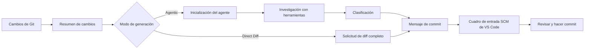

<!-- markdownlint-disable MD001 MD013 MD026 MD033 MD036 MD041 -->

<div align="center">


# Commit-Copilot

### Mensajes de commit con agentes inteligentes que entienden tu código, no solo tu diff.

Commit-Copilot es una extensión de VS Code que investiga tu repositorio con un agente de IA multietapa, clasifica los cambios utilizando reglas estrictas de Conventional Commits y redacta mensajes de commit pulidos directamente en el control de código fuente (Source Control).

Funciona perfectamente con los principales LLMs en la nube (Gemini, OpenAI, Anthropic Claude, DeepSeek), modelos locales de Ollama centrados en la privacidad y puntos finales personalizados (formatos compatibles con OpenAI y Anthropic).

[](https://marketplace.visualstudio.com/items?itemName=JeremySu0818.commit-copilot)
[](https://open-vsx.org/extension/JeremySu0818/commit-copilot)
[](https://open-vsx.org/extension/JeremySu0818/commit-copilot)
[](#requisitos)
[](#desarrollo)
[](#clasificación-de-commits-convencionales)
[](../../LICENSE)

**Investigación basada en agentes · 9 proveedores integrados · Endpoints personalizados · Soporte local para Ollama · 20 idiomas**

<p align="center">
  <b>Traducciones:</b>
  <a href="https://github.com/JeremySu0818/Commit-Copilot#readme">English</a> |
  <a href="https://github.com/JeremySu0818/Commit-Copilot/blob/main/docs/readme/README-zh-tw.md">繁體中文</a> |
  <a href="https://github.com/JeremySu0818/Commit-Copilot/blob/main/docs/readme/README-zh-cn.md">简体中文</a> |
  <a href="https://github.com/JeremySu0818/Commit-Copilot/blob/main/docs/readme/README-ja.md">日本語</a> |
  <a href="https://github.com/JeremySu0818/Commit-Copilot/blob/main/docs/readme/README-ko.md">한국어</a> |
  <a href="https://github.com/JeremySu0818/Commit-Copilot/blob/main/docs/readme/README-de.md">Deutsch</a> |
  <a href="https://github.com/JeremySu0818/Commit-Copilot/blob/main/docs/readme/README-fr.md">Français</a> |
  <a href="https://github.com/JeremySu0818/Commit-Copilot/blob/main/docs/readme/README-es.md">Español</a> |
  <a href="https://github.com/JeremySu0818/Commit-Copilot/blob/main/docs/readme/README-pt-br.md">Português (Brasil)</a> |
  <a href="https://github.com/JeremySu0818/Commit-Copilot/blob/main/docs/readme/README-ru.md">Русский</a> |
  <a href="https://github.com/JeremySu0818/Commit-Copilot/blob/main/docs/readme/README-it.md">Italiano</a> |
  <a href="https://github.com/JeremySu0818/Commit-Copilot/blob/main/docs/readme/README-nl.md">Nederlands</a> |
  <a href="https://github.com/JeremySu0818/Commit-Copilot/blob/main/docs/readme/README-pl.md">Polski</a> |
  <a href="https://github.com/JeremySu0818/Commit-Copilot/blob/main/docs/readme/README-tr.md">Türkçe</a> |
  <a href="https://github.com/JeremySu0818/Commit-Copilot/blob/main/docs/readme/README-vi.md">Tiếng Việt</a> |
  <a href="https://github.com/JeremySu0818/Commit-Copilot/blob/main/docs/readme/README-id.md">Bahasa Indonesia</a> |
  <a href="https://github.com/JeremySu0818/Commit-Copilot/blob/main/docs/readme/README-hu.md">Magyar</a> |
  <a href="https://github.com/JeremySu0818/Commit-Copilot/blob/main/docs/readme/README-cs.md">Čeština</a> |
  <a href="https://github.com/JeremySu0818/Commit-Copilot/blob/main/docs/readme/README-hi.md">हिन्दी</a> |
  <a href="https://github.com/JeremySu0818/Commit-Copilot/blob/main/docs/readme/README-ar.md">العربية</a>
</p>

</div>

---

## ¿Por qué Commit-Copilot?

La mayoría de las herramientas de commit con IA envían un diff sin procesar a un modelo esperando obtener un buen resumen de una línea.

Commit-Copilot adopta un enfoque completamente diferente.

Comienza con metadatos de cambio ligeros y luego deja que un agente autónomo decida qué necesita inspeccionar: diffs, contenido de archivos, símbolos, referencias, patrones globales del proyecto y commits recientes. Solo después de comprender a fondo el cambio, clasifica y genera el mensaje.

| Capacidad                                           | Herramientas básicas diff-a-prompt | Commit-Copilot |
| --------------------------------------------------- | :--------------------------------: | :------------: |
| Lee el diff completo de inmediato                   |                 Sí                 |    Opcional    |
| Investiga selectivamente archivos relevantes        |                 No                 |       Sí       |
| Entiende la estructura del código                   |              Limitado              |       Sí       |
| Encuentra referencias de símbolos mediante LSP      |                 No                 |       Sí       |
| Busca relaciones ocultas de cadenas/configuraciones |                 No                 |       Sí       |
| Aprende del estilo de commits recientes             |            Raras veces             |       Sí       |
| Utiliza análisis preciso del índice (staged) de Git |            Raras veces             |       Sí       |
| Soporta flujos de agentes nativos y locales         |              Limitado              |       Sí       |
| Aplica límites estrictos de tipos de commit         |         Depende del modelo         |       Sí       |
| Nunca añade al stage sin consentimiento             |               Varía                |       Sí       |

> [!TIP]
> Utiliza el modo **Agentic** para obtener máxima precisión y contexto. Utiliza el modo **Direct Diff** cuando la velocidad sea más importante que la investigación profunda.

---

## Puntos destacados

<table>
<tr>
<td width="50%" valign="top">

<h3>Agente con conocimiento del repositorio</h3>

El agente comienza con los nombres de archivo, tipos de cambios, recuento de líneas y la estructura del proyecto; luego elige las herramientas necesarias para comprender el cambio.

</td>
<td width="50%" valign="top">

<h3>Precisión en el índice de Git</h3>

Para los cambios preparados (staged), las herramientas del repositorio priorizan el contenido del índice de Git. El análisis de referencias LSP utiliza un espacio de trabajo temporal reconstruido a partir del estado en stage.

</td>
</tr>
<tr>
<td width="50%" valign="top">

<h3>Diseñado para múltiples proveedores</h3>

Utiliza Google Gemini, OpenAI, Anthropic, xAI, Groq, OpenRouter, DeepSeek, Alibaba Qwen, Ollama o cualquier endpoint personalizado compatible.

</td>
<td width="50%" valign="top">

<h3>Conventional Commits estrictos</h3>

El prompt admite los 11 tipos de Conventional Commits y aplica reglas de clasificación jerarquizadas con límites explícitos. El ámbito (scope), cuerpo (body), pie (footer) y Gitmoji se pueden configurar de forma independiente.

</td>
</tr>
<tr>
<td width="50%" valign="top">

<h3>Flujo de trabajo con agentes para modelos locales</h3>

Los modelos de Ollama pueden usar las mismas herramientas de investigación mediante el protocolo de herramientas de texto integrado de Commit-Copilot, incluso sin soporte nativo de Tool Calling.

</td>
<td width="50%" valign="top">

<h3>Flujo de trabajo seguro centrado en la revisión</h3>

Commit-Copilot escribe el resultado en el cuadro de entrada de Source Control. Tú mantienes el control total sobre la preparación (stage), edición y el commit final.

</td>
</tr>
</table>

---

## Índice

- [Cómo funciona](#cómo-funciona)
- [Herramientas del agente](#herramientas-del-agente)
- [Características](#características)
- [Proveedores compatibles](#proveedores-compatibles)
- [Requisitos](#requisitos)
- [Instalación](#instalación)
- [Configuración](#configuración)
- [Uso](#uso)
- [Clasificación de commits convencionales](#clasificación-de-commits-convencionales)
- [Detección de cambios](#detección-de-cambios)
- [Localización](#localización)
- [Seguridad y privacidad](#seguridad-y-privacidad)
- [Desarrollo](#desarrollo)
- [Pruebas](#pruebas)
- [Preguntas frecuentes (FAQ)](#preguntas-frecuentes-faq)
- [Contribución](#contribución)
- [Licencia](#licencia)

---

## Cómo funciona



### Flujo de trabajo Agentic

1. **Recopilar metadatos de cambios**
   Commit-Copilot recopila nombres de archivos, tipos de cambios, recuentos de líneas y el árbol de estructura del proyecto.

2. **Inicializar el agente**
   El modelo recibe el resumen y las instrucciones para la generación autónoma del mensaje de commit. El contenido del diff sin procesar no se incluye inicialmente.

3. **Investigar con herramientas**
   El agente inspecciona selectivamente el repositorio solicitando únicamente el contexto que considera útil.

4. **Clasificar el cambio**
   Reglas ordenadas por prioridad determinan el tipo de commit. Cuando la salida de ámbito (scope) está habilitada, el agente también selecciona el módulo o área afectada.

5. **Generar el mensaje**
   El mensaje final se escribe en el cuadro de entrada de Source Control para su revisión y edición.

> [!NOTE]
> Cuando la **Generación híbrida** está activada, el texto existente en Source Control se trata como borrador de referencia para el estilo y la intención. Las instrucciones incluidas dentro de ese borrador no pueden anular las reglas de generación.

### Flujo de trabajo Direct Diff

Direct Diff omite el ciclo de investigación y envía el diff completo al modelo seleccionado en una sola solicitud. Es más rápido, está disponible para todos los proveedores y es ideal para cambios pequeños u obvios.

---

## Herramientas del agente

El agente puede combinar las siguientes herramientas a lo largo de varios pasos de investigación:

| Herramienta            | Propósito                                                                                                                        |
| ---------------------- | -------------------------------------------------------------------------------------------------------------------------------- |
| `get_diff`             | Obtiene el diff exacto y completo para un archivo o múltiples archivos solicitados.                                              |
| `read_file`            | Lee el contenido del archivo, opcionalmente en un rango de líneas. El análisis en stage prioriza el contenido del índice de Git. |
| `get_file_outline`     | Devuelve información estructural como funciones, clases y exportaciones.                                                         |
| `find_references`      | Utiliza el Language Server Protocol de VS Code para localizar referencias sintácticas de símbolos.                               |
| `get_recent_commits`   | Lee mensajes de commits recientes para adaptarse al estilo existente del repositorio.                                            |
| `search_code`          | Busca en el espacio de trabajo cadenas o patrones que las importaciones por sí solas no revelan.                                 |
| `write_commit_message` | Envía el mensaje de commit estructurado final.                                                                                   |

Las rutas de Gemini, Anthropic y compatibles con OpenAI utilizan llamadas a herramientas estructuradas nativas. Ollama utiliza un protocolo de texto equivalente con soporte para llamadas agrupadas en lote, IDs de llamada asignados por la aplicación, resultados estructurados, errores por llamada y envío final.

`get_diff` acepta un único `path` o un array no vacío `paths`. Las solicitudes de múltiples archivos reducen las transferencias de herramientas y devuelven el diff exacto y completo de cada archivo solicitado; ningún contenido de archivo se resume u omite.

La generación mediante agentes puede exigir de forma opcional una cobertura completa de diffs. Cuando se activa en Configuración, `write_commit_message` se rechaza hasta que cada archivo modificado de un diff de Git válido haya sido cubierto por una solicitud `get_diff` exitosa (individual o en lote). Esta opción está deshabilitada por defecto para preservar el rendimiento y el consumo de tokens.

---

## Características

### Generación y análisis

- **Modos de generación Agentic y Direct Diff**
- **Pasos máximos del agente configurables**
- **Ciclo de investigación cancelable en cualquier momento**
- **Reintentos automáticos** ante fallos transitorios de API remotas y límites de frecuencia (Rate Limits)
- **Búsqueda de patrones en todo el proyecto** para variables de entorno, nombres de eventos, claves de configuración y otras relaciones basadas en texto
- **Radar de impacto de referencias LSP** para análisis de símbolos consciente de la sintaxis
- **Inspección de commits recientes** para adaptarse a las convenciones del proyecto
- **Generación híbrida** utilizando el texto existente en Source Control como borrador de referencia seguro

### Comportamiento consciente de Git

- Detecta cinco estados del repositorio: solo en stage (Staged), solo sin stage (Unstaged), mixto (Mixed), sin stage + no rastreado, y solo no rastreado (Untracked-only)
- Pregunta antes de añadir archivos no rastreados al stage
- Nunca añade archivos al stage automáticamente sin consentimiento explícito
- Prioriza el contenido del índice de Git al inspeccionar archivos en stage
- Crea una instantánea temporal del espacio de trabajo en stage para el análisis de referencias LSP
- Actualiza la vista principal en tiempo real a medida que cambia el estado del repositorio

### Controles de salida del commit

Activa o desactiva de forma independiente:

- **Scope** (Ámbito)
- **Body** (Cuerpo)
- **Footer** (Pie / Breaking Changes)
- **Prefijo Gitmoji**

Valores predeterminados:

| Elemento | Predeterminado |
| -------- | :------------: |
| Scope    |    Activado    |
| Body     |    Activado    |
| Footer   |  Desactivado   |
| Gitmoji  |  Desactivado   |

### Integración con VS Code

Inicia Commit-Copilot desde:

- La **Barra de actividad (Activity Bar)**
- El icono de varita mágica en la **barra de navegación de Source Control (SCM)**
- La **Paleta de comandos (Command Palette)**

Los mensajes generados se insertan directamente en el cuadro de entrada estándar de Source Control, donde se pueden revisar y editar antes de hacer el commit.

### Validación de proveedores y gestión de modelos

- Las claves de API se validan con el punto final real del proveedor seleccionado antes de guardarse
- Los errores específicos de autenticación, cuota y conexión del proveedor se muestran con orientación práctica
- OpenRouter, Alibaba Qwen, Ollama y los proveedores personalizados pueden consultar listas de modelos dinámicamente
- Ollama y los proveedores personalizados permiten añadir o eliminar IDs de modelos manualmente si el descubrimiento automático está incompleto
- Los proveedores personalizados admiten APIs compatibles con OpenAI y Anthropic

---

## Proveedores compatibles

| Proveedor           | Puntos destacados                                                                |
| ------------------- | -------------------------------------------------------------------------------- |
| **Google Gemini**   | Herramientas estructuradas nativas y múltiples generaciones de modelos Gemini    |
| **OpenAI**          | Modelos de razonamiento, uso general, compactos y la serie GPT-5                 |
| **Anthropic**       | Familias completas Claude Haiku, Sonnet, Opus y Fable                            |
| **xAI Grok**        | Variantes de Grok estándar y con razonamiento                                    |
| **Groq**            | Modelos alojados ultrarrápidos MiniMax, Qwen y `gpt-oss`                         |
| **OpenRouter**      | Acceso dinámico a modelos compatibles con filtrado por soporte de herramientas   |
| **DeepSeek**        | DeepSeek V4.1 Flash                                                              |
| **Alibaba Qwen**    | Integración DashScope con descubrimiento dinámico de modelos                     |
| **Ollama**          | Modelos locales con descubrimiento dinámico y protocolo de herramientas de texto |
| **Custom Provider** | Puntos finales compatibles con los formatos de API de OpenAI o Anthropic         |

<details>
<summary><strong>Ver las familias de modelos listadas por Commit-Copilot</strong></summary>

### Google Gemini

- Gemini 2.5 Flash-Lite, Flash y Pro
- Gemini 3 Flash
- Gemini 3.1 Flash-Lite y Pro
- Gemini 3.5 Flash-Lite y Flash
- Gemini 3.6 Flash
- Gemini 3.7 Flash
- Gemini 3.8 Flash

### OpenAI

- o3 y o3-mini
- o4-mini
- GPT-4o mini y GPT-4o
- GPT-4.1 nano, mini y GPT-4.1
- GPT-5 nano, mini y GPT-5
- GPT-5.1
- GPT-5.2
- GPT-5.4 nano, mini y GPT-5.4
- GPT-5.5
- GPT-5.6 Luna, Terra y Sol
- GPT-6 Astra

### Anthropic

- Claude Sonnet 4 y Opus 4
- Claude Opus 4.1
- Claude Haiku, Sonnet y Opus 4.5
- Claude Sonnet y Opus 4.6
- Claude Opus 4.7
- Claude Opus 4.8
- Claude Sonnet 5, Opus 5 y Fable 5
- Claude Fable 5.1

### xAI Grok

- Grok 4.20, con y sin razonamiento
- Grok 4.3
- Grok 4.5
- Grok 4.6

### Groq

- `gpt-oss-20B`
- `gpt-oss-120B`
- `gpt-oss-safeguard-20B`
- MiniMax M2.7
- Qwen 3.6 27b

### DeepSeek

- DeepSeek V4.1 Flash

> [!IMPORTANT]
> La disponibilidad de modelos depende del proveedor, cuenta, región, punto final y catálogo actual del proveedor. Las listas para OpenRouter, Qwen, Ollama y proveedores personalizados pueden descubrirse dinámicamente.

</details>

---

## Requisitos

- **VS Code** `1.91.0` o posterior
- **Git**, disponible a través de la extensión Git integrada de VS Code
- Al menos uno de los siguientes:
  - Una clave de API válida para un proveedor remoto compatible
  - Una instancia de Ollama local o remota accesible
  - Credenciales para un endpoint personalizado compatible

Para el desarrollo:

- **Node.js** `20+`
- **npm**

---

## Instalación

Instala Commit-Copilot desde cualquiera de los siguientes marketplaces:

- [**Visual Studio Code Marketplace**](https://marketplace.visualstudio.com/items?itemName=JeremySu0818.commit-copilot)
- [**Open VSX Registry**](https://open-vsx.org/extension/JeremySu0818/commit-copilot)

Tras la instalación, abre un repositorio Git en VS Code y haz clic en el icono de **Commit Copilot** en la barra de actividad.

---

## Configuración

### Configuración básica

1. Abre la vista **Commit Copilot** desde la barra de actividad.
2. Selecciona un proveedor de API.
3. Introduce la clave de API del proveedor o la URL de host de Ollama.
4. Selecciona **Guardar**.
5. Espera la validación de credenciales en tiempo real.
6. Elige un modelo una vez que la selección de modelos esté disponible.

> [!IMPORTANT]
> La generación con Ollama ejecuta automáticamente `ollama pull` para el modelo seleccionado antes de la generación e informa del progreso en el área de notificaciones. Esto puede volver a descargar capas del modelo incluso si el modelo ya existe localmente.

### Opciones

| Opción                               | Predeterminado | Descripción                                                                                                                               |
| ------------------------------------ | -------------- | ----------------------------------------------------------------------------------------------------------------------------------------- |
| **Modo de generación**               | Agentic        | `Agentic` ejecuta un bucle de investigación multietapa. `Direct Diff` envía el diff completo en una sola solicitud.                       |
| **Generación híbrida**               | Desactivado    | Utiliza el texto existente de Source Control como borrador de referencia mientras lo aísla estrictamente de las instrucciones del prompt. |
| **Pasos Máximos del Agente**         | `0`            | Iteraciones máximas de llamadas a herramientas. Establece en `0` para ilimitado.                                                          |
| **Incluir Ámbito (Scope)**           | Activado       | Exige un ámbito de Conventional Commits en el asunto cuando está habilitado.                                                              |
| **Incluir Cuerpo (Body)**            | Activado       | Exige una sección descriptiva del cuerpo cuando está habilitado.                                                                          |
| **Incluir Pie (Footer)**             | Desactivado    | Exige una sección de pie cuando está habilitado (p. ej., Breaking Changes); nunca se inventan hechos no respaldados.                      |
| **Incluir Gitmoji**                  | Desactivado    | Requiere exactamente un prefijo Gitmoji mapeado cuando está habilitado.                                                                   |
| **Idioma de Extensión**              | Auto           | Sigue el idioma de visualización de VS Code a menos que se fije manualmente.                                                              |
| **Idioma de los mensajes de commit** | Inglés         | Controla de forma independiente el idioma del asunto, cuerpo y pie de página generados.                                                   |

### Proveedor personalizado

Para añadir un punto final compatible con OpenAI o Anthropic:

1. Abre los ajustes del proveedor.
2. Selecciona **+ Añadir Proveedor...**.
3. Elige el formato de la API (`OpenAI-compatible` o `Anthropic-compatible`).
4. Introduce un nombre para mostrar y la URL base de la API.
5. Guarda el proveedor.
6. Introduce y valida la clave de API.
7. Selecciona un modelo descubierto o añade un ID de modelo mediante **Gestionar modelos...**.

Para endpoints compatibles con Anthropic, también se puede configurar el valor máximo de tokens de salida (`max_tokens`).

---

## Uso

### Método A: Barra de actividad (Activity Bar)

1. Abre la vista **Commit Copilot**.
2. Confirma que el repositorio contiene cambios en stage, sin stage o no rastreados.
3. Selecciona **Generar Mensaje de Commit**.
4. Responde a cualquier aviso de selección o preparación de cambios.

### Método B: Control de código fuente (Source Control)

1. Abre Source Control con `Ctrl+Shift+G` (macOS: `Cmd+Shift+G`).
2. Haz clic en el icono de varita mágica de Commit-Copilot en la barra de navegación.

### Método C: Paleta de comandos (Command Palette)

1. Abre la paleta de comandos:
   - Windows/Linux: `Ctrl+Shift+P`
   - macOS: `Cmd+Shift+P`
2. Ejecuta **Commit-Copilot: Generar Mensaje de Commit**.

### Revisar y hacer commit

El mensaje generado aparece directamente en el cuadro de entrada de Source Control.

Puedes editarlo libremente y luego hacer el commit con la acción estándar de Source Control de VS Code.

---

## Clasificación de commits convencionales

Commit-Copilot admite los siguientes 11 tipos de Conventional Commits:

| Tipo       | Uso previsto                                                    |
| ---------- | --------------------------------------------------------------- |
| `feat`     | Introduce una nueva funcionalidad visible para el usuario       |
| `fix`      | Corrige un comportamiento erróneo                               |
| `docs`     | Modifica exclusivamente la documentación                        |
| `style`    | Cambia el formateo sin afectar el comportamiento del código     |
| `refactor` | Reestructura el código sin añadir funciones ni corregir errores |
| `perf`     | Mejora el rendimiento o el consumo de recursos                  |
| `test`     | Añade o actualiza pruebas                                       |
| `build`    | Modifica el sistema de compilación o dependencias externas      |
| `ci`       | Cambia la configuración de integración o despliegue continuo    |
| `chore`    | Realiza tareas de mantenimiento no cubiertas por otro tipo      |
| `revert`   | Revierte un commit anterior                                     |

La salida sigue estrictamente la sintaxis de Conventional Commits:

```text
type(scope): descripción concisa

Cuerpo explicativo que describe qué cambió y por qué.
```

Dependiendo de la configuración, el scope, el body, el footer y el Gitmoji pueden requerirse u omitirse. La primera línea está limitada a 72 caracteres y se recomienda mantenerla por debajo de 50.

---

## Detección de cambios

Commit-Copilot reconoce cinco estados del repositorio:

| Escenario                     | Comportamiento                                                            |
| ----------------------------- | ------------------------------------------------------------------------- |
| **Solo en stage (Staged)**    | Utiliza el diff en stage y herramientas conscientes del índice de Git     |
| **Solo sin stage (Unstaged)** | Analiza las modificaciones actuales en el árbol de trabajo (Working Tree) |
| **Cambios mixtos (Mixed)**    | Pregunta interactivamente qué conjunto de cambios procesar                |
| **Sin stage + no rastreado**  | Presenta opciones contextuales para preparar los cambios                  |
| **Solo no rastreado**         | Ofrece preparar los archivos nuevos y generar el mensaje                  |

Ningún archivo se añade al stage automáticamente sin confirmación explícita.

---

## Localización

La interfaz de usuario de la extensión puede seguir el idioma de VS Code automáticamente o fijarse en uno de los 20 idiomas admitidos:

<table>
<tr>
<td><a href="README-ar.md">العربية</a></td>
<td><a href="README-cs.md">Čeština</a></td>
<td><a href="README-de.md">Deutsch</a></td>
<td><a href="../../README.md">English</a></td>
</tr>
<tr>
<td><a href="README-es.md">Español</a></td>
<td><a href="README-fr.md">Français</a></td>
<td><a href="README-hi.md">हिन्दी</a></td>
<td><a href="README-hu.md">Magyar</a></td>
</tr>
<tr>
<td><a href="README-id.md">Bahasa Indonesia</a></td>
<td><a href="README-it.md">Italiano</a></td>
<td><a href="README-ja.md">日本語</a></td>
<td><a href="README-ko.md">한국어</a></td>
</tr>
<tr>
<td><a href="README-nl.md">Nederlands</a></td>
<td><a href="README-pl.md">Polski</a></td>
<td><a href="README-pt-br.md">Português (Brasil)</a></td>
<td><a href="README-ru.md">Русский</a></td>
</tr>
<tr>
<td><a href="README-tr.md">Türkçe</a></td>
<td><a href="README-vi.md">Tiếng Việt</a></td>
<td><a href="README-zh-cn.md">简体中文</a></td>
<td><a href="README-zh-tw.md">繁體中文</a></td>
</tr>
</table>

El **idioma de los mensajes de commit** se configura por separado del idioma de la interfaz de la extensión, lo que permite tener la interfaz en español y generar commits en inglés.

---

## Seguridad y privacidad

- Las claves de API se guardan de forma cifrada en el **Secret Storage de VS Code**
- Las claves se validan directamente con el proveedor seleccionado antes de guardarse
- Commit-Copilot nunca añade archivos al stage sin consentimiento explícito
- La generación híbrida trata el texto existente en Source Control como un borrador de referencia no confiable para evitar inyecciones de prompts
- Las solicitudes a proveedores remotos solo incluyen metadatos, diffs o contenido de archivos seleccionados durante el análisis
- Con Ollama, la inferencia del modelo permanece completamente dentro de tu entorno local

> [!CAUTION]
> Revisa la política de privacidad y manejo de datos de tu proveedor seleccionado antes de enviar código confidencial o propietario a una API remota.

---

## Desarrollo

### Instalar dependencias

```bash
npm install
```

### Compilar para desarrollo

```bash
npm run compile
```

Para compilación continua en tiempo real con TypeScript y esbuild:

```bash
npm run watch
```

### Empaquetar un VSIX

```bash
npm run build
```

El script de compilación instala dependencias, ejecuta el flujo de empaquetado de VS Code y genera un paquete `.vsix`.

### Control de calidad de código

Comprobar reglas de estilo (lint):

```bash
npm run lint
```

Formatear archivos de código fuente:

```bash
npm run format
```

Verificar el formateo sin modificar archivos:

```bash
npm run check-format
```

---

## Pruebas

Ejecutar la suite completa de pruebas unitarias:

```bash
npm test
```

Esto ejecuta:

1. `npm run test:build`
2. `node --test --test-concurrency=1 "out/test/**/*.test.js"`

La cobertura de pruebas actual incluye:

- Todas las herramientas del agente:
  - `get_diff`
  - `read_file`
  - `get_file_outline`
  - `find_references`
  - `get_recent_commits`
  - `search_code`
- Bucles de agente con llamadas a herramientas estructuradas nativas
- Bucles de agente con protocolo de texto para Ollama
- Llamadas en lote y esquemas de herramientas localizados
- Recuperación ante respuestas malformadas
- Envío final de herramientas
- Despacho de herramientas mediante `executeToolCall`
- Análisis y construcción del contexto
- Utilidades de instantáneas del espacio de trabajo en stage
- Comportamiento de reintentos automáticos
- Mensajes de error localizados
- Comportamiento de proveedores en la vista principal
- Gestión de modelos personalizados
- Gestores de estado

---

## Preguntas frecuentes (FAQ)

<details>
<summary><strong>¿Commit-Copilot realiza el commit automáticamente?</strong></summary>

No. Solo escribe el mensaje generado en el cuadro de entrada de Source Control. Puedes revisarlo, editarlo y hacer el commit tú mismo.

</details>

<details>
<summary><strong>¿El agente recibe todo mi repositorio?</strong></summary>

En el modo Agentic, inicialmente solo recibe metadatos de los cambios y el árbol de archivos rastreados, no el contenido de cada archivo. Posteriormente solicita diffs, archivos, referencias o búsquedas específicas según sea necesario. El modo Direct Diff envía el diff completo seleccionado en una única solicitud.

</details>

<details>
<summary><strong>¿Pueden los modelos de Ollama usar herramientas de agente sin Tool Calling nativo?</strong></summary>

Sí. Commit-Copilot incluye un protocolo de herramientas de texto que permite a los modelos de Ollama acceder al mismo flujo de trabajo de investigación multietapa.

</details>

<details>
<summary><strong>¿Qué significa Pasos Máximos del Agente = 0?</strong></summary>

Elimina el límite de iteraciones de llamadas a herramientas. Cualquier valor positivo restringe la cantidad de pasos de investigación que el agente puede dar antes de producir el resultado final.

</details>

<details>
<summary><strong>¿Puedo utilizar un endpoint que no esté integrado nativamente?</strong></summary>

Sí. Añádelo como un proveedor personalizado compatible con OpenAI o Anthropic, y luego obtén dinámicamente o configura manualmente sus IDs de modelo.

</details>

<details>
<summary><strong>¿Por qué Ollama descarga (pull) el modelo cada vez?</strong></summary>

La extensión ejecuta deliberadamente `ollama pull` antes de cada generación para asegurar que el modelo seleccionado esté disponible localmente y actualizado. Según el estado de la caché local, esto puede verificar o volver a descargar capas del modelo.

</details>

---

## Contribución

¡Las contribuciones de la comunidad son bienvenidas!

Un flujo de contribución recomendado es:

1. Crea una rama dedicada para tu cambio.
2. Realiza las modificaciones.
3. Ejecuta el linter, comprobaciones de formato y pruebas.
4. Describe claramente la motivación y los cambios en el Pull Request.
5. Añade cobertura de pruebas relevante para cambios de comportamiento.

Antes de enviar:

```bash
npm run lint
npm run check-format
npm test
```

Para informes de errores, incluye el proveedor, modelo, modo de generación, estado de cambios de Git, registros relevantes y pasos confiables de reproducción. Nunca incluyas claves de API ni código confidencial del repositorio.

---

## Licencia

Commit-Copilot se distribuye bajo la [Licencia MIT](../../LICENSE).

---

<div align="center">

Creado para desarrolladores que buscan mensajes de commit con contexto, sin adivinanzas.

</div>
