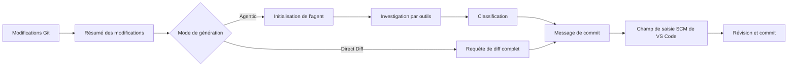

<!-- markdownlint-disable MD001 MD013 MD026 MD033 MD036 MD041 -->

<div align="center">


# Commit-Copilot

### Des messages de commit intelligents (Agentic) qui comprennent votre code — pas seulement vos diffs.

Commit-Copilot est une extension VS Code qui explore votre dépôt à l’aide d’un agent IA autonome en plusieurs étapes, classifie les modifications selon les règles strictes de Conventional Commits et rédige des messages de commit soignés directement dans le contrôle de code source (Source Control).

Il fonctionne en toute fluidité avec les grands LLM du cloud (Gemini, OpenAI, Anthropic Claude, DeepSeek), les modèles locaux Ollama respectueux de la vie privée et les points de terminaison personnalisés (formats compatibles OpenAI et Anthropic).

[](https://marketplace.visualstudio.com/items?itemName=JeremySu0818.commit-copilot)
[](https://open-vsx.org/extension/JeremySu0818/commit-copilot)
[](https://open-vsx.org/extension/JeremySu0818/commit-copilot)
[](#prérequis)
[](#développement)
[](#classification-conventional-commits)
[](../../LICENSE)

**Investigation autonome par agent · 9 fournisseurs intégrés · Points de terminaison personnalisés · Support Ollama local · 20 langues**

<p align="center">
  <b>Traductions :</b>
  <a href="https://github.com/JeremySu0818/Commit-Copilot#readme">English</a> |
  <a href="https://github.com/JeremySu0818/Commit-Copilot/blob/main/docs/readme/README-zh-tw.md">繁體中文</a> |
  <a href="https://github.com/JeremySu0818/Commit-Copilot/blob/main/docs/readme/README-zh-cn.md">简体中文</a> |
  <a href="https://github.com/JeremySu0818/Commit-Copilot/blob/main/docs/readme/README-ja.md">日本語</a> |
  <a href="https://github.com/JeremySu0818/Commit-Copilot/blob/main/docs/readme/README-ko.md">한국어</a> |
  <a href="https://github.com/JeremySu0818/Commit-Copilot/blob/main/docs/readme/README-de.md">Deutsch</a> |
  <a href="https://github.com/JeremySu0818/Commit-Copilot/blob/main/docs/readme/README-fr.md">Français</a> |
  <a href="https://github.com/JeremySu0818/Commit-Copilot/blob/main/docs/readme/README-es.md">Español</a> |
  <a href="https://github.com/JeremySu0818/Commit-Copilot/blob/main/docs/readme/README-pt-br.md">Português (Brasil)</a> |
  <a href="https://github.com/JeremySu0818/Commit-Copilot/blob/main/docs/readme/README-ru.md">Русский</a> |
  <a href="https://github.com/JeremySu0818/Commit-Copilot/blob/main/docs/readme/README-it.md">Italiano</a> |
  <a href="https://github.com/JeremySu0818/Commit-Copilot/blob/main/docs/readme/README-nl.md">Nederlands</a> |
  <a href="https://github.com/JeremySu0818/Commit-Copilot/blob/main/docs/readme/README-pl.md">Polski</a> |
  <a href="https://github.com/JeremySu0818/Commit-Copilot/blob/main/docs/readme/README-tr.md">Türkçe</a> |
  <a href="https://github.com/JeremySu0818/Commit-Copilot/blob/main/docs/readme/README-vi.md">Tiếng Việt</a> |
  <a href="https://github.com/JeremySu0818/Commit-Copilot/blob/main/docs/readme/README-id.md">Bahasa Indonesia</a> |
  <a href="https://github.com/JeremySu0818/Commit-Copilot/blob/main/docs/readme/README-hu.md">Magyar</a> |
  <a href="https://github.com/JeremySu0818/Commit-Copilot/blob/main/docs/readme/README-cs.md">Čeština</a> |
  <a href="https://github.com/JeremySu0818/Commit-Copilot/blob/main/docs/readme/README-hi.md">हिन्दी</a> |
  <a href="https://github.com/JeremySu0818/Commit-Copilot/blob/main/docs/readme/README-ar.md">العربية</a>
</p>

</div>

---

## Pourquoi Commit-Copilot ?

La plupart des outils de commit par IA envoient un diff brut à un modèle en espérant obtenir un résumé convenable sur une seule ligne.

Commit-Copilot adopte une approche radicalement différente.

Il commence par analyser des métadonnées de modification légères, puis laisse un agent autonome décider de ce qu'il doit inspecter : diffs, contenus de fichiers, symboles, références, motifs à l'échelle du projet et commits récents. Ce n'est qu'après avoir parfaitement compris la modification qu'il la classifie et génère le message.

| Fonctionnalité                                            | Outils basiques diff-vers-prompt | Commit-Copilot |
| --------------------------------------------------------- | :------------------------------: | :------------: |
| Lit le diff complet immédiatement                         |               Oui                |   Optionnel    |
| Explore sélectivement les fichiers pertinents             |               Non                |      Oui       |
| Comprend la structure du code                             |              Limité              |      Oui       |
| Trouve les références de symboles via LSP                 |               Non                |      Oui       |
| Recherche les relations cachées de chaînes/configurations |               Non                |      Oui       |
| Apprend du style des commits récents                      |             Rarement             |      Oui       |
| Utilise une analyse précise de l'index Git (staged)       |             Rarement             |      Oui       |
| Prend en charge les workflows d'agents natifs et locaux   |              Limité              |      Oui       |
| Applique des limites strictes aux types de commit         |         Dépend du modèle         |      Oui       |
| N'indexe jamais de fichiers sans consentement             |             Variable             |      Oui       |

> [!TIP]
> Utilisez le mode **Agentic** pour une précision et un contexte optimaux. Utilisez le mode **Direct Diff** lorsque la vitesse prime sur l'investigation approfondie.

---

## Points forts

<table>
<tr>
<td width="50%" valign="top">

<h3>Agent sensible au dépôt</h3>

L'agent commence par les noms de fichiers, les types de modifications, le décompte des lignes et la structure du projet, puis choisit les outils nécessaires pour comprendre en détail la modification.

</td>
<td width="50%" valign="top">

<h3>Précision de l'index Git</h3>

Pour les modifications indexées (staged), les outils privilégient le contenu de l'index Git. L'analyse des références LSP utilise un espace de travail temporaire reconstitué à partir de l'état indexé.

</td>
</tr>
<tr>
<td width="50%" valign="top">

<h3>Multi-fournisseurs par conception</h3>

Utilisez Google Gemini, OpenAI, Anthropic, xAI, Groq, OpenRouter, DeepSeek, Alibaba Qwen, Ollama ou n'importe quel point de terminaison personnalisé compatible.

</td>
<td width="50%" valign="top">

<h3>Conventional Commits stricts</h3>

Le prompt prend en charge les 11 types de Conventional Commits et applique des règles de classification hiérarchisées avec des délimitations claires. Scope, Body, Footer et Gitmoji sont configurables indépendamment.

</td>
</tr>
<tr>
<td width="50%" valign="top">

<h3>Workflow d'agent pour modèles locaux</h3>

Les modèles Ollama peuvent utiliser les mêmes outils d'investigation grâce au protocole d'outils textuels intégré de Commit-Copilot — même sans support natif de Tool Calling.

</td>
<td width="50%" valign="top">

<h3>Workflow sécurisé axé sur la révision</h3>

Commit-Copilot écrit le résultat dans le champ de saisie du contrôle de code source. Vous gardez le contrôle total sur l'indexation, l'édition et la validation finale.

</td>
</tr>
</table>

---

## Table des matières

- [Comment ça marche](#comment-ça-marche)
- [Outils de l'agent](#outils-de-lagent)
- [Fonctionnalités](#fonctionnalités)
- [Fournisseurs pris en charge](#fournisseurs-pris-en-charge)
- [Prérequis](#prérequis)
- [Installation](#installation)
- [Configuration](#configuration)
- [Utilisation](#utilisation)
- [Classification Conventional Commits](#classification-conventional-commits)
- [Détection des modifications](#détection-des-modifications)
- [Localisation](#localisation)
- [Sécurité et confidentialité](#sécurité-et-confidentialité)
- [Développement](#développement)
- [Tests](#tests)
- [FAQ](#faq)
- [Contribution](#contribution)
- [Licence](#licence)

---

## Comment ça marche



### Workflow Agentic

1. **Collecter les métadonnées de modification**
   Commit-Copilot rassemble les noms de fichiers, les types de modifications, le décompte des lignes et l'arborescence du projet.

2. **Initialiser l'agent**
   Le modèle reçoit le résumé et des instructions pour générer le message de commit de manière autonome. Le diff brut n'est pas inclus au départ.

3. **Investiguer avec les outils**
   L'agent inspecte sélectivement le dépôt en ne demandant que le contexte qu'il juge utile.

4. **Classifier la modification**
   Des règles hiérarchisées déterminent le type de commit. Si l'inclusion du scope est activée, l'agent sélectionne également le module ou la zone concernée.

5. **Générer le message**
   Le message final est inséré dans le champ de saisie du contrôle de code source (SCM) pour révision et édition.

> [!NOTE]
> Lorsque la **Génération hybride** est activée, le texte existant dans le contrôle de code source sert de document de référence pour la formulation et l'intention. Les instructions éventuelles présentes dans ce brouillon ne peuvent pas remplacer les règles de génération.

### Workflow Direct Diff

Direct Diff ignore la boucle d'investigation et envoie le diff complet au modèle sélectionné en une seule requête. Il est plus rapide, disponible pour tous les fournisseurs et idéal pour les modifications simples ou évidentes.

---

## Outils de l'agent

L'agent peut combiner les outils suivants au cours de plusieurs étapes d'investigation :

| Outil                  | Objectif                                                                                                               |
| ---------------------- | ---------------------------------------------------------------------------------------------------------------------- |
| `get_diff`             | Récupère le diff exact et complet pour un fichier ou plusieurs fichiers demandés.                                      |
| `read_file`            | Lit le contenu d'un fichier, avec plage de lignes optionnelle. L'analyse indexée privilégie le contenu de l'index Git. |
| `get_file_outline`     | Renvoie des informations structurelles telles que les fonctions, classes et exports.                                   |
| `find_references`      | Utilise le Language Server Protocol de VS Code pour localiser les références syntaxiques de symboles.                  |
| `get_recent_commits`   | Lit les messages de commit récents pour s'aligner sur le style existant du projet.                                     |
| `search_code`          | Recherche dans l'espace de travail des chaînes ou motifs que les imports seuls ne révèlent pas.                        |
| `write_commit_message` | Soumet le message de commit structuré final.                                                                           |

Les intégrations Gemini, Anthropic et compatibles OpenAI utilisent des appels d'outils structurés natifs. Ollama utilise un protocole textuel équivalent avec prise en charge des appels groupés, des identifiants d'appel attribués par l'application, des résultats structurés, de la gestion des erreurs par appel et de la soumission finale.

`get_diff` accepte un seul paramètre `path` ou un tableau non vide `paths`. Les requêtes multi-fichiers réduisent les allers-retours tout en renvoyant le diff exact et complet de chaque fichier demandé ; aucun contenu de fichier n'est résumé ou omis.

La génération par agent peut facultativement exiger une couverture complète des diffs. Lorsqu'elle est activée dans les paramètres, `write_commit_message` est rejeté tant que chaque fichier modifié provenant d'un diff Git valide n'a pas été couvert par une requête `get_diff` individuelle ou groupée réussie. Ce paramètre est désactivé par défaut pour préserver les performances et la consommation de jetons.

---

## Fonctionnalités

### Génération et analyse

- **Modes de génération Agentic et Direct Diff**
- **Nombre maximal d'étapes de l'agent configurable**
- **Boucle d'investigation annulable à tout moment**
- **Nouvelles tentatives automatiques** pour les erreurs d'API distantes temporaires et les limites de fréquence (Rate Limits)
- **Recherche de motifs transversaux** pour les variables d'environnement, noms d'événements, clés de configuration et autres relations textuelles
- **Radar d'impact des références LSP** pour une analyse sémantique précise des symboles
- **Inspection des commits récents** pour respecter les conventions du projet
- **Génération hybride** utilisant le texte existant dans le SCM comme brouillon de référence sécurisé

### Comportement Git intelligent

- Détecte cinq états du dépôt : indexé uniquement (Staged), non indexé uniquement (Unstaged), mixte (Mixed), non indexé + non suivi, et non suivi uniquement (Untracked-only)
- Demande confirmation avant d'indexer des fichiers non suivis
- N'effectue jamais d'indexation automatique sans consentement explicite
- Privilégie le contenu de l'index Git lors de l'inspection de fichiers indexés
- Crée un instantané temporaire de l'espace de travail indexé pour l'analyse des références LSP
- Met à jour l'interface principale en temps réel selon les changements d'état du dépôt

### Contrôle du format de sortie du commit

Activez ou désactivez indépendamment :

- **Scope** (Portée)
- **Body** (Corps du message)
- **Footer** (Pied de page / Changements majeurs)
- **Préfixe Gitmoji**

Valeurs par défaut :

| Élément | État par défaut |
| ------- | :-------------: |
| Scope   |     Activé      |
| Body    |     Activé      |
| Footer  |    Désactivé    |
| Gitmoji |    Désactivé    |

### Intégration VS Code

Lancez Commit-Copilot depuis :

- La **Barre d'activité (Activity Bar)**
- L'icône de baguette magique dans la **barre de navigation du contrôle de code source (SCM)**
- La **Palette de commandes (Command Palette)**

Les messages générés sont directement insérés dans le champ de saisie standard du SCM, où ils peuvent être révisés et ajustés avant d'être validés.

### Validation des fournisseurs et gestion des modèles

- Les clés API sont validées auprès du véritable point de terminaison du fournisseur avant d'être enregistrées
- Les erreurs d'authentification, de quota et de connexion spécifiques au fournisseur sont accompagnées de conseils clairs
- OpenRouter, Alibaba Qwen, Ollama et les fournisseurs personnalisés peuvent récupérer les listes de modèles dynamiquement
- Ollama et les fournisseurs personnalisés permettent d'ajouter ou de supprimer manuellement des identifiants de modèles lorsque la détection est incomplète
- Les fournisseurs personnalisés prennent en charge les API compatibles OpenAI et Anthropic

---

## Fournisseurs pris en charge

| Fournisseur         | Points forts                                                                      |
| ------------------- | --------------------------------------------------------------------------------- |
| **Google Gemini**   | Outils structurés natifs et générations multiples de modèles Gemini               |
| **OpenAI**          | Modèles de raisonnement, généralistes, compacts et séries GPT-5                   |
| **Anthropic**       | Familles complètes Claude Haiku, Sonnet, Opus et Fable                            |
| **xAI Grok**        | Variantes Grok standards et avec raisonnement                                     |
| **Groq**            | Hébergement ultra-rapide des modèles MiniMax, Qwen et `gpt-oss`                   |
| **OpenRouter**      | Accès dynamique à un vaste catalogue de modèles avec filtrage du support d'outils |
| **DeepSeek**        | Variantes Chat, Reasoner (R1) et V4                                               |
| **Alibaba Qwen**    | Intégration DashScope avec découverte dynamique de modèles                        |
| **Ollama**          | Modèles locaux avec découverte dynamique et protocole d'outils textuels intégré   |
| **Custom Provider** | Points de terminaison compatibles avec les formats d'API OpenAI ou Anthropic      |

<details>
<summary><strong>Afficher les familles de modèles répertoriées par Commit-Copilot</strong></summary>

### Google Gemini

- Gemini 2.5 Flash-Lite, Flash et Pro
- Gemini 3 Flash
- Gemini 3.1 Flash-Lite et Pro
- Gemini 3.5 Flash-Lite et Flash
- Gemini 3.6 Flash
- Gemini 3.7 Flash

### OpenAI

- o3 et o3-mini
- o4-mini
- GPT-4o mini et GPT-4o
- GPT-4.1 nano, mini et GPT-4.1
- GPT-5 nano, mini et GPT-5
- GPT-5.1
- GPT-5.2
- GPT-5.4 nano, mini et GPT-5.4
- GPT-5.5
- GPT-5.6 Luna, Terra et Sol

### Anthropic

- Claude Sonnet 4 et Opus 4
- Claude Opus 4.1
- Claude Haiku, Sonnet et Opus 4.5
- Claude Sonnet et Opus 4.6
- Claude Opus 4.7
- Claude Opus 4.8
- Claude Sonnet 5, Opus 5 et Fable 5

### xAI Grok

- Grok 4.20, avec et sans raisonnement
- Grok 4.3
- Grok 4.5
- Grok 4.6

### Groq

- `gpt-oss-20B`
- `gpt-oss-120B`
- `gpt-oss-safeguard-20B`
- MiniMax M2.7
- Qwen 3.6 27b

### DeepSeek

- DeepSeek Chat
- DeepSeek R1 / Reasoner
- DeepSeek V4 Flash et Pro

> [!IMPORTANT]
> La disponibilité des modèles dépend du fournisseur, du compte, de la région, du point de terminaison et du catalogue en vigueur. Les listes pour OpenRouter, Qwen, Ollama et les fournisseurs personnalisés peuvent être découvertes dynamiquement.

</details>

---

## Prérequis

- **VS Code** `1.91.0` ou version ultérieure
- **Git**, accessible via l'extension Git intégrée de VS Code
- Au moins l'un des éléments suivants :
  - Une clé API valide pour un fournisseur distant pris en charge
  - Une instance Ollama locale ou distante accessible
  - Des identifiants pour un point de terminaison personnalisé compatible

Pour le développement :

- **Node.js** `20+`
- **npm**

---

## Installation

Installez Commit-Copilot depuis l'un des registres suivants :

- [**Visual Studio Code Marketplace**](https://marketplace.visualstudio.com/items?itemName=JeremySu0818.commit-copilot)
- [**Registre Open VSX**](https://open-vsx.org/extension/JeremySu0818/commit-copilot)

Après l'installation, ouvrez un dépôt Git dans VS Code et cliquez sur l'icône **Commit Copilot** dans la barre d'activité.

---

## Configuration

### Configuration de base

1. Ouvrez le panneau **Commit Copilot** depuis la barre d'activité.
2. Sélectionnez un fournisseur d'API.
3. Saisissez la clé API du fournisseur ou l'URL de l'hôte Ollama.
4. Cliquez sur **Enregistrer**.
5. Patientez pendant la validation en temps réel des identifiants.
6. Choisissez un modèle dès que la sélection de modèle est disponible.

> [!IMPORTANT]
> Pour la génération avec Ollama, l'extension exécute systématiquement `ollama pull` pour le modèle sélectionné avant la génération et affiche la progression dans la zone de notification. Cela permet de garantir que le modèle est à jour et disponible, mais peut re-télécharger des couches même si le modèle existe déjà localement.

### Options de configuration

| Option                                 | Valeur par défaut | Description                                                                                                                 |
| -------------------------------------- | ----------------- | --------------------------------------------------------------------------------------------------------------------------- |
| **Mode de génération**                 | Agentic           | `Agentic` exécute une boucle d'investigation multi-étapes. `Direct Diff` envoie l'intégralité du diff en une seule requête. |
| **Génération hybride**                 | Désactivé         | Utilise le texte existant dans le SCM comme référence tout en l'isolant strictement des instructions de prompt.             |
| **Nombre maximal d'étapes de l'agent** | `0`               | Nombre maximal d'itérations d'appels d'outils. Définir à `0` pour aucune limite.                                            |
| **Inclure la portée (scope)**          | Activé            | Exige une portée Conventional Commits dans l'en-tête du message lorsqu'activé.                                              |
| **Inclure le corps (body)**            | Activé            | Exige une section explicative détaillée lorsqu'activé.                                                                      |
| **Inclure le pied de page (footer)**   | Désactivé         | Exige un pied de page lorsqu'activé (ex. Breaking Changes) ; aucun fait non étayé n'est inventé.                            |
| **Inclure Gitmoji**                    | Désactivé         | Ajoute exactement un préfixe Gitmoji correspondant lorsqu'activé.                                                           |
| **Langue de l'extension**              | Auto              | Suit la langue d'affichage de VS Code, sauf si elle est définie manuellement.                                               |
| **Langue des messages de commit**      | Anglais           | Contrôle indépendamment la langue de l'objet, du corps et du pied de page générés.                                          |

### Fournisseur personnalisé

Pour ajouter un point de terminaison compatible OpenAI ou Anthropic :

1. Ouvrez les paramètres du fournisseur.
2. Cliquez sur **+ Ajouter un fournisseur...**.
3. Choisissez le format d'API (`OpenAI-compatible` ou `Anthropic-compatible`).
4. Saisissez un nom d'affichage et l'URL de base de l'API.
5. Enregistrez le fournisseur.
6. Saisissez et validez la clé API.
7. Sélectionnez un modèle découvert ou ajoutez un identifiant de modèle via **Gérer les modèles...**.

Pour les points de terminaison compatibles Anthropic, la limite de jetons de sortie (`max_tokens`) peut également être configurée.

---

## Utilisation

### Méthode A : Barre d'activité (Activity Bar)

1. Ouvrez la vue **Commit Copilot**.
2. Vérifiez que le dépôt contient des modifications indexées, non indexées ou non suivies.
3. Cliquez sur **Générer le message de commit**.
4. Répondez aux éventuelles invites de sélection ou d'indexation des modifications.

### Méthode B : Contrôle de code source (Source Control)

1. Ouvrez le contrôle de code source avec `Ctrl+Shift+G` (macOS : `Cmd+Shift+G`).
2. Cliquez sur l'icône de baguette magique Commit-Copilot dans la barre de navigation.

### Méthode C : Palette de commandes (Command Palette)

1. Ouvrez la palette de commandes :
   - Windows/Linux : `Ctrl+Shift+P`
   - macOS : `Cmd+Shift+P`
2. Exécutez la commande **Commit-Copilot: Générer le message de commit**.

### Révision et commit

Le message généré s'affiche automatiquement dans le champ de saisie du contrôle de code source.

Vous pouvez le relire, le modifier à votre convenance, puis le valider avec l'action de commit standard de VS Code.

---

## Classification Conventional Commits

Commit-Copilot prend en charge les 11 types de Conventional Commits suivants :

| Type       | Utilisation prévue                                                      |
| ---------- | ----------------------------------------------------------------------- |
| `feat`     | Introduit une nouvelle fonctionnalité visible pour l'utilisateur        |
| `fix`      | Corrige un bogue ou un comportement anormal                             |
| `docs`     | Modifie exclusivement la documentation                                  |
| `style`    | Modifie le formatage sans affecter le comportement du code              |
| `refactor` | Restructure le code sans ajouter de fonctionnalité ni corriger de bogue |
| `perf`     | Améliore les performances ou la consommation de ressources              |
| `test`     | Ajoute ou met à jour des tests                                          |
| `build`    | Modifie le système de build ou les dépendances externes                 |
| `ci`       | Modifie les configurations d'intégration ou de déploiement continus     |
| `chore`    | Effectue des tâches de maintenance non couvertes par un autre type      |
| `revert`   | Annule un commit précédent                                              |

Le format généré respecte scrupuleusement la syntaxe Conventional Commits :

```text
type(scope): description concise

Corps explicatif décrivant ce qui a changé et pourquoi.
```

Selon vos réglages, le scope, le body, le footer et le Gitmoji peuvent être exigés ou omis. La première ligne est strictement limitée à 72 caractères et reste idéalement sous la barre des 50 caractères.

---

## Détection des modifications

Commit-Copilot prend en charge cinq états distincts du dépôt :

| Scénario                   | Comportement                                                             |
| -------------------------- | ------------------------------------------------------------------------ |
| **Indexé uniquement**      | Utilise le diff indexé et les outils d'inspection de l'index Git         |
| **Non indexé uniquement**  | Analyse les modifications courantes de l'arbre de travail (Working Tree) |
| **Modifications mixtes**   | Demande explicitement quel ensemble de modifications traiter             |
| **Non indexé + non suivi** | Propose des options contextuelles pour inclure les fichiers              |
| **Non suivi uniquement**   | Propose d'indexer les nouveaux fichiers puis de lancer la génération     |

Aucun fichier n'est indexé automatiquement sans votre consentement explicite.

---

## Localisation

L'interface de l'extension peut suivre automatiquement la langue de VS Code ou être fixée sur l'une des 20 langues prises en charge :

<table>
<tr>
<td><a href="README-ar.md">العربية</a></td>
<td><a href="README-cs.md">Čeština</a></td>
<td><a href="README-de.md">Deutsch</a></td>
<td><a href="../../README.md">English</a></td>
</tr>
<tr>
<td><a href="README-es.md">Español</a></td>
<td><a href="README-fr.md">Français</a></td>
<td><a href="README-hi.md">हिन्दी</a></td>
<td><a href="README-hu.md">Magyar</a></td>
</tr>
<tr>
<td><a href="README-id.md">Bahasa Indonesia</a></td>
<td><a href="README-it.md">Italiano</a></td>
<td><a href="README-ja.md">日本語</a></td>
<td><a href="README-ko.md">한국어</a></td>
</tr>
<tr>
<td><a href="README-nl.md">Nederlands</a></td>
<td><a href="README-pl.md">Polski</a></td>
<td><a href="README-pt-br.md">Português (Brasil)</a></td>
<td><a href="README-ru.md">Русский</a></td>
</tr>
<tr>
<td><a href="README-tr.md">Türkçe</a></td>
<td><a href="README-vi.md">Tiếng Việt</a></td>
<td><a href="README-zh-cn.md">简体中文</a></td>
<td><a href="README-zh-tw.md">繁體中文</a></td>
</tr>
</table>

La **langue des messages de commit** est configurée indépendamment de la langue de l'interface, vous permettant par exemple d'avoir une interface en français et des messages de commit générés en anglais.

---

## Sécurité et confidentialité

- Les clés API sont stockées de manière chiffrée dans le **Secret Storage de VS Code**
- Les clés sont validées directement auprès du fournisseur avant leur enregistrement
- Commit-Copilot n'indexe jamais de fichiers sans votre consentement préalable
- La génération hybride traite le texte existant dans le SCM comme un brouillon non fiable afin de prévenir les injections de prompt
- Les requêtes transmises aux fournisseurs distants ne contiennent que les métadonnées, diffs ou fichiers sélectionnés lors de l'investigation
- Avec Ollama, l'inférence des modèles s'exécute intégralement dans votre environnement local

> [!CAUTION]
> Veuillez vérifier la politique de confidentialité et de traitement des données de votre fournisseur avant d'envoyer du code propriétaire ou sensible à une API distante.

---

## Développement

### Installer les dépendances

```bash
npm install
```

### Compiler pour le développement

```bash
npm run compile
```

Pour la recompilation continue en mode watch (TypeScript et esbuild) :

```bash
npm run watch
```

### Créer un package VSIX

```bash
npm run build
```

Le script de build installe les dépendances, exécute le pipeline de packaging VS Code et produit un fichier d'installation `.vsix`.

### Vérifier la qualité du code

Lancer le linter :

```bash
npm run lint
```

Formater les fichiers sources :

```bash
npm run format
```

Vérifier le formatage sans modifier les fichiers :

```bash
npm run check-format
```

---

## Tests

Exécuter la suite complète de tests unitaires :

```bash
npm test
```

Cette commande exécute :

1. `npm run test:build`
2. `node --test --test-concurrency=1 "out/test/**/*.test.js"`

La couverture des tests comprend actuellement :

- Tous les outils de l'agent :
  - `get_diff`
  - `read_file`
  - `get_file_outline`
  - `find_references`
  - `get_recent_commits`
  - `search_code`
- Boucles d'agent avec appels d'outils structurés natifs
- Boucles d'agent avec protocole textuel pour Ollama
- Appels groupés et schémas d'outils localisés
- Récupération après des réponses malformées
- Soumission finale des outils
- Distribution des outils via `executeToolCall`
- Analyse et construction du contexte
- Utilitaires de capture d'espace de travail temporaire pour l'état indexé
- Logique de nouvelle tentative automatique
- Messages d'erreur localisés
- Comportement des fournisseurs de la vue principale
- Gestion des modèles personnalisés
- Gestionnaires d'état

---

## FAQ

<details>
<summary><strong>Commit-Copilot valide-t-il (commit) automatiquement les modifications ?</strong></summary>

Non. Il écrit uniquement le message généré dans le champ de saisie du contrôle de code source. Vous pouvez ainsi le vérifier, l'ajuster et le valider vous-même.

</details>

<details>
<summary><strong>L'agent reçoit-il l'intégralité de mon dépôt ?</strong></summary>

En mode Agentic, l'agent ne reçoit au départ que les métadonnées des modifications et l'arborescence des fichiers suivis — pas le contenu de chaque fichier. Il demande ensuite de manière ciblée les diffs, fichiers, références ou recherches dont il a besoin. En mode Direct Diff, seul le diff complet sélectionné est transmis en une seule requête.

</details>

<details>
<summary><strong>Les modèles Ollama peuvent-ils utiliser les outils d'agent sans support natif de Tool Calling ?</strong></summary>

Oui. Commit-Copilot intègre un protocole d'outils textuels qui permet aux modèles Ollama d'accéder au même processus d'investigation en plusieurs étapes.

</details>

<details>
<summary><strong>Que signifie Nombre maximal d'étapes de l'agent = 0 ?</strong></summary>

Cela supprime la limite d'itérations d'appels d'outils. Toute valeur positive fixe une limite au nombre d'étapes d'investigation que l'agent peut effectuer avant de produire le résultat final.

</details>

<details>
<summary><strong>Puis-je utiliser un point de terminaison non intégré nativement ?</strong></summary>

Oui. Ajoutez-le simplement en tant que fournisseur personnalisé compatible OpenAI ou Anthropic, puis récupérez dynamiquement ou configurez manuellement ses identifiants de modèles.

</details>

<details>
<summary><strong>Pourquoi Ollama télécharge-t-il (pull) le modèle à chaque fois ?</strong></summary>

L'extension exécute délibérément `ollama pull` avant chaque génération afin de s'assurer que le modèle sélectionné est présent localement et à jour. Selon l'état du cache local, cela peut vérifier ou retélécharger des couches de modèle.

</details>

---

## Contribution

Les contributions de la communauté sont les bienvenues !

Voici le flux de contribution recommandé :

1. Créez une branche dédiée.
2. Effectuez vos modifications.
3. Exécutez le linting, la vérification du formatage et les tests.
4. Décrivez clairement la motivation et le comportement dans votre Pull Request.
5. Ajoutez des tests pertinents pour toute modification de comportement.

Avant de soumettre :

```bash
npm run lint
npm run check-format
npm test
```

Pour les rapports de bogues, veuillez inclure le fournisseur, le modèle, le mode de génération, l'état des modifications Git, les journaux pertinents et les étapes de reproduction. N'incluez jamais de clés API ni de code confidentiel.

---

## Licence

Commit-Copilot est publié sous [Licence MIT](../../LICENSE).

---

<div align="center">

Conçu pour les développeurs qui exigent des messages de commit précis et contextualisés — sans approximations.

</div>
