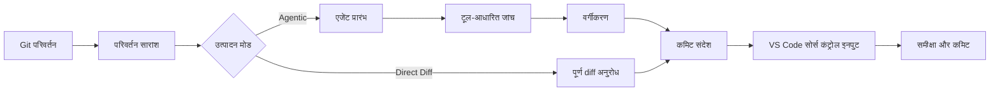

<!-- markdownlint-disable MD001 MD013 MD026 MD033 MD036 MD041 -->

<div align="center">


# Commit-Copilot

### एजेंटिक कमिट संदेश जो सिर्फ आपके diff को नहीं, बल्कि आपके संपूर्ण कोड को समझते हैं।

Commit-Copilot एक VS Code एक्सटेंशन है जो बहु-चरणीय स्वायत्त AI एजेंट की मदद से आपके रिपॉजिटरी की जांच करता है, Conventional Commits के कड़े नियमों के तहत परिवर्तनों को वर्गीकृत करता है, और सोर्स कंट्रोल (Source Control) इनपुट बॉक्स में सीधे सटीक कमिट संदेश लिखता है।

यह प्रमुख क्लाउड LLM (Gemini, OpenAI, Anthropic Claude, DeepSeek), गोपनीयता-केंद्रित स्थानीय Ollama मॉडल और कस्टम एंडपॉइंट्स (OpenAI और Anthropic संगत प्रारूप) के साथ सुचारू रूप से कार्य करता है।

[](https://marketplace.visualstudio.com/items?itemName=JeremySu0818.commit-copilot)
[](https://open-vsx.org/extension/JeremySu0818/commit-copilot)
[](https://open-vsx.org/extension/JeremySu0818/commit-copilot)
[](#आवश्यकताएं)
[](#विकास-गाइड)
[](#conventional-commits-वर्गीकरण)
[](../../LICENSE)

**एजेंटिक जांच · 9 अंतर्निहित प्रदाता · कस्टम एंडपॉइंट · स्थानीय Ollama समर्थन · 20 भाषाएँ**

<p align="center">
  <b>Translations:</b>
  <a href="../../README.md">English</a> |
  <a href="README-zh-tw.md">繁體中文</a> |
  <a href="README-zh-cn.md">简体中文</a> |
  <a href="README-ja.md">日本語</a> |
  <a href="README-ko.md">한국어</a> |
  <a href="README-de.md">Deutsch</a> |
  <a href="README-fr.md">Français</a> |
  <a href="README-es.md">Español</a> |
  <a href="README-pt-br.md">Português (Brasil)</a> |
  <a href="README-ru.md">Русский</a> |
  <a href="README-it.md">Italiano</a> |
  <a href="README-nl.md">Nederlands</a> |
  <a href="README-pl.md">Polski</a> |
  <a href="README-tr.md">Türkçe</a> |
  <a href="README-vi.md">Tiếng Việt</a> |
  <a href="README-id.md">Bahasa Indonesia</a> |
  <a href="README-hu.md">Magyar</a> |
  <a href="README-cs.md">Čeština</a> |
  <a href="README-hi.md">हिन्दी</a> |
  <a href="README-ar.md">العربية</a>
</p>

</div>

---

## Commit-Copilot क्यों चुनें?

अधिकांश AI कमिट टूल्स मॉडल को केवल कच्चा diff भेजते हैं और एक अच्छी एकल-पंक्ति सारांश की उम्मीद करते हैं।

Commit-Copilot एक पूरी तरह से भिन्न दृष्टिकोण अपनाता है।

यह हल्के परिवर्तन मेटाडेटा से शुरू होता है, फिर एक स्वायत्त एजेंट को यह तय करने देता है कि उसे क्या जांचना है: diff, फ़ाइल सामग्री, प्रतीक, संदर्भ, संपूर्ण प्रोजेक्ट में स्ट्रिंग पैटर्न और हालिया कमिट इतिहास। परिवर्तन के प्रभाव को पूरी तरह समझने के बाद ही यह उसका वर्गीकरण करता है और संदेश तैयार करता है।

| क्षमता                                        | पारंपरिक diff-to-prompt टूल्स | Commit-Copilot |
| --------------------------------------------- | :---------------------------: | :------------: |
| पूरे diff को तुरंत पढ़ता है                   |              हाँ              |    वैकल्पिक    |
| प्रासंगिक फ़ाइलों की चुनिंदा जांच करता है     |             नहीं              |      हाँ       |
| कोड संरचना और प्रतीकों को समझता है            |             सीमित             |      हाँ       |
| LSP के माध्यम से प्रतीक संदर्भ ढूंढता है      |             नहीं              |      हाँ       |
| छिपे हुए स्ट्रिंग/कॉन्फ़िगरेशन संबंध खोजता है |             नहीं              |      हाँ       |
| हालिया कमिट शैली से सीखता है                  |            दुर्लभ             |      हाँ       |
| Git इंडेक्स (staged) आधारित सटीक विश्लेषण     |            दुर्लभ             |      हाँ       |
| स्थानीय और एजेंट कार्यप्रवाह का समर्थन        |             सीमित             |      हाँ       |
| सख्त कमिट प्रकार सीमाओं को लागू करता है       |        मॉडल पर निर्भर         |      हाँ       |
| बिना सहमति फ़ाइलों को कभी स्टेज नहीं करता     |          भिन्न भिन्न          |      हाँ       |

> [!TIP]
> अधिकतम सटीकता और पूर्ण संदर्भ के लिए **एजेंटिक (Agentic)** मोड का उपयोग करें। जब गहरी जांच की तुलना में गति अधिक महत्वपूर्ण हो, तो **डायरेक्ट डिफ (Direct Diff)** मोड का उपयोग करें।

---

## मुख्य विशेषताएं

<table>
<tr>
<td width="50%" valign="top">

<h3>रिपॉजिटरी-सजग एजेंट</h3>

एजेंट फ़ाइल नामों, परिवर्तन प्रकारों, पंक्ति गणना और प्रोजेक्ट संरचना से शुरुआत करता है—फिर परिवर्तन को समझने के लिए आवश्यक टूल्स का चयन करता है।

</td>
<td width="50%" valign="top">

<h3>Git इंडेक्स सटीकता</h3>

स्टेज किए गए परिवर्तनों के लिए टूल्स Git इंडेक्स की सामग्री को प्राथमिकता देते हैं। LSP संदर्भ विश्लेषण स्टेज की गई स्थिति से निर्मित अस्थायी कार्यक्षेत्र में चलता है।

</td>
</tr>
<tr>
<td width="50%" valign="top">

<h3>बहु-प्रदाता देशी समर्थन</h3>

Google Gemini, OpenAI, Anthropic, xAI, Groq, OpenRouter, DeepSeek, Alibaba Qwen, Ollama या किसी भी संगत कस्टम एंडपॉइंट का उपयोग करें।

</td>
<td width="50%" valign="top">

<h3>सख्त Conventional Commits</h3>

सभी 11 Conventional Commit प्रकारों का समर्थन करता है और स्पष्ट प्रकार सीमाओं के साथ प्राथमिकता-आधारित वर्गीकरण लागू करता है। Scope, Body, Footer और Gitmoji स्वतंत्र रूप से कॉन्फ़िगर किए जा सकते हैं।

</td>
</tr>
<tr>
<td width="50%" valign="top">

<h3>स्थानीय मॉडल एजेंट कार्यप्रवाह</h3>

Ollama मॉडल बिना देशी tool calling समर्थन के भी Commit-Copilot के अंतर्निहित टेक्स्ट टूल प्रोटोकॉल के माध्यम से समान जांच टूल्स का उपयोग कर सकते हैं।

</td>
<td width="50%" valign="top">

<h3>सुरक्षित, समीक्षा-प्रथम कार्यप्रवाह</h3>

Commit-Copilot परिणाम को सोर्स कंट्रोल इनपुट बॉक्स में लिखता है। स्टेजिंग, संपादन और कमिट करने पर आपका पूरा नियंत्रण रहता है।

</td>
</tr>
</table>

---

## विषय सूची

- [यह कैसे काम करता है](#यह-कैसे-काम-करता-है)
- [एजेंट टूल्स](#एजेंट-टूल्स)
- [फीचर्स](#फीचर्स)
- [समर्थित प्रदाता](#समर्थित-प्रदाता)
- [आवश्यकताएं](#आवश्यकताएं)
- [स्थापना](#स्थापना)
- [कॉन्फ़िगरेशन](#कॉन्फ़िगरेशन)
- [उपयोग विधि](#उपयोग-विधि)
- [Conventional Commits वर्गीकरण](#conventional-commits-वर्गीकरण)
- [परिवर्तन पहचान](#परिवर्तन-पहचान)
- [स्थानीयकरण](#स्थानीयकरण)
- [सुरक्षा और गोपनीयता](#सुरक्षा-और-गोपनीयता)
- [विकास गाइड](#विकास-गाइड)
- [परीक्षण](#परीक्षण)
- [अक्सर पूछे जाने वाले प्रश्न (FAQ)](#अक्सर-पूछे-जाने-वाले-प्रश्न-faq)
- [योगदान](#योगदान)
- [लाइसेंस](#लाइसेंस)

---

## यह कैसे काम करता है



### एजेंटिक कार्यप्रवाह (Agentic)

1. **परिवर्तन मेटाडेटा एकत्र करना**
   Commit-Copilot फ़ाइल नाम, परिवर्तन प्रकार, पंक्ति गणना और प्रोजेक्ट संरचना ट्री एकत्र करता है।

2. **एजेंट प्रारंभ करना**
   मॉडल को संरचित सारांश और स्वायत्त संदेश उत्पादन निर्देश प्राप्त होते हैं। प्रारंभिक चरण में कच्चा diff नहीं भेजा जाता।

3. **टूल्स के साथ जांच करना**
   एजेंट रिपॉजिटरी की चुनिंदा जांच करता है, और केवल वही संदर्भ मांगता है जिसे वह आवश्यक समझता है।

4. **परिवर्तन का वर्गीकरण करना**
   प्राथमिकता-आधारित नियम कमिट प्रकार निर्धारित करते हैं। यदि Scope सक्षम है, तो एजेंट प्रभावित मॉड्यूल या क्षेत्र का भी चयन करता है।

5. **संदेश उत्पन्न करना**
   अंतिम संदेश समीक्षा और संपादन के लिए सोर्स कंट्रोल इनपुट बॉक्स में लिखा जाता है।

> [!NOTE]
> जब **हाइब्रिड जनरेशन (Hybrid Generation)** सक्षम होता है, तो सोर्स कंट्रोल इनपुट में मौजूदा टेक्स्ट को केवल संदर्भ प्रारूप के रूप में उपयोग किया जाता है। उस ड्राफ्ट के अंदर दिए गए निर्देश उत्पादन नियमों को ओवरराइड नहीं कर सकते।

### डायरेक्ट डिफ (Direct Diff) कार्यप्रवाह

Direct Diff मोड जांच चक्र को छोड़ देता है और एक ही अनुरोध में चयनित मॉडल को पूरा diff भेजता है। यह तेज़ है, हर प्रदाता के लिए उपलब्ध है और छोटे या स्पष्ट परिवर्तनों के लिए आदर्श है।

---

## एजेंट टूल्स

एजेंट बहु-चरणीय जांच के दौरान निम्नलिखित टूल्स को संयोजित कर सकता है:

| टूल                    | उद्देश्य                                                                                                                     |
| ---------------------- | ---------------------------------------------------------------------------------------------------------------------------- |
| `get_diff`             | एक या अधिक अनुरोधित फ़ाइलों के लिए सटीक और पूर्ण diff प्राप्त करता है।                                                       |
| `read_file`            | फ़ाइल सामग्री पढ़ता है (वैकल्पिक पंक्ति सीमा में)। स्टेज किए गए परिवर्तनों के लिए Git इंडेक्स सामग्री को प्राथमिकता देता है। |
| `get_file_outline`     | संरचनात्मक जानकारी देता है: फ़ंक्शन, क्लास, इंटरफ़ेस और एक्सपोर्ट्स।                                                         |
| `find_references`      | वाक्यविन्यास-सजग प्रतीक संदर्भ खोजने के लिए VS Code के Language Server Protocol (LSP) का उपयोग करता है।                      |
| `get_recent_commits`   | रिपॉजिटरी की मौजूदा शैली सीखने के लिए हालिया कमिट संदेश पढ़ता है।                                                            |
| `search_code`          | कार्यक्षेत्र में ऐसे स्ट्रिंग्स या पैटर्न खोजता है जिन्हें केवल इम्पोर्ट के माध्यम से नहीं देखा जा सकता।                     |
| `write_commit_message` | अंतिम संरचित कमिट संदेश सबमिट करता है और सत्र समाप्त करता है।                                                                |

Gemini, Anthropic और OpenAI-संगत प्रदाता देशी संरचित टूल कॉलिंग का उपयोग करते हैं। Ollama एक समकक्ष टेक्स्ट प्रोटोकॉल का उपयोग करता है जिसमें बैच कॉल, एप्लिकेशन-असाइन कॉल आईडी, संरचित परिणाम, व्यक्तिगत त्रुटि प्रबंधन और अंतिम सबमिशन शामिल हैं।

`get_diff` एकल `path` या गैर-रिक्त `paths` ऐरे स्वीकार करता है। बैच अनुरोध टूल राउंड ट्रिप को कम करते हैं और हर अनुरोधित फ़ाइल का पूरा diff बिना किसी संक्षिप्तिकरण के लौटाते हैं।

एजेंट मोड में वैकल्पिक रूप से पूर्ण diff कवरेज अनिवार्य किया जा सकता है। सेटिंग्स में सक्षम होने पर, जब तक मान्य Git diff की प्रत्येक बदली हुई फ़ाइल को `get_diff` कॉल द्वारा जांच नहीं लिया जाता, तब तक `write_commit_message` को अस्वीकार कर दिया जाता है। टोकन उपयोग और गति बनाए रखने के लिए यह सेटिंग डिफ़ॉल्ट रूप से बंद है।

---

## फीचर्स

### उत्पादन और गहन विश्लेषण

- **Agentic और Direct Diff मोड**
- **कॉन्फ़िगर करने योग्य अधिकतम एजेंट कदम (Max Agent Steps)**
- **किसी भी समय रद्द करने योग्य जांच प्रक्रिया**
- **स्वचालित पुनः प्रयास (Retries)**: क्षणिक दूरस्थ API विफलताओं और रेट लिमिट के लिए स्वचालित विलंब और पुनः प्रयास
- **प्रोजेक्ट-व्यापी पैटर्न खोज**: पर्यावरण चर, इवेंट नाम, कॉन्फ़िग कुंजी और स्ट्रिंग संबंधों को ट्रैक करना
- **LSP संदर्भ प्रभाव रडार**: प्रतीक परिवर्तनों का सटीक वाक्यविन्यास विश्लेषण
- **हालिया कमिट निरीक्षण**: प्रोजेक्ट परंपराओं से सही मिलान
- **हाइब्रिड जनरेशन (Hybrid Generation)**: सोर्स कंट्रोल टेक्स्ट को सुरक्षित संदर्भ ड्राफ्ट के रूप में उपयोग करना

### Git-सजग व्यवहार

- 5 रिपॉजिटरी स्थितियों की पहचान: केवल स्टेज्ड (staged), केवल अनस्टेज्ड (unstaged), मिश्रित (mixed), अनट्रैक्ड फ़ाइलों सहित और केवल अनट्रैक्ड (untracked-only)
- अनट्रैक्ड फ़ाइलों को स्टेज करने से पहले पुष्टि मांगना
- उपयोगकर्ता की स्पष्ट सहमति के बिना कभी भी स्वचालित स्टेज न करना
- स्टेज की गई फ़ाइलों की जांच करते समय Git इंडेक्स सामग्री को प्राथमिकता देना
- स्टेज की गई स्थिति में LSP संदर्भ विश्लेषण के लिए अस्थायी कार्यक्षेत्र स्नैपशॉट बनाना
- रिपॉजिटरी स्थिति बदलने पर मुख्य पैनल को रीयल-टाइम में अपडेट करना

### कमिट आउटपुट नियंत्रण

निम्नलिखित घटकों को स्वतंत्र रूप से चालू/बंद करें:

- **Scope** (प्रभाव दायरा)
- **Body** (विस्तृत विवरण)
- **Footer** (फुटर / Breaking Changes)
- **Gitmoji उपसर्ग**

डिफ़ॉल्ट सेटिंग्स:

| घटक     | डिफ़ॉल्ट स्थिति |
| ------- | :-------------: |
| Scope   |      चालू       |
| Body    |      चालू       |
| Footer  |       बंद       |
| Gitmoji |       बंद       |

### VS Code एकीकरण

Commit-Copilot को अपनी सुविधानुसार प्रारंभ करें:

- **एक्टिविटी बार (Activity Bar)** आइकन से
- **सोर्स कंट्रोल (Source Control)** नेविगेशन बार में जादुई छड़ी आइकन से
- **कमांड पैलेट (Command Palette)** से

उत्पन्न संदेश मानक सोर्स कंट्रोल इनपुट बॉक्स में डाला जाता है, जहाँ कमिट करने से पहले आप इसकी समीक्षा और संपादन कर सकते हैं।

### प्रदाता सत्यापन और मॉडल प्रबंधन

- API कुंजियों को सहेजने से पहले प्रदाता के वास्तविक एंडपॉइंट पर सत्यापित किया जाता है
- प्रमाणीकरण, कोटा और नेटवर्क त्रुटियों के लिए स्पष्ट और कार्रवाई योग्य मार्गदर्शन
- OpenRouter, Alibaba Qwen, Ollama और कस्टम प्रदाताओं के लिए मॉडल सूचियों को गतिशील रूप से प्राप्त करना
- Ollama और कस्टम प्रदाताओं के लिए मैन्युअल रूप से मॉडल आईडी जोड़ना और हटाना
- OpenAI-संगत और Anthropic-संगत API प्रारूपों का समर्थन

---

## समर्थित प्रदाता

| प्रदाता           | मुख्य विशेषताएं                                                      |
| ----------------- | -------------------------------------------------------------------- |
| **Google Gemini** | देशी संरचित टूल्स और कई Gemini मॉडल पीढ़ियों का समर्थन               |
| **OpenAI**        | रीजनिंग (तर्क), सामान्य प्रयोजन, कॉम्पैक्ट और GPT-5 श्रृंखला के मॉडल |
| **Anthropic**     | Claude Haiku, Sonnet, Opus और Fable मॉडल परिवार                      |
| **xAI Grok**      | रीजनिंग और मानक Grok मॉडल संस्करण                                    |
| **Groq**          | उच्च गति होस्टेड MiniMax, Qwen और `gpt-oss` मॉडल                     |
| **OpenRouter**    | टूल कॉलिंग फ़िल्टरिंग के साथ विशाल मॉडल कैटलॉग तक गतिशील पहुंच       |
| **DeepSeek**      | DeepSeek Chat, Reasoner (R1) और V4 मॉडल                              |
| **Alibaba Qwen**  | DashScope एकीकरण और गतिशील मॉडल खोज                                  |
| **Ollama**        | गतिशील सूची और अंतर्निहित टेक्स्ट टूल प्रोटोकॉल के साथ स्थानीय मॉडल  |
| **कस्टम प्रदाता** | OpenAI या Anthropic संगत कोई भी कस्टम एंडपॉइंट                       |

<details>
<summary><strong>Commit-Copilot द्वारा समर्थित मॉडल परिवार देखें</strong></summary>

### Google Gemini

- Gemini 2.5 Flash-Lite, Flash और Pro
- Gemini 3 Flash
- Gemini 3.1 Flash-Lite और Pro
- Gemini 3.5 Flash-Lite और Flash
- Gemini 3.6 Flash
- Gemini 3.7 Flash

### OpenAI

- o3 और o3-mini
- o4-mini
- GPT-4o mini और GPT-4o
- GPT-4.1 nano, mini और GPT-4.1
- GPT-5 nano, mini और GPT-5
- GPT-5.1
- GPT-5.2
- GPT-5.4 nano, mini और GPT-5.4
- GPT-5.5
- GPT-5.6 Luna, Terra और Sol

### Anthropic

- Claude Sonnet 4 और Opus 4
- Claude Opus 4.1
- Claude Haiku, Sonnet और Opus 4.5
- Claude Sonnet और Opus 4.6
- Claude Opus 4.7
- Claude Opus 4.8
- Claude Sonnet 5, Opus 5 और Fable 5

### xAI Grok

- Grok 4.20 (रीजनिंग और मानक)
- Grok 4.3
- Grok 4.5
- Grok 4.6

### Groq

- `gpt-oss-20B`
- `gpt-oss-120B`
- `gpt-oss-safeguard-20B`
- MiniMax M2.7
- Qwen 3.6 27b

### DeepSeek

- DeepSeek Chat
- DeepSeek R1 / Reasoner
- DeepSeek V4 Flash और Pro

> [!IMPORTANT]
> मॉडल की उपलब्धता प्रदाता, खाते, क्षेत्र और वर्तमान API कैटलॉग पर निर्भर करती है। OpenRouter, Qwen, Ollama और कस्टम प्रदाता मॉडल सूचियां गतिशील रूप से खोजी जा सकती हैं।

</details>

---

## आवश्यकताएं

- **VS Code** `1.91.0` या नया
- **Git** (VS Code के अंतर्निहित Git एक्सटेंशन के माध्यम से उपलब्ध)
- निम्नलिखित में से कोई एक:
  - समर्थित दूरस्थ प्रदाता के लिए एक वैध API कुंजी
  - एक सुलभ स्थानीय या दूरस्थ Ollama इंस्टेंस
  - संगत कस्टम एंडपॉइंट के लिए क्रेडेंशियल्स

विकास के लिए:

- **Node.js** `20+`
- **npm**

---

## स्थापना

Commit-Copilot को अपने पसंदीदा मार्केटप्लेस से इंस्टॉल करें:

- [**Visual Studio Code Marketplace**](https://marketplace.visualstudio.com/items?itemName=JeremySu0818.commit-copilot)
- [**Open VSX Registry**](https://open-vsx.org/extension/JeremySu0818/commit-copilot)

इंस्टॉलेशन के बाद, VS Code में कोई भी Git रिपॉजिटरी खोलें और एक्टिविटी बार (Activity Bar) में **Commit Copilot** आइकन पर क्लिक करें।

---

## कॉन्फ़िगरेशन

### बुनियादी सेटअप

1. एक्टिविटी बार से **Commit Copilot** पैनल खोलें।
2. एक प्रदाता चुनें।
3. प्रदाता की API कुंजी या Ollama होस्ट URL दर्ज करें।
4. **सहेजें** पर क्लिक करें।
5. क्रेडेंशियल के रीयल-टाइम सत्यापन की प्रतीक्षा करें।
6. मॉडल सूची उपलब्ध होने पर एक मॉडल चुनें।

> [!IMPORTANT]
> Ollama का उपयोग करते समय, एक्सटेंशन प्रत्येक उत्पादन से पहले चयनित मॉडल के लिए `ollama pull` चलाता है और अधिसूचना क्षेत्र में प्रगति दिखाता है। यह मॉडल के स्थानीय रूप से मौजूद होने पर भी परतों को फिर से सत्यापित कर सकता है।

### विकल्प

| विकल्प                 | डिफ़ॉल्ट  | विवरण                                                                                                             |
| ---------------------- | --------- | ----------------------------------------------------------------------------------------------------------------- |
| **उत्पादन मोड**        | Agentic   | `Agentic` बहु-चरणीय जांच चलाता है। `Direct Diff` एक ही अनुरोध में पूरा diff भेजता है।                             |
| **हाइब्रिड जनरेशन**    | बंद       | सोर्स कंट्रोल इनपुट टेक्स्ट को संदर्भ ड्राफ्ट के रूप में उपयोग करता है और इसे प्रॉम्प्ट निर्देशों से अलग रखता है। |
| **अधिकतम एजेंट कदम**   | `0`       | टूल कॉल चरणों की अधिकतम संख्या। असीमित के लिए `0` दर्ज करें।                                                      |
| **Scope शामिल करें**   | चालू      | विषय पंक्ति में Conventional Commits स्कोप (Scope) शामिल करना आवश्यक बनाता है।                                    |
| **Body शामिल करें**    | चालू      | विस्तृत और वर्णनात्मक बॉडी सेक्शन बनाना आवश्यक बनाता है।                                                          |
| **Footer शामिल करें**  | बंद       | फुटर सेक्शन (उदा. Breaking Changes) उत्पन्न करता है; असत्यापित तथ्यों को कभी गढ़ा नहीं जाता।                      |
| **Gitmoji शामिल करें** | बंद       | विषय पंक्ति के आगे ठीक एक मेल खाता Gitmoji उपसर्ग जोड़ता है।                                                      |
| **एक्सटेंशन भाषा**     | ऑटो       | VS Code की भाषा का अनुसरण करता है, जब तक कि मैन्युअल रूप से सेट न किया गया हो।                                    |
| **कमिट संदेश की भाषा** | अंग्रेज़ी | एक्सटेंशन UI भाषा से स्वतंत्र रूप से उत्पन्न विषय, बॉडी और फुटर की भाषा को नियंत्रित करता है।                     |

### कस्टम प्रदाता (Custom Provider)

OpenAI-संगत या Anthropic-संगत एंडपॉइंट जोड़ने के लिए:

1. प्रदाता सेटिंग्स खोलें।
2. **+ प्रदाता जोड़ें...** पर क्लिक करें।
3. API प्रारूप चुनें (`OpenAI-compatible` या `Anthropic-compatible`)।
4. प्रदर्शित नाम और API बेस URL दर्ज करें।
5. प्रदाता को सहेजें।
6. API कुंजी दर्ज करें और सत्यापित करें।
7. खोजी गई सूची में से एक मॉडल चुनें या **मॉडल प्रबंधित करें...** के माध्यम से मैन्युअल मॉडल आईडी जोड़ें।

Anthropic-संगत एंडपॉइंट्स के लिए अधिकतम आउटपुट टोकन सीमा (`max_tokens`) भी कॉन्फ़िगर की जा सकती है।

---

## उपयोग विधि

### तरीका A: एक्टिविटी बार (Activity Bar)

1. **Commit Copilot** साइडबार खोलें।
2. पुष्टि करें कि रिपॉजिटरी में स्टेज्ड, अनस्टेज्ड या अनट्रैक्ड परिवर्तन मौजूद हैं।
3. **कमिट संदेश उत्पन्न करें** बटन पर क्लिक करें।
4. यदि फ़ाइल चयन का संकेत मिले, तो अपनी पसंद का विकल्प चुनें।

### तरीका B: सोर्स कंट्रोल (Source Control)

1. `Ctrl+Shift+G` (macOS पर: `Cmd+Shift+G`) दबाकर सोर्स कंट्रोल खोलें।
2. नेविगेशन बार में Commit-Copilot जादुई छड़ी आइकन पर क्लिक करें।

### तरीका C: कमांड पैलेट (Command Palette)

1. कमांड पैलेट खोलें:
   - Windows/Linux: `Ctrl+Shift+P`
   - macOS: `Cmd+Shift+P`
2. **Commit-Copilot: Generate Commit Message** कमांड चलाएं।

### समीक्षा और कमिट

उत्पन्न संदेश मानक सोर्स कंट्रोल इनपुट बॉक्स में दिखाई देगा।

आप इसकी समीक्षा कर सकते हैं, आवश्यक संपादन कर सकते हैं और फिर VS Code के मानक कमिट बटन के साथ कमिट कर सकते हैं।

---

## Conventional Commits वर्गीकरण

Commit-Copilot निम्नलिखित 11 Conventional Commit प्रकारों का सख्ती से पालन करता है:

| प्रकार     | उपयोग का उद्देश्य                                                          |
| ---------- | -------------------------------------------------------------------------- |
| `feat`     | उपयोगकर्ता-दृश्यमान नई सुविधा या कार्यक्षमता जोड़ना                        |
| `fix`      | किसी बग या त्रुटिपूर्ण व्यवहार को ठीक करना                                 |
| `docs`     | केवल दस्तावेज़ीकरण में परिवर्तन                                            |
| `style`    | प्रारूपण, व्हाइटस्पेस और शैली में सुधार जो कोड लॉजिक को प्रभावित नहीं करते |
| `refactor` | कोड पुनर्गठन (न तो बग ठीक करता है और न ही नई सुविधा जोड़ता है)             |
| `perf`     | प्रदर्शन या संसाधन दक्षता में सुधार                                        |
| `test`     | परीक्षण जोड़ना, संशोधित करना या पूर्ण करना                                 |
| `build`    | बिल्ड सिस्टम या बाहरी निर्भरताओं को प्रभावित करने वाले परिवर्तन            |
| `ci`       | सतत एकीकरण (CI) और परिनियोजन कॉन्फ़िगरेशन में बदलाव                        |
| `chore`    | नियमित रखरखाव और विविध कार्य जो अन्य श्रेणियों में नहीं आते                |
| `revert`   | किसी पिछले कमिट को वापस लेना (revert)                                      |

आउटपुट संदेश Conventional Commits सिंटैक्स का पालन करता है:

```text
type(scope): संक्षिप्त और स्पष्ट विवरण

विस्तृत बॉडी टेक्स्ट जो बताता है कि क्या बदला और क्यों बदला।
```

कॉन्फ़िगरेशन के आधार पर Scope, Body, Footer और Gitmoji को शामिल या छोड़ा जा सकता है। पहली पंक्ति 72 वर्णों तक सीमित है (लगभग 50 वर्ण अनुशंसित हैं)।

---

## परिवर्तन पहचान

Commit-Copilot 5 Git रिपॉजिटरी स्थितियों को पहचानता है:

| परिदृश्य                            | व्यवहार                                                              |
| ----------------------------------- | -------------------------------------------------------------------- |
| **केवल स्टेज्ड (Staged only)**      | स्टेज किए गए diff और Git इंडेक्स सजग टूल्स का उपयोग करता है          |
| **केवल अनस्टेज्ड (Unstaged only)**  | कार्यशील डायरेक्टरी के परिवर्तनों का विश्लेषण करता है                |
| **मिश्रित परिवर्तन (Mixed)**        | उपयोगकर्ता से पूछता है कि किस परिवर्तन समूह को संसाधित करना है       |
| **अनस्टेज्ड + अनट्रैक्ड**           | संदर्भ-अनुकूल प्रसंस्करण विकल्प प्रस्तुत करता है                     |
| **केवल अनट्रैक्ड (Untracked only)** | नई फ़ाइलों को स्टेज करने और कमिट संदेश उत्पन्न करने का सुझाव देता है |

आपकी स्पष्ट पुष्टि के बिना किसी भी फ़ाइल को स्वचालित रूप से स्टेज नहीं किया जाता है।

---

## स्थानीयकरण

एक्सटेंशन यूआई स्वचालित रूप से VS Code की भाषा का पालन कर सकता है या समर्थित 20 भाषाओं में से किसी एक पर तय किया जा सकता है:

<table>
<tr>
<td><a href="README-ar.md">العربية</a></td>
<td><a href="README-cs.md">Čeština</a></td>
<td><a href="README-de.md">Deutsch</a></td>
<td><a href="../../README.md">English</a></td>
</tr>
<tr>
<td><a href="README-es.md">Español</a></td>
<td><a href="README-fr.md">Français</a></td>
<td><a href="README-hi.md">हिन्दी</a></td>
<td><a href="README-hu.md">Magyar</a></td>
</tr>
<tr>
<td><a href="README-id.md">Bahasa Indonesia</a></td>
<td><a href="README-it.md">Italiano</a></td>
<td><a href="README-ja.md">日本語</a></td>
<td><a href="README-ko.md">한국어</a></td>
</tr>
<tr>
<td><a href="README-nl.md">Nederlands</a></td>
<td><a href="README-pl.md">Polski</a></td>
<td><a href="README-pt-br.md">Português (Brasil)</a></td>
<td><a href="README-ru.md">Русский</a></td>
</tr>
<tr>
<td><a href="README-tr.md">Türkçe</a></td>
<td><a href="README-vi.md">Tiếng Việt</a></td>
<td><a href="README-zh-cn.md">简体中文</a></td>
<td><a href="README-zh-tw.md">繁體中文</a></td>
</tr>
</table>

**कमिट संदेश की भाषा** एक्सटेंशन UI भाषा से स्वतंत्र रूप से कॉन्फ़िगर की जाती है, ताकि आप हिंदी इंटरफ़ेस का उपयोग करते हुए भी अंग्रेजी में कमिट संदेश उत्पन्न कर सकें।

---

## सुरक्षा और गोपनीयता

- API कुंजियों को **VS Code Secret Storage** द्वारा सुरक्षित रूप से एन्क्रिप्ट किया जाता है
- कुंजियों को सहेजने से पहले संबंधित प्रदाता के एंडपॉइंट पर सीधे सत्यापित किया जाता है
- Commit-Copilot आपकी अनुमति के बिना कभी भी फ़ाइलों को स्टेज नहीं करता
- हाइब्रिड जनरेशन मौजूदा SCM इनपुट को अविश्वसनीय संदर्भ सामग्री के रूप में अलग रखता है
- दूरस्थ अनुरोधों में केवल जांच के दौरान चुने गए रिपॉजिटरी मेटाडेटा, diff या फ़ाइल अंश ही भेजे जाते हैं
- स्थानीय Ollama का उपयोग करने पर संपूर्ण डेटा और मॉडल इन्फरेंस केवल आपके निजी परिवेश में रहता है

> [!CAUTION]
> किसी दूरस्थ API को मालिकाना या संवेदनशील रिपॉजिटरी कोड भेजने से पहले अपने चयनित प्रदाता की डेटा गोपनीयता नीतियों की समीक्षा अवश्य करें।

---

## विकास गाइड

### निर्भरताएं इंस्टॉल करें

```bash
npm install
```

### विकास के लिए संकलित करें

```bash
npm run compile
```

निरंतर TypeScript और esbuild रीबिल्ड के लिए:

```bash
npm run watch
```

### VSIX पैकेज बनाएं

```bash
npm run build
```

बिल्ड स्क्रिप्ट निर्भरताएं इंस्टॉल करती है, VS Code पैकेजिंग पाइपलाइन चलाती है और `.vsix` पैकेज बनाती है।

### कोड गुणवत्ता

लिंटर नियमों की जाँच करें:

```bash
npm run lint
```

स्रोत फ़ाइलों को प्रारूपित करें:

```bash
npm run format
```

फ़ाइलों को संशोधित किए बिना प्रारूपण की पुष्टि करें:

```bash
npm run check-format
```

---

## परीक्षण

संपूर्ण यूनिट-टेस्ट सुइट चलाएं:

```bash
npm test
```

यह कमांड क्रमशः निष्पादित करती है:

1. `npm run test:build`
2. `node --test --test-concurrency=1 "out/test/**/*.test.js"`

वर्तमान परीक्षण कवरेज में शामिल हैं:

- सभी एजेंट जांच टूल्स:
  - `get_diff`
  - `read_file`
  - `get_file_outline`
  - `find_references`
  - `get_recent_commits`
  - `search_code`
- देशी संरचित टूल एजेंट लूप
- Ollama टेक्स्ट प्रोटोकॉल एजेंट लूप
- बैच कॉल और स्थानीयकृत टूल स्कीमा
- त्रुटिपूर्ण मॉडल प्रतिक्रियाओं से स्वतः रिकवरी
- अंतिम कमिट संदेश सबमिशन सत्यापन
- `executeToolCall` के माध्यम से टूल डिस्पैच
- संदर्भ पार्सिंग और निर्माण
- स्टेज किए गए कार्यक्षेत्र स्नैपशॉट उपयोगिताएँ
- स्वचालित पुनः प्रयास (retry) व्यवहार
- स्थानीयकृत त्रुटि संदेश
- मुख्य वेबव्यू प्रदाता व्यवहार
- कस्टम मॉडल प्रबंधन
- स्थिति प्रबंधक

---

## अक्सर पूछे जाने वाले प्रश्न (FAQ)

<details>
<summary><strong>क्या Commit-Copilot स्वचालित रूप से कमिट करता है?</strong></summary>

नहीं। यह केवल उत्पन्न संदेश को सोर्स कंट्रोल (Source Control) इनपुट बॉक्स में लिखता है। आप स्वयं इसकी समीक्षा, संपादन और कमिट कर सकते हैं।

</details>

<details>
<summary><strong>क्या एजेंट मेरा पूरा रिपॉजिटरी AI को भेजता है?</strong></summary>

एजेंटिक मोड में, शुरुआत में केवल परिवर्तन मेटाडेटा और ट्रैक की गई फ़ाइल संरचना भेजी जाती है—सभी फ़ाइलों की सामग्री नहीं। इसके बाद एजेंट आवश्यकतानुसार विशिष्ट diff, फ़ाइलें, संदर्भ या खोज परिणाम मांगता है। Direct Diff मोड केवल चयनित परिवर्तनों का पूर्ण diff भेजता है।

</details>

<details>
<summary><strong>क्या Ollama मॉडल बिना देशी tool calling के टूल्स का उपयोग कर सकते हैं?</strong></summary>

हाँ। Commit-Copilot में एक विशेष टेक्स्ट टूल प्रोटोकॉल शामिल है जो Ollama मॉडल को बहु-चरणीय जांच प्रक्रिया का पूरा लाभ उठाने में सक्षम बनाता है।

</details>

<details>
<summary><strong>"अधिकतम एजेंट कदम = 0" का क्या अर्थ है?</strong></summary>

मान `0` टूल कॉल चरणों की सीमा को हटा देता है। कोई भी सकारात्मक संख्या यह तय करती है कि अंतिम संदेश तैयार करने से पहले एजेंट अधिकतम कितने कदम उठा सकता है।

</details>

<details>
<summary><strong>क्या मैं गैर-अंतर्निहित कस्टम API एंडपॉइंट का उपयोग कर सकता हूँ?</strong></summary>

हाँ। इसे OpenAI या Anthropic संगत कस्टम प्रदाता के रूप में जोड़ें, फिर मॉडल गतिशील रूप से प्राप्त करें या मैन्युअल रूप से मॉडल आईडी दर्ज करें।

</details>

<details>
<summary><strong>Ollama हर बार उत्पादन से पहले मॉडल को pull क्यों करता है?</strong></summary>

एक्सटेंशन प्रत्येक उत्पादन से पहले `ollama pull` चलाता है ताकि यह सुनिश्चित हो सके कि चयनित मॉडल आपके सिस्टम में उपलब्ध और अद्यतित है। स्थानीय स्थिति के आधार पर यह परतों को फिर से सत्यापित या डाउनलोड कर सकता है।

</details>

---

## योगदान

परियोजना में योगदान का हार्दिक स्वागत है!

अनुशंसित योगदान प्रवाह:

1. एक नई समर्पित शाखा (branch) बनाएं।
2. अपने परिवर्तन करें।
3. लिंट, फॉर्मेटिंग चेक और टेस्ट चलाएं।
4. पुल रिक्वेस्ट (PR) में बदलाव के कारणों और व्यवहार को स्पष्ट रूप से समझाएं।
5. नए या बदले हुए व्यवहार के लिए प्रासंगिक टेस्ट शामिल करें।

सबमिट करने से पहले चलाएं:

```bash
npm run lint
npm run check-format
npm test
```

बग रिपोर्ट करते समय प्रदाता, मॉडल, उत्पादन मोड, Git परिवर्तन स्थिति, प्रासंगिक लॉग और पुनरुत्पादन के चरण शामिल करें। कभी भी API कुंजियाँ या संवेदनशील कोड साझा न करें।

---

## लाइसेंस

Commit-Copilot [MIT लाइसेंस](../../LICENSE) के तहत जारी किया गया है।

---

<div align="center">

उन डेवलपर्स के लिए निर्मित जो कमिट संदेशों में वास्तविक संदर्भ चाहते हैं—अटकलें नहीं।

</div>
