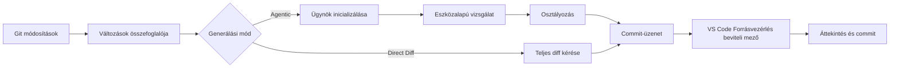

<!-- markdownlint-disable MD001 MD013 MD026 MD033 MD036 MD041 -->

<div align="center">


# Commit-Copilot

### Ügynöki (agentic) commit-üzenetek, amelyek a teljes kódot értik – nem csupán a diffet.

A Commit-Copilot egy olyan VS Code kiterjesztés, amely egy több lépésből álló, autonóm AI-ügynök segítségével vizsgálja át a kódtárat, szigorú Conventional Commits szabályok szerint osztályozza a módosításokat, és közvetlenül a forrásvezérlő (Source Control) beviteli mezőjébe írja a kidolgozott commit-üzeneteket.

Zökkenőmentesen működik a vezető felhős LLM-ekkel (Gemini, OpenAI, Anthropic Claude, DeepSeek), az adatvédelmet szem előtt tartó helyi Ollama modellekkel és egyéni végpontokkal (OpenAI és Anthropic kompatibilis formátumok).

[](https://marketplace.visualstudio.com/items?itemName=JeremySu0818.commit-copilot)
[](https://open-vsx.org/extension/JeremySu0818/commit-copilot)
[](https://open-vsx.org/extension/JeremySu0818/commit-copilot)
[](#követelmények)
[](#fejlesztés)
[](#conventional-commits-osztályozás)
[](../../LICENSE)

**Ügynöki vizsgálat · 9 beépített szolgáltató · Egyéni végpontok · Helyi Ollama támogatás · 20 nyelv**

<p align="center">
  <b>Translations:</b>
  <a href="https://github.com/JeremySu0818/Commit-Copilot#readme">English</a> |
  <a href="https://github.com/JeremySu0818/Commit-Copilot/blob/main/docs/readme/README-zh-tw.md">繁體中文</a> |
  <a href="https://github.com/JeremySu0818/Commit-Copilot/blob/main/docs/readme/README-zh-cn.md">简体中文</a> |
  <a href="https://github.com/JeremySu0818/Commit-Copilot/blob/main/docs/readme/README-ja.md">日本語</a> |
  <a href="https://github.com/JeremySu0818/Commit-Copilot/blob/main/docs/readme/README-ko.md">한국어</a> |
  <a href="https://github.com/JeremySu0818/Commit-Copilot/blob/main/docs/readme/README-de.md">Deutsch</a> |
  <a href="https://github.com/JeremySu0818/Commit-Copilot/blob/main/docs/readme/README-fr.md">Français</a> |
  <a href="https://github.com/JeremySu0818/Commit-Copilot/blob/main/docs/readme/README-es.md">Español</a> |
  <a href="https://github.com/JeremySu0818/Commit-Copilot/blob/main/docs/readme/README-pt-br.md">Português (Brasil)</a> |
  <a href="https://github.com/JeremySu0818/Commit-Copilot/blob/main/docs/readme/README-ru.md">Русский</a> |
  <a href="https://github.com/JeremySu0818/Commit-Copilot/blob/main/docs/readme/README-it.md">Italiano</a> |
  <a href="https://github.com/JeremySu0818/Commit-Copilot/blob/main/docs/readme/README-nl.md">Nederlands</a> |
  <a href="https://github.com/JeremySu0818/Commit-Copilot/blob/main/docs/readme/README-pl.md">Polski</a> |
  <a href="https://github.com/JeremySu0818/Commit-Copilot/blob/main/docs/readme/README-tr.md">Türkçe</a> |
  <a href="https://github.com/JeremySu0818/Commit-Copilot/blob/main/docs/readme/README-vi.md">Tiếng Việt</a> |
  <a href="https://github.com/JeremySu0818/Commit-Copilot/blob/main/docs/readme/README-id.md">Bahasa Indonesia</a> |
  <a href="https://github.com/JeremySu0818/Commit-Copilot/blob/main/docs/readme/README-hu.md">Magyar</a> |
  <a href="https://github.com/JeremySu0818/Commit-Copilot/blob/main/docs/readme/README-cs.md">Čeština</a> |
  <a href="https://github.com/JeremySu0818/Commit-Copilot/blob/main/docs/readme/README-hi.md">हिन्दी</a> |
  <a href="https://github.com/JeremySu0818/Commit-Copilot/blob/main/docs/readme/README-ar.md">العربية</a>
</p>

</div>

---

## Miért a Commit-Copilot?

A legtöbb AI commit-eszköz a nyers diffet egyszerűen elküldi a modellnek, és egyetlen találó összefoglaló sorban reménykedik.

A Commit-Copilot teljesen más megközelítést alkalmaz.

Könnyű változás-metaadatokkal kezd, majd engedi, hogy egy autonóm ügynök döntse el, mit kell megvizsgálnia: diffeket, fájltartalmakat, szimbólumokat, hivatkozásokat, teljes projektre kiterjedő mintázatokat és a legutóbbi commitokat. Csak a változtatás teljes megértése után osztályozza és állítja össze az üzenetet.

| Képesség                                        | Hagyományos diff-to-prompt eszközök | Commit-Copilot |
| ----------------------------------------------- | :---------------------------------: | :------------: |
| Azonnal beolvassa a teljes diffet               |                Igen                 |   Opcionális   |
| Szelektíven vizsgálja a releváns fájlokat       |                 Nem                 |      Igen      |
| Érti a kód szerkezetét és szimbólumait          |             Korlátozott             |      Igen      |
| Megtalálja a szimbólum-hivatkozásokat LSP-vel   |                 Nem                 |      Igen      |
| Rejtett szöveges/konfigurációs relációkat keres |                 Nem                 |      Igen      |
| Tanul a legutóbbi commitok stílusából           |               Ritkán                |      Igen      |
| Git index-alapú előkészített elemzést végez     |               Ritkán                |      Igen      |
| Támogatja a helyi és ügynöki munkafolyamatokat  |             Korlátozott             |      Igen      |
| Szigorú commit-típus határokat alkalmaz         |             Modellfüggő             |      Igen      |
| Soha nem készít elő fájlokat beleegyezés nélkül |               Változó               |      Igen      |

> [!TIP]
> Használja az **Ügynöki (Agentic)** módot a maximális pontosság és kontextus érdekében. Válassza a **Direct Diff** módot, ha a sebesség fontosabb a mély elemzésnél.

---

## Fő jellemzők

<table>
<tr>
<td width="50%" valign="top">

<h3>Kódtárat értő ügynök</h3>

Az ügynök fájlnevekkel, módosítási típusokkal, sorszámokkal és a projektstruktúrával indul – majd kiválasztja a változtatás megértéséhez szükséges eszközöket.

</td>
<td width="50%" valign="top">

<h3>Git-index pontosság</h3>

Az előkészített (staged) változtatásoknál az eszközök a Git-indexből származó tartalmat részesítik előnyben. Az LSP-hivatkozások elemzése az előkészített állapotból felépített ideiglenes munkaterületen fut.

</td>
</tr>
<tr>
<td width="50%" valign="top">

<h3>Több szolgáltató natív támogatása</h3>

Használhatja a Google Gemini, OpenAI, Anthropic, xAI, Groq, OpenRouter, DeepSeek, Alibaba Qwen, Ollama szolgáltatókat vagy bármely egyéni kompatibilis végpontot.

</td>
<td width="50%" valign="top">

<h3>Szigorú Conventional Commits</h3>

Mind a 11 Conventional Commit típust támogatja, prioritáson alapuló osztályozási szabályokkal és egyértelmű típushatárokkal. A Scope, Body, Footer és Gitmoji függetlenül konfigurálható.

</td>
</tr>
<tr>
<td width="50%" valign="top">

<h3>Helyi modell ügynök-munkafolyamat</h3>

Az Ollama modellek a Commit-Copilot beépített szöveges eszközprotokollján keresztül ugyanazokat a vizsgálati eszközöket használhatják – még natív tool-calling támogatás nélkül is.

</td>
<td width="50%" valign="top">

<h3>Biztonságos, áttekintés-központú folyamat</h3>

A Commit-Copilot az eredményt a Forrásvezérlés beviteli mezőjébe írja. Ön teljes mértékben felügyeli az előkészítést, szerkesztést és véglegesítést.

</td>
</tr>
</table>

---

## Tartalomjegyzék

- [Hogyan működik?](#hogyan-működik)
- [Ügynök eszközök](#ügynök-eszközök)
- [Funkciók](#funkciók)
- [Támogatott szolgáltatók](#támogatott-szolgáltatók)
- [Követelmények](#követelmények)
- [Telepítés](#telepítés)
- [Konfiguráció](#konfiguráció)
- [Használat](#használat)
- [Conventional Commits Osztályozás](#conventional-commits-osztályozás)
- [Változások észlelése](#változások-észlelése)
- [Lokalizáció](#lokalizáció)
- [Biztonság és adatvédelem](#biztonság-és-adatvédelem)
- [Fejlesztés](#fejlesztés)
- [Tesztelés](#tesztelés)
- [Gyakran Ismételt Kérdések (GYIK)](#gyakran-ismételt-kérdések-gyik)
- [Közreműködés](#közreműködés)
- [Licenc](#licenc)

---

## Hogyan működik?



### Ügynöki (Agentic) munkafolyamat

1. **Változás-metaadatok gyűjtése**
   A Commit-Copilot összegyűjti a fájlneveket, a változtatási típusokat, a sorok számát és a projekt mappastruktúráját.

2. **Az ügynök inicializálása**
   A modell megkapja a strukturált összefoglalót és az autonóm generáláshoz szükséges utasításokat. A nyers diff kezdetben nem kerül átadásra.

3. **Vizsgálat eszközökkel**
   Az ügynök szelektíven átvizsgálja a kódtárat, és csak a számára hasznos kontextust kéri le.

4. **A változtatás osztályozása**
   Prioritási szabályok határozzák meg a commit típusát. Ha a Scope engedélyezve van, az ügynök kiválasztja az érintett modult vagy területet is.

5. **Az üzenet generálása**
   A végleges üzenet bekerül a Forrásvezérlés (Source Control) beviteli mezőjébe az áttekintéshez és szerkesztéshez.

> [!NOTE]
> A **Hibrid generálás (Hybrid Generation)** bekapcsolásakor a Forrásvezérlés beviteli mezőjében lévő meglévő szöveg csak referenciaként szolgál a megfogalmazáshoz; a benne lévő utasítások nem írhatják felül a generálási szabályokat.

### Direct Diff munkafolyamat

A Direct Diff kihagyja a vizsgálati ciklust, és a teljes diffet egyetlen kérésben küldi el a kiválasztott modellnek. Gyorsabb, minden szolgáltatónál működik, és kiválóan alkalmas egyszerű vagy egyértelmű módosításokhoz.

---

## Ügynök eszközök

Az ügynök a több lépésből álló vizsgálat során az alábbi eszközöket kombinálhatja:

| Eszköz                 | Cél                                                                                                                         |
| ---------------------- | --------------------------------------------------------------------------------------------------------------------------- |
| `get_diff`             | Lekéri a teljes és pontos diffet egy vagy több megadott fájlhoz.                                                            |
| `read_file`            | Beolvassa a fájl tartalmát (opcionálisan megadott sortartományban). Staged módosításoknál a Git-indexet részesíti előnyben. |
| `get_file_outline`     | Visszaadja a struktúrát: függvényeket, osztályokat, interfészeket és exportokat.                                            |
| `find_references`      | A VS Code Language Server Protocol (LSP) segítségével szintaxis-érzékeny szimbólum-hivatkozásokat keres.                    |
| `get_recent_commits`   | Beolvassa a legutóbbi commit-üzeneteket a projekt meglévő stílusának megismeréséhez.                                        |
| `search_code`          | Szövegekre vagy mintázatokra keres a munkaterületen, feltárva az importokból nem látható rejtett kapcsolatokat.             |
| `write_commit_message` | Beküldi a végleges, strukturált commit-üzenetet és befejezi a folyamatot.                                                   |

A Gemini, Anthropic és OpenAI-kompatibilis modellek natív strukturált eszközhívást (tool calling) használnak. Az Ollama egy azzal egyenértékű szöveges protokollt használ kötegelt hívásokkal, alkalmazás által kezelt azonosítókkal, strukturált eredményekkel, hibakezeléssel és végleges beküldéssel.

A `get_diff` egyetlen `path` értéket vagy nem üres `paths` tömböt fogad el. A kötegelt kérések jelentősen csökkentik a hálózati köröket, miközben minden fájl teljes és pontos diffjét visszaadják kihagyások nélkül.

Ügynök módban opcionálisan megkövetelhető a teljes diff-lefedettség. A beállításokban való engedélyezéskor a `write_commit_message` meghívása mindaddig elutasításra kerül, amíg minden módosított fájl diffjét sikeresen le nem kéri a rendszer. Ez a beállítás alapértelmezés szerint ki van kapcsolva a tokenhasználat és idő megőrzése érdekében.

---

## Funkciók

### Generálás és elemzés

- **Agentic és Direct Diff módok**
- **Konfigurálható maximális ügynöklépés (Max Agent Steps)**
- **Bármikor megszakítható vizsgálati folyamat**
- **Automatikus újrapróbálkozás (retry)** átmeneti távoli API hibák és sebességkorlátok esetén
- **Projektszintű mintázatkeresés** környezeti változókhoz, eseménynevekhez, konfigurációs kulcsokhoz és szöveges kapcsolatokhoz
- **LSP hivatkozási hatásradar** szimbólummódosítások szintaktikai elemzéséhez
- **Legutóbbi commitok vizsgálata** a projekt konvencióihoz való igazodáshoz
- **Hibrid generálás (Hybrid Generation)** a meglévő SCM szöveg biztonságos referencia-vázlatként történő használatával

### Git-állapotkezelés

- 5 kódtár-állapot felismerése: csak előkészített (staged), csak nem előkészített (unstaged), vegyes (mixed), nem követett fájlokat tartalmazó és kizárólag nem követett (untracked-only)
- Megkérdezi a felhasználót a nem követett fájlok előkészítése előtt
- Kifejezett jóváhagyás nélkül soha nem készít elő fájlokat automatikusan
- Előkészített fájlok vizsgálatakor a Git-index tartalmát részesíti előnyben
- Ideiglenes munkaterület-pillanatképet hoz létre az előkészített állapotú LSP hivatkozáselemzéshez
- Valós időben frissíti a nézetet a kódtár állapotának változásakor

### Commit kimeneti beállítások

Függetlenül ki- és bekapcsolható elemek:

- **Scope** (hatáskör)
- **Body** (törzs)
- **Footer** (lábjegyzet / Breaking Changes)
- **Gitmoji előtag**

Alapértelmezett beállítások:

| Elem    | Alapértelmezett |
| ------- | :-------------: |
| Scope   |   Bekapcsolva   |
| Body    |   Bekapcsolva   |
| Footer  |   Kikapcsolva   |
| Gitmoji |   Kikapcsolva   |

### VS Code integráció

A Commit-Copilot elindítható:

- A **Tevékenységsáv (Activity Bar)** ikonjáról
- A **Forrásvezérlés (Source Control)** navigációs sávjában lévő varázspálca ikonról
- A **Parancspalettáról (Command Palette)**

A generált üzenetek a szabványos Forrásvezérlés beviteli mezőbe kerülnek, ahol a commit előtt áttekinthetők és szerkeszthetők.

### Szolgáltató-érvényesítés és modellkezelés

- Az API kulcsokat mentés előtt a szolgáltató valós végpontján ellenőrzi a rendszer
- Részletes és hasznos hibaüzenetek hitelesítési, kvóta- és kapcsolati problémák esetén
- Az OpenRouter, Alibaba Qwen, Ollama és egyéni szolgáltatók dinamikusan lekérhetik a modell-listákat
- Az Ollama és az egyéni szolgáltatók támogatják a modellazonosítók kézi hozzáadását és törlését
- Az egyéni szolgáltatók támogatják az OpenAI-kompatibilis és Anthropic-kompatibilis API-kat

---

## Támogatott szolgáltatók

| Szolgáltató            | Főbb jellemzők                                                            |
| ---------------------- | ------------------------------------------------------------------------- |
| **Google Gemini**      | Natív strukturált eszközök és több Gemini modellgeneráció támogatása      |
| **OpenAI**             | Érvelési (reasoning), általános célú, kompakt és GPT-5 sorozatú modellek  |
| **Anthropic**          | Claude Haiku, Sonnet, Opus és Fable modellcsaládok                        |
| **xAI Grok**           | Érvelési és szabványos Grok változatok                                    |
| **Groq**               | Gyors MiniMax, Qwen és `gpt-oss` modellek futtatása                       |
| **OpenRouter**         | Dinamikus hozzáférés széles modellkatalógushoz eszközhívás-szűréssel      |
| **DeepSeek**           | DeepSeek V4.1 Flash                                                       |
| **Alibaba Qwen**       | DashScope integráció és dinamikus modellfelderítés                        |
| **Ollama**             | Helyi modellek dinamikus listával és beépített szöveges eszközprotokollal |
| **Egyéni szolgáltató** | Bármilyen OpenAI- vagy Anthropic-kompatibilis egyéni végpont              |

<details>
<summary><strong>A Commit-Copilot által támogatott modellcsaládok megtekintése</strong></summary>

### Google Gemini

- Gemini 2.5 Flash-Lite, Flash és Pro
- Gemini 3 Flash
- Gemini 3.1 Flash-Lite és Pro
- Gemini 3.5 Flash-Lite és Flash
- Gemini 3.6 Flash
- Gemini 3.7 Flash
- Gemini 3.8 Flash

### OpenAI

- o3 és o3-mini
- o4-mini
- GPT-4o mini és GPT-4o
- GPT-4.1 nano, mini és GPT-4.1
- GPT-5 nano, mini és GPT-5
- GPT-5.1
- GPT-5.2
- GPT-5.4 nano, mini és GPT-5.4
- GPT-5.5
- GPT-5.6 Luna, Terra és Sol
- GPT-6 Astra

### Anthropic

- Claude Sonnet 4 és Opus 4
- Claude Opus 4.1
- Claude Haiku, Sonnet és Opus 4.5
- Claude Sonnet és Opus 4.6
- Claude Opus 4.7
- Claude Opus 4.8
- Claude Sonnet 5, Opus 5 és Fable 5
- Claude Fable 5.1

### xAI Grok

- Grok 4.20 (érvelési és szabványos)
- Grok 4.3
- Grok 4.5
- Grok 4.6

### Groq

- `gpt-oss-20B`
- `gpt-oss-120B`
- `gpt-oss-safeguard-20B`
- MiniMax M2.7
- Qwen 3.6 27b

### DeepSeek

- DeepSeek V4.1 Flash

> [!IMPORTANT]
> A modellek elérhetősége a szolgáltatótól, fióktól, régiótól és az aktuális API-katalógustól függ. Az OpenRouter, Qwen, Ollama és egyéni szolgáltatók modell-listái dinamikusan lekérhetők.

</details>

---

## Követelmények

- **VS Code** `1.91.0` vagy újabb
- **Git** (elérhető a VS Code beépített Git kiterjesztésén keresztül)
- Az alábbiak egyike:
  - Érvényes API kulcs egy támogatott távoli szolgáltatóhoz
  - Elérhető helyi vagy távoli Ollama példány
  - Hitelesítési adatok egy kompatibilis egyéni végponthoz

Fejlesztéshez:

- **Node.js** `20+`
- **npm**

---

## Telepítés

Telepítse a Commit-Copilotot az Ön által preferált piactérről:

- [**Visual Studio Code Piactér**](https://marketplace.visualstudio.com/items?itemName=JeremySu0818.commit-copilot)
- [**Open VSX Jegyzék**](https://open-vsx.org/extension/JeremySu0818/commit-copilot)

A telepítés után nyisson meg egy Git kódtárat a VS Code-ban, és kattintson a **Commit Copilot** ikonra a Tevékenységsávban (Activity Bar).

---

## Konfiguráció

### Alapvető beállítás

1. Nyissa meg a **Commit Copilot** nézetet a Tevékenységsávról.
2. Válasszon szolgáltatót.
3. Adja meg a szolgáltató API kulcsát vagy az Ollama gazdagép URL-jét.
4. Kattintson a **Mentés** gombra.
5. Várja meg a valós idejű hitelesítés ellenőrzését.
6. Válasszon egy modellt az elérhető listából.

> [!IMPORTANT]
> Az Ollama használatakor a kiterjesztés minden generálás előtt lefuttatja az `ollama pull` parancsot a kiválasztott modellre, és megjeleníti a folyamatot az értesítési területen. Ez frissíti a modellt, de a rétegek újbóli ellenőrzését eredményezheti akkor is, ha a modell már létezik helyben.

### Beállítási lehetőségek

| Beállítás                          | Alapértelmezett | Leírás                                                                                                   |
| ---------------------------------- | --------------- | -------------------------------------------------------------------------------------------------------- |
| **Generálás Módja**                | Agentic         | `Agentic` több lépésből álló vizsgálatot végez. `Direct Diff` egyetlen kérésben elküldi a teljes diffet. |
| **Hibrid Generálás**               | Kikapcsolva     | A Forrásvezérlés beviteli szövegét vázlatként használja, elszigetelve a rendszerszintű utasításoktól.    |
| **Max Ügynök Lépés**               | `0`             | Az ügynök eszközhívási lépéseinek felső korlátja. Adjon meg `0`-t a korlátlanhoz.                        |
| **Hatáskör (Scope) Belefoglalása** | Bekapcsolva     | Megköveteli a Conventional Commits hatáskör (Scope) megadását a tárgysorban.                             |
| **Törzs (Body) Belefoglalása**     | Bekapcsolva     | Részletes leíró törzsszöveg létrehozását írja elő.                                                       |
| **Lábjegyzet Belefoglalása**       | Kikapcsolva     | Lábjegyzet szakaszt hoz létre (pl. Breaking Changes); alaptalan információkat soha nem talál ki.         |
| **Gitmoji Belefoglalása**          | Kikapcsolva     | Pontosan egy illeszkedő Gitmoji előtagot szúr be a tárgysor elé.                                         |
| **Kiterjesztés Nyelve**            | Automatikus     | Követi a VS Code megjelenítési nyelvét, hacsak manuálisan nem rögzíti.                                   |
| **Commit-üzenet Nyelve**           | Angol           | A kiterjesztés felületétől függetlenül szabályozza a létrehozott tárgysor, törzs és lábjegyzet nyelvét.  |

### Egyéni szolgáltató (Custom Provider)

OpenAI- vagy Anthropic-kompatibilis végpont hozzáadásához:

1. Nyissa meg a szolgáltató beállításait a panelen.
2. Kattintson a **+ Szolgáltató hozzáadása...** lehetőségre.
3. Válassza ki az API-formátumot (`OpenAI-compatible` vagy `Anthropic-compatible`).
4. Adja meg a megjelenítendő nevet és az API alap URL címét (Base URL).
5. Mentse el a szolgáltatót.
6. Írja be és érvényesítse az API kulcsot.
7. Válasszon a felderített modellek közül, vagy adjon hozzá modellazonosítót a **Modellek kezelése...** gombon keresztül.

Anthropic-kompatibilis végpontoknál a kimeneti tokenek felső határa (`max_tokens`) is beállítható.

---

## Használat

### A módszer: Tevékenységsáv (Activity Bar)

1. Nyissa meg a **Commit Copilot** panelt.
2. Győződjön meg arról, hogy a kódtárban vannak előkészített, nem előkészített vagy nem követett módosítások.
3. Kattintson a **Commit Üzenet Generálása** gombra.
4. Válassza ki a kívánt fájlkészletet, ha erre vonatkozó kérdés jelenik meg.

### B módszer: Forrásvezérlés (Source Control)

1. Nyissa meg a Forrásvezérlést a `Ctrl+Shift+G` (macOS-en: `Cmd+Shift+G`) billentyűkombinációval.
2. Kattintson a Commit-Copilot varázspálca ikonra a navigációs sávban.

### C módszer: Parancspaletta (Command Palette)

1. Nyissa meg a Parancspalettát:
   - Windows/Linux: `Ctrl+Shift+P`
   - macOS: `Cmd+Shift+P`
2. Futtassa a **Commit-Copilot: Generate Commit Message** parancsot.

### Áttekintés és véglegesítés

A generált üzenet automatikusan megjelenik a Forrásvezérlés szabványos beviteli mezőjében.

Áttekintheti, módosíthatja a szöveget, majd a VS Code beépített commit gombjával véglegesítheti a módosításokat.

---

## Conventional Commits Osztályozás

A Commit-Copilot szigorúan alkalmazza a következő 11 Conventional Commit típust:

| Típus      | Rendeltetés                                                                        |
| ---------- | ---------------------------------------------------------------------------------- |
| `feat`     | Új funkciót vagy felhasználó által látható képességet vezet be                     |
| `fix`      | Hibát vagy nem megfelelő működést javít                                            |
| `docs`     | Kizárólag a dokumentációt érintő módosítások                                       |
| `style`    | Formázási, szóköz- vagy stílusjavítások, amelyek nem befolyásolják a kód logikáját |
| `refactor` | A kód újraszervezése új funkció hozzáadása és hibajavítás nélkül                   |
| `perf`     | A teljesítményt vagy erőforrás-használatot javító módosítások                      |
| `test`     | Tesztek hozzáadása, frissítése vagy kiegészítése                                   |
| `build`    | A build-rendszert vagy külső függőségeket érintő változtatások                     |
| `ci`       | Folyamatos integrációs (CI) és telepítési konfigurációk módosítása                 |
| `chore`    | Egyéb kategóriákba nem illeszkedő rutinkarbantartási és takarítási feladatok       |
| `revert`   | Egy korábbi commit visszavonása                                                    |

A generált üzenet a Conventional Commits szintaxisát követi:

```text
type(scope): tömör és egyértelmű leírás

Részletes magyarázó törzsszöveg, amely leírja, mi és miért változott.
```

A konfigurációtól függően a Scope, Body, Footer és Gitmoji elemek megkövetelhetők vagy elhagyhatók. Az első sor legfeljebb 72 karakter lehet (50 karakter körüli hossz ajánlott).

---

## Változások észlelése

A Commit-Copilot 5 kódtár-állapotot ismer fel:

| Forgatókönyv                              | Viselkedés                                                           |
| ----------------------------------------- | -------------------------------------------------------------------- |
| **Csak előkészített (Staged only)**       | Az előkészített diffet és az index-érzékeny eszközöket használja     |
| **Csak nem előkészített (Unstaged only)** | A munkakönyvtár változtatásait elemzi                                |
| **Vegyes módosítások (Mixed)**            | Párbeszédablakban kéri a kezelendő változtatási halmaz kiválasztását |
| **Nem előkészített + nem követett**       | Kontextusnak megfelelő feldolgozási lehetőségeket kínál              |
| **Csak nem követett (Untracked only)**    | Felajánlja az új fájlok előkészítését és a generálás indítását       |

Kifejezett megerősítés nélkül a rendszer egyetlen fájlt sem készít elő automatikusan.

---

## Lokalizáció

A kiterjesztés felhasználói felülete automatikusan követheti a VS Code nyelvét, vagy fixen beállítható a 20 támogatott nyelv egyikére:

<table>
<tr>
<td><a href="README-ar.md">العربية</a></td>
<td><a href="README-cs.md">Čeština</a></td>
<td><a href="README-de.md">Deutsch</a></td>
<td><a href="../../README.md">English</a></td>
</tr>
<tr>
<td><a href="README-es.md">Español</a></td>
<td><a href="README-fr.md">Français</a></td>
<td><a href="README-hi.md">हिन्दी</a></td>
<td><a href="README-hu.md">Magyar</a></td>
</tr>
<tr>
<td><a href="README-id.md">Bahasa Indonesia</a></td>
<td><a href="README-it.md">Italiano</a></td>
<td><a href="README-ja.md">日本語</a></td>
<td><a href="README-ko.md">한국어</a></td>
</tr>
<tr>
<td><a href="README-nl.md">Nederlands</a></td>
<td><a href="README-pl.md">Polski</a></td>
<td><a href="README-pt-br.md">Português (Brasil)</a></td>
<td><a href="README-ru.md">Русский</a></td>
</tr>
<tr>
<td><a href="README-tr.md">Türkçe</a></td>
<td><a href="README-vi.md">Tiếng Việt</a></td>
<td><a href="README-zh-cn.md">简体中文</a></td>
<td><a href="README-zh-tw.md">繁體中文</a></td>
</tr>
</table>

A **commit-üzenet nyelve** a kiterjesztés felületi nyelvétől függetlenül állítható be, így a magyar felület mellett a commit-üzeneteket angolul is generálhatja.

---

## Biztonság és adatvédelem

- Az API kulcsok biztonságosan, a **VS Code Secret Storage** segítségével vannak titkosítva
- A kulcsokat a rendszer mentés előtt közvetlenül az adott szolgáltató végpontján ellenőrzi
- A Commit-Copilot soha nem készít elő fájlokat kifejezett beleegyezés nélkül
- A hibrid generálás megbízhatatlan referencia-anyagként kezeli a beviteli mező szövegét
- A távoli kérések csak a vizsgálat során kiválasztott metaadatokat, diffeket vagy fájlrészleteket tartalmazzák
- A helyi Ollama használatával minden adatfeldolgozás és kód a saját privát környezetében marad

> [!CAUTION]
> Mielőtt védett vagy érzékeny kódot küldene egy távoli API-nak, tekintse át a kiválasztott szolgáltató adatkezelési szabályzatát.

---

## Fejlesztés

### Függőségek telepítése

```bash
npm install
```

### Fordítás fejlesztéshez

```bash
npm run compile
```

Folyamatos TypeScript és esbuild figyeléshez:

```bash
npm run watch
```

### VSIX csomag készítése

```bash
npm run build
```

A build parancs telepíti a függőségeket, lefuttatja a VS Code csomagolási folyamatot, és létrehozza a `.vsix` fájlt.

### Kódminőség

Linter szabályok ellenőrzése:

```bash
npm run lint
```

Forrásfájlok formázása:

```bash
npm run format
```

Formázás ellenőrzése módosítás nélkül:

```bash
npm run check-format
```

---

## Tesztelés

A teljes egységteszt-csomag futtatása:

```bash
npm test
```

Ez a parancs az alábbiakat hajtja végre:

1. `npm run test:build`
2. `node --test --test-concurrency=1 "out/test/**/*.test.js"`

A tesztlefedettség kiterjed az alábbiakra:

- Minden ügynök vizsgálati eszköz:
  - `get_diff`
  - `read_file`
  - `get_file_outline`
  - `find_references`
  - `get_recent_commits`
  - `search_code`
- Natív strukturált eszközhívásos ügynökciklusok
- Ollama szöveges protokollos ügynökciklusok
- Kötegelt hívások és lokalizált eszközsémák
- Hibás válaszok automatikus helyreállítása
- Végleges üzenetbeküldés érvényesítése
- Eszközkézbesítés az `executeToolCall` segítségével
- Kontextus-feldolgozás és felépítés
- Előkészített munkaterület-pillanatkép segédeszközök
- Újrapróbálkozási logika (retries)
- Lokalizált hibaüzenetek
- A fő webview szolgáltató működése
- Egyéni modellek kezelése
- Állapotkezelők

---

## Gyakran Ismételt Kérdések (GYIK)

<details>
<summary><strong>A Commit-Copilot automatikusan végrehajtja a commitot?</strong></summary>

Nem. A generált üzenetet kizárólag a Forrásvezérlés (Source Control) beviteli mezőjébe írja. Ön átnézheti, szerkesztheti és maga véglegesítheti.

</details>

<details>
<summary><strong>Az ügynök a teljes kódtáramat elküldi az AI-nak?</strong></summary>

Ügynök módban kezdetben csak a változás-metaadatok és a követett fájlstruktúra kerül elküldésre – az összes fájl tartalma nem. Ezután az ügynök szükség szerint célzottan kéri le a diffeket, fájlokat, hivatkozásokat vagy keresési eredményeket. A Direct Diff mód csak a kiválasztott változtatások teljes diffjét küldi el.

</details>

<details>
<summary><strong>Használhatnak-e az Ollama modellek eszközöket natív tool-calling nélkül?</strong></summary>

Igen. A Commit-Copilot tartalmaz egy egyedi szöveges eszközprotokollt, amely lehetővé teszi az Ollama modellek számára a több lépésből álló vizsgálati folyamat teljes használatát.

</details>

<details>
<summary><strong>Mit jelent a „Max ügynök lépés = 0”?</strong></summary>

A `0` érték eltávolítja az eszközhívások számának korlátozását. Bármely pozitív szám meghatározza, hogy az ügynök legfeljebb hány lépést tehet a végleges üzenet elkészítése előtt.

</details>

<details>
<summary><strong>Használhatok olyan egyéni végpontot, amely nincs a beépített listában?</strong></summary>

Igen. Hozzáadhatja OpenAI- vagy Anthropic-kompatibilis egyéni szolgáltatóként, majd lekérheti a modelleket dinamikusan vagy megadhatja a modellazonosítókat manuálisan.

</details>

<details>
<summary><strong>Miért tölti le (pull) az Ollama a modellt minden generálás előtt?</strong></summary>

A kiterjesztés minden generálás előtt lefuttatja az `ollama pull` parancsot annak érdekében, hogy a kiválasztott modell biztosan elérhető és naprakész legyen. A helyi állapottól függően ez újraellenőrizheti vagy letöltheti a modell rétegeit.

</details>

---

## Közreműködés

Minden közreműködést és javaslatot szívesen fogadunk!

Javasolt közreműködési folyamat:

1. Hozzon létre egy új ágat (branch).
2. Végezze el a módosításokat.
3. Futtassa a lintert, a formázás-ellenőrzést és a teszteket.
4. Világosan írja le a módosítás célját és működését a Pull Requestben.
5. Adjon hozzá releváns teszteket az új viselkedésekhez.

Beküldés előtt futtassa:

```bash
npm run lint
npm run check-format
npm test
```

Hibabejelentés esetén adja meg a szolgáltatót, a modellt, a generálási módot, a Git-változások állapotát, a vonatkozó naplófájlokat és az újra-előállítás lépéseit. Soha ne osszon meg API kulcsokat vagy bizalmas kódrészleteket.

---

## Licenc

A Commit-Copilot az [MIT Licenc](../../LICENSE) alatt érhető el.

---

<div align="center">

Olyan fejlesztőknek készült, akik a kontextust megértő commit-üzeneteket akarnak – találgatások nélkül.

</div>
