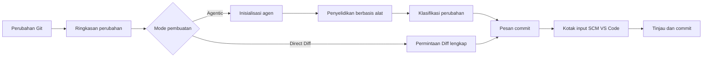

<!-- markdownlint-disable MD001 MD013 MD026 MD033 MD036 MD041 -->

<div align="center">


# Commit-Copilot

### Pesan commit Agentic yang benar-benar memahami kode Anda—bukan sekadar meringkas diff.

Commit-Copilot adalah ekstensi VS Code yang menyelidiki repositori Anda menggunakan agen AI otonom multilangkah, mengklasifikasikan perubahan berdasarkan aturan Conventional Commits yang ketat, dan menulis pesan commit yang rapi langsung ke dalam kotak input Kontrol Sumber (Source Control).

Bekerja mulus dengan LLM cloud terkemuka (Gemini, OpenAI, Anthropic Claude, DeepSeek), model Ollama lokal yang mengutamakan privasi, dan titik akhir kustom (format kompatibel OpenAI & Anthropic).

[](https://marketplace.visualstudio.com/items?itemName=JeremySu0818.commit-copilot)
[](https://open-vsx.org/extension/JeremySu0818/commit-copilot)
[](https://open-vsx.org/extension/JeremySu0818/commit-copilot)
[](#persyaratan-sistem)
[](#pengembangan)
[](#klasifikasi-conventional-commits)
[](../../LICENSE)

**Penyelidikan Agentic · 9 penyedia bawaan · Titik akhir kustom · Dukungan Ollama lokal · 20 bahasa**

<p align="center">
  <b>Terjemahan:</b>
  <a href="https://github.com/JeremySu0818/Commit-Copilot#readme">English</a> |
  <a href="https://github.com/JeremySu0818/Commit-Copilot/blob/main/docs/readme/README-zh-tw.md">繁體中文</a> |
  <a href="https://github.com/JeremySu0818/Commit-Copilot/blob/main/docs/readme/README-zh-cn.md">简体中文</a> |
  <a href="https://github.com/JeremySu0818/Commit-Copilot/blob/main/docs/readme/README-ja.md">日本語</a> |
  <a href="https://github.com/JeremySu0818/Commit-Copilot/blob/main/docs/readme/README-ko.md">한국어</a> |
  <a href="https://github.com/JeremySu0818/Commit-Copilot/blob/main/docs/readme/README-de.md">Deutsch</a> |
  <a href="https://github.com/JeremySu0818/Commit-Copilot/blob/main/docs/readme/README-fr.md">Français</a> |
  <a href="https://github.com/JeremySu0818/Commit-Copilot/blob/main/docs/readme/README-es.md">Español</a> |
  <a href="https://github.com/JeremySu0818/Commit-Copilot/blob/main/docs/readme/README-pt-br.md">Português (Brasil)</a> |
  <a href="https://github.com/JeremySu0818/Commit-Copilot/blob/main/docs/readme/README-ru.md">Русский</a> |
  <a href="https://github.com/JeremySu0818/Commit-Copilot/blob/main/docs/readme/README-it.md">Italiano</a> |
  <a href="https://github.com/JeremySu0818/Commit-Copilot/blob/main/docs/readme/README-nl.md">Nederlands</a> |
  <a href="https://github.com/JeremySu0818/Commit-Copilot/blob/main/docs/readme/README-pl.md">Polski</a> |
  <a href="https://github.com/JeremySu0818/Commit-Copilot/blob/main/docs/readme/README-tr.md">Türkçe</a> |
  <a href="https://github.com/JeremySu0818/Commit-Copilot/blob/main/docs/readme/README-vi.md">Tiếng Việt</a> |
  <a href="https://github.com/JeremySu0818/Commit-Copilot/blob/main/docs/readme/README-id.md">Bahasa Indonesia</a> |
  <a href="https://github.com/JeremySu0818/Commit-Copilot/blob/main/docs/readme/README-hu.md">Magyar</a> |
  <a href="https://github.com/JeremySu0818/Commit-Copilot/blob/main/docs/readme/README-cs.md">Čeština</a> |
  <a href="https://github.com/JeremySu0818/Commit-Copilot/blob/main/docs/readme/README-hi.md">हिन्दी</a> |
  <a href="https://github.com/JeremySu0818/Commit-Copilot/blob/main/docs/readme/README-ar.md">العربية</a>
</p>

</div>

---

## Mengapa Commit-Copilot?

Sebagian besar alat commit AI hanya mengirimkan diff mentah ke model dan berharap mendapatkan ringkasan satu baris yang sesuai.

Commit-Copilot mengambil pendekatan yang sama sekali berbeda.

Alat ini dimulai dengan metadata perubahan yang ringan, lalu membiarkan agen otonom menentukan apa saja yang perlu diselidiki: diff per file, isi file lengkap, struktur simbol kode, referensi sintaksis, pola string di seluruh proyek, dan gaya riwayat commit terbaru. Hanya setelah memahami maksud dan dampak perubahan secara menyeluruh, alat ini mengklasifikasikan dan menghasilkan pesan commit berkualitas tinggi.

| Kemampuan                                               | Alat diff-to-prompt biasa | Commit-Copilot |
| ------------------------------------------------------- | :-----------------------: | :------------: |
| Membaca seluruh diff besar secara langsung              |            Ya             |    Opsional    |
| Menyelidiki file relevan secara selektif                |           Tidak           |       Ya       |
| Memahami struktur dan kerangka kode                     |         Terbatas          |       Ya       |
| Menemukan referensi simbol melalui LSP                  |           Tidak           |       Ya       |
| Mencari hubungan string/konfigurasi tersembunyi         |           Tidak           |       Ya       |
| Mempelajari gaya dari commit terbaru                    |       Sangat jarang       |       Ya       |
| Menggunakan analisis akurat berbasis indeks Git (Index) |       Sangat jarang       |       Ya       |
| Mendukung alur kerja agen model lokal                   |         Terbatas          |       Ya       |
| Menerapkan batasan tipe commit yang ketat               |     Bergantung model      |       Ya       |
| Tidak pernah men-stage tanpa izin                       |        Bervariasi         |       Ya       |

> [!TIP]
> Gunakan mode **Agentic** untuk akurasi dan konteks terbaik. Gunakan mode **Direct Diff** jika kecepatan lebih diutamakan daripada penyelidikan mendalam.

---

## Sorotan Utama

<table>
<tr>
<td width="50%" valign="top">

<h3>Agen yang sadar repositori</h3>

Agen memulai dari nama file, tipe perubahan, jumlah baris, dan struktur proyek—lalu secara mandiri memilih alat yang diperlukan untuk memahami perubahan kode secara mendalam.

</td>
<td width="50%" valign="top">

<h3>Akurasi indeks Git</h3>

Untuk perubahan yang di-stage, alat mengutamakan konten dari indeks Git. Analisis referensi LSP dilakukan di dalam ruang kerja sementara yang direkonstruksi dari status staged.

</td>
</tr>
<tr>
<td width="50%" valign="top">

<h3>Multi-penyedia secara bawaan</h3>

Mendukung Google Gemini, OpenAI, Anthropic Claude, xAI Grok, Groq, OpenRouter, DeepSeek, Alibaba Qwen (Tongyi Qianwen), Ollama, atau titik akhir kompatibel kustom apa pun.

</td>
<td width="50%" valign="top">

<h3>Conventional Commits yang ketat</h3>

Mendukung penuh 11 tipe Conventional Commit, menerapkan aturan klasifikasi berbasis prioritas dengan panduan batasan yang jelas. Scope, Body, Footer, dan Gitmoji dapat dikonfigurasi secara mandiri.

</td>
</tr>
<tr>
<td width="50%" valign="top">

<h3>Alur kerja agen untuk model lokal</h3>

Melalui protokol alat teks bawaan Commit-Copilot, model Ollama lokal yang tidak memiliki dukungan Tool Calling native sekalipun dapat menjalankan alur kerja penyelidikan multilangkah secara penuh.

</td>
<td width="50%" valign="top">

<h3>Alur kerja aman, utamakan peninjauan</h3>

Pesan yang dihasilkan akan ditulis ke dalam kotak input Kontrol Sumber VS Code. Anda memegang kendali penuh atas staging, pengeditan, dan commit akhir.

</td>
</tr>
</table>

---

## Daftar Isi

- [Cara Kerja](#cara-kerja)
- [Alat Agen](#alat-agen)
- [Fitur](#fitur)
- [Penyedia yang Didukung](#penyedia-yang-didukung)
- [Persyaratan Sistem](#persyaratan-sistem)
- [Instalasi](#instalasi)
- [Konfigurasi](#konfigurasi)
- [Penggunaan](#penggunaan)
- [Klasifikasi Conventional Commits](#klasifikasi-conventional-commits)
- [Deteksi Perubahan](#deteksi-perubahan)
- [Lokalisasi](#lokalisasi)
- [Keamanan dan Privasi](#keamanan-dan-privasi)
- [Pengembangan](#pengembangan)
- [Pengujian](#pengujian)
- [Pertanyaan Umum (FAQ)](#pertanyaan-umum-faq)
- [Berkontribusi](#berkontribusi)
- [Lisensi](#lisensi)

---

## Cara Kerja



### Alur kerja pembuatan Agentic

1. **Mengumpulkan metadata perubahan**
   Commit-Copilot mengumpulkan nama file, tipe perubahan, jumlah baris, dan pohon struktur proyek.

2. **Inisialisasi Agen**
   Model menerima ringkasan terstruktur dan panduan pembuatan otonom. Isi diff mentah yang besar tidak dikirimkan pada tahap awal ini.

3. **Penyelidikan dengan alat**
   Agen memanggil alat secara mandiri untuk memeriksa repositori, hanya meminta konteks penting yang dinilai relevan.

4. **Klasifikasi perubahan**
   Aturan berurutan berdasarkan prioritas menentukan tipe Conventional Commit. Saat Scope diaktifkan, Agen juga menentukan modul atau area yang terpengaruh.

5. **Menghasilkan pesan commit**
   Pesan akhir ditulis ke dalam kotak input Kontrol Sumber (Source Control) agar dapat ditinjau dan disesuaikan.

> [!NOTE]
> Saat **Pembuatan Hibrida (Hybrid Generation)** diaktifkan, teks yang ada di kotak input SCM hanya dijadikan draf referensi untuk nada bahasa dan maksud. Instruksi apa pun di dalam draf tersebut tidak dapat mengesampingkan aturan pembuatan sistem.

### Alur kerja Direct Diff

Mode Direct Diff melewati siklus penyelidikan dan mengirimkan seluruh diff ke model yang dipilih dalam satu permintaan. Mode ini lebih cepat, tersedia untuk semua penyedia, dan sangat cocok untuk perubahan kecil atau sederhana.

---

## Alat Agen

Agen dapat menggabungkan alat-alat berikut di berbagai langkah penyelidikan:

| Nama Alat              | Tujuan Penggunaan                                                                               |
| ---------------------- | ----------------------------------------------------------------------------------------------- |
| `get_diff`             | Mengambil diff lengkap dan tepat untuk satu atau beberapa file yang diminta.                    |
| `read_file`            | Membaca isi file, opsional menentukan rentang baris; mengutamakan indeks Git untuk file staged. |
| `get_file_outline`     | Mengembalikan informasi struktural seperti fungsi, kelas, antarmuka, dan ekspor.                |
| `find_references`      | Menggunakan Language Server Protocol (LSP) VS Code untuk menemukan referensi simbol sintaksis.  |
| `get_recent_commits`   | Membaca pesan commit terbaru untuk mempelajari gaya penulisan yang sudah ada di repositori.     |
| `search_code`          | Mencari string atau pola di seluruh ruang kerja untuk menemukan hubungan tersembunyi.           |
| `write_commit_message` | Mengirimkan pesan commit terstruktur akhir dan menyelesaikan penyelidikan.                      |

Gemini, Anthropic, dan OpenAI menggunakan Tool Calling terstruktur native. Ollama menggunakan protokol alat teks yang setara dengan dukungan penuh untuk panggilan batch, ID dari aplikasi, hasil terstruktur, penanganan kesalahan per panggilan, dan pengiriman akhir.

`get_diff` menerima satu `path` atau array `paths` yang tidak kosong. Permintaan banyak file sekaligus mengurangi latensi bolak-balik alat sambil tetap mengembalikan diff lengkap dan tepat untuk setiap file yang diminta tanpa ada yang diringkas atau dihilangkan.

Mode Agentic memiliki opsi "Wajibkan cakupan diff lengkap". Jika diaktifkan di Pengaturan, panggilan `write_commit_message` akan ditolak sampai setiap file yang diubah telah diperiksa diff-nya melalui `get_diff` tunggal atau batch. Opsi ini dinonaktifkan secara default untuk menghemat token dan mempertahankan performa.

---

## Fitur

### Pembuatan dan analisis mendalam

- **Mode ganda Agentic dan Direct Diff**
- **Batas maksimum langkah Agen yang dapat disesuaikan**
- **Siklus penyelidikan yang dapat dibatalkan kapan saja**
- **Mekanisme percobaan ulang otomatis**: Otomatis mencoba ulang saat terjadi kesalahan API sementara atau batas kuota (Rate Limit)
- **Pencarian pola string lintas proyek**: Melacak variabel lingkungan, nama event, kunci konfigurasi, dan relasi tersembunyi lainnya
- **Radar dampak referensi LSP**: Menganalisis dampak sintaksis dari perubahan simbol secara akurat
- **Analisis gaya commit terbaru**: Mempelajari kebiasaan penulisan commit proyek secara otomatis
- **Pembuatan Hibrida (Hybrid Generation)**: Memanfaatkan teks input yang ada sebagai draf referensi yang aman

### Kesadaran status Git

- Mengenali 5 status repositori secara akurat: Di-stage (Staged), Belum di-stage (Unstaged), Campuran (Mixed), Berisi file tidak dilacak (Untracked), Hanya file tidak dilacak (Untracked-only)
- Meminta konfirmasi sebelum men-stage file yang belum dilacak
- Tidak pernah melakukan auto-stage tanpa persetujuan eksplisit pengguna
- Mengutamakan isi indeks Git saat memeriksa file yang di-stage
- Membuat snapshot ruang kerja sementara untuk analisis referensi LSP pada status staged
- Memperbarui panel samping secara real-time saat status repositori berubah

### Kontrol keluaran Commit

Aktifkan atau nonaktifkan setiap elemen secara independen:

- **Scope** (Cakupan area)
- **Body** (Isi penjelasan rinci)
- **Footer** (Kaki pesan / Breaking Changes)
- **Awalan Gitmoji**

Pengaturan default:

| Elemen  | Status Default |
| ------- | :------------: |
| Scope   |     Aktif      |
| Body    |     Aktif      |
| Footer  |    Nonaktif    |
| Gitmoji |    Nonaktif    |

### Integrasi mendalam dengan VS Code

Jalankan Commit-Copilot dengan mudah melalui:

- Ikon khusus di **Activity Bar**
- Tombol tongkat sihir di bilah navigasi **Source Control (SCM)**
- **Command Palette**

Pesan yang dihasilkan otomatis dimasukkan ke dalam kotak input SCM standar VS Code agar dapat ditinjau dan disunting sebelum di-commit.

### Validasi penyedia dan manajemen model

- Memvalidasi API Key langsung ke titik akhir penyedia sebelum disimpan
- Memberikan panduan praktis saat terjadi kesalahan autentikasi, kuota habis, atau masalah koneksi
- Mendukung pengambilan daftar model dinamis untuk OpenRouter, Alibaba Qwen, Ollama, dan penyedia kustom
- Mendukung penambahan/penghapusan ID model secara manual untuk Ollama dan penyedia kustom
- Penyedia kustom mendukung format API yang kompatibel dengan OpenAI dan Anthropic

---

## Penyedia yang Didukung

| Penyedia            | Sorotan Utama                                                   |
| ------------------- | --------------------------------------------------------------- |
| **Google Gemini**   | Dukungan alat terstruktur native dan berbagai generasi Gemini   |
| **OpenAI**          | Model penalaran, serbaguna, ringkas, dan seri GPT-5/6           |
| **Anthropic**       | Lini lengkap Claude Haiku, Sonnet, Opus, dan Fable              |
| **xAI Grok**        | Varian Grok penalaran dan non-penalaran                         |
| **Groq**            | Hosting berkecepatan tinggi untuk model Qwen, `gpt-oss`         |
| **OpenRouter**      | Akses katalog model luas dengan filter dukungan Tool Calling    |
| **DeepSeek**        | DeepSeek V4.1 Flash                                             |
| **Alibaba Qwen**    | Integrasi DashScope dengan penemuan model dinamis               |
| **Ollama**          | Model lokal dengan daftar dinamis dan protokol alat teks bawaan |
| **Penyedia Kustom** | Mendukung titik akhir pihak ketiga kompatibel OpenAI/Anthropic  |

<details>
<summary><strong>Buka untuk melihat daftar seri model yang didukung Commit-Copilot</strong></summary>

### Google Gemini

- Gemini 2.5 Flash-Lite, Flash, Pro
- Gemini 3 Flash
- Gemini 3.1 Flash-Lite, Pro
- Gemini 3.5 Flash-Lite, Flash
- Gemini 3.6 Flash
- Gemini 3.7 Flash
- Gemini 3.8 Flash

### OpenAI

- o3, o3-mini
- o4-mini
- GPT-4o mini, GPT-4o
- GPT-4.1 nano, mini, GPT-4.1
- GPT-5 nano, mini, GPT-5
- GPT-5.1
- GPT-5.2
- GPT-5.4 nano, mini, GPT-5.4
- GPT-5.5
- GPT-5.6 Luna, Terra, Sol
- GPT-6 Luna, Sol, Astra
- GPT-6.1 Sol

### Anthropic

- Claude Sonnet 4, Opus 4
- Claude Opus 4.1
- Claude Haiku, Sonnet, Opus 4.5
- Claude Sonnet, Opus 4.6
- Claude Opus 4.7
- Claude Opus 4.8
- Claude Sonnet 5, Opus 5, Fable 5
- Claude Fable 5.1
- Claude Opus 5.5

### xAI Grok

- Grok 4.20 (penalaran dan non-penalaran)
- Grok 4.3
- Grok 4.5
- Grok 4.6
- Grok 4.7

### Groq

- `gpt-oss-20B`
- `gpt-oss-120B`
- `gpt-oss-safeguard-20B`
- Qwen 3.8 27b

### DeepSeek

- DeepSeek V4.1 Flash

> [!IMPORTANT]
> Ketersediaan model sebenarnya bergantung pada penyedia, izin akun, wilayah, dan status titik akhir. Daftar model OpenRouter, Qwen, Ollama, dan penyedia kustom dapat diambil secara dinamis.

</details>

---

## Persyaratan Sistem

- **VS Code** `1.91.0` atau yang lebih baru
- **Git** (tersedia melalui ekstensi Git bawaan VS Code)
- Salah satu dari akses berikut:
  - API Key yang valid untuk penyedia jarak jauh yang didukung
  - Instans Ollama lokal atau jarak jauh yang sedang berjalan
  - Kredensial untuk titik akhir kustom yang kompatibel

Untuk pengembangan:

- **Node.js** `20+`
- **npm**

---

## Instalasi

Instal Commit-Copilot dari salah satu marketplace berikut:

- [**Visual Studio Code Marketplace**](https://marketplace.visualstudio.com/items?itemName=JeremySu0818.commit-copilot)
- [**Open VSX Registry**](https://open-vsx.org/extension/JeremySu0818/commit-copilot)

Setelah instalasi, buka repositori Git di VS Code dan klik ikon **Commit Copilot** di Activity Bar untuk memulai.

---

## Konfigurasi

### Pengaturan dasar

1. Buka panel **Commit Copilot** dari Activity Bar.
2. Pilih penyedia model yang ingin digunakan.
3. Masukkan API Key penyedia atau URL host Ollama.
4. Klik **Simpan**.
5. Tunggu validasi koneksi dan kredensial secara real-time selesai.
6. Pilih model spesifik setelah validasi berhasil.

> [!IMPORTANT]
> Untuk model Ollama, ekstensi selalu menjalankan `ollama pull` sebelum pembuatan untuk memastikan model tersedia dan terkini, serta menampilkan progres di area notifikasi. Hal ini dapat mengunduh ulang layer meskipun model sudah ada secara lokal.

### Opsi Pengaturan

| Opsi Pengaturan         | Default  | Deskripsi                                                                                      |
| ----------------------- | -------- | ---------------------------------------------------------------------------------------------- |
| **Mode Pembuatan**      | Agentic  | `Agentic` menjalankan penyelidikan multilangkah. `Direct Diff` mengirim seluruh diff langsung. |
| **Pembuatan Hibrida**   | Nonaktif | Menggunakan teks input SCM sebagai draf referensi sambil mengisolasi instruksi prompt.         |
| **Maks. Langkah Agen**  | `0`      | Membatasi jumlah iterasi panggilan alat per penyelidikan. `0` berarti tanpa batas.             |
| **Sertakan Scope**      | Aktif    | Mewajibkan scope Conventional Commits pada baris subjek jika diaktifkan.                       |
| **Sertakan Body**       | Aktif    | Mewajibkan bagian isi deskriptif jika diaktifkan.                                              |
| **Sertakan Footer**     | Nonaktif | Mewajibkan bagian footer (Breaking Changes, dll.) jika diaktifkan; tidak memalsukan fakta.     |
| **Sertakan Gitmoji**    | Nonaktif | Menambahkan tepat satu awalan Gitmoji yang sesuai jika diaktifkan.                             |
| **Bahasa Ekstensi**     | Otomatis | Mengikuti bahasa tampilan VS Code atau dapat dikunci manual ke bahasa tertentu.                |
| **Bahasa Pesan Commit** | Inggris  | Mengontrol bahasa subjek, isi, dan footer yang dihasilkan secara independen.                   |

### Penyedia Kustom

Untuk menambahkan titik akhir yang kompatibel dengan OpenAI atau Anthropic:

1. Buka pengaturan penyedia.
2. Pilih **Tambahkan Penyedia Kustom**.
3. Pilih format API (OpenAI-compatible atau Anthropic-compatible).
4. Masukkan nama tampilan dan API Base URL.
5. Simpan penyedia.
6. Masukkan dan validasi API Key.
7. Pilih model dari daftar yang diambil atau pilih **Tambah Model Kustom...** untuk mendaftarkan ID model secara manual.

Untuk titik akhir yang kompatibel dengan Anthropic, nilai token output maksimum (max_tokens) juga dapat dikonfigurasi.

---

## Penggunaan

### Metode A: Panel Activity Bar

1. Buka panel samping **Commit Copilot**.
2. Pastikan repositori memiliki perubahan yang di-stage, belum di-stage, atau belum dilacak.
3. Klik **Hasilkan Pesan Commit (Generate Commit Message)**.
4. Tanggapi dialog pemilihan perubahan atau staging jika muncul.

### Metode B: Tampilan Source Control

1. Tekan `Ctrl+Shift+G` (macOS: `Cmd+Shift+G`) untuk membuka Source Control.
2. Klik ikon tongkat sihir Commit-Copilot di bilah navigasi atas.

### Metode C: Command Palette

1. Buka Command Palette:
   - Windows/Linux: `Ctrl+Shift+P`
   - macOS: `Cmd+Shift+P`
2. Jalankan **Commit-Copilot: Generate Commit Message**.

### Meninjau dan Commit

Pesan yang dihasilkan akan otomatis terisi ke dalam kotak input Source Control.

Anda dapat leluasa meninjau, menyempurnakan kalimat, lalu melakukan commit menggunakan tombol Commit standar VS Code.

---

## Klasifikasi Conventional Commits

Commit-Copilot secara ketat mendukung 11 tipe Conventional Commit berikut:

| Tipe       | Tujuan Penggunaan                                              |
| ---------- | -------------------------------------------------------------- |
| `feat`     | Menambahkan fitur atau fungsionalitas baru bagi pengguna       |
| `fix`      | Memperbaiki bug atau perilaku yang salah                       |
| `docs`     | Hanya mengubah dokumentasi                                     |
| `style`    | Mengubah format kode tanpa memengaruhi logika                  |
| `refactor` | Restrukturisasi kode tanpa menambah fitur atau memperbaiki bug |
| `perf`     | Meningkatkan performa atau efisiensi sumber daya               |
| `test`     | Menambah, memperbarui, atau melengkapi pengujian               |
| `build`    | Mengubah sistem build atau dependensi eksternal                |
| `ci`       | Mengubah konfigurasi CI/CD dan alur otomatisasi                |
| `chore`    | Tugas pemeliharaan rutin yang tidak tercakup tipe lain         |
| `revert`   | Membatalkan commit sebelumnya                                  |

Format keluaran mengikuti sintaks standar Conventional Commits:

```text
type(scope): deskripsi subjek yang ringkas dan jelas

Isi penjelasan mendetail tentang apa yang diubah dan mengapa.
```

Tergantung konfigurasi, Scope, Body, Footer, dan Gitmoji dapat disertakan atau dihilangkan. Baris subjek pertama dibatasi maksimal 72 karakter dan idealnya dijaga di bawah 50 karakter.

---

## Deteksi Perubahan

Commit-Copilot mengenali 5 status repositori Git yang berbeda:

| Skenario Deteksi                   | Perilaku Penanganan                               |
| ---------------------------------- | ------------------------------------------------- |
| **Hanya yang di-stage**            | Menggunakan diff yang di-stage dan alat indeks    |
| **Hanya belum di-stage**           | Menganalisis langsung modifikasi working tree     |
| **Campuran (Mixed)**               | Menampilkan dialog untuk memilih ruang lingkup    |
| **Belum di-stage + Belum dilacak** | Menyajikan opsi sesuai konteks                    |
| **Hanya belum dilacak**            | Menawarkan untuk men-stage file baru lalu membuat |

Tidak ada file yang di-stage secara otomatis tanpa persetujuan eksplisit pengguna.

---

## Lokalisasi

Antarmuka ekstensi dapat mengikuti bahasa VS Code secara otomatis atau dikunci ke salah satu dari 20 bahasa yang didukung:

<table>
<tr>
<td><a href="README-ar.md">العربية</a></td>
<td><a href="README-cs.md">Čeština</a></td>
<td><a href="README-de.md">Deutsch</a></td>
<td><a href="../../README.md">English</a></td>
</tr>
<tr>
<td><a href="README-es.md">Español</a></td>
<td><a href="README-fr.md">Français</a></td>
<td><a href="README-hi.md">हिन्दी</a></td>
<td><a href="README-hu.md">Magyar</a></td>
</tr>
<tr>
<td><a href="README-id.md">Bahasa Indonesia</a></td>
<td><a href="README-it.md">Italiano</a></td>
<td><a href="README-ja.md">日本語</a></td>
<td><a href="README-ko.md">한국어</a></td>
</tr>
<tr>
<td><a href="README-nl.md">Nederlands</a></td>
<td><a href="README-pl.md">Polski</a></td>
<td><a href="README-pt-br.md">Português (Brasil)</a></td>
<td><a href="README-ru.md">Русский</a></td>
</tr>
<tr>
<td><a href="README-tr.md">Türkçe</a></td>
<td><a href="README-vi.md">Tiếng Việt</a></td>
<td><a href="README-zh-cn.md">简体中文</a></td>
<td><a href="README-zh-tw.md">繁體中文</a></td>
</tr>
</table>

**Bahasa pesan commit** dikonfigurasi secara terpisah dari bahasa antarmuka ekstensi, sehingga Anda dapat menggunakan UI berbahasa Indonesia sementara pesan commit yang dihasilkan tetap dalam bahasa Inggris.

---

## Keamanan dan Privasi

- Semua API Key disimpan secara aman dan terenkripsi menggunakan **VS Code Secret Storage**
- Kunci divalidasi langsung ke titik akhir penyedia sebelum disimpan
- Tidak pernah melakukan auto-stage file tanpa izin eksplisit
- Pembuatan Hibrida memperlakukan teks input SCM sebagai draf referensi yang tidak tepercaya untuk mencegah Prompt Injection
- Permintaan jarak jauh hanya menyertakan metadata, diff, atau isi file tertentu yang dipilih selama penyelidikan
- Ollama lokal dapat menjaga seluruh proses inferensi tetap berada di dalam lingkungan privat Anda

> [!CAUTION]
> Tinjau kebijakan penanganan data penyedia model yang Anda pilih sebelum mengirimkan kode rahasia atau hak milik ke API jarak jauh.

---

## Pengembangan

### Menginstal dependensi

```bash
npm install
```

### Kompilasi untuk pengembangan

```bash
npm run compile
```

Untuk kompilasi dan pemantauan berkas berkelanjutan dengan TypeScript dan esbuild:

```bash
npm run watch
```

### Membangun paket VSIX

```bash
npm run build
```

Skrip build akan menginstal dependensi, menjalankan alur pengemasan VS Code, dan menghasilkan paket `.vsix`.

### Pemeriksaan kualitas kode

Menjalankan pemeriksaan Lint:

```bash
npm run lint
```

Memformat kode sumber:

```bash
npm run format
```

Memverifikasi format (tanpa mengubah berkas):

```bash
npm run check-format
```

---

## Pengujian

Menjalankan seluruh rangkaian pengujian unit:

```bash
npm test
```

Perintah ini akan menjalankan secara berurutan:

1. `npm run test:build`
2. `node --test --test-concurrency=1 "out/test/**/*.test.js"`

Cakupan pengujian saat ini meliputi:

- Semua alat penyelidikan Agen:
  - `get_diff`
  - `read_file`
  - `get_file_outline`
  - `find_references`
  - `get_recent_commits`
  - `search_code`
- Siklus penyelidikan Agen berbasis Tool Calling native
- Siklus penyelidikan Agen berbasis protokol teks Ollama
- Panggilan batch dan skema alat yang dilokalisasi
- Pemulihan respons dengan format tidak sesuai
- Validasi pengiriman alat akhir
- Pengiriman alat melalui `executeToolCall`
- Penguraian dan pembentukan konteks
- Utilitas snapshot ruang kerja staged
- Perilaku percobaan ulang otomatis
- Pesan kesalahan yang dilokalisasi
- Perilaku Main View Provider
- Manajemen model kustom
- Pengelola status

---

## Pertanyaan Umum (FAQ)

<details>
<summary><strong>Apakah Commit-Copilot melakukan commit otomatis?</strong></summary>

Tidak. Ekstensi ini hanya menulis pesan yang dihasilkan ke dalam kotak input Source Control (SCM). Anda dapat meninjau, mengedit, dan melakukan commit sendiri.

</details>

<details>
<summary><strong>Apakah Agen mengirimkan seluruh repositori saya ke AI?</strong></summary>

Dalam mode Agentic, tahap awal hanya mengirimkan metadata perubahan dan pohon file yang dilacak, bukan seluruh isi file. Selanjutnya, Agen meminta diff, isi file, simbol, atau kueri pencarian tertentu sesuai kebutuhan penyelidikan. Mode Direct Diff hanya mengirimkan diff lengkap dari perubahan yang dipilih.

</details>

<details>
<summary><strong>Dapatkah model Ollama menggunakan alat agen tanpa Tool Calling native?</strong></summary>

Ya. Commit-Copilot menyertakan protokol alat teks khusus yang memungkinkan model Ollama lokal menjalankan alur kerja penyelidikan multilangkah dengan lancar.

</details>

<details>
<summary><strong>Apa arti Maks. Langkah Agen = 0?</strong></summary>

Artinya batas jumlah iterasi panggilan alat dihapus. Menyetel bilangan bulat positif akan membatasi berapa banyak langkah penyelidikan yang dapat dilakukan Agen sebelum memberikan hasil akhir.

</details>

<details>
<summary><strong>Bisakah saya menggunakan titik akhir pihak ketiga yang tidak bawaan?</strong></summary>

Ya. Anda dapat menambahkannya sebagai penyedia kustom yang kompatibel dengan OpenAI atau Anthropic, lalu mengambil atau mengonfigurasi ID modelnya secara manual.

</details>

<details>
<summary><strong>Mengapa Ollama selalu menjalankan pull setiap kali pembuatan?</strong></summary>

Ekstensi sengaja menjalankan `ollama pull` sebelum setiap pembuatan untuk memastikan model yang dipilih tersedia dan merupakan versi terbaru di komputer lokal Anda. Tergantung pada status cache lokal, ini mungkin memeriksa atau mengunduh ulang layer model.

</details>

---

## Berkontribusi

Kontribusi dari komunitas sangat kami hargai!

Alur kontribusi yang disarankan:

1. Buat branch fitur khusus.
2. Lakukan perubahan dan pengembangan.
3. Jalankan Lint, pemeriksaan format, dan pengujian unit.
4. Jelaskan motivasi dan perubahan perilaku secara jelas dalam Pull Request.
5. Sertakan cakupan pengujian yang relevan untuk perubahan perilaku.

Sebelum mengajukan PR:

```bash
npm run lint
npm run check-format
npm test
```

Saat melaporkan bug, sertakan penyedia, model, mode pembuatan, status perubahan repositori, log terkait, dan langkah reproduksi. Jangan pernah menyertakan API Key atau konten repositori yang bersifat sensitif.

---

## Lisensi

Commit-Copilot dirilis di bawah [Lisensi MIT](../../LICENSE).

---

<div align="center">

Dibuat khusus untuk pengembang yang menginginkan pesan commit berkonteks jelas—bukan hasil tebakan.

</div>
