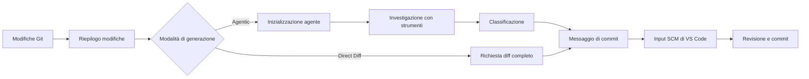

<!-- markdownlint-disable MD001 MD013 MD026 MD033 MD036 MD041 -->

<div align="center">


# Commit-Copilot

### Messaggi di commit basati su agenti che comprendono il tuo codice, non solo il diff.

Commit-Copilot è un'estensione per VS Code che esplora il tuo repository con un agente IA multi-fase, classifica le modifiche seguendo le rigide regole di Conventional Commits e scrive messaggi di commit impeccabili direttamente nel controllo del codice sorgente (Source Control).

Funziona perfettamente con i principali LLM cloud (Gemini, OpenAI, Anthropic Claude, DeepSeek), modelli locali Ollama orientati alla privacy ed endpoint personalizzati (formati compatibili con OpenAI e Anthropic).

[](https://marketplace.visualstudio.com/items?itemName=JeremySu0818.commit-copilot)
[](https://open-vsx.org/extension/JeremySu0818/commit-copilot)
[](https://open-vsx.org/extension/JeremySu0818/commit-copilot)
[](#requisiti)
[](#sviluppo)
[](#classificazione-conventional-commits)
[](../../LICENSE)

**Investigazione basata su agenti · 9 provider integrati · Endpoint personalizzati · Supporto locale Ollama · 20 lingue**

<p align="center">
  <b>Traduzioni:</b>
  <a href="https://github.com/JeremySu0818/Commit-Copilot#readme">English</a> |
  <a href="https://github.com/JeremySu0818/Commit-Copilot/blob/main/docs/readme/README-zh-tw.md">繁體中文</a> |
  <a href="https://github.com/JeremySu0818/Commit-Copilot/blob/main/docs/readme/README-zh-cn.md">简体中文</a> |
  <a href="https://github.com/JeremySu0818/Commit-Copilot/blob/main/docs/readme/README-ja.md">日本語</a> |
  <a href="https://github.com/JeremySu0818/Commit-Copilot/blob/main/docs/readme/README-ko.md">한국어</a> |
  <a href="https://github.com/JeremySu0818/Commit-Copilot/blob/main/docs/readme/README-de.md">Deutsch</a> |
  <a href="https://github.com/JeremySu0818/Commit-Copilot/blob/main/docs/readme/README-fr.md">Français</a> |
  <a href="https://github.com/JeremySu0818/Commit-Copilot/blob/main/docs/readme/README-es.md">Español</a> |
  <a href="https://github.com/JeremySu0818/Commit-Copilot/blob/main/docs/readme/README-pt-br.md">Português (Brasil)</a> |
  <a href="https://github.com/JeremySu0818/Commit-Copilot/blob/main/docs/readme/README-ru.md">Русский</a> |
  <a href="https://github.com/JeremySu0818/Commit-Copilot/blob/main/docs/readme/README-it.md">Italiano</a> |
  <a href="https://github.com/JeremySu0818/Commit-Copilot/blob/main/docs/readme/README-nl.md">Nederlands</a> |
  <a href="https://github.com/JeremySu0818/Commit-Copilot/blob/main/docs/readme/README-pl.md">Polski</a> |
  <a href="https://github.com/JeremySu0818/Commit-Copilot/blob/main/docs/readme/README-tr.md">Türkçe</a> |
  <a href="https://github.com/JeremySu0818/Commit-Copilot/blob/main/docs/readme/README-vi.md">Tiếng Việt</a> |
  <a href="https://github.com/JeremySu0818/Commit-Copilot/blob/main/docs/readme/README-id.md">Bahasa Indonesia</a> |
  <a href="https://github.com/JeremySu0818/Commit-Copilot/blob/main/docs/readme/README-hu.md">Magyar</a> |
  <a href="https://github.com/JeremySu0818/Commit-Copilot/blob/main/docs/readme/README-cs.md">Čeština</a> |
  <a href="https://github.com/JeremySu0818/Commit-Copilot/blob/main/docs/readme/README-hi.md">हिन्दी</a> |
  <a href="https://github.com/JeremySu0818/Commit-Copilot/blob/main/docs/readme/README-ar.md">العربية</a>
</p>

</div>

---

## Perché Commit-Copilot?

La maggior parte degli strumenti di commit con IA invia un diff grezzo a un modello sperando in un buon riassunto su una sola riga.

Commit-Copilot adotta un approccio completamente diverso.

Inizia analizzando metadati leggeri sulle modifiche, quindi lascia che un agente autonomo decida cosa ispezionare: diff, contenuti dei file, simboli, riferimenti, pattern globali del progetto e commit recenti. Solo dopo aver compreso la modifica a fondo, la classifica e genera il messaggio.

| Funzionalità                                                | Strumenti di base diff-to-prompt | Commit-Copilot |
| ----------------------------------------------------------- | :------------------------------: | :------------: |
| Legge immediatamente l'intero diff                          |                Sì                |   Opzionale    |
| Esplora selettivamente i file rilevanti                     |                No                |       Sì       |
| Comprende la struttura del codice                           |             Limitato             |       Sì       |
| Trova i riferimenti dei simboli tramite LSP                 |                No                |       Sì       |
| Cerca relazioni nascoste di stringhe/configurazioni         |                No                |       Sì       |
| Apprende dallo stile dei commit recenti                     |            Raramente             |       Sì       |
| Utilizza un'analisi precisa basata sull'indice Git (staged) |            Raramente             |       Sì       |
| Supporta workflow di agenti nativi e locali                 |             Limitato             |       Sì       |
| Applica limiti rigorosi per i tipi di commit                |       Dipende dal modello        |       Sì       |
| Non aggiunge mai in stage senza consenso                    |              Varia               |       Sì       |

> [!TIP]
> Usa la modalità **Agentic** per la massima precisione e contesto. Usa la modalità **Direct Diff** quando la velocità è prioritaria rispetto a un'analisi approfondita.

---

## Caratteristiche principali

<table>
<tr>
<td width="50%" valign="top">

<h3>Agente consapevole del repository</h3>

L'agente inizia con nomi di file, tipi di modifica, conteggio delle righe e struttura del progetto, quindi sceglie autonomamente gli strumenti necessari per comprendere la modifica.

</td>
<td width="50%" valign="top">

<h3>Precisione dell'indice Git</h3>

Per le modifiche in stage, gli strumenti del repository danno priorità ai contenuti dell'indice Git. L'analisi dei riferimenti LSP utilizza un'area di lavoro temporanea ricostruita dallo stato in stage.

</td>
</tr>
<tr>
<td width="50%" valign="top">

<h3>Multi-provider per progettazione</h3>

Utilizza Google Gemini, OpenAI, Anthropic, xAI, Groq, OpenRouter, DeepSeek, Alibaba Qwen, Ollama o qualsiasi endpoint personalizzato compatibile.

</td>
<td width="50%" valign="top">

<h3>Conventional Commits rigorosi</h3>

Il prompt supporta tutti gli 11 tipi di Conventional Commits e applica regole di classificazione gerarchiche con limiti espliciti. Scope, Body, Footer e Gitmoji sono configurabili in modo indipendente.

</td>
</tr>
<tr>
<td width="50%" valign="top">

<h3>Workflow per modelli locali con agenti</h3>

I modelli Ollama possono utilizzare gli stessi strumenti di investigazione tramite il protocollo di strumenti testuali integrato di Commit-Copilot, anche senza supporto nativo per il Tool Calling.

</td>
<td width="50%" valign="top">

<h3>Workflow sicuro e orientato alla revisione</h3>

Commit-Copilot scrive il risultato nella casella di testo del controllo del codice sorgente. Mantieni il pieno controllo su staging, modifica e commit finale.

</td>
</tr>
</table>

---

## Indice

- [Come funziona](#come-funziona)
- [Strumenti dell'agente](#strumenti-dellagente)
- [Funzionalità](#funzionalità)
- [Provider supportati](#provider-supportati)
- [Requisiti](#requisiti)
- [Installazione](#installazione)
- [Configurazione](#configurazione)
- [Utilizzo](#utilizzo)
- [Classificazione Conventional Commits](#classificazione-conventional-commits)
- [Rilevamento delle modifiche](#rilevamento-delle-modifiche)
- [Localizzazione](#localizzazione)
- [Sicurezza e privacy](#sicurezza-e-privacy)
- [Sviluppo](#sviluppo)
- [Test](#test)
- [Domande frequenti (FAQ)](#domande-frequenti-faq)
- [Contribuire](#contribuire)
- [Licenza](#licenza)

---

## Come funziona



### Workflow Agentic

1. **Raccogliere i metadati delle modifiche**
   Commit-Copilot raccoglie i nomi dei file, i tipi di modifica, il conteggio delle righe e l'albero della struttura del progetto.

2. **Inizializzare l'agente**
   Il modello riceve il riepilogo e le istruzioni operative per la generazione autonoma del messaggio. Il contenuto del diff grezzo non viene incluso inizialmente.

3. **Investigare con gli strumenti**
   L'agente ispeziona selettivamente il repository, richiedendo solo il contesto che ritiene utile.

4. **Classificare la modifica**
   Regole ordinate per priorità determinano il tipo di commit. Quando l'inclusione dello scope è abilitata, l'agente seleziona anche il modulo o l'area interessata.

5. **Generare il messaggio**
   Il messaggio finale viene scritto nella casella di input del controllo del codice sorgente (Source Control) per la revisione e la modifica.

> [!NOTE]
> Quando la **Generazione ibrida** è abilitata, il testo esistente nel controllo del codice sorgente viene trattato come bozza di riferimento per stile e intento. Eventuali istruzioni presenti in questa bozza non possono ignorare le regole di generazione.

### Workflow Direct Diff

Direct Diff salta il ciclo di investigazione e invia l'intero diff al modello selezionato in un'unica richiesta. È più veloce, disponibile per ogni provider ed è ideale per modifiche semplici o evidenti.

---

## Strumenti dell'agente

L'agente può combinare i seguenti strumenti attraverso diversi passaggi di analisi:

| Strumento              | Scopo                                                                                                                       |
| ---------------------- | --------------------------------------------------------------------------------------------------------------------------- |
| `get_diff`             | Recupera il diff esatto e completo per un file o per più file richiesti.                                                    |
| `read_file`            | Legge il contenuto del file, con intervallo di righe opzionale. L'analisi in stage privilegia il contenuto dell'indice Git. |
| `get_file_outline`     | Restituisce informazioni strutturali come funzioni, classi ed esportazioni.                                                 |
| `find_references`      | Utilizza il Language Server Protocol di VS Code per individuare riferimenti sintattici ai simboli.                          |
| `get_recent_commits`   | Legge i messaggi di commit recenti per conformarsi allo stile esistente del repository.                                     |
| `search_code`          | Cerca nell'area di lavoro stringhe o pattern che le sole importazioni non rivelano.                                         |
| `write_commit_message` | Invia il messaggio di commit finale strutturato.                                                                            |

Gemini, Anthropic e i percorsi compatibili con OpenAI utilizzano chiamate a strumenti strutturate native. Ollama utilizza un protocollo testuale equivalente che supporta chiamate in batch, ID di chiamata assegnati dall'applicazione, risultati strutturati, gestione degli errori per chiamata e invio finale.

`get_diff` accetta un singolo `path` o un array `paths` non vuoto. Le richieste su più file riducono i passaggi dell'agente restituendo al contempo il diff esatto e completo di ciascun file richiesto; nessun contenuto viene riassunto o omesso.

La generazione agentica può facoltativamente imporre una copertura completa dei diff. Se abilitata nelle Impostazioni, `write_commit_message` viene rifiutata finché ogni file modificato da un diff Git valido non è stato coperto da una chiamata `get_diff` (singola o in batch) riuscita. Questa opzione è disabilitata per impostazione predefinita per preservare le prestazioni e il consumo di token.

---

## Funzionalità

### Generazione e analisi

- **Modalità di generazione Agentic e Direct Diff**
- **Passi massimi dell'agente configurabili**
- **Ciclo di analisi annullabile in qualsiasi momento**
- **Tentativi automatici (retry)** per errori temporanei delle API remote e limiti di velocità (Rate Limits)
- **Ricerca di pattern a livello di progetto** per variabili d'ambiente, nomi di eventi, chiavi di configurazione e altre relazioni testuali
- **Radar di impatto dei riferimenti LSP** per l'analisi dei simboli sensibile alla sintassi
- **Ispezione dei commit recenti** per rispettare le convenzioni del progetto
- **Generazione ibrida** che utilizza il testo esistente in SCM come bozza di riferimento sicura

### Comportamento consapevole di Git

- Rileva cinque stati del repository: solo in stage (Staged), solo non in stage (Unstaged), modifiche miste (Mixed), non in stage + non tracciati, e solo non tracciati (Untracked-only)
- Chiede conferma prima di aggiungere in stage i file non tracciati
- Non esegue mai lo stage automatico senza esplicito consenso
- Privilegia il contenuto dell'indice Git durante l'ispezione dei file in stage
- Crea un'istantanea temporanea dell'area di lavoro in stage per l'analisi dei riferimenti LSP
- Aggiorna la vista principale in tempo reale al variare dello stato del repository

### Controlli di output del commit

Abilita o disabilita in modo indipendente:

- **Scope** (Scopo / Ambito)
- **Body** (Corpo del messaggio)
- **Footer** (Piè di pagina / Breaking Changes)
- **Prefisso Gitmoji**

Impostazioni predefinite:

| Elemento | Predefinito |
| -------- | :---------: |
| Scope    |   Attivo    |
| Body     |   Attivo    |
| Footer   | Disattivato |
| Gitmoji  | Disattivato |

### Integrazione con VS Code

Avvia Commit-Copilot da:

- L'icona nella **Barra delle attività (Activity Bar)**
- L'icona della bacchetta magica nella **barra di navigazione del controllo del codice sorgente (SCM)**
- La **Tavolozza dei comandi (Command Palette)**

I messaggi generati vengono inseriti direttamente nella casella di input standard di Source Control, dove possono essere esaminati e modificati prima del commit.

### Convalida dei provider e gestione dei modelli

- Le chiavi API vengono verificate con l'endpoint reale del provider selezionato prima del salvataggio
- Gli errori di autenticazione, quota e connessione specifici del provider vengono mostrati con chiare istruzioni pratiche
- OpenRouter, Alibaba Qwen, Ollama e i provider personalizzati possono recuperare elenchi di modelli in modo dinamico
- Ollama e i provider personalizzati consentono di aggiungere o rimuovere manualmente gli ID dei modelli se la ricerca automatica è incompleta
- I provider personalizzati supportano API compatibili con OpenAI e Anthropic

---

## Provider supportati

| Provider            | Caratteristiche principali                                                         |
| ------------------- | ---------------------------------------------------------------------------------- |
| **Google Gemini**   | Strumenti strutturati nativi e supporto per diverse generazioni di modelli Gemini  |
| **OpenAI**          | Modelli di ragionamento, generici, compatti e la serie GPT-5                       |
| **Anthropic**       | Famiglie complete Claude Haiku, Sonnet, Opus e Fable                               |
| **xAI Grok**        | Varianti di Grok standard e con ragionamento                                       |
| **Groq**            | Modelli ospitati ad altissima velocità MiniMax, Qwen e `gpt-oss`                   |
| **OpenRouter**      | Accesso dinamico a modelli compatibili con filtro per il supporto degli strumenti  |
| **DeepSeek**        | Varianti Chat, Reasoner (R1) e V4                                                  |
| **Alibaba Qwen**    | Integrazione con DashScope e rilevamento dinamico dei modelli                      |
| **Ollama**          | Modelli locali con rilevamento dinamico e protocollo testuale integrato per agenti |
| **Custom Provider** | Endpoint personalizzati compatibili con le specifiche API di OpenAI o Anthropic    |

<details>
<summary><strong>Visualizza le famiglie di modelli elencate da Commit-Copilot</strong></summary>

### Google Gemini

- Gemini 2.5 Flash-Lite, Flash e Pro
- Gemini 3 Flash
- Gemini 3.1 Flash-Lite e Pro
- Gemini 3.5 Flash-Lite e Flash
- Gemini 3.6 Flash
- Gemini 3.7 Flash

### OpenAI

- o3 e o3-mini
- o4-mini
- GPT-4o mini e GPT-4o
- GPT-4.1 nano, mini e GPT-4.1
- GPT-5 nano, mini e GPT-5
- GPT-5.1
- GPT-5.2
- GPT-5.4 nano, mini e GPT-5.4
- GPT-5.5
- GPT-5.6 Luna, Terra e Sol

### Anthropic

- Claude Sonnet 4 e Opus 4
- Claude Opus 4.1
- Claude Haiku, Sonnet e Opus 4.5
- Claude Sonnet e Opus 4.6
- Claude Opus 4.7
- Claude Opus 4.8
- Claude Sonnet 5, Opus 5 e Fable 5

### xAI Grok

- Grok 4.20, con e senza ragionamento
- Grok 4.3
- Grok 4.5
- Grok 4.6

### Groq

- `gpt-oss-20B`
- `gpt-oss-120B`
- `gpt-oss-safeguard-20B`
- MiniMax M2.7
- Qwen 3.6 27b

### DeepSeek

- DeepSeek Chat
- DeepSeek R1 / Reasoner
- DeepSeek V4 Flash e Pro

> [!IMPORTANT]
> La disponibilità dei modelli dipende dal provider, dall'account, dall'area geografica, dall'endpoint e dal catalogo attivo del provider. Gli elenchi per OpenRouter, Qwen, Ollama e provider personalizzati possono essere individuati dinamicamente.

</details>

---

## Requisiti

- **VS Code** `1.91.0` o successivo
- **Git**, disponibile tramite l'estensione Git integrata in VS Code
- Almeno uno dei seguenti elementi:
  - Una chiave API valida per un provider remoto supportato
  - Un'istanza Ollama locale o remota raggiungibile
  - Credenziali per un endpoint personalizzato compatibile

Per lo sviluppo:

- **Node.js** `20+`
- **npm**

---

## Installazione

Installa Commit-Copilot da uno dei seguenti marketplace:

- [**Visual Studio Code Marketplace**](https://marketplace.visualstudio.com/items?itemName=JeremySu0818.commit-copilot)
- [**Open VSX Registry**](https://open-vsx.org/extension/JeremySu0818/commit-copilot)

Dopo l'installazione, apri un repository Git in VS Code e fai clic sull'icona **Commit Copilot** nella barra delle attività.

---

## Configurazione

### Configurazione di base

1. Apri la vista **Commit Copilot** dalla barra delle attività.
2. Seleziona un provider API.
3. Inserisci la chiave API del provider o l'URL host di Ollama.
4. Seleziona **Salva**.
5. Attendi la convalida in tempo reale delle credenziali.
6. Scegli un modello quando la selezione del modello diventa disponibile.

> [!IMPORTANT]
> La generazione con Ollama esegue automaticamente `ollama pull` per il modello selezionato prima di ogni generazione e mostra l'avanzamento nell'area delle notifiche. Questo assicura che il modello sia disponibile e aggiornato, ma potrebbe riscaricare layer anche se il modello esiste già localmente.

### Opzioni di configurazione

| Opzione                            | Predefinito | Descrizione                                                                                                                       |
| ---------------------------------- | ----------- | --------------------------------------------------------------------------------------------------------------------------------- |
| **Modalità**                       | Agentic     | `Agentic` esegue un ciclo di investigazione multi-fase. `Direct Diff` invia l'intero diff in un'unica richiesta.                  |
| **Generazione ibrida**             | Disattivato | Utilizza il testo SCM esistente come bozza di riferimento, isolandolo rigorosamente dalle istruzioni di sistema.                  |
| **Passi Massimi Agente**           | `0`         | Numero massimo di iterazioni per le chiamate agli strumenti. Imposta su `0` per nessun limite.                                    |
| **Includi Scopo (Scope)**          | Attivo      | Richiede uno scope Conventional Commits nell'oggetto quando abilitato.                                                            |
| **Includi Corpo (Body)**           | Attivo      | Richiede una sezione descrittiva del corpo quando abilitato.                                                                      |
| **Includi Piè di pagina (Footer)** | Disattivato | Richiede una sezione footer quando abilitato (es. Breaking Changes); non vengono mai inventati elementi non supportati dai fatti. |
| **Includi Gitmoji**                | Disattivato | Richiede esattamente un prefisso Gitmoji mappato quando abilitato.                                                                |
| **Lingua Estensione**              | Auto        | Segue la lingua di visualizzazione di VS Code a meno che non venga impostata manualmente.                                         |
| **Lingua dei messaggi di commit**  | Inglese     | Controlla in modo indipendente la lingua dell'oggetto, del corpo e del piè di pagina generati.                                    |

### Provider personalizzato

Per aggiungere un endpoint compatibile con OpenAI o Anthropic:

1. Apri le impostazioni del provider.
2. Seleziona **+ Aggiungi Provider...**.
3. Scegli il formato API (`OpenAI-compatible` o `Anthropic-compatible`).
4. Inserisci un nome visualizzato e l'URL Base API.
5. Salva il provider.
6. Inserisci e convalida la chiave API.
7. Seleziona un modello rilevato oppure aggiungi un ID modello tramite **Gestisci modelli...**.

Per gli endpoint compatibili con Anthropic, è inoltre possibile configurare il valore massimo dei token di output (`max_tokens`).

---

## Utilizzo

### Metodo A: Barra delle attività (Activity Bar)

1. Apri la vista **Commit Copilot**.
2. Verifica che il repository contenga modifiche in stage, non in stage o non tracciate.
3. Seleziona **Genera Messaggio di Commit**.
4. Rispondi a eventuali richieste di selezione o staging delle modifiche.

### Metodo B: Controllo del codice sorgente (Source Control)

1. Apri Source Control con `Ctrl+Shift+G` (macOS: `Cmd+Shift+G`).
2. Fai clic sull'icona della bacchetta magica di Commit-Copilot nella barra di navigazione.

### Metodo C: Tavolozza dei comandi (Command Palette)

1. Apri la tavolozza dei comandi:
   - Windows/Linux: `Ctrl+Shift+P`
   - macOS: `Cmd+Shift+P`
2. Esegui **Commit-Copilot: Genera Messaggio di Commit**.

### Revisione e commit

Il messaggio generato viene inserito nella casella di testo di Source Control.

Puoi modificarlo liberamente e poi procedere con il normale comando di commit di VS Code.

---

## Classificazione Conventional Commits

Commit-Copilot supporta i seguenti 11 tipi di Conventional Commits:

| Tipo       | Uso previsto                                                         |
| ---------- | -------------------------------------------------------------------- |
| `feat`     | Introduce una nuova funzionalità visibile per l'utente               |
| `fix`      | Corregge un comportamento difettoso o un bug                         |
| `docs`     | Modifica esclusivamente la documentazione                            |
| `style`    | Modifica la formattazione senza alterare il comportamento del codice |
| `refactor` | Ristruttura il codice senza aggiungere funzioni né correggere bug    |
| `perf`     | Migliora le prestazioni o l'efficienza                               |
| `test`     | Aggiunge o aggiorna i test                                           |
| `build`    | Modifica il sistema di compilazione o le dipendenze esterne          |
| `ci`       | Modifica le configurazioni di integrazione o distribuzione continua  |
| `chore`    | Esegue attività di manutenzione non coperte da altri tipi            |
| `revert`   | Annulla un commit precedente                                         |

L'output rispetta la sintassi standard di Conventional Commits:

```text
type(scope): descrizione sintetica

Corpo descrittivo che illustra cosa è cambiato e per quale motivo.
```

In base alla configurazione, scope, body, footer e Gitmoji possono essere inclusi o omessi. La prima riga è limitata a 72 caratteri ed è preferibile mantenerla entro i 50 caratteri.

---

## Rilevamento delle modifiche

Commit-Copilot riconosce cinque stati del repository:

| Scenario                         | Comportamento                                                        |
| -------------------------------- | -------------------------------------------------------------------- |
| **Solo in stage (Staged)**       | Utilizza il diff in stage e strumenti sensibili all'indice Git       |
| **Solo non in stage**            | Analizza le modifiche correnti dell'albero di lavoro (Working Tree)  |
| **Modifiche miste**              | Chiede espressamente quale insieme di modifiche elaborare            |
| **Non in stage + non tracciati** | Presenta opzioni contestuali per includere i file                    |
| **Solo non tracciati**           | Propone di aggiungere in stage i nuovi file e avviare la generazione |

Nessun file viene aggiunto in stage automaticamente senza esplicita conferma dell'utente.

---

## Localizzazione

L'interfaccia utente dell'estensione può seguire automaticamente la lingua di VS Code oppure essere impostata su una delle 20 lingue supportate:

<table>
<tr>
<td><a href="README-ar.md">العربية</a></td>
<td><a href="README-cs.md">Čeština</a></td>
<td><a href="README-de.md">Deutsch</a></td>
<td><a href="../../README.md">English</a></td>
</tr>
<tr>
<td><a href="README-es.md">Español</a></td>
<td><a href="README-fr.md">Français</a></td>
<td><a href="README-hi.md">हिन्दी</a></td>
<td><a href="README-hu.md">Magyar</a></td>
</tr>
<tr>
<td><a href="README-id.md">Bahasa Indonesia</a></td>
<td><a href="README-it.md">Italiano</a></td>
<td><a href="README-ja.md">日本語</a></td>
<td><a href="README-ko.md">한국어</a></td>
</tr>
<tr>
<td><a href="README-nl.md">Nederlands</a></td>
<td><a href="README-pl.md">Polski</a></td>
<td><a href="README-pt-br.md">Português (Brasil)</a></td>
<td><a href="README-ru.md">Русский</a></td>
</tr>
<tr>
<td><a href="README-tr.md">Türkçe</a></td>
<td><a href="README-vi.md">Tiếng Việt</a></td>
<td><a href="README-zh-cn.md">简体中文</a></td>
<td><a href="README-zh-tw.md">繁體中文</a></td>
</tr>
</table>

La **lingua dei messaggi di commit** viene configurata separatamente dalla lingua dell'interfaccia utente dell'estensione, permettendoti di utilizzare l'interfaccia in italiano e generare messaggi di commit in inglese.

---

## Sicurezza e privacy

- Le chiavi API sono archiviate in modo sicuro e crittografato tramite **VS Code Secret Storage**
- Le chiavi vengono convalidate direttamente con l'endpoint del provider prima del salvataggio
- Commit-Copilot non aggiunge mai file in stage senza consenso esplicito
- La generazione ibrida considera il testo presente in SCM come una bozza non affidabile per proteggere da attacchi di Prompt Injection
- Le richieste inviate ai provider remoti includono unicamente i metadati, diff o file selezionati durante l'analisi
- Con Ollama, l'inferenza del modello rimane interamente nel tuo ambiente locale

> [!CAUTION]
> Esamina attentamente la politica di gestione dei dati del provider prima di inviare codice proprietario o riservato a un'API remota.

---

## Sviluppo

### Installare le dipendenze

```bash
npm install
```

### Compilare per lo sviluppo

```bash
npm run compile
```

Per la ricompilazione automatica continua (TypeScript ed esbuild in modalità watch):

```bash
npm run watch
```

### Creare il pacchetto VSIX

```bash
npm run build
```

Lo script di build installa le dipendenze, esegue la pipeline di packaging di VS Code e genera il file `.vsix`.

### Verifica della qualità del codice

Eseguire il linter:

```bash
npm run lint
```

Formattare i file sorgente:

```bash
npm run format
```

Verificare la formattazione senza apportare modifiche:

```bash
npm run check-format
```

---

## Test

Eseguire la suite completa di unit test:

```bash
npm test
```

Questo comando esegue:

1. `npm run test:build`
2. `node --test --test-concurrency=1 "out/test/**/*.test.js"`

La copertura dei test attuale include:

- Tutti gli strumenti dell'agente:
  - `get_diff`
  - `read_file`
  - `get_file_outline`
  - `find_references`
  - `get_recent_commits`
  - `search_code`
- Cicli dell'agente con chiamate a strumenti strutturate native
- Cicli dell'agente con protocollo testuale per Ollama
- Chiamate in batch e schemi di strumenti localizzati
- Gestione e recupero da risposte malformate
- Invio finale tramite strumenti
- Smistamento degli strumenti tramite `executeToolCall`
- Analisi e costruzione del contesto
- Utilità per snapshot dell'area di lavoro in stato staged
- Logica di nuovi tentativi automatici
- Messaggi di errore localizzati
- Comportamento dei provider nella vista principale
- Gestione dei modelli personalizzati
- Gestori di stato

---

## Domande frequenti (FAQ)

<details>
<summary><strong>Commit-Copilot esegue il commit automaticamente?</strong></summary>

No. Scrive semplicemente il messaggio generato nella casella di input del controllo del codice sorgente. Puoi esaminarlo, modificarlo ed eseguire il commit manualmente.

</details>

<details>
<summary><strong>L'agente riceve l'intero contenuto del mio repository?</strong></summary>

In modalità Agentic, riceve inizialmente solo i metadati delle modifiche e l'albero dei file tracciati, non il contenuto di ogni file. Successivamente richiede in modo mirato diff, file, riferimenti o ricerche secondo necessità. La modalità Direct Diff invia l'intero diff selezionato in un'unica richiesta.

</details>

<details>
<summary><strong>I modelli Ollama possono usare gli strumenti dell'agente senza Tool Calling nativo?</strong></summary>

Sì. Commit-Copilot integra un protocollo di strumenti testuali che offre ai modelli Ollama l'accesso allo stesso flusso di analisi multi-fase.

</details>

<details>
<summary><strong>Cosa significa Passi Massimi Agente = 0?</strong></summary>

Rimuove il limite alle iterazioni delle chiamate agli strumenti. Qualsiasi valore positivo stabilisce il numero massimo di passaggi di analisi consentiti all'agente prima di produrre il messaggio finale.

</details>

<details>
<summary><strong>Posso usare un endpoint non preconfigurato?</strong></summary>

Sì. Aggiungilo come provider personalizzato compatibile con OpenAI o Anthropic, quindi recupera dinamicamente o inserisci manualmente gli ID dei suoi modelli.

</details>

<details>
<summary><strong>Perché Ollama esegue il pull del modello ogni volta?</strong></summary>

L'estensione esegue deliberatamente `ollama pull` prima di ogni generazione per verificare che il modello selezionato sia presente localmente e aggiornato. A seconda della cache locale, ciò potrebbe verificare o scaricare nuovamente i layer del modello.

</details>

---

## Contribuire

I contributi da parte della community sono i benvenuti!

Il flusso di lavoro consigliato per contribuire è:

1. Crea un branch dedicato.
2. Apporta le modifiche.
3. Esegui il linter, i controlli di formattazione e i test.
4. Descrivi chiaramente la motivazione e le modifiche nella Pull Request.
5. Includi test pertinenti per le modifiche al comportamento.

Prima di inviare:

```bash
npm run lint
npm run check-format
npm test
```

Nelle segnalazioni di bug, indica il provider, il modello, la modalità di generazione, lo stato delle modifiche Git, i log pertinenti e i passaggi per riprodurre il problema. Non includere mai chiavi API o codice riservato.

---

## Licenza

Commit-Copilot è rilasciato sotto la [Licenza MIT](../../LICENSE).

---

<div align="center">

Creato per gli sviluppatori che desiderano messaggi di commit con contesto, non tentativi alla cieca.

</div>
