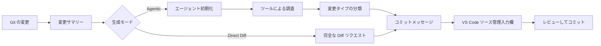

<!-- markdownlint-disable MD001 MD013 MD026 MD033 MD036 MD041 -->

<div align="center">


# Commit-Copilot

### 差分の要約にとどまらず、コードの文脈を真に理解する Agentic コミットメッセージ生成ツール。

Commit-Copilot は、自律型 AI エージェントがマルチステップでリポジトリを調査し、厳格な Conventional Commits（コンベンショナル・コミット）規約に基づいて変更を分類し、洗練されたコミットメッセージを VS Code のソース管理（Source Control）入力欄に直接書き込む拡張機能です。

主要なクラウド LLM（Gemini、OpenAI、Anthropic Claude、DeepSeek）、プライバシーを重視したローカル Ollama モデル、および各種カスタムエンドポイント（OpenAI および Anthropic 互換 API 形式）とシームレスに連携します。

[](https://marketplace.visualstudio.com/items?itemName=JeremySu0818.commit-copilot)
[](https://open-vsx.org/extension/JeremySu0818/commit-copilot)
[](https://open-vsx.org/extension/JeremySu0818/commit-copilot)
[](#システム要件)
[](#開発ガイド)
[](#conventional-commits-分類規約)
[](../../LICENSE)

**エージェント調査 · 9 つの組み込みプロバイダー · カスタム互換エンドポイント · ローカル Ollama 対応 · 20 言語対応**

<p align="center">
  <b>翻訳:</b>
  <a href="https://github.com/JeremySu0818/Commit-Copilot#readme">English</a> |
  <a href="https://github.com/JeremySu0818/Commit-Copilot/blob/main/docs/readme/README-zh-tw.md">繁體中文</a> |
  <a href="https://github.com/JeremySu0818/Commit-Copilot/blob/main/docs/readme/README-zh-cn.md">简体中文</a> |
  <a href="https://github.com/JeremySu0818/Commit-Copilot/blob/main/docs/readme/README-ja.md">日本語</a> |
  <a href="https://github.com/JeremySu0818/Commit-Copilot/blob/main/docs/readme/README-ko.md">한국어</a> |
  <a href="https://github.com/JeremySu0818/Commit-Copilot/blob/main/docs/readme/README-de.md">Deutsch</a> |
  <a href="https://github.com/JeremySu0818/Commit-Copilot/blob/main/docs/readme/README-fr.md">Français</a> |
  <a href="https://github.com/JeremySu0818/Commit-Copilot/blob/main/docs/readme/README-es.md">Español</a> |
  <a href="https://github.com/JeremySu0818/Commit-Copilot/blob/main/docs/readme/README-pt-br.md">Português (Brasil)</a> |
  <a href="https://github.com/JeremySu0818/Commit-Copilot/blob/main/docs/readme/README-ru.md">Русский</a> |
  <a href="https://github.com/JeremySu0818/Commit-Copilot/blob/main/docs/readme/README-it.md">Italiano</a> |
  <a href="https://github.com/JeremySu0818/Commit-Copilot/blob/main/docs/readme/README-nl.md">Nederlands</a> |
  <a href="https://github.com/JeremySu0818/Commit-Copilot/blob/main/docs/readme/README-pl.md">Polski</a> |
  <a href="https://github.com/JeremySu0818/Commit-Copilot/blob/main/docs/readme/README-tr.md">Türkçe</a> |
  <a href="https://github.com/JeremySu0818/Commit-Copilot/blob/main/docs/readme/README-vi.md">Tiếng Việt</a> |
  <a href="https://github.com/JeremySu0818/Commit-Copilot/blob/main/docs/readme/README-id.md">Bahasa Indonesia</a> |
  <a href="https://github.com/JeremySu0818/Commit-Copilot/blob/main/docs/readme/README-hu.md">Magyar</a> |
  <a href="https://github.com/JeremySu0818/Commit-Copilot/blob/main/docs/readme/README-cs.md">Čeština</a> |
  <a href="https://github.com/JeremySu0818/Commit-Copilot/blob/main/docs/readme/README-hi.md">हिन्दी</a> |
  <a href="https://github.com/JeremySu0818/Commit-Copilot/blob/main/docs/readme/README-ar.md">العربية</a>
</p>

</div>

---

## なぜ Commit-Copilot なのか？

一般的な AI コミットツールの多くは、生の diff をそのままモデルに送信し、1 行の適切な要約が出力されることを期待するだけです。

Commit-Copilot はまったく異なるアプローチを採用しています。

まず軽量な変更メタデータから開始し、自律エージェントが必要な調査項目を判断します。差分（diff）、ファイル全体の内容、コードのシンボル構造、構文上の参照関係、プロジェクト全体の文字列パターン、直近のコミット履歴のスタイルなどを調べます。変更の意図と影響範囲を十分に理解した上で初めて、精密な分類を行いメッセージを生成します。

| 機能特性                                                         | 一般的な Diff 直渡しツール | Commit-Copilot |
| ---------------------------------------------------------------- | :------------------------: | :------------: |
| 巨大な差分（Diff）全体を即座に読み取る                           |            はい            | 任意（選択可） |
| 関連ファイルを厳選して自律調査                                   |           いいえ           |      はい      |
| コード構造とアウトラインを理解                                   |           限定的           |      はい      |
| LSP を通じてシンボル参照と影響範囲を追跡                         |           いいえ           |      はい      |
| プロジェクト全体の暗黙的な文字列・設定の関連を検索               |           いいえ           |      はい      |
| 直近のコミットスタイルから学習                                   |          ほぼなし          |      はい      |
| Git インデックス（ステージ状態）を意識した精密分析               |          ほぼなし          |      はい      |
| ローカルモデルと非ネイティブ Tool Calling ワークフローをサポート |           限定的           |      はい      |
| 厳格なコミットタイプの境界ルールを適用                           |         モデル依存         |      はい      |
| 同意なしに自動ステージングを行わない                             |         ツール依存         |      はい      |

> [!TIP]
> 最高の精度と文脈理解を求める場合は **Agentic** モードを使用してください。深い調査よりも生成速度を最優先する場合は **Direct Diff** モードを使用してください。

---

## 主な特長

<table>
<tr>
<td width="50%" valign="top">

<h3>リポジトリ認識エージェント</h3>

エージェントはファイル名、変更タイプ、行数増減、プロジェクト構造から開始し、変更を理解するために必要な調査ツールを自律的に選択します。

</td>
<td width="50%" valign="top">

<h3>Git インデックスの正確性</h3>

ステージされた変更（Staged）に対しては、Git インデックスの内容を優先して読み取ります。LSP 参照分析もステージ状態から再構築された一時ワークスペース上で実行されます。

</td>
</tr>
<tr>
<td width="50%" valign="top">

<h3>多様なプロバイダーへのネイティブ対応</h3>

Google Gemini、OpenAI、Anthropic Claude、xAI Grok、Groq、OpenRouter、DeepSeek、Alibaba Qwen（通義千問）、Ollama、および各種カスタム互換エンドポイントをサポートしています。

</td>
<td width="50%" valign="top">

<h3>厳格な Conventional Commits</h3>

全 11 種類の Conventional Commit タイプに対応し、優先順位に基づく明確な分類ルールと境界指引を適用します。Scope、Body、Footer、Gitmoji は個別に設定可能です。

</td>
</tr>
<tr>
<td width="50%" valign="top">

<h3>ローカルモデル向けエージェントワークフロー</h3>

Commit-Copilot 独自の内蔵テキストツールプロトコルにより、ネイティブな Tool Calling をサポートしていない Ollama ローカルモデルでもマルチステップ調査を実行できます。

</td>
<td width="50%" valign="top">

<h3>安全なレビュー優先ワークフロー</h3>

生成されたメッセージは VS Code のソース管理（SCM）入力欄に書き込まれます。ステージング、編集、最終コミットの決定権は常にユーザーにあります。

</td>
</tr>
</table>

---

## 目次

- [動作の仕組み](#動作の仕組み)
- [エージェントツール](#エージェントツール)
- [機能一覧](#機能一覧)
- [対応プロバイダー](#対応プロバイダー)
- [システム要件](#システム要件)
- [インストール](#インストール)
- [設定方法](#設定方法)
- [使用方法](#使用方法)
- [Conventional Commits 分類規約](#conventional-commits-分類規約)
- [変更検出メカニズム](#変更検出メカニズム)
- [多言語対応](#多言語対応)
- [セキュリティとプライバシー](#セキュリティとプライバシー)
- [開発ガイド](#開発ガイド)
- [テスト](#テスト)
- [よくある質問（FAQ）](#よくある質問faq)
- [コントリビューション](#コントリビューション)
- [ライセンス](#ライセンス)

---

## 動作の仕組み



### Agentic 生成ワークフロー

1. **変更メタデータの収集**
   Commit-Copilot はファイル名、変更種別、行数、プロジェクト構造ツリーを収集します。

2. **エージェントの初期化**
   モデルは構造化サマリーと自律生成ガイドラインを受け取ります。この段階では生の巨大な diff は送信されません。

3. **ツールによる調査**
   エージェントは必要に応じて自律的にツールを呼び出し、有用と判断した文脈のみを取得します。

4. **変更タイプの分類**
   優先順位ルールに従って Conventional Commit タイプを決定します。Scope の出力が有効な場合は、影響を受けるモジュールや領域も特定します。

5. **コミットメッセージの生成**
   最終的なメッセージがソース管理（Source Control）入力欄に書き込まれ、レビューや微調整が行えます。

> [!NOTE]
> **ハイブリッド生成（Hybrid Generation）** が有効な場合、ソース管理入力欄にある既存のテキストは表現や意図の参考用下書きとしてのみ扱われます。下書き内に含まれる指示文が生成ルールを上書きすることはありません。

### Direct Diff ワークフロー

Direct Diff モードは調査ループをスキップし、選択されたモデルに完全な diff を 1 回のリクエストで直接送信します。生成が高速で、すべてのプロバイダーで利用でき、小規模または自明な変更に適しています。

---

## エージェントツール

エージェントは複数の調査ステップにわたって以下のツールを組み合わせて使用できます：

| ツール名               | 用途                                                                                                    |
| ---------------------- | ------------------------------------------------------------------------------------------------------- |
| `get_diff`             | 1 つまたは複数の指定されたファイルの完全かつ正確な差分（diff）を取得します。                            |
| `read_file`            | ファイルの内容を行番号範囲指定付きで読み取ります。ステージされた変更には Git インデックスを優先します。 |
| `get_file_outline`     | 関数、クラス、インターフェース、エクスポートなどの構造アウトラインを取得します。                        |
| `find_references`      | VS Code の Language Server Protocol（LSP）を利用して構文認識に基づいたシンボル参照を検索します。        |
| `get_recent_commits`   | 直近のコミットメッセージを読み取り、リポジトリ既存の記述スタイルを学習します。                          |
| `search_code`          | import だけでは把握できない文字列やパターンの暗黙的な関連をワークスペース全体から検索します。           |
| `write_commit_message` | 最終的な構造化コミットメッセージを提出して調査を完了します。                                            |

Gemini、Anthropic、OpenAI 互換ルートではネイティブな構造化 Tool Calling が使用されます。Ollama では同等のテキストプロトコルが使用され、バッチ呼び出し、アプリ割り当て ID、構造化結果、個別エラー処理、最終提出が完全にサポートされています。

`get_diff` は単一の `path` または空でない `paths` 配列を受け付けます。複数ファイルの一括リクエストによりツールの往復回数を削減しつつ、要求されたすべてのファイルの完全で正確な diff を取得できます（内容の省略や要約は行われません）。

Agentic モードでは、設定で「すべての差分の取得を必須にする」を有効にできます。有効にすると、Git diff に含まれるすべての変更ファイルが単一またはバッチの `get_diff` で網羅されるまで `write_commit_message` の呼び出しが拒否されます。この設定はトークン消費と既存の動作を維持するためデフォルトでは無効になっています。

---

## 機能一覧

### 生成と高度な分析

- **Agentic モードと Direct Diff モードの 2 つの生成方式**
- **エージェントの最大ステップ数を設定可能**
- **いつでも中断可能な調査ループ**
- **自動リトライ機構**：一時的なリモート API エラーやレート制限に対して自動で再試行
- **クロスプロジェクト・パターン検索**：環境変数、イベント名、設定キーなどの文字列ベースの暗黙的関係を追跡
- **LSP 参照インパクトレーダー**：構文認識に基づいたコード変更の影響範囲を分析
- **直近コミットの傾向分析**：プロジェクトの記述規則を自動学習
- **ハイブリッド生成（Hybrid Generation）**：既存の入力テキストを安全な参考用下書きとして活用

### Git 状態認識メカニズム

- 5 つのリポジトリ状態を正確に判別：ステージ済み（Staged）、未ステージ（Unstaged）、混在（Mixed）、未追跡含む（Untracked）、未追跡のみ（Untracked-only）
- 未追跡ファイルが存在する場合、ステージングするか事前に確認
- ユーザーの明示的な同意なしに自動ステージングを実行しない
- ステージ済みファイルの検査時は Git インデックスの内容を優先
- ステージ状態の LSP 参照分析用に一時的なワークスペーススナップショットを作成
- リポジトリ状態の変更に合わせてサイドパネルをリアルタイム更新

### コミット出力制御

各構成要素を個別にオン／オフ設定可能：

- **Scope**（影響範囲）
- **Body**（詳細な変更本文）
- **Footer**（フッター／Breaking Changes 等）
- **Gitmoji プレフィックス**

デフォルト設定：

| 構成要素 | デフォルト |
| -------- | :--------: |
| Scope    |    有効    |
| Body     |    有効    |
| Footer   |    無効    |
| Gitmoji  |    無効    |

### VS Code とのシームレスな統合

以下の場所からいつでも Commit-Copilot を起動できます：

- **アクティビティバー（Activity Bar）** の専用アイコン
- **ソース管理（SCM）ナビゲーションバー** の魔法の杖アイコン
- **コマンドパレット（Command Palette）**

生成されたメッセージは標準の SCM 入力欄に自動入力され、コミット前に自由に確認・編集できます。

### プロバイダー検証とモデル管理

- 保存前にプロバイダーの実際のエンドポイントに対して API キーの有効性を事前検証
- 認証失敗、利用枠超過、接続エラー時に具体的な対処法を表示
- OpenRouter、Alibaba Qwen、Ollama、カスタムプロバイダーでモデル一覧を動的に取得
- Ollama およびカスタムプロバイダーでモデル ID の手動追加・削除に対応
- カスタムプロバイダーで OpenAI 互換および Anthropic 互換 API 形式をサポート

---

## 対応プロバイダー

| プロバイダー             | 主な特徴                                                             |
| ------------------------ | -------------------------------------------------------------------- |
| **Google Gemini**        | ネイティブ構造化ツール対応とマルチ世代 Gemini モデル群               |
| **OpenAI**               | 推論モデル、汎用モデル、軽量モデル、GPT-5 シリーズ                   |
| **Anthropic**            | Claude Haiku、Sonnet、Opus、Fable 各シリーズ                         |
| **xAI Grok**             | 推論モデルおよび通常版 Grok シリーズ                                 |
| **Groq**                 | 高速ホスティングされた MiniMax、Qwen、`gpt-oss` モデル               |
| **OpenRouter**           | 膨大な互換モデル群へのアクセスと Tool Calling 対応フィルタリング     |
| **DeepSeek**             | DeepSeek Chat、Reasoner（R1）、V4 シリーズ                           |
| **Alibaba Qwen**         | DashScope 統合による動的モデル探索（通義千問）                       |
| **Ollama**               | 動的モデル検出と内蔵テキストツールプロトコルを備えたローカルモデル   |
| **カスタムプロバイダー** | OpenAI 互換または Anthropic 互換の任意のサードパーティエンドポイント |

<details>
<summary><strong>Commit-Copilot が内蔵サポートするモデルシリーズ一覧を展開する</strong></summary>

### Google Gemini

- Gemini 2.5 Flash-Lite, Flash, Pro
- Gemini 3 Flash
- Gemini 3.1 Flash-Lite, Pro
- Gemini 3.5 Flash-Lite, Flash
- Gemini 3.6 Flash
- Gemini 3.7 Flash

### OpenAI

- o3, o3-mini
- o4-mini
- GPT-4o mini, GPT-4o
- GPT-4.1 nano, mini, GPT-4.1
- GPT-5 nano, mini, GPT-5
- GPT-5.1
- GPT-5.2
- GPT-5.4 nano, mini, GPT-5.4
- GPT-5.5
- GPT-5.6 Luna, Terra, Sol

### Anthropic

- Claude Sonnet 4, Opus 4
- Claude Opus 4.1
- Claude Haiku, Sonnet, Opus 4.5
- Claude Sonnet, Opus 4.6
- Claude Opus 4.7
- Claude Opus 4.8
- Claude Sonnet 5, Opus 5, Fable 5

### xAI Grok

- Grok 4.20（推論版および通常版）
- Grok 4.3
- Grok 4.5
- Grok 4.6

### Groq

- `gpt-oss-20B`
- `gpt-oss-120B`
- `gpt-oss-safeguard-20B`
- MiniMax M2.7
- Qwen 3.6 27b

### DeepSeek

- DeepSeek Chat
- DeepSeek R1 / Reasoner
- DeepSeek V4 Flash, Pro

> [!IMPORTANT]
> 実際に利用可能なモデルはプロバイダーのアカウント権限、リージョン、エンドポイント状況により異なります。OpenRouter、Qwen、Ollama、カスタムプロバイダーの一覧は動的に取得できます。

</details>

---

## システム要件

- **VS Code** `1.91.0` 以上
- **Git**（VS Code 内蔵の Git 拡張機能経由で利用可能）
- 以下のいずれかへのアクセス権：
  - サポート対象リモートプロバイダーの有効な API キー
  - 稼働中のローカルまたはリモート Ollama インスタンス
  - 互換性のあるカスタムエンドポイントの認証情報

開発を行う場合：

- **Node.js** `20+`
- **npm**

---

## インストール

以下のマーケットプレイスから Commit-Copilot をインストールできます：

- [**Visual Studio Code Marketplace**](https://marketplace.visualstudio.com/items?itemName=JeremySu0818.commit-copilot)
- [**Open VSX Registry**](https://open-vsx.org/extension/JeremySu0818/commit-copilot)

インストール後、VS Code で Git リポジトリを開き、アクティビティバーの **Commit Copilot** アイコンをクリックして開始します。

---

## 設定方法

### 基本設定

1. アクティビティバーから **Commit Copilot** パネルを開きます。
2. 使用するモデルプロバイダーを選択します。
3. プロバイダーの API キー、または Ollama ホスト URL を入力します。
4. **保存** をクリックします。
5. リアルタイムでの接続検証の完了を待ちます。
6. 検証成功後、使用するモデルを選択します。

> [!IMPORTANT]
> Ollama モデルの場合、生成前に拡張機能が自動的に `ollama pull` を実行してモデルを最新状態に保ち、進行状況を通知欄に表示します。モデルが既に存在する場合でもレイヤーの再ダウンロードが発生することがあります。

### 設定オプション

| オプション名                   | 初期値  | 説明                                                                                          |
| ------------------------------ | ------- | --------------------------------------------------------------------------------------------- |
| **生成モード**                 | Agentic | `Agentic` はマルチステップ調査を実行します。`Direct Diff` は差分全体を 1 回で送信します。     |
| **ハイブリッド生成**           | 無効    | SCM 入力欄の既存テキストを参照用下書きとして使用し、指示文の混入を防止します。                |
| **最大エージェントステップ数** | `0`     | 1 回の調査における最大ツール呼び出し回数を制限します。`0` で無制限になります。                |
| **スコープを含める**           | 有効    | 有効な場合、件名に Conventional Commits の Scope（影響範囲）を必須とします。                  |
| **本文を含める**               | 有効    | 有効な場合、詳細な変更説明本文を生成します。                                                  |
| **フッターを含める**           | 無効    | 有効な場合、フッター情報（Breaking Changes 等）を生成します（根拠のない情報は捏造しません）。 |
| **Gitmoji を含める**           | 無効    | 有効な場合、件名の先頭に対応する Gitmoji を 1 つ付与します。                                  |
| **拡張機能の言語**             | 自動    | VS Code の表示言語に自動追従します。手動で特定の言語に固定することも可能です。                |
| **コミットメッセージの言語**   | 英語    | 生成されるコミットメッセージの件名・本文・フッターの言語を個別に指定します。                  |

### カスタムプロバイダー

OpenAI 互換または Anthropic 互換のエンドポイントを追加するには：

1. プロバイダー設定を開きます。
2. **カスタムプロバイダーを追加** を選択します。
3. API 形式（OpenAI-compatible または Anthropic-compatible）を選択します。
4. 表示名と API Base URL を入力します。
5. プロバイダーを保存します。
6. API キーを入力して検証します。
7. 動的に取得されたリストからモデルを選択するか、**カスタムモデルの追加...** でモデル ID を手動登録します。

Anthropic 互換エンドポイントでは、最大出力トークン数（max_tokens）も指定できます。

---

## 使用方法

### 方法 A：アクティビティバーから

1. **Commit Copilot** サイドパネルを開きます。
2. リポジトリに変更（ステージ済み、未ステージ、未追跡）が存在することを確認します。
3. **コミットメッセージを生成** をクリックします。
4. 変更選択やステージングに関する確認ダイアログが表示された場合は指示に従って選択します。

### 方法 B：ソース管理ビューから

1. `Ctrl+Shift+G`（macOS は `Cmd+Shift+G`）でソース管理（SCM）を開きます。
2. ナビゲーションバー上部の Commit-Copilot 魔法の杖アイコンをクリックします。

### 方法 C：コマンドパレットから

1. コマンドパレットを開きます：
   - Windows/Linux: `Ctrl+Shift+P`
   - macOS: `Cmd+Shift+P`
2. **Commit-Copilot: Generate Commit Message** を実行します。

### レビューとコミット

生成されたメッセージはソース管理（SCM）の入力欄に自動挿入されます。

内容を確認・微調整した後、VS Code 標準のコミット操作でコミットを完了します。

---

## Conventional Commits 分類規約

Commit-Copilot は以下の 11 種類の Conventional Commit タイプを厳格にサポートしています：

| タイプ名   | 用途・適用条件                                             |
| ---------- | ---------------------------------------------------------- |
| `feat`     | ユーザー向けの新機能や機能追加                             |
| `fix`      | バグ修正や意図しない動作の修正                             |
| `docs`     | ドキュメントのみの追加・変更                               |
| `style`    | コードの動作に影響しないフォーマット・空白・スタイルの変更 |
| `refactor` | バグ修正や機能追加を含まないコードのリファクタリング       |
| `perf`     | パフォーマンスやリソース効率の向上                         |
| `test`     | テストコードの追加・更新・補強                             |
| `build`    | ビルドシステムや外部依存関係に関する変更                   |
| `ci`       | CI/CD パイプラインやワークフロー設定の変更                 |
| `chore`    | 他のタイプに当てはまらない日常的なメンテナンスタスク       |
| `revert`   | 過去のコミットの取り消し                                   |

出力メッセージは Conventional Commits 標準構文に準拠します：

```text
type(scope): 簡潔で要点を押さえた件名

変更内容とその理由を詳細に説明する本文。
```

設定に応じて、Scope、Body、Footer、Gitmoji の有無を自由に制御できます。件名の 1 行目は 72 文字以内に制限され、理想的には 50 文字程度にまとめられます。

---

## 変更検出メカニズム

Commit-Copilot はリポジトリの 5 つの状態を正確に認識します：

| 検出状態               | 動作内容                                                 |
| ---------------------- | -------------------------------------------------------- |
| **ステージ済みのみ**   | ステージ済み diff を使用し、インデックス認識ツールで分析 |
| **未ステージのみ**     | ワーキングツリーの変更内容を直接分析                     |
| **混在（Mixed）**      | どの変更セットを対象にするか確認ダイアログを表示         |
| **未ステージ＋未追跡** | 状況に応じた処理オプションを提示                         |
| **未追跡ファイルのみ** | 新規ファイルをステージして生成を開始するか確認           |

ユーザーの明示的な同意なしに自動でファイルをステージングすることはありません。

---

## 多言語対応

拡張機能の UI は VS Code の言語設定に自動追従させることも、サポートされている 20 言語のいずれかに手動で固定することもできます：

<table>
<tr>
<td><a href="README-ar.md">العربية</a></td>
<td><a href="README-cs.md">Čeština</a></td>
<td><a href="README-de.md">Deutsch</a></td>
<td><a href="../../README.md">English</a></td>
</tr>
<tr>
<td><a href="README-es.md">Español</a></td>
<td><a href="README-fr.md">Français</a></td>
<td><a href="README-hi.md">हिन्दी</a></td>
<td><a href="README-hu.md">Magyar</a></td>
</tr>
<tr>
<td><a href="README-id.md">Bahasa Indonesia</a></td>
<td><a href="README-it.md">Italiano</a></td>
<td><a href="README-ja.md">日本語</a></td>
<td><a href="README-ko.md">한국어</a></td>
</tr>
<tr>
<td><a href="README-nl.md">Nederlands</a></td>
<td><a href="README-pl.md">Polski</a></td>
<td><a href="README-pt-br.md">Português (Brasil)</a></td>
<td><a href="README-ru.md">Русский</a></td>
</tr>
<tr>
<td><a href="README-tr.md">Türkçe</a></td>
<td><a href="README-vi.md">Tiếng Việt</a></td>
<td><a href="README-zh-cn.md">简体中文</a></td>
<td><a href="README-zh-tw.md">繁體中文</a></td>
</tr>
</table>

**コミットメッセージの言語** は拡張機能の UI 言語とは独立して設定できるため、UI を日本語にしつつコミットメッセージを英語で生成することも可能です。

---

## セキュリティとプライバシー

- すべての API キーは **VS Code Secret Storage** により安全に暗号化されて保存されます
- 保存前にプロバイダーのエンドポイントに対して直接検証を行い、有効性を確認します
- ユーザーの明示的な許可なしにファイルを自動ステージングしません
- ハイブリッド生成では既存の入力テキストを信頼できない参考下書きとして扱い、プロンプトインジェクションを防止します
- リモートへのリクエストには、調査中に選択されたメタデータ、diff、特定ファイルの内容のみが含まれます
- ローカルの Ollama を使用する場合、環境構成に応じてすべての推論をローカル環境内で完結できます

> [!CAUTION]
> 機密情報やプロプライエタリなコードをリモート API に送信する前に、選択したモデルプロバイダーのデータ取り扱いポリシーを必ずご確認ください。

---

## 開発ガイド

### 依存パッケージのインストール

```bash
npm install
```

### 開発用コンパイル

```bash
npm run compile
```

TypeScript と esbuild による継続的なファイル監視・自動ビルド：

```bash
npm run watch
```

### VSIX パッケージのビルド

```bash
npm run build
```

ビルドスクリプトは依存関係の解決、VS Code パッケージングパイプラインの実行を行い、`.vsix` パッケージを生成します。

### コード品質チェック

Lint チェックの実行：

```bash
npm run lint
```

ソースファイルの自動フォーマット：

```bash
npm run format
```

フォーマットの検証（ファイルの変更なし）：

```bash
npm run check-format
```

---

## テスト

ユニットテストスイート全体の実行：

```bash
npm test
```

このコマンドは以下を順次実行します：

1. `npm run test:build`
2. `node --test --test-concurrency=1 "out/test/**/*.test.js"`

現在のテスト対象範囲：

- すべてのエージェント調査ツール：
  - `get_diff`
  - `read_file`
  - `get_file_outline`
  - `find_references`
  - `get_recent_commits`
  - `search_code`
- ネイティブ構造化ツールによるエージェント調査ループ
- Ollama テキストプロトコルによるエージェント調査ループ
- バッチ呼び出しおよびローカライズされたツールスキーマ
- 不正な形式の応答からのリカバリ処理
- 最終ツールの提出検証
- `executeToolCall` によるツールディスパッチ
- コンテキストの解析と構築
- ステージ状態ワークスペーススナップショットユーティリティ
- リトライ動作
- ローカライズされたエラーメッセージ
- メインビュープロバイダーの動作
- カスタムモデル管理
- 状態マネージャー

---

## よくある質問（FAQ）

<details>
<summary><strong>Commit-Copilot は自動で git commit を実行しますか？</strong></summary>

いいえ。生成されたメッセージを VS Code のソース管理（SCM）入力欄に書き込むだけです。ユーザー自身で確認・編集し、コミットを実行できます。

</details>

<details>
<summary><strong>エージェントはリポジトリ全体を AI に送信しますか？</strong></summary>

Agentic モードでは、初期段階で送信されるのは変更メタデータと追跡中ファイルのツリー構造のみであり、すべてのファイル内容を送信することはありません。その後、エージェントが必要に応じて特定の差分、ファイル、シンボル、検索クエリを要求します。Direct Diff モードでは、選択された変更の差分全体のみが送信されます。

</details>

<details>
<summary><strong>Ollama モデルでネイティブ Tool Calling がなくてもエージェントツールを使えますか？</strong></summary>

はい。Commit-Copilot には専用のテキストツールプロトコルが組み込まれており、Ollama ローカルモデルでもマルチステップ調査ワークフローをシームレスに実行できます。

</details>

<details>
<summary><strong>最大エージェントステップ数 = 0 はどういう意味ですか？</strong></summary>

ツール呼び出し回数の上限を解除することを意味します。0 より大きい正の整数を設定すると、最終結果を出力するまでにエージェントが実行できる調査ステップ数が制限されます。

</details>

<details>
<summary><strong>組み込みにないサードパーティ製エンドポイントは使えますか？</strong></summary>

はい。OpenAI 互換または Anthropic 互換のカスタムプロバイダーとして追加し、モデル一覧の動的取得またはモデル ID の手動登録を行って利用できます。

</details>

<details>
<summary><strong>なぜ Ollama は生成のたびに pull を実行するのですか？</strong></summary>

選択されたモデルがローカルで利用可能かつ最新であることを保証するために、生成前に `ollama pull` を実行する設計になっています。ローカルのキャッシュ状態によってはレイヤーの再確認やダウンロードが発生することがあります。

</details>

---

## コントリビューション

コミュニティからの貢献を歓迎しています。

推奨されるコントリビューション手順：

1. 目的別のブランチを作成します。
2. 変更・機能実装を行います。
3. Lint、フォーマットチェック、単元テストを実行します。
4. プルリクエスト（PR）で動機と変更内容をわかりやすく説明します。
5. 動作変更に伴う適切なテストコードを追加します。

PR 提出前の確認コマンド：

```bash
npm run lint
npm run check-format
npm test
```

バグ報告の際は、プロバイダー、モデル、生成モード、リポジトリの変更状態、関連ログ、再現手順を記載してください。API キーや機密コードは絶対に含めないでください。

---

## ライセンス

Commit-Copilot は [MIT ライセンス](../../LICENSE) のもとで公開されています。

---

<div align="center">

推測ではなく、確かな文脈を持ったコミットメッセージを求めるすべての開発者のために。

</div>
