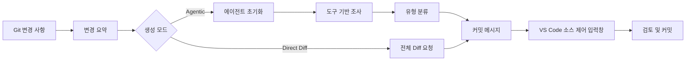

<!-- markdownlint-disable MD001 MD013 MD026 MD033 MD036 MD041 -->

<div align="center">


# Commit-Copilot

### 단순한 diff 요약을 넘어, 코드의 맥락을 진정으로 이해하는 Agentic 커밋 메시지 생성 도구.

Commit-Copilot은 자율형 AI 에이전트가 다단계로 저장소를 조사하고, 엄격한 Conventional Commits(규약 기반 커밋) 표준에 따라 변경 사항을 분류하며, 세련된 커밋 메시지를 VS Code의 소스 제어(Source Control) 입력창에 직접 작성하는 확장 프로그램입니다.

주요 클라우드 LLM(Gemini, OpenAI, Anthropic Claude, DeepSeek), 개인정보를 보호하는 로컬 Ollama 모델, 그리고 다양한 사용자 지정 엔드포인트(OpenAI 및 Anthropic 호환 API 형식)와 원활하게 연동됩니다.

[](https://marketplace.visualstudio.com/items?itemName=JeremySu0818.commit-copilot)
[](https://open-vsx.org/extension/JeremySu0818/commit-copilot)
[](https://open-vsx.org/extension/JeremySu0818/commit-copilot)
[](#시스템-요구-사항)
[](#개발-가이드)
[](#conventional-commits-분류-규칙)
[](../../LICENSE)

**에이전트 조사 · 9개 기본 제공 프로바이더 · 사용자 지정 호환 엔드포인트 · 로컬 Ollama 지원 · 20개 언어 지원**

<p align="center">
  <b>번역:</b>
  <a href="https://github.com/JeremySu0818/Commit-Copilot#readme">English</a> |
  <a href="https://github.com/JeremySu0818/Commit-Copilot/blob/main/docs/readme/README-zh-tw.md">繁體中文</a> |
  <a href="https://github.com/JeremySu0818/Commit-Copilot/blob/main/docs/readme/README-zh-cn.md">简体中文</a> |
  <a href="https://github.com/JeremySu0818/Commit-Copilot/blob/main/docs/readme/README-ja.md">日本語</a> |
  <a href="https://github.com/JeremySu0818/Commit-Copilot/blob/main/docs/readme/README-ko.md">한국어</a> |
  <a href="https://github.com/JeremySu0818/Commit-Copilot/blob/main/docs/readme/README-de.md">Deutsch</a> |
  <a href="https://github.com/JeremySu0818/Commit-Copilot/blob/main/docs/readme/README-fr.md">Français</a> |
  <a href="https://github.com/JeremySu0818/Commit-Copilot/blob/main/docs/readme/README-es.md">Español</a> |
  <a href="https://github.com/JeremySu0818/Commit-Copilot/blob/main/docs/readme/README-pt-br.md">Português (Brasil)</a> |
  <a href="https://github.com/JeremySu0818/Commit-Copilot/blob/main/docs/readme/README-ru.md">Русский</a> |
  <a href="https://github.com/JeremySu0818/Commit-Copilot/blob/main/docs/readme/README-it.md">Italiano</a> |
  <a href="https://github.com/JeremySu0818/Commit-Copilot/blob/main/docs/readme/README-nl.md">Nederlands</a> |
  <a href="https://github.com/JeremySu0818/Commit-Copilot/blob/main/docs/readme/README-pl.md">Polski</a> |
  <a href="https://github.com/JeremySu0818/Commit-Copilot/blob/main/docs/readme/README-tr.md">Türkçe</a> |
  <a href="https://github.com/JeremySu0818/Commit-Copilot/blob/main/docs/readme/README-vi.md">Tiếng Việt</a> |
  <a href="https://github.com/JeremySu0818/Commit-Copilot/blob/main/docs/readme/README-id.md">Bahasa Indonesia</a> |
  <a href="https://github.com/JeremySu0818/Commit-Copilot/blob/main/docs/readme/README-hu.md">Magyar</a> |
  <a href="https://github.com/JeremySu0818/Commit-Copilot/blob/main/docs/readme/README-cs.md">Čeština</a> |
  <a href="https://github.com/JeremySu0818/Commit-Copilot/blob/main/docs/readme/README-hi.md">हिन्दी</a> |
  <a href="https://github.com/JeremySu0818/Commit-Copilot/blob/main/docs/readme/README-ar.md">العربية</a>
</p>

</div>

---

## 왜 Commit-Copilot인가요?

시중의 대다수 AI 커밋 도구는 가공되지 않은 raw diff를 모델에 그대로 전달하고 한 줄 요약이 잘 나오기만을 기대합니다.

Commit-Copilot은 완전히 다른 방식으로 접근합니다.

가벼운 변경 메타데이터로부터 시작하여, 자율 에이전트가 어떤 정보를 심층 조사해야 할지 스스로 결정합니다. 파일별 diff, 파일 전체 내용, 코드 심볼 구조, 구문 참조 관계, 프로젝트 전반의 문자열 패턴, 그리고 최근 커밋 내역의 스타일까지 확인합니다. 변경의 의도와 영향 범위를 온전히 이해한 후에야 비로소 정밀한 분류와 완성도 높은 커밋 메시지를 생성합니다.

| 기능 특성                                          | 기본 Diff 직렬 전달 도구 | Commit-Copilot |
| -------------------------------------------------- | :----------------------: | :------------: |
| 거대한 전체 diff를 즉시 읽음                       |            예            | 선택적 (옵션)  |
| 관련 파일을 선별하여 자율적으로 조사               |          아니요          |       예       |
| 코드 구조 및 개요 이해                             |          제한적          |       예       |
| LSP를 통해 심볼 참조 및 영향 범위 추적             |          아니요          |       예       |
| 프로젝트 전반의 숨겨진 문자열/설정 관계 검색       |          아니요          |       예       |
| 최근 커밋 스타일 학습                              |        거의 없음         |       예       |
| Git 인덱스(스테이징 상태) 기반 정밀 분석           |        거의 없음         |       예       |
| 로컬 모델 및 비네이티브 Tool Calling 워크플로 지원 |          제한적          |       예       |
| 엄격한 커밋 유형 경계 규칙 적용                    |       모델에 의존        |       예       |
| 사용자 동의 없이 자동 스테이징하지 않음            |      도구마다 다름       |       예       |

> [!TIP]
> 최고의 정확도와 맥락 파악이 필요할 때는 **Agentic** 모드를 사용하세요. 심층 조사보다 생성 속도가 최우선일 때는 **Direct Diff** 모드를 사용하세요.

---

## 핵심 기능

<table>
<tr>
<td width="50%" valign="top">

<h3>저장소 인식 에이전트</h3>

에이전트는 파일 이름, 변경 유형, 줄 수 증감, 프로젝트 디렉터리 구조를 바탕으로 코드 변경을 철저히 이해하는 데 필요한 조사 도구를 자율적으로 선택합니다.

</td>
<td width="50%" valign="top">

<h3>Git 인덱스 정확도</h3>

스테이징된(Staged) 변경 사항의 경우 Git 인덱스에서 파일 내용을 우선적으로 읽어오며, LSP 참조 분석은 스테이징 상태로 재구성된 임시 워크스페이스에서 수행됩니다.

</td>
</tr>
<tr>
<td width="50%" valign="top">

<h3>다양한 프로바이더 기본 지원</h3>

Google Gemini, OpenAI, Anthropic Claude, xAI Grok, Groq, OpenRouter, DeepSeek, Alibaba Qwen(통의천문), Ollama 및 모든 사용자 지정 호환 엔드포인트를 지원합니다.

</td>
<td width="50%" valign="top">

<h3>엄격한 Conventional Commits</h3>

총 11가지 Conventional Commit 유형을 완벽히 지원하며, 우선순위 기반 분류 규칙과 명확한 유형 경계 가이드를 적용합니다. Scope, Body, Footer, Gitmoji는 개별적으로 설정할 수 있습니다.

</td>
</tr>
<tr>
<td width="50%" valign="top">

<h3>로컬 모델 전용 에이전트 워크플로</h3>

Commit-Copilot의 내장 텍스트 도구 프로토콜을 통해 네이티브 Tool Calling을 지원하지 않는 Ollama 로컬 모델에서도 다단계 조사 워크플로를 온전히 수행할 수 있습니다.

</td>
<td width="50%" valign="top">

<h3>안전한 검토 우선 워크플로</h3>

생성된 메시지는 VS Code의 소스 제어(SCM) 입력창에 자동으로 입력됩니다. 스테이징, 편집, 최종 커밋에 대한 모든 통제권은 사용자에게 있습니다.

</td>
</tr>
</table>

---

## 목차

- [동작 원리](#동작-원리)
- [에이전트 도구](#에이전트-도구)
- [기능 목록](#기능-목록)
- [지원 프로바이더](#지원-프로바이더)
- [시스템 요구 사항](#시스템-요구-사항)
- [설치 방법](#설치-방법)
- [설정 방법](#설정-방법)
- [사용 방법](#사용-방법)
- [Conventional Commits 분류 규칙](#conventional-commits-분류-규칙)
- [변경 사항 감지 메커니즘](#변경-사항-감지-메커니즘)
- [다국어 지원](#다국어-지원)
- [보안 및 개인정보 보호](#보안-및-개인정보-보호)
- [개발 가이드](#개발-가이드)
- [테스트](#테스트)
- [자주 묻는 질문 (FAQ)](#자주-묻는-질문-faq)
- [기여하기](#기여하기)
- [라이선스](#라이선스)

---

## 동작 원리



### Agentic 생성 워크플로

1. **변경 메타데이터 수집**
   Commit-Copilot이 파일 목록, 변경 유형, 줄 수 변동, 프로젝트 구조 트리를 수집합니다.

2. **에이전트 초기화**
   모델은 구조화된 요약과 자율 생성 지침을 수신합니다. 이 단계에서는 대용량 raw diff를 전송하지 않습니다.

3. **도구를 활용한 심층 조사**
   에이전트는 필요에 따라 도구를 자율적으로 호출하여 유용하다고 판단한 핵심 맥락만을 요청합니다.

4. **변경 유형 분류**
   우선순위 규칙에 따라 Conventional Commit 유형을 결정합니다. Scope 출력이 활성화된 경우 영향을 받는 모듈이나 영역도 지정합니다.

5. **커밋 메시지 생성**
   최종 메시지가 소스 제어(Source Control) 입력창에 작성되어 검토 및 수정이 가능해집니다.

> [!NOTE]
> **하이브리드 생성(Hybrid Generation)** 이 활성화된 경우, 소스 제어 입력창의 기존 텍스트는 어조와 의도를 파악하기 위한 참조 초안으로만 사용됩니다. 초안 내부의 프롬프트성 지시문이 시스템 생성 규칙을 재정의할 수 없습니다.

### Direct Diff 워크플로

Direct Diff 모드는 다단계 조사 루프를 생략하고 선택한 모델에 전체 diff를 단일 요청으로 직접 전송합니다. 생성 속도가 빠르고 모든 프로바이더에서 사용 가능하며 단순하거나 명확한 변경 사항에 적합합니다.

---

## 에이전트 도구

에이전트는 다단계 조사 과정에서 다음 도구들을 조합하여 사용할 수 있습니다:

| 도구 이름              | 용도                                                                                                   |
| ---------------------- | ------------------------------------------------------------------------------------------------------ |
| `get_diff`             | 단일 또는 여러 지정된 파일의 완전하고 정확한 diff를 가져옵니다.                                        |
| `read_file`            | 파일 내용을 읽으며 선택적으로 행 범위를 지정할 수 있습니다. 스테이징된 파일은 Git 인덱스를 우선합니다. |
| `get_file_outline`     | 함수, 클래스, 인터페이스, 내보내기 등의 구조적 개요를 가져옵니다.                                      |
| `find_references`      | VS Code의 Language Server Protocol(LSP)을 활용하여 구문 인식 기반의 심볼 참조를 찾습니다.              |
| `get_recent_commits`   | 최근 커밋 메시지를 읽어 저장소의 기존 작성 스타일을 학습합니다.                                        |
| `search_code`          | import만으로는 파악할 수 없는 문자열이나 패턴의 암시적 관계를 워크스페이스 전체에서 검색합니다.        |
| `write_commit_message` | 최종 구조화된 커밋 메시지를 제출하고 조사를 완료합니다.                                                |

Gemini, Anthropic, OpenAI 호환 라우트는 네이티브 구조화된 Tool Calling을 사용합니다. Ollama는 배치 호출, 앱 할당 ID, 구조화된 결과, 호출별 에러 처리, 최종 제출을 온전히 지원하는 동등한 텍스트 프로토콜을 사용합니다.

`get_diff`는 단일 `path` 또는 비어 있지 않은 `paths` 배열을 지원합니다. 여러 파일을 한 번에 요청하면 도구 왕복 횟수를 크게 줄이면서도 요청된 모든 파일의 완전하고 정확한 diff를 온전히 반환합니다(내용 요약이나 생략 없음).

Agentic 모드에서는 설정에서 "모든 diff 조회 필수" 옵션을 활성화할 수 있습니다. 활성화되면 변경된 모든 파일에 대해 단일 또는 배치 `get_diff` 조회가 완료될 때까지 `write_commit_message` 호출이 제한됩니다. 이 설정은 토큰 사용량과 기존 속도를 유지하기 위해 기본적으로 비활성화되어 있습니다.

---

## 기능 목록

### 생성 및 심층 분석

- **Agentic 및 Direct Diff 듀얼 생성 모드**
- **최대 에이전트 단계 수 설정 가능**
- **언제든지 중단 가능한 조사 루프**
- **자동 재시도 메커니즘**: 일시적인 원격 API 오류 및 Rate Limit 발생 시 자동 지연 재시도
- **프로젝트 전반 문자열 패턴 검색**: 환경 변수, 이벤트 이름, 구성 키 등의 암시적 관계 추적
- **LSP 참조 영향도 레이더**: 구문 인식 기반 코드 변경 영향 분석
- **최근 커밋 스타일 분석**: 프로젝트 작성 관례 자동 학습
- **하이브리드 생성(Hybrid Generation)**: 기존 입력 텍스트를 안전한 참조 초안으로 활용

### Git 상태 감지 메커니즘

- 5가지 저장소 상태 정밀 판별: 스테이징됨(Staged), 스테이징 안 됨(Unstaged), 혼합(Mixed), 추적되지 않음 포함(Untracked), 추적되지 않는 파일만 있음(Untracked-only)
- 추적되지 않는 파일이 있을 경우 스테이징 여부 사전 확인
- 사용자의 명시적 동의 없이 자동 스테이징하지 않음
- 스테이징된 파일 검사 시 Git 인덱스 내용 우선 참조
- 스테이징 상태의 LSP 참조 분석을 위한 임시 워크스페이스 스냅샷 생성
- 저장소 상태 변경 시 사이드 패널 실시간 동기화

### 커밋 출력 커스터마이징

각 요소를 독립적으로 활성화/비활성화 가능:

- **Scope** (영향 범위)
- **Body** (상세 설명 본문)
- **Footer** (바닥글 / Breaking Changes 등)
- **Gitmoji 접두사**

기본 설정값:

| 구성 요소 | 기본값 |
| --------- | :----: |
| Scope     |  켜짐  |
| Body      |  켜짐  |
| Footer    |  꺼짐  |
| Gitmoji   |  꺼짐  |

### VS Code 완벽 통합

다음 경로에서 언제든지 Commit-Copilot을 실행할 수 있습니다:

- **액티비티 바(Activity Bar)** 전용 아이콘
- **소스 제어(SCM) 내비게이션 바** 마법봉 아이콘
- **명령 팔레트(Command Palette)**

생성된 메시지는 표준 SCM 입력창에 자동 입력되어 커밋 전 자유롭게 검토하고 수정할 수 있습니다.

### 프로바이더 검증 및 모델 관리

- 저장 전 프로바이더의 실제 엔드포인트에 대해 API 키의 유효성을 실시간 검증
- 인증 실패, 할당량 초과, 연결 오류 발생 시 구체적인 해결 가이드 제공
- OpenRouter, Alibaba Qwen, Ollama, 사용자 지정 프로바이더에서 모델 목록 동적 조회
- Ollama 및 사용자 지정 프로바이더에서 모델 ID 수동 추가/삭제 지원
- 사용자 지정 프로바이더에서 OpenAI 호환 및 Anthropic 호환 API 형식 지원

---

## 지원 프로바이더

| 프로바이더                 | 주요 특징                                                        |
| -------------------------- | ---------------------------------------------------------------- |
| **Google Gemini**          | 네이티브 구조화 도구 지원 및 다세대 Gemini 모델군                |
| **OpenAI**                 | 추론 모델, 범용 모델, 소형 모델 및 GPT-5/6 시리즈                |
| **Anthropic**              | Claude Haiku, Sonnet, Opus, Fable 전 시리즈                      |
| **xAI Grok**               | 추론 및 일반 Grok 시리즈                                         |
| **Groq**                   | 초고속 호스팅 Qwen, `gpt-oss` 오픈소스 모델                      |
| **OpenRouter**             | 방대한 호환 모델 목록 및 Tool Calling 지원 스마트 필터링         |
| **DeepSeek**               | DeepSeek V4.1 Flash                                              |
| **Alibaba Qwen**           | 통의천문(DashScope) 연동 및 동적 모델 검색                       |
| **Ollama**                 | 동적 모델 목록 및 내장 텍스트 도구 프로토콜을 지원하는 로컬 모델 |
| **사용자 지정 프로바이더** | OpenAI 호환 또는 Anthropic 호환 사ード파티 엔드포인트 지원       |

<details>
<summary><strong>Commit-Copilot이 기본 지원하는 모델 시리즈 목록 펼치기</strong></summary>

### Google Gemini

- Gemini 2.5 Flash-Lite, Flash, Pro
- Gemini 3 Flash
- Gemini 3.1 Flash-Lite, Pro
- Gemini 3.5 Flash-Lite, Flash
- Gemini 3.6 Flash
- Gemini 3.7 Flash
- Gemini 3.8 Flash

### OpenAI

- o3, o3-mini
- o4-mini
- GPT-4o mini, GPT-4o
- GPT-4.1 nano, mini, GPT-4.1
- GPT-5 nano, mini, GPT-5
- GPT-5.1
- GPT-5.2
- GPT-5.4 nano, mini, GPT-5.4
- GPT-5.5
- GPT-5.6 Luna, Terra, Sol
- GPT-6 Luna, Sol, Astra
- GPT-6.1 Sol

### Anthropic

- Claude Sonnet 4, Opus 4
- Claude Opus 4.1
- Claude Haiku, Sonnet, Opus 4.5
- Claude Sonnet, Opus 4.6
- Claude Opus 4.7
- Claude Opus 4.8
- Claude Sonnet 5, Opus 5, Fable 5
- Claude Fable 5.1
- Claude Opus 5.5

### xAI Grok

- Grok 4.20 (추론 및 일반 버전)
- Grok 4.3
- Grok 4.5
- Grok 4.6
- Grok 4.7

### Groq

- `gpt-oss-20B`
- `gpt-oss-120B`
- `gpt-oss-safeguard-20B`
- Qwen 3.8 27b

### DeepSeek

- DeepSeek V4.1 Flash

> [!IMPORTANT]
> 모델의 실제 사용 가능 여부는 프로바이더 계정 권한, 지역, 엔드포인트 상태에 따라 다릅니다. OpenRouter, Qwen, Ollama, 사용자 지정 프로바이더의 모델 목록은 동적으로 가져올 수 있습니다.

</details>

---

## 시스템 요구 사항

- **VS Code** `1.91.0` 이상
- **Git** (VS Code 내장 Git 확장을 통해 접근 가능)
- 다음 중 하나의 접근 권한:
  - 지원되는 원격 프로바이더의 유효한 API 키
  - 실행 중인 로컬 또는 원격 Ollama 인스턴스
  - 호환되는 사용자 지정 엔드포인트의 인증 정보

로컬 개발 환경:

- **Node.js** `20+`
- **npm**

---

## 설치 방법

다음 마켓플레이스에서 Commit-Copilot을 설치할 수 있습니다:

- [**Visual Studio Code Marketplace**](https://marketplace.visualstudio.com/items?itemName=JeremySu0818.commit-copilot)
- [**Open VSX Registry**](https://open-vsx.org/extension/JeremySu0818/commit-copilot)

설치 후 VS Code에서 Git 저장소를 열고 액티비티 바의 **Commit Copilot** 아이콘을 클릭하여 시작하세요.

---

## 설정 방법

### 기본 설정

1. 액티비티 바에서 **Commit Copilot** 패널을 엽니다.
2. 사용할 모델 프로바이더를 선택합니다.
3. 프로바이더 API 키 또는 Ollama 호스트 URL을 입력합니다.
4. **저장**을 클릭합니다.
5. 실시간 연결 및 자격 증명 검증 완료를 기다립니다.
6. 검증 완료 후 사용할 모델을 선택합니다.

> [!IMPORTANT]
> Ollama 모델의 경우, 확장이 생성 전 항상 자동으로 `ollama pull`을 실행하여 모델을 최신 상태로 유지하며 알림 영역에 진행률을 표시합니다. 로컬에 모델이 이미 있더라도 레이어 재다운로드가 발생할 수 있습니다.

### 옵션 구성

| 설정 옵션                 | 기본값  | 설명                                                                                  |
| ------------------------- | ------- | ------------------------------------------------------------------------------------- |
| **생성 모드**             | Agentic | `Agentic`은 다단계 조사를 수행합니다. `Direct Diff`는 diff 전체를 한 번에 전송합니다. |
| **하이브리드 생성**       | 꺼짐    | SCM 입력창의 기존 텍스트를 참조 초안으로 사용하며, 프롬프트 지시문은 격리합니다.      |
| **최대 에이전트 단계 수** | `0`     | 1회 조사 시 최대 도구 호출 횟수를 제한합니다. `0`은 제한 없음을 의미합니다.           |
| **스코프 포함**           | 켜짐    | 활성화 시 제목에 Conventional Commits의 Scope(영향 범위)를 필수로 포함합니다.         |
| **본문 포함**             | 켜짐    | 활성화 시 상세한 변경 설명 본문을 생성합니다.                                         |
| **푸터 포함**             | 꺼짐    | 활성화 시 바닥글 정보(Breaking Changes 등)를 생성합니다(근거 없는 정보 조작 없음).    |
| **Gitmoji 포함**          | 꺼짐    | 활성화 시 제목 앞에 알맞은 단일 Gitmoji 아이콘을 추가합니다.                          |
| **확장 언어**             | 자동    | VS Code의 표시 언어를 자동으로 따릅니다. 특정 언어로 수동 고정도 가능합니다.          |
| **커밋 메시지 언어**      | 영어    | 생성되는 커밋 메시지의 제목, 본문, 바닥글 언어를 개별적으로 설정합니다.               |

### 사용자 지정 프로바이더

OpenAI 호환 또는 Anthropic 호환 엔드포인트를 추가하려면:

1. 프로바이더 설정을 엽니다.
2. **사용자 지정 프로바이더 추가**를 선택합니다.
3. API 형식(OpenAI-compatible 또는 Anthropic-compatible)을 선택합니다.
4. 표시 이름과 API Base URL을 입력합니다.
5. 프로바이더를 저장합니다.
6. API 키를 입력하고 검증합니다.
7. 동적으로 조회된 목록에서 모델을 선택하거나, **사용자 지정 모델 추가...**를 통해 모델 ID를 수동 등록합니다.

Anthropic 호환 엔드포인트의 경우 최대 출력 토큰 수(max_tokens)도 추가로 설정할 수 있습니다.

---

## 사용 방법

### 방법 A: 액티비티 바 패널

1. **Commit Copilot** 사이드 패널을 엽니다.
2. 저장소에 스테이징됨, 스테이징 안 됨, 추적되지 않음 변경 사항이 있는지 확인합니다.
3. **Commit Message 생성**을 클릭합니다.
4. 변경 사항 선택이나 스테이징 관련 확인 창이 나타나면 지시에 따라 선택합니다.

### 방법 B: 소스 제어 뷰

1. `Ctrl+Shift+G`(macOS는 `Cmd+Shift+G`)를 눌러 소스 제어(SCM)를 엽니다.
2. 내비게이션 바 상단의 Commit-Copilot 마법봉 아이콘을 클릭합니다.

### 방법 C: 명령 팔레트

1. 명령 팔레트를 엽니다:
   - Windows/Linux: `Ctrl+Shift+P`
   - macOS: `Cmd+Shift+P`
2. **Commit-Copilot: Generate Commit Message**를 실행합니다.

### 검토 및 커밋

생성된 메시지는 소스 제어(SCM) 입력창에 자동으로 채워집니다.

메시지를 자유롭게 검토하고 수정한 후, VS Code 표준 커밋 버튼을 눌러 커밋을 완료합니다.

---

## Conventional Commits 분류 규칙

Commit-Copilot은 다음 11가지 Conventional Commit 유형을 엄격히 지원합니다:

| 유형 이름  | 적용 대상 및 상황                                           |
| ---------- | ----------------------------------------------------------- |
| `feat`     | 사용자에게 표시되는 새로운 기능이나 기능 추가               |
| `fix`      | 버그 수정 및 비정상적인 동작 해결                           |
| `docs`     | 문서 관련 파일만 추가/수정                                  |
| `style`    | 코드 동작에 영향을 주지 않는 포맷, 공백, 세미콜론 등의 변경 |
| `refactor` | 버그를 고치거나 새 기능을 추가하지 않는 코드 구조 개선      |
| `perf`     | 성능 및 리소스 효율 향상                                    |
| `test`     | 테스트 코드 추가, 수정, 보완                                |
| `build`    | 빌드 시스템 또는 외부 종속성에 영향을 주는 변경             |
| `ci`       | 지속적 통합(CI/CD) 및 배포 워크플로 설정 변경               |
| `chore`    | 기타 유형에 해당하지 않는 일상적인 유지보수 작업            |
| `revert`   | 이전 특정 커밋 되돌리기                                     |

출력 형식은 Conventional Commits 표준 구문을 따릅니다:

```text
type(scope): 간결하고 명확한 제목 설명

무엇이 왜 변경되었는지 상세히 설명하는 본문.
```

설정에 따라 Scope, Body, Footer, Gitmoji 포함 여부를 자유롭게 결정할 수 있습니다. 첫 번째 제목 줄은 최대 72자로 제한되며, 가급적 50자 이내로 간결하게 작성됩니다.

---

## 변경 사항 감지 메커니즘

Commit-Copilot은 5가지의 서로 다른 Git 저장소 상태를 정확히 인식합니다:

| 감지 상태                      | 동작 방식                                          |
| ------------------------------ | -------------------------------------------------- |
| **스테이징된 변경만 있음**     | 스테이징된 diff를 사용하고 인덱스 인식 도구로 분석 |
| **스테이징 안 된 변경만 있음** | 작업 트리의 현재 변경 사항을 직접 분석             |
| **혼합된 변경(Mixed)**         | 처리할 변경 범위를 선택하도록 팝업으로 안내        |
| **스테이징 안 됨 + 미추적**    | 상황에 맞는 처리 옵션 제공                         |
| **미추적 파일만 있음**         | 새 파일을 스테이징하고 생성을 시작할지 확인        |

사용자의 명시적 동의 없이는 어떤 파일도 자동으로 스테이징하지 않습니다.

---

## 다국어 지원

확장 프로그램 UI는 VS Code의 언어 설정을 자동으로 따르거나 지원되는 20개 언어 중 하나로 수동 고정할 수 있습니다:

<table>
<tr>
<td><a href="README-ar.md">العربية</a></td>
<td><a href="README-cs.md">Čeština</a></td>
<td><a href="README-de.md">Deutsch</a></td>
<td><a href="../../README.md">English</a></td>
</tr>
<tr>
<td><a href="README-es.md">Español</a></td>
<td><a href="README-fr.md">Français</a></td>
<td><a href="README-hi.md">हिन्दी</a></td>
<td><a href="README-hu.md">Magyar</a></td>
</tr>
<tr>
<td><a href="README-id.md">Bahasa Indonesia</a></td>
<td><a href="README-it.md">Italiano</a></td>
<td><a href="README-ja.md">日本語</a></td>
<td><a href="README-ko.md">한국어</a></td>
</tr>
<tr>
<td><a href="README-nl.md">Nederlands</a></td>
<td><a href="README-pl.md">Polski</a></td>
<td><a href="README-pt-br.md">Português (Brasil)</a></td>
<td><a href="README-ru.md">Русский</a></td>
</tr>
<tr>
<td><a href="README-tr.md">Türkçe</a></td>
<td><a href="README-vi.md">Tiếng Việt</a></td>
<td><a href="README-zh-cn.md">简体中文</a></td>
<td><a href="README-zh-tw.md">繁體中文</a></td>
</tr>
</table>

**커밋 메시지 언어**는 확장 프로그램 UI 언어와 독립적으로 구성되므로, UI는 한국어로 사용하면서 생성되는 커밋 메시지는 영어로 유지할 수 있습니다.

---

## 보안 및 개인정보 보호

- 모든 API 키는 **VS Code Secret Storage**를 통해 안전하게 암호화되어 저장됩니다
- 저장 전 프로바이더 엔드포인트에 직접 유효성을 검증하여 올바른 키인지 확인합니다
- 사용자 동의 없이 임의로 파일을 스테이징하지 않습니다
- 하이브리드 생성은 기존 입력창 텍스트를 신뢰할 수 없는 참조 초안으로 취급하여 프롬프트 인젝션을 방지합니다
- 원격 요청에는 조사 과정에서 선택된 코드 메타데이터, diff, 특정 파일 내용만 포함됩니다
- 로컬 Ollama를 사용할 경우 구성에 따라 모든 추론을 로컬 환경 내에서 안전하게 유지할 수 있습니다

> [!CAUTION]
> 기밀 정보나 소유권이 있는 코드를 원격 API에 전송하기 전에 선택한 모델 프로바이더의 데이터 처리 정책을 반드시 검토하세요.

---

## 개발 가이드

### 종속성 설치

```bash
npm install
```

### 개발용 컴파일

```bash
npm run compile
```

TypeScript 및 esbuild를 통한 지속적인 파일 감시 빌드:

```bash
npm run watch
```

### VSIX 패키지 빌드

```bash
npm run build
```

빌드 스크립트는 종속성 설치, VS Code 패키징 파이프라인 실행을 거쳐 `.vsix` 설치 파일을 생성합니다.

### 코드 품질 검사

Lint 검사 실행:

```bash
npm run lint
```

소스 파일 포맷팅:

```bash
npm run format
```

포맷팅 검증(파일 수정 없음):

```bash
npm run check-format
```

---

## 테스트

전체 단위 테스트 스위트 실행:

```bash
npm test
```

이 명령어는 다음 단계를 순차적으로 실행합니다:

1. `npm run test:build`
2. `node --test --test-concurrency=1 "out/test/**/*.test.js"`

현재 테스트 범위:

- 모든 에이전트 조사 도구:
  - `get_diff`
  - `read_file`
  - `get_file_outline`
  - `find_references`
  - `get_recent_commits`
  - `search_code`
- 네이티브 구조화 도구 기반 에이전트 조사 루프
- Ollama 텍스트 프로토콜 기반 에이전트 조사 루프
- 배치 도구 호출 및 지역화된 도구 스키마
- 잘못된 형식의 응답 복구 메커니즘
- 최종 도구 제출 검증
- `executeToolCall`을 통한 도구 디스패치
- 컨텍스트 파싱 및 구성
- 스테이징 작업 공간 스냅샷 유틸리티
- API 자동 재시도 동작
- 지역화된 오류 메시지
- Main View Provider 동작
- 사용자 지정 모델 관리
- 상태 관리자

---

## 자주 묻는 질문 (FAQ)

<details>
<summary><strong>Commit-Copilot이 자동으로 git commit을 실행하나요?</strong></summary>

아니요. 생성된 커밋 메시지를 VS Code의 소스 제어(SCM) 입력창에 입력할 뿐입니다. 사용자가 직접 검토하고 수정한 후 커밋할 수 있습니다.

</details>

<details>
<summary><strong>에이전트가 내 전체 저장소를 AI에 전송하나요?</strong></summary>

Agentic 모드에서는 초기 단계에서 변경 메타데이터와 추적 중인 파일 트리만 전송하며 모든 파일 내용을 미리 보내지 않습니다. 이후 에이전트의 조사 필요에 따라 특정 파일의 diff, 내용, 심볼, 검색 쿼리를 요청합니다. Direct Diff 모드는 선택된 변경 사항의 전체 diff만 전송합니다.

</details>

<details>
<summary><strong>Ollama 모델에 네이티브 Tool Calling이 없어도 에이전트 도구를 쓸 수 있나요?</strong></summary>

네. Commit-Copilot에는 전용 텍스트 도구 프로토콜이 내장되어 있어 Ollama 로컬 모델에서도 다단계 조사 워크플로를 원활하게 수행할 수 있습니다.

</details>

<details>
<summary><strong>최대 에이전트 단계 수 = 0은 무슨 의미인가요?</strong></summary>

도구 호출 횟수의 상한을 없앰을 의미합니다. 0보다 큰 양의 정수를 설정하면 에이전트가 최종 결과를 출력하기 전까지 수행할 수 있는 최대 조사 단계 수가 제한됩니다.

</details>

<details>
<summary><strong>기본 제공되지 않는 서드파티 엔드포인트도 사용할 수 있나요?</strong></summary>

네. OpenAI 호환 또는 Anthropic 호환 사용자 지정 프로바이더로 추가한 후 모델 목록을 동적으로 가져오거나 모델 ID를 수동으로 등록하여 사용할 수 있습니다.

</details>

<details>
<summary><strong>왜 Ollama는 생성할 때마다 pull을 실행하나요?</strong></summary>

선택된 모델이 로컬 환경에서 사용 가능하고 최신 버전인지 확인하기 위해 매 생성 전 `ollama pull`을 실행하도록 설계되었습니다. 로컬 캐시 상태에 따라 레이어 재확인 또는 다운로드가 진행될 수 있습니다.

</details>

---

## 기여하기

커뮤니티의 기여를 언제나 환영합니다!

권장하는 기여 절차:

1. 기능별 전용 브랜치를 생성합니다.
2. 코드 변경 및 개발을 진행합니다.
3. Lint, 포맷팅 검사 및 단위 테스트를 실행합니다.
4. Pull Request에서 변경 동기와 동작을 명확히 설명합니다.
5. 동작 변경에 대한 적절한 테스트 코드를 추가합니다.

PR 제출 전 확인 명령어:

```bash
npm run lint
npm run check-format
npm test
```

버그를 제보할 때는 프로바이더, 모델, 생성 모드, 저장소 변경 상태, 관련 로그 및 재현 단계를 함께 작성해 주세요. API 키나 기밀 코드는 절대 포함하지 마세요.

---

## 라이선스

Commit-Copilot은 [MIT 라이선스](../../LICENSE)에 따라 오픈소스로 배포됩니다.

---

<div align="center">

단순한 추측이 아닌, 명확한 맥락이 담긴 커밋 메시지를 원하는 모든 개발자를 위해.

</div>
