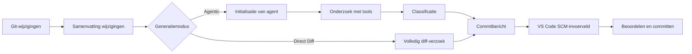

<!-- markdownlint-disable MD001 MD013 MD026 MD033 MD036 MD041 -->

<div align="center">


# Commit-Copilot

### Agentische commitberichten die uw code begrijpen — niet alleen uw diff.

Commit-Copilot is een VS Code-extensie die uw repository onderzoekt met een meerstaps AI-agent, wijzigingen classificeert volgens strikte Conventional Commits-regels en verzorgde commitberichten rechtstreeks in Source Control schrijft.

Het werkt naadloos samen met toonaangevende cloud-LLM's (Gemini, OpenAI, Anthropic Claude, DeepSeek), privacygerichte lokale Ollama-modellen en aangepaste eindpunten (OpenAI- en Anthropic-compatibele indelingen).

[](https://marketplace.visualstudio.com/items?itemName=JeremySu0818.commit-copilot)
[](https://open-vsx.org/extension/JeremySu0818/commit-copilot)
[](https://open-vsx.org/extension/JeremySu0818/commit-copilot)
[](#vereisten)
[](#ontwikkeling)
[](#conventionele-commit-classificatie)
[](../../LICENSE)

**Agentisch onderzoek · 9 ingebouwde providers · Aangepaste eindpunten · Lokale Ollama-ondersteuning · 20 talen**

<p align="center">
  <b>Vertalingen:</b>
  <a href="https://github.com/JeremySu0818/Commit-Copilot#readme">English</a> |
  <a href="https://github.com/JeremySu0818/Commit-Copilot/blob/main/docs/readme/README-zh-tw.md">繁體中文</a> |
  <a href="https://github.com/JeremySu0818/Commit-Copilot/blob/main/docs/readme/README-zh-cn.md">简体中文</a> |
  <a href="https://github.com/JeremySu0818/Commit-Copilot/blob/main/docs/readme/README-ja.md">日本語</a> |
  <a href="https://github.com/JeremySu0818/Commit-Copilot/blob/main/docs/readme/README-ko.md">한국어</a> |
  <a href="https://github.com/JeremySu0818/Commit-Copilot/blob/main/docs/readme/README-de.md">Deutsch</a> |
  <a href="https://github.com/JeremySu0818/Commit-Copilot/blob/main/docs/readme/README-fr.md">Français</a> |
  <a href="https://github.com/JeremySu0818/Commit-Copilot/blob/main/docs/readme/README-es.md">Español</a> |
  <a href="https://github.com/JeremySu0818/Commit-Copilot/blob/main/docs/readme/README-pt-br.md">Português (Brasil)</a> |
  <a href="https://github.com/JeremySu0818/Commit-Copilot/blob/main/docs/readme/README-ru.md">Русский</a> |
  <a href="https://github.com/JeremySu0818/Commit-Copilot/blob/main/docs/readme/README-it.md">Italiano</a> |
  <a href="https://github.com/JeremySu0818/Commit-Copilot/blob/main/docs/readme/README-nl.md">Nederlands</a> |
  <a href="https://github.com/JeremySu0818/Commit-Copilot/blob/main/docs/readme/README-pl.md">Polski</a> |
  <a href="https://github.com/JeremySu0818/Commit-Copilot/blob/main/docs/readme/README-tr.md">Türkçe</a> |
  <a href="https://github.com/JeremySu0818/Commit-Copilot/blob/main/docs/readme/README-vi.md">Tiếng Việt</a> |
  <a href="https://github.com/JeremySu0818/Commit-Copilot/blob/main/docs/readme/README-id.md">Bahasa Indonesia</a> |
  <a href="https://github.com/JeremySu0818/Commit-Copilot/blob/main/docs/readme/README-hu.md">Magyar</a> |
  <a href="https://github.com/JeremySu0818/Commit-Copilot/blob/main/docs/readme/README-cs.md">Čeština</a> |
  <a href="https://github.com/JeremySu0818/Commit-Copilot/blob/main/docs/readme/README-hi.md">हिन्दी</a> |
  <a href="https://github.com/JeremySu0818/Commit-Copilot/blob/main/docs/readme/README-ar.md">العربية</a>
</p>

</div>

---

## Waarom Commit-Copilot?

De meeste AI-commithulpprogramma's sturen een ruwe diff naar een model en hopen op een goede samenvatting van één regel.

Commit-Copilot kiest voor een geheel andere aanpak.

Het begint met lichte metagegevens over wijzigingen en laat vervolgens een autonome agent bepalen wat er moet worden geïnspecteerd: diffs, bestandsinhoud, symbolen, referenties, projectbrede patronen en recente commits. Pas na grondig begrip van de wijziging wordt deze geclassificeerd en het bericht gegenereerd.

| Functionaliteit                                          | Eenvoudige diff-naar-prompt tools | Commit-Copilot |
| -------------------------------------------------------- | :-------------------------------: | :------------: |
| Leest de volledige diff onmiddellijk                     |                Ja                 |   Optioneel    |
| Onderzoekt selectief relevante bestanden                 |                Nee                |       Ja       |
| Begrijpt de codestructuur                                |              Beperkt              |       Ja       |
| Vindt symboolreferenties via LSP                         |                Nee                |       Ja       |
| Doorzoekt verborgen tekenreeks-/configuratierelaties     |                Nee                |       Ja       |
| Leert van de stijl van recente commits                   |              Zelden               |       Ja       |
| Gebruikt nauwkeurige index-gebaseerde (staged) analyse   |              Zelden               |       Ja       |
| Ondersteunt native en lokale agent-workflows             |              Beperkt              |       Ja       |
| Hanteert strikte grenzen voor committypes                |         Modelafhankelijk          |       Ja       |
| Voegt nooit bestanden toe aan staging zonder toestemming |             Varieert              |       Ja       |

> [!TIP]
> Gebruik de **Agentic**-modus voor maximale nauwkeurigheid en context. Gebruik de **Direct Diff**-modus wanneer snelheid belangrijker is dan diepgaand onderzoek.

---

## Belangrijkste kenmerken

<table>
<tr>
<td width="50%" valign="top">

<h3>Repository-bewuste agent</h3>

De agent start met bestandsnamen, wijzigingstypen, regelaantallen en projectstructuur – en kiest vervolgens zelfstandig de tools die nodig zijn om de wijziging te begrijpen.

</td>
<td width="50%" valign="top">

<h3>Git-index nauwkeurigheid</h3>

Voor gestagede wijzigingen geven repository-tools prioriteit aan inhoud uit de Git-index. LSP-referentieanalyse gebruikt een tijdelijke werkomgeving die is gereconstrueerd uit de gestagede toestand.

</td>
</tr>
<tr>
<td width="50%" valign="top">

<h3>Multi-provider van opzet</h3>

Gebruik Google Gemini, OpenAI, Anthropic, xAI, Groq, OpenRouter, DeepSeek, Alibaba Qwen, Ollama of een aangepast compatibel eindpunt.

</td>
<td width="50%" valign="top">

<h3>Strikte Conventional Commits</h3>

De prompt ondersteunt alle 11 Conventional Commit-typen en past prioriteitsgestuurde classificatieregels toe met duidelijke typegrenzen. Scope, Body, Footer en Gitmoji zijn onafhankelijk configureerbaar.

</td>
</tr>
<tr>
<td width="50%" valign="top">

<h3>Agent-workflow voor lokale modellen</h3>

Ollama-modellen kunnen dezelfde onderzoekstools gebruiken via het ingebouwde teksttoolprotocol van Commit-Copilot — zelfs zonder native ondersteuning voor Tool Calling.

</td>
<td width="50%" valign="top">

<h3>Veilige, beoordelingsgerichte workflow</h3>

Commit-Copilot schrijft het resultaat in het invoerveld van Source Control. U behoudt de volledige controle over stagen, bewerken en definitief committen.

</td>
</tr>
</table>

---

## Inhoudsopgave

- [Hoe het werkt](#hoe-het-werkt)
- [Agent-tools](#agent-tools)
- [Functies](#functies)
- [Ondersteunde providers](#ondersteunde-providers)
- [Vereisten](#vereisten)
- [Installatie](#installatie)
- [Configuratie](#configuratie)
- [Gebruik](#gebruik)
- [Conventionele Commit-classificatie](#conventionele-commit-classificatie)
- [Wijzigingsdetectie](#wijzigingsdetectie)
- [Lokalisatie](#lokalisatie)
- [Beveiliging en privacy](#beveiliging-en-privacy)
- [Ontwikkeling](#ontwikkeling)
- [Testen](#testen)
- [Veelgestelde vragen (FAQ)](#veelgestelde-vragen-faq)
- [Bijdragen](#bijdragen)
- [Licentie](#licentie)

---

## Hoe het werkt



### Agentic-workflow

1. **Metagegevens van wijzigingen verzamelen**
   Commit-Copilot verzamelt bestandsnamen, wijzigingstypen, regelaantallen en een boomstructuur van het project.

2. **Agent initialiseren**
   Het model ontvangt de samenvatting en instructies voor autonome generatie van commitberichten. De ruwe diff-inhoud wordt initieel niet meegestuurd.

3. **Onderzoeken met tools**
   De agent inspecteert de repository selectief en vraagt alleen de context op die hij nuttig acht.

4. **Wijziging classificeren**
   Prioriteitsregels bepalen het type commit. Wanneer scope-uitvoer is ingeschakeld, selecteert de agent ook de getroffen module of het bereik.

5. **Bericht genereren**
   Het definitieve bericht wordt in het invoerveld van Source Control geschreven ter beoordeling en bewerking.

> [!NOTE]
> Wanneer **Hybride generatie** is ingeschakeld, wordt de bestaande tekst in Source Control behandeld als referentieconcept voor formulering en intentie. Instructie-achtige inhoud in dat concept kan de generatieregels niet overschrijven.

### Direct Diff-workflow

Direct Diff slaat de onderzoekscyclus over en stuurt de volledige diff in één enkel verzoek naar het geselecteerde model. Dit is sneller, beschikbaar voor elke provider en nuttig voor kleine of voor de hand liggende wijzigingen.

---

## Agent-tools

De agent kan de volgende tools combineren over meerdere onderzoekstappen:

| Tool                   | Doel                                                                                                                       |
| ---------------------- | -------------------------------------------------------------------------------------------------------------------------- |
| `get_diff`             | Haalt de exacte en volledige diff op voor één bestand of meerdere aangevraagde bestanden.                                  |
| `read_file`            | Leest bestandsinhoud, optioneel binnen een regelbereik. Bij gestagede analyses wordt inhoud uit de Git-index geprefereerd. |
| `get_file_outline`     | Geeft structurele informatie zoals functies, klassen en exports terug.                                                     |
| `find_references`      | Gebruikt het Language Server Protocol van VS Code om syntaxisbewuste symboolreferenties te lokaliseren.                    |
| `get_recent_commits`   | Leest recente commitberichten om de bestaande stijl van het project over te nemen.                                         |
| `search_code`          | Doorzoekt de werkomgeving naar tekenreeksen of patronen die imports alleen niet kunnen onthullen.                          |
| `write_commit_message` | Verzendt het definitieve gestructureerde commitbericht.                                                                    |

Gemini-, Anthropic- en OpenAI-compatibele routes gebruiken native gestructureerde tool calls. Ollama maakt gebruik van een gelijkwaardig tekstprotocol met ondersteuning voor gebundelde aanroepen, door de applicatie toegewezen call-ID's, gestructureerde resultaten, foutafhandeling per aanroep en de definitieve verzending.

`get_diff` accepteert een enkel `path` of een niet-lege array `paths`. Aanvragen voor meerdere bestanden verminderen het aantal tool-aanroepen en retourneren de volledige, exacte diff van elk aangevraagd bestand; er wordt geen inhoud samengevat of weggelaten.

Agentische generatie kan optioneel een volledige diff-dekking afdwingen. Wanneer ingeschakeld in de Instellingen, wordt `write_commit_message` geweigerd totdat elk gewijzigd bestand uit een geldige Git-diff is gedekt door een geslaagde individuele of gebundelde `get_diff`-aanroep. Deze instelling is standaard uitgeschakeld om prestaties en tokenverbruik te behouden.

---

## Functies

### Generatie en analyse

- **Agentic- en Direct Diff-generatiemodi**
- **Configureerbaar maximum aantal agentstappen**
- **Op elk moment annuleerbare onderzoekscyclus**
- **Automatische nieuwe pogingen** bij tijdelijke externe API-fouten en snelheidslimieten (Rate Limits)
- **Projectbrede patroonzoekfunctie** voor omgevingsvariabelen, gebeurtenisnamen, configuratiesleutels en andere tekstuele relaties
- **LSP-referentie-impactradar** voor syntaxisbewuste symboolanalyse
- **Inspectie van recente commits** om projectconventies te volgen
- **Hybride generatie** waarbij bestaande SCM-tekst veilig wordt gebruikt als referentieconcept

### Git-bewust gedrag

- Detecteert vijf repository-toestanden: alleen gestaged (Staged), alleen niet-gestaged (Unstaged), gemengd (Mixed), niet-gestaged + niet-getraceerd, en alleen niet-getraceerd (Untracked-only)
- Vraagt bevestiging alvorens niet-getraceerde bestanden te stagen
- Voert nooit automatische staging uit zonder expliciete toestemming
- Geeft prioriteit aan inhoud uit de Git-index bij het inspecteren van gestagede bestanden
- Maakt een tijdelijke momentopname van de gestagede werkruimte voor LSP-referentieanalyse
- Werkt het hoofdscherm in realtime bij wanneer de toestand van de repository verandert

### Instellingen voor commit-uitvoer

Schakel onafhankelijk in of uit:

- **Scope** (Bereik / Context)
- **Body** (Berichttekst / Uitleg)
- **Footer** (Voettekst / Breaking Changes)
- **Gitmoji-voorvoegsel**

Standaardwaarden:

| Element | Standaard |
| ------- | :-------: |
| Scope   |    Aan    |
| Body    |    Aan    |
| Footer  |    Uit    |
| Gitmoji |    Uit    |

### Integratie met VS Code

Start Commit-Copilot vanuit:

- De **Activiteitenbalk (Activity Bar)**
- Het toverstaf-icoon in de **navigatiebalk van Source Control (SCM)**
- Het **Opdrachtenpalet (Command Palette)**

Gegenereerde berichten worden rechtstreeks in het standaard invoerveld van Source Control geplaatst, waar ze vóór het committen kunnen worden beoordeeld en bewerkt.

### Provider-validatie en modelbeheer

- API-sleutels worden geverifieerd bij het echte eindpunt van de geselecteerde provider voordat ze worden opgeslagen
- Specifieke verificatie-, quotum- en verbindingsfouten van providers worden getoond met praktische richtlijnen
- OpenRouter, Alibaba Qwen, Ollama en aangepaste providers kunnen modellijsten dynamisch ophalen
- Ollama en aangepaste providers ondersteunen het handmatig toevoegen of verwijderen van model-ID's wanneer automatische detectie onvolledig is
- Aangepaste providers ondersteunen OpenAI-compatibele en Anthropic-compatibele API's

---

## Ondersteunde providers

| Provider            | Belangrijkste kenmerken                                                            |
| ------------------- | ---------------------------------------------------------------------------------- |
| **Google Gemini**   | Native gestructureerde tools en ondersteuning voor meerdere Gemini-modelgeneraties |
| **OpenAI**          | Redenerings-, algemene, compacte modellen en de GPT-5/6-serie                      |
| **Anthropic**       | Volledige families Claude Haiku, Sonnet, Opus en Fable                             |
| **xAI Grok**        | Standaard- en redeneringsvarianten van Grok                                        |
| **Groq**            | Supersnel gehoste Qwen- en `gpt-oss`-modellen                                      |
| **OpenRouter**      | Dynamische toegang tot compatibele modellen met filtering op toolondersteuning     |
| **DeepSeek**        | DeepSeek V4.1 Flash                                                                |
| **Alibaba Qwen**    | DashScope-integratie met dynamische modeldetectie                                  |
| **Ollama**          | Lokale modellen met dynamische detectie en ingebouwd teksttoolprotocol             |
| **Custom Provider** | Aangepaste eindpunten compatibel met OpenAI- of Anthropic-API-indelingen           |

<details>
<summary><strong>Bekijk de modelfamilies die door Commit-Copilot worden vermeld</strong></summary>

### Google Gemini

- Gemini 2.5 Flash-Lite, Flash en Pro
- Gemini 3 Flash
- Gemini 3.1 Flash-Lite en Pro
- Gemini 3.5 Flash-Lite en Flash
- Gemini 3.6 Flash
- Gemini 3.7 Flash
- Gemini 3.8 Flash

### OpenAI

- o3 en o3-mini
- o4-mini
- GPT-4o mini en GPT-4o
- GPT-4.1 nano, mini en GPT-4.1
- GPT-5 nano, mini en GPT-5
- GPT-5.1
- GPT-5.2
- GPT-5.4 nano, mini en GPT-5.4
- GPT-5.5
- GPT-5.6 Luna, Terra en Sol
- GPT-6 Luna, Sol en Astra
- GPT-6.1 Sol

### Anthropic

- Claude Sonnet 4 en Opus 4
- Claude Opus 4.1
- Claude Haiku, Sonnet en Opus 4.5
- Claude Sonnet en Opus 4.6
- Claude Opus 4.7
- Claude Opus 4.8
- Claude Sonnet 5, Opus 5 en Fable 5
- Claude Fable 5.1
- Claude Opus 5.5

### xAI Grok

- Grok 4.20, met en zonder redenering
- Grok 4.3
- Grok 4.5
- Grok 4.6
- Grok 4.7

### Groq

- `gpt-oss-20B`
- `gpt-oss-120B`
- `gpt-oss-safeguard-20B`
- Qwen 3.8 27b

### DeepSeek

- DeepSeek V4.1 Flash

> [!IMPORTANT]
> De beschikbaarheid van modellen is afhankelijk van de provider, het account, de regio, het eindpunt en de actuele providercatalogus. Lijsten voor OpenRouter, Qwen, Ollama en aangepaste providers kunnen dynamisch worden opgehaald.

</details>

---

## Vereisten

- **VS Code** `1.91.0` of nieuwer
- **Git**, beschikbaar via de ingebouwde Git-extensie van VS Code
- Ten minste een van de volgende:
  - Een geldige API-sleutel voor een ondersteunde externe provider
  - Een bereikbare lokale of externe Ollama-instantie
  - Inloggegevens voor een compatibel aangepast eindpunt

Voor ontwikkeling:

- **Node.js** `20+`
- **npm**

---

## Installatie

Installeer Commit-Copilot via een van de volgende marktplaatsen:

- [**Visual Studio Code Marketplace**](https://marketplace.visualstudio.com/items?itemName=JeremySu0818.commit-copilot)
- [**Open VSX Registry**](https://open-vsx.org/extension/JeremySu0818/commit-copilot)

Open na de installatie een Git-repository in VS Code en klik op het **Commit Copilot**-icoon in de activiteitenbalk.

---

## Configuratie

### Basisinstelling

1. Open de **Commit Copilot**-weergave vanuit de activiteitenbalk.
2. Selecteer een API-provider.
3. Voer de API-sleutel van de provider of de host-URL van Ollama in.
4. Selecteer **Opslaan**.
5. Wacht op realtime validatie van de inloggegevens.
6. Kies een model zodra de modelselectie beschikbaar is.

> [!IMPORTANT]
> Bij het genereren met Ollama wordt vóór elke generatie automatisch `ollama pull` uitgevoerd voor het geselecteerde model en wordt de downloadvoortgang in het meldingengebied weergegeven. Dit zorgt ervoor dat het model up-to-date is, maar kan ertoe leiden dat modellagen opnieuw worden gedownload, zelfs als het model lokaal al aanwezig is.

### Opties

| Optie                        | Standaard | Beschrijving                                                                                                        |
| ---------------------------- | --------- | ------------------------------------------------------------------------------------------------------------------- |
| **Modus**                    | Agentic   | `Agentic` voert een meerstaps onderzoekscyclus uit. `Direct Diff` verstuurt de volledige diff in één enkel verzoek. |
| **Hybride generatie**        | Uit       | Gebruikt bestaande SCM-tekst als referentieconcept en isoleert deze strikt van prompt-instructies.                  |
| **Max Agent Stappen**        | `0`       | Maximaal aantal iteraties voor tool-aanroepen. Stel in op `0` voor geen limiet.                                     |
| **Inclusief Scope**          | Aan       | Vereist bij inschakeling een Conventional Commits-scope in de onderwerpregel.                                       |
| **Inclusief Body**           | Aan       | Vereist bij inschakeling een beschrijvende berichttekst (body).                                                     |
| **Inclusief Footer**         | Uit       | Vereist bij inschakeling een voettekst (bijv. Breaking Changes); ongefundeerde feiten worden nooit verzonnen.       |
| **Gitmoji opnemen**          | Uit       | Voegt bij inschakeling exact één overeenkomend Gitmoji-voorvoegsel toe.                                             |
| **Extensie Taal**            | Auto      | Volgt de weergavetaal van VS Code, tenzij handmatig vastgezet.                                                      |
| **Taal van commitberichten** | Engels    | Bepaalt onafhankelijk van de UI-taal de taal van het gegenereerde onderwerp, de body en de voettekst.               |

### Aangepaste provider

Een OpenAI-compatibel of Anthropic-compatibel eindpunt toevoegen:

1. Open de providerinstellingen.
2. Selecteer **+ Provider Toevoegen...**.
3. Kies de API-indeling (`OpenAI-compatible` of `Anthropic-compatible`).
4. Voer een weergavenaam en de API Basis URL in.
5. Sla de provider op.
6. Voer de API-sleutel in en laat deze valideren.
7. Selecteer een gedetecteerd model of voeg handmatig model-ID's toe via **Modellen beheren...**.

Voor Anthropic-compatibele eindpunten kan ook de maximale uitvoertokenlimiet (`max_tokens`) worden geconfigureerd.

---

## Gebruik

### Methode A: Activiteitenbalk (Activity Bar)

1. Open het paneel **Commit Copilot**.
2. Controleer of de repository gestagede, niet-gestagede of niet-getraceerde wijzigingen bevat.
3. Selecteer **Genereer Commitbericht**.
4. Beantwoord eventuele prompts over bestandsselectie of staging.

### Methode B: Source Control (SCM)

1. Open Source Control met `Ctrl+Shift+G` (macOS: `Cmd+Shift+G`).
2. Klik op het Commit-Copilot toverstaf-icoon in de navigatiebalk.

### Methode C: Opdrachtenpalet (Command Palette)

1. Open het opdrachtenpalet:
   - Windows/Linux: `Ctrl+Shift+P`
   - macOS: `Cmd+Shift+P`
2. Voer de opdracht **Commit-Copilot: Genereer Commitbericht** uit.

### Beoordelen en committen

Het gegenereerde bericht verschijnt direct in het invoerveld van Source Control.

U kunt het naar wens bewerken en vervolgens committen via de standaard commit-knop van VS Code.

---

## Conventionele Commit-classificatie

Commit-Copilot ondersteunt de volgende 11 Conventional Commit-typen:

| Type       | Beoogd gebruik                                                             |
| ---------- | -------------------------------------------------------------------------- |
| `feat`     | Introduceert een nieuwe, voor de gebruiker zichtbare functionaliteit       |
| `fix`      | Corrigeert een fout of bug                                                 |
| `docs`     | Wijzigt uitsluitend documentatie                                           |
| `style`    | Wijzigt formattering zonder de functionaliteit van de code te beïnvloeden  |
| `refactor` | Herstructureert code zonder nieuwe functies toe te voegen of bugs te fixen |
| `perf`     | Verbetert prestaties of efficiëntie                                        |
| `test`     | Voegt tests toe of werkt bestaande tests bij                               |
| `build`    | Wijzigt het buildsysteem of externe afhankelijkheden                       |
| `ci`       | Wijzigt configuraties voor continue integratie of levering                 |
| `chore`    | Voert onderhoudswerkzaamheden uit die niet onder een ander type vallen     |
| `revert`   | Draait een eerdere commit terug                                            |

De uitvoer volgt strikt de Conventional Commits-syntaxis:

```text
type(scope): beknopte beschrijving

Verklarende hoofdtekst die beschrijft wat er is veranderd en waarom.
```

Afhankelijk van uw instellingen kunnen scope, body, footer en Gitmoji verplicht zijn of worden weggelaten. De eerste regel is beperkt tot 72 tekens en blijft bij voorkeur onder de 50 tekens.

---

## Wijzigingsdetectie

Commit-Copilot herkent vijf verschillende repository-toestanden:

| Scenario                            | Gedrag                                                                |
| ----------------------------------- | --------------------------------------------------------------------- |
| **Alleen gestaged (Staged)**        | Gebruikt de gestagede diff en index-bewuste analysetools              |
| **Alleen niet-gestaged**            | Analyseert de huidige wijzigingen in de werkboom (Working Tree)       |
| **Gemengde wijzigingen (Mixed)**    | Vraagt expliciet welke verzameling wijzigingen moet worden verwerkt   |
| **Niet-gestaged + niet-getraceerd** | Biedt contextuele opties om bestanden op te nemen                     |
| **Alleen niet-getraceerd**          | Biedt aan om de nieuwe bestanden te stagen en de generatie te starten |

Er worden nooit bestanden automatisch gestaged zonder uw uitdrukkelijke bevestiging.

---

## Lokalisatie

De gebruikersinterface van de extensie kan automatisch de taal van VS Code volgen of handmatig worden ingesteld op een van de 20 ondersteunde talen:

<table>
<tr>
<td><a href="README-ar.md">العربية</a></td>
<td><a href="README-cs.md">Čeština</a></td>
<td><a href="README-de.md">Deutsch</a></td>
<td><a href="../../README.md">English</a></td>
</tr>
<tr>
<td><a href="README-es.md">Español</a></td>
<td><a href="README-fr.md">Français</a></td>
<td><a href="README-hi.md">हिन्दी</a></td>
<td><a href="README-hu.md">Magyar</a></td>
</tr>
<tr>
<td><a href="README-id.md">Bahasa Indonesia</a></td>
<td><a href="README-it.md">Italiano</a></td>
<td><a href="README-ja.md">日本語</a></td>
<td><a href="README-ko.md">한국어</a></td>
</tr>
<tr>
<td><a href="README-nl.md">Nederlands</a></td>
<td><a href="README-pl.md">Polski</a></td>
<td><a href="README-pt-br.md">Português (Brasil)</a></td>
<td><a href="README-ru.md">Русский</a></td>
</tr>
<tr>
<td><a href="README-tr.md">Türkçe</a></td>
<td><a href="README-vi.md">Tiếng Việt</a></td>
<td><a href="README-zh-cn.md">简体中文</a></td>
<td><a href="README-zh-tw.md">繁體中文</a></td>
</tr>
</table>

De **taal van commitberichten** wordt onafhankelijk van de UI-taal van de extensie geconfigureerd, waardoor u bijvoorbeeld de interface in het Nederlands kunt gebruiken terwijl gegenereerde commitberichten in het Engels worden opgesteld.

---

## Beveiliging en privacy

- API-sleutels worden veilig versleuteld opgeslagen in de **VS Code Secret Storage**
- Sleutels worden vóór het opslaan direct gevalideerd bij het eindpunt van de provider
- Commit-Copilot stageert nooit bestanden zonder expliciete toestemming
- Hybride generatie behandelt bestaande SCM-tekst als een niet-vertrouwd concept om Prompt Injections te voorkomen
- Verzoeken aan externe providers bevatten uitsluitend de metagegevens, diffs of bestandsinhoud die tijdens het onderzoek zijn geselecteerd
- Met Ollama blijft modelinterferentie volledig binnen uw lokale omgeving

> [!CAUTION]
> Controleer het gegevensverwerkings- en privacybeleid van uw geselecteerde provider voordat u bedrijfseigen of gevoelige code naar een externe API verzendt.

---

## Ontwikkeling

### Afhankelijkheden installeren

```bash
npm install
```

### Compileren voor ontwikkeling

```bash
npm run compile
```

Voor continue hercompilatie in watch-modus (TypeScript en esbuild):

```bash
npm run watch
```

### Een VSIX-pakket bouwen

```bash
npm run build
```

Het build-script installeert afhankelijkheden, doorloopt de VS Code-verpakkingspijplijn en produceert een `.vsix`-installatiebestand.

### Codekwaliteit controleren

Lint-regels controleren:

```bash
npm run lint
```

Bronbestanden formatteren:

```bash
npm run format
```

Formattering verifiëren zonder bestanden aan te passen:

```bash
npm run check-format
```

---

## Testen

De volledige suite met unit-tests uitvoeren:

```bash
npm test
```

Dit voert uit:

1. `npm run test:build`
2. `node --test --test-concurrency=1 "out/test/**/*.test.js"`

De huidige testdekking omvat:

- Alle agent-tools:
  - `get_diff`
  - `read_file`
  - `get_file_outline`
  - `find_references`
  - `get_recent_commits`
  - `search_code`
- Agent-lussen met native gestructureerde tool-aanroepen
- Agent-lussen met tekstprotocol voor Ollama
- Gebundelde tool-aanroepen en gelokaliseerde tool-schema's
- Herstel na onjuist geformatteerde modelantwoorden
- Definitieve tool-inzending
- Tool-dispatching via `executeToolCall`
- Context-parsing en -opbouw
- Hulpprogramma's voor tijdelijke werkruimte-momentopnamen van de gestagede toestand
- Automatische nieuwe pogingen bij API-fouten
- Gelokaliseerde foutmeldingen
- Providergedrag in het hoofdscherm
- Beheer van aangepaste modellen
- Statusbeheerders

---

## Veelgestelde vragen (FAQ)

<details>
<summary><strong>Commit Commit-Copilot automatisch?</strong></summary>

Nee. Het schrijft het gegenereerde bericht uitsluitend in het invoerveld van Source Control. U kunt het zelf bekijken, bewerken en handmatig committen.

</details>

<details>
<summary><strong>Ontvangt de agent mijn volledige repository?</strong></summary>

In de Agentic-modus ontvangt de agent initieel alleen metagegevens over de wijzigingen en de boomstructuur van getraceerde bestanden – niet de inhoud van elk bestand. Vervolgens vraagt hij gericht specifieke diffs, bestanden, symboolreferenties of zoekopdrachten op. De Direct Diff-modus verzendt de volledige geselecteerde diff in één enkel verzoek.

</details>

<details>
<summary><strong>Kunnen Ollama-modellen agent-tools gebruiken zonder native Tool Calling?</strong></summary>

Ja. Commit-Copilot bevat een speciaal teksttoolprotocol waarmee Ollama-modellen toegang krijgen tot dezelfde meerstaps onderzoeksworkflow.

</details>

<details>
<summary><strong>Wat betekent Max Agent Stappen = 0?</strong></summary>

Het heft de limiet op tool-aanroepiteraties op. Elke positieve waarde beperkt het aantal onderzoekstappen dat de agent mag uitvoeren voordat het eindresultaat wordt geproduceerd.

</details>

<details>
<summary><strong>Kan ik een eindpunt gebruiken dat niet standaard is ingebouwd?</strong></summary>

Ja. Voeg het toe als een OpenAI-compatibele of Anthropic-compatibele aangepaste provider en haal de model-ID's dynamisch op of stel ze handmatig in.

</details>

<details>
<summary><strong>Waarom downloadt (pullt) Ollama het model telkens opnieuw?</strong></summary>

De extensie voert vóór elke generatie bewust `ollama pull` uit om ervoor te zorgen dat het geselecteerde model lokaal aanwezig en actueel is. Afhankelijk van de lokale cache kan dit modellagen controleren of opnieuw downloaden.

</details>

---

## Bijdragen

Bijdragen vanuit de community zijn van harte welkom!

Een aanbevolen werkwijze voor bijdragen:

1. Maak een gerichte feature-branch aan.
2. Voer de wijzigingen door.
3. Voer linting, formatteringcontroles en tests uit.
4. Beschrijf de motivatie en het gedrag helder in de Pull Request.
5. Voeg relevante tests toe voor gedragswijzigingen.

Vóór het indienen:

```bash
npm run lint
npm run check-format
npm test
```

Vermeld bij bugrapporten altijd de provider, het model, de generatiemodus, de Git-wijzigingstoestand, relevante logboeken en duidelijke stappen om het probleem te reproduceren. Voeg nooit API-sleutels of vertrouwelijke repository-code toe.

---

## Licentie

Commit-Copilot is uitgebracht onder de [MIT-licentie](../../LICENSE).

---

<div align="center">

Gemaakt voor ontwikkelaars die commitberichten met context willen — geen gissingen.

</div>
