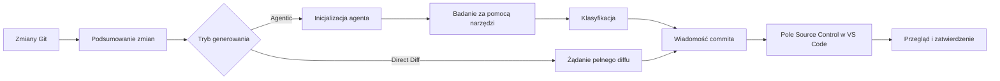

<!-- markdownlint-disable MD001 MD013 MD026 MD033 MD036 MD041 -->

<div align="center">


# Commit-Copilot

### Komunikaty commitów oparte na agentach, które rozumieją Twój kod — a nie tylko diff.

Commit-Copilot to rozszerzenie dla programu VS Code, które bada Twoje repozytorium za pomocą wieloetapowego, autonomicznego agenta AI, klasyfikuje zmiany zgodnie ze ścisłymi regułami Conventional Commits i zapisuje dopracowane komunikaty commitów bezpośrednio w panelu kontroli źródła (Source Control).

Działa bezproblemowo z wiodącymi chmurowymi modelami LLM (Gemini, OpenAI, Anthropic Claude, DeepSeek), dbającymi o prywatność lokalnymi modelami Ollama oraz niestandardowymi punktami końcowymi (zgodnymi z formatami OpenAI i Anthropic).

[](https://marketplace.visualstudio.com/items?itemName=JeremySu0818.commit-copilot)
[](https://open-vsx.org/extension/JeremySu0818/commit-copilot)
[](https://open-vsx.org/extension/JeremySu0818/commit-copilot)
[](#wymagania)
[](#rozwój-i-budowanie)
[](#klasyfikacja-conventional-commits)
[](../../LICENSE)

**Badanie agentowe · 9 wbudowanych dostawców · Niestandardowe punkty końcowe · Obsługa lokalnego Ollama · 20 języków**

<p align="center">
  <b>Translations:</b>
  <a href="https://github.com/JeremySu0818/Commit-Copilot#readme">English</a> |
  <a href="https://github.com/JeremySu0818/Commit-Copilot/blob/main/docs/readme/README-zh-tw.md">繁體中文</a> |
  <a href="https://github.com/JeremySu0818/Commit-Copilot/blob/main/docs/readme/README-zh-cn.md">简体中文</a> |
  <a href="https://github.com/JeremySu0818/Commit-Copilot/blob/main/docs/readme/README-ja.md">日本語</a> |
  <a href="https://github.com/JeremySu0818/Commit-Copilot/blob/main/docs/readme/README-ko.md">한국어</a> |
  <a href="https://github.com/JeremySu0818/Commit-Copilot/blob/main/docs/readme/README-de.md">Deutsch</a> |
  <a href="https://github.com/JeremySu0818/Commit-Copilot/blob/main/docs/readme/README-fr.md">Français</a> |
  <a href="https://github.com/JeremySu0818/Commit-Copilot/blob/main/docs/readme/README-es.md">Español</a> |
  <a href="https://github.com/JeremySu0818/Commit-Copilot/blob/main/docs/readme/README-pt-br.md">Português (Brasil)</a> |
  <a href="https://github.com/JeremySu0818/Commit-Copilot/blob/main/docs/readme/README-ru.md">Русский</a> |
  <a href="https://github.com/JeremySu0818/Commit-Copilot/blob/main/docs/readme/README-it.md">Italiano</a> |
  <a href="https://github.com/JeremySu0818/Commit-Copilot/blob/main/docs/readme/README-nl.md">Nederlands</a> |
  <a href="https://github.com/JeremySu0818/Commit-Copilot/blob/main/docs/readme/README-pl.md">Polski</a> |
  <a href="https://github.com/JeremySu0818/Commit-Copilot/blob/main/docs/readme/README-tr.md">Türkçe</a> |
  <a href="https://github.com/JeremySu0818/Commit-Copilot/blob/main/docs/readme/README-vi.md">Tiếng Việt</a> |
  <a href="https://github.com/JeremySu0818/Commit-Copilot/blob/main/docs/readme/README-id.md">Bahasa Indonesia</a> |
  <a href="https://github.com/JeremySu0818/Commit-Copilot/blob/main/docs/readme/README-hu.md">Magyar</a> |
  <a href="https://github.com/JeremySu0818/Commit-Copilot/blob/main/docs/readme/README-cs.md">Čeština</a> |
  <a href="https://github.com/JeremySu0818/Commit-Copilot/blob/main/docs/readme/README-hi.md">हिन्दी</a> |
  <a href="https://github.com/JeremySu0818/Commit-Copilot/blob/main/docs/readme/README-ar.md">العربية</a>
</p>

</div>

---

## Dlaczego Commit-Copilot?

Większość narzędzi AI do tworzenia commitów przesyła surowy diff do modelu, licząc na trafne jednostronicowe podsumowanie.

Commit-Copilot przyjmuje zupełnie inne podejście.

Rozpoczyna od lekkich metadanych zmian, a następnie pozwala autonomicznemu agentowi zdecydować, co należy zbadać: diffy, zawartość plików, symbole, referencje, wzorce w całym projekcie oraz ostatnie commity. Dopiero po pełnym zrozumieniu zmian klasyfikuje je i generuje komunikat.

| Funkcjonalność                                 | Zwykłe narzędzia diff-to-prompt | Commit-Copilot |
| ---------------------------------------------- | :-----------------------------: | :------------: |
| Natychmiast odczytuje cały diff                |               Tak               |  Opcjonalnie   |
| Selektywnie bada istotne pliki                 |               Nie               |      Tak       |
| Rozumie strukturę kodu                         |           Ograniczone           |      Tak       |
| Wyszukuje referencje symboli przez LSP         |               Nie               |      Tak       |
| Wyszukuje ukryte relacje ciągów/konfiguracji   |               Nie               |      Tak       |
| Uczy się na podstawie stylu ostatnich commitów |             Rzadko              |      Tak       |
| Analizuje stan indeksu Git (staged)            |             Rzadko              |      Tak       |
| Obsługuje lokalne i agentowe procesy robocze   |           Ograniczone           |      Tak       |
| Stosuje ścisłe granice typów commitów          |        Zależne od modelu        |      Tak       |
| Nigdy nie dodaje do indeksu bez zgody          |             Różnie              |      Tak       |

> [!TIP]
> Używaj trybu **Agentic** dla maksymalnej dokładności i kontekstu. Używaj trybu **Direct Diff**, gdy szybkość jest ważniejsza niż głęboka analiza.

---

## Najważniejsze cechy

<table>
<tr>
<td width="50%" valign="top">

<h3>Agent rozumiejący repozytorium</h3>

Agent rozpoczyna pracę od nazw plików, typów zmian, liczby linii i struktury projektu — a następnie wybiera narzędzia potrzebne do zrozumienia zmiany.

</td>
<td width="50%" valign="top">

<h3>Precyzja indeksu Git</h3>

W przypadku zmian przygotowanych (staged) narzędzia preferują zawartość z indeksu Git. Analiza referencji LSP wykorzystuje tymczasowy obszar roboczy zrekonstruowany ze stanu przygotowanego.

</td>
</tr>
<tr>
<td width="50%" valign="top">

<h3>Wielu dostawców w standardzie</h3>

Korzystaj z Google Gemini, OpenAI, Anthropic, xAI, Groq, OpenRouter, DeepSeek, Alibaba Qwen, Ollama lub dowolnego niestandardowego punktu końcowego.

</td>
<td width="50%" valign="top">

<h3>Ścisłe reguły Conventional Commits</h3>

Obsługuje wszystkie 11 typów Conventional Commits oraz stosuje priorytetowe reguły klasyfikacji z wyraźnymi wytycznymi dotyczącymi granic typów. Zakres (Scope), treść (Body), stopka (Footer) i Gitmoji są konfigurowane niezależnie.

</td>
</tr>
<tr>
<td width="50%" valign="top">

<h3>Proces roboczy agenta dla modeli lokalnych</h3>

Modele Ollama mogą korzystać z tych samych narzędzi badawczych dzięki wbudowanemu protokołowi tekstowemu — nawet bez natywnej obsługi wywoływania narzędzi (tool calling).

</td>
<td width="50%" valign="top">

<h3>Bezpieczny proces oparty na przeglądzie</h3>

Commit-Copilot wpisuje wynik do pola wprowadzania w Source Control. Masz pełną kontrolę nad przygotowywaniem, edycją i zatwierdzaniem zmian.

</td>
</tr>
</table>

---

## Spis treści

- [Jak to działa](#jak-to-działa)
- [Narzędzia agenta](#narzędzia-agenta)
- [Funkcje](#funkcje)
- [Obsługiwani dostawcy](#obsługiwani-dostawcy)
- [Wymagania](#wymagania)
- [Instalacja](#instalacja)
- [Konfiguracja](#konfiguracja)
- [Użytkowanie](#użytkowanie)
- [Klasyfikacja Conventional Commits](#klasyfikacja-conventional-commits)
- [Wykrywanie zmian](#wykrywanie-zmian)
- [Lokalizacja](#lokalizacja)
- [Bezpieczeństwo i prywatność](#bezpieczeństwo-i-prywatność)
- [Rozwój i budowanie](#rozwój-i-budowanie)
- [Testowanie](#testowanie)
- [Często zadawane pytania (FAQ)](#często-zadawane-pytania-faq)
- [Współpraca](#współpraca)
- [Licencja](#licencja)

---

## Jak to działa



### Proces roboczy w trybie agenta (Agentic)

1. **Zbieranie metadanych o zmianach**
   Commit-Copilot gromadzi nazwy plików, typy modyfikacji, liczbę linii oraz drzewo struktury projektu.

2. **Inicjalizacja agenta**
   Model otrzymuje zwięzłe podsumowanie oraz instrukcje do autonomicznego tworzenia komunikatów. Surowy diff nie jest początkowo przesyłany.

3. **Badanie za pomocą narzędzi**
   Agent selektywnie sprawdza repozytorium, prosząc tylko o ten kontekst, który uzna za przydatny.

4. **Klasyfikacja zmian**
   Zasady oparte na priorytetach określają typ commita. Jeśli włączono opcję Scope, agent wybiera również powiązany moduł lub obszar.

5. **Generowanie wiadomości**
   Ostateczny komunikat trafia do pola Source Control, gdzie można go przejrzeć i edytować.

> [!NOTE]
> Gdy włączone jest **Generowanie hybrydowe (Hybrid Generation)**, istniejący tekst w polu Source Control jest traktowany jako wersja robocza i punkt odniesienia. Instrukcje zawarte w tym szkicu nie mogą nadpisać zasad generowania.

### Proces roboczy Direct Diff

Tryb Direct Diff pomija pętlę badania i wysyła cały diff do wybranego modelu w jednym żądaniu. Jest szybszy, dostępny dla każdego dostawcy i świetnie sprawdza się w przypadku drobnych, jednoznacznych zmian.

---

## Narzędzia agenta

Agent może łączyć następujące narzędzia podczas kolejnych kroków analizy:

| Narzędzie              | Zastosowanie                                                                                                       |
| ---------------------- | ------------------------------------------------------------------------------------------------------------------ |
| `get_diff`             | Pobiera kompletny i dokładny diff dla jednego lub wielu wskazanych plików.                                         |
| `read_file`            | Odczytuje zawartość pliku (opcjonalnie w zadanym zakresie linii). W przypadku staged preferuje dane z indeksu Git. |
| `get_file_outline`     | Zwraca strukturę pliku: funkcje, klasy, interfejsy i eksporty.                                                     |
| `find_references`      | Wykorzystuje Language Server Protocol (LSP) w VS Code do odnajdywania referencji symboli ze świadomością składni.  |
| `get_recent_commits`   | Odczytuje ostatnie commity w celu dopasowania stylu do konwencji projektu.                                         |
| `search_code`          | Przeszukuje obszar roboczy pod kątem ciągów znaków lub wzorców, których nie ujawniają same importy.                |
| `write_commit_message` | Przesyła ostateczny, sformatowany komunikat commita i kończy pracę.                                                |

Dla modeli Gemini, Anthropic i kompatybilnych z OpenAI stosowane jest natywne wywoływanie narzędzi (tool calling). Ollama korzysta z równorzędnego protokołu tekstowego z obsługą zapytań wsadowych, identyfikatorów po stronie aplikacji, ustrukturyzowanych wyników, obsługi błędów pojedynczych wywołań i ostatecznego zatwierdzania.

Narzędzie `get_diff` przyjmuje pojedynczą ścieżkę `path` lub niepustą tablicę `paths`. Zapytania wsadowe ograniczają liczbę zapytań do API, zwracając dokładny diff każdego pliku bez pomijania jakiejkolwiek treści.

W trybie agenta można opcjonalnie wymusić pełne pokrycie diffem. Po włączeniu w ustawieniach wywołanie `write_commit_message` będzie blokowane do momentu, aż każdy zmodyfikowany plik z Git diff zostanie sprawdzony przez udane wywołanie `get_diff`. Opcja ta jest domyślnie wyłączona, aby oszczędzać tokeny i czas.

---

## Funkcje

### Generowanie i analiza

- **Tryby Agentic oraz Direct Diff**
- **Konfigurowalna maksymalna liczba kroków agenta (Max Agent Steps)**
- **Możliwość anulowania analizy w dowolnym momencie**
- **Automatyczne ponawianie prób (retries)** w przypadku przejściowych błędów API lub limitów zapytań (rate limits)
- **Przeszukiwanie wzorców w całym projekcie** dla zmiennych środowiskowych, nazw zdarzeń, kluczy konfiguracji i relacji tekstowych
- **Analiza wpływu referencji LSP** dla badania modyfikacji symboli kodu
- **Badanie ostatnich commitów** w celu zachowania spójnego stylu w projekcie
- **Generowanie hybrydowe (Hybrid Generation)** wykorzystujące istniejący tekst w Source Control jako bezpieczny szkic

### Integracja z Git

- Rozpoznawanie 5 stanów repozytorium: tylko przygotowane (staged), tylko nieprzygotowane (unstaged), mieszane (mixed), z nieśledzonymi plikami oraz wyłącznie nieśledzone (untracked-only)
- Pytanie o zgodę przed dodaniem nieśledzonych plików do indeksu
- Całkowity brak automatycznego indeksowania bez wyraźnej zgody użytkownika
- Preferowanie zawartości indeksu Git podczas badania przygotowanych plików
- Tworzenie tymczasowej migawki obszaru roboczego do analizy LSP dla zmian w indeksie
- Aktualizacja widoku w czasie rzeczywistym przy zmianach w repozytorium

### Kontrola formatu commita

Niezależne włączanie i wyłączanie elementów:

- **Scope** (zakres)
- **Body** (treść)
- **Footer** (stopka / Breaking Changes)
- **Prefiks Gitmoji**

Domyślne ustawienia:

| Element | Domyślnie |
| ------- | :-------: |
| Scope   | Włączone  |
| Body    | Włączone  |
| Footer  | Wyłączone |
| Gitmoji | Wyłączone |

### Integracja z VS Code

Uruchamiaj Commit-Copilot za pomocą:

- Paska bocznego (**Activity Bar**)
- Paska nawigacji w widoku **Source Control** (ikona różdżki)
- Palety poleceń (**Command Palette**)

Wygenerowana wiadomość jest wstawiana do standardowego pola tekstowego Source Control, gdzie można ją przejrzeć i zmodyfikować przed zatwierdzeniem.

### Weryfikacja dostawców i zarządzanie modelami

- Klucze API są weryfikowane bezpośrednio w punkcie końcowym dostawcy przed zapisaniem
- Szczegółowe i pomocne komunikaty błędów dotyczące uwierzytelniania, limitów i problemów z połączeniem
- Dynamiczne pobieranie list modeli dla OpenRouter, Alibaba Qwen, Ollama i dostawców niestandardowych
- Ręczne dodawanie i usuwanie identyfikatorów modeli dla Ollama i dostawców niestandardowych
- Obsługa formatów API zgodnych z OpenAI i Anthropic

---

## Obsługiwani dostawcy

| Dostawca                    | Najważniejsze cechy                                                        |
| --------------------------- | -------------------------------------------------------------------------- |
| **Google Gemini**           | Natywne narzędzia ustrukturyzowane i obsługa wielu generacji Gemini        |
| **OpenAI**                  | Modele rozumowania (reasoning), uniwersalne, kompaktowe oraz seria GPT-5   |
| **Anthropic**               | Rodziny Claude Haiku, Sonnet, Opus i Fable                                 |
| **xAI Grok**                | Warianty Grok z rozumowaniem oraz bez rozumowania                          |
| **Groq**                    | Szybki hosting modeli MiniMax, Qwen oraz `gpt-oss`                         |
| **OpenRouter**              | Dynamiczny dostęp do modeli z filtrowaniem obsługi narzędzi (tool calling) |
| **DeepSeek**                | Modele DeepSeek Chat, Reasoner (R1) oraz V4                                |
| **Alibaba Qwen**            | Integracja z DashScope i dynamiczne wykrywanie modeli                      |
| **Ollama**                  | Modele lokalne z dynamicznym wykrywaniem i wbudowanym protokołem narzędzi  |
| **Niestandardowy dostawca** | Dowolne punkty końcowe zgodne ze standardem OpenAI lub Anthropic           |

<details>
<summary><strong>Zobacz rodziny modeli obsługiwane przez Commit-Copilot</strong></summary>

### Google Gemini

- Gemini 2.5 Flash-Lite, Flash oraz Pro
- Gemini 3 Flash
- Gemini 3.1 Flash-Lite oraz Pro
- Gemini 3.5 Flash-Lite oraz Flash
- Gemini 3.6 Flash
- Gemini 3.7 Flash

### OpenAI

- o3 oraz o3-mini
- o4-mini
- GPT-4o mini oraz GPT-4o
- GPT-4.1 nano, mini oraz GPT-4.1
- GPT-5 nano, mini oraz GPT-5
- GPT-5.1
- GPT-5.2
- GPT-5.4 nano, mini oraz GPT-5.4
- GPT-5.5
- GPT-5.6 Luna, Terra oraz Sol

### Anthropic

- Claude Sonnet 4 oraz Opus 4
- Claude Opus 4.1
- Claude Haiku, Sonnet oraz Opus 4.5
- Claude Sonnet oraz Opus 4.6
- Claude Opus 4.7
- Claude Opus 4.8
- Claude Sonnet 5, Opus 5 oraz Fable 5

### xAI Grok

- Grok 4.20 (z rozumowaniem i standardowy)
- Grok 4.3
- Grok 4.5
- Grok 4.6

### Groq

- `gpt-oss-20B`
- `gpt-oss-120B`
- `gpt-oss-safeguard-20B`
- MiniMax M2.7
- Qwen 3.6 27b

### DeepSeek

- DeepSeek Chat
- DeepSeek R1 / Reasoner
- DeepSeek V4 Flash oraz Pro

> [!IMPORTANT]
> Dostępność modeli zależy od dostawcy, konta, regionu i aktualnego katalogu API. Listy modeli dla OpenRouter, Qwen, Ollama i dostawców niestandardowych mogą być pobierane dynamicznie.

</details>

---

## Wymagania

- **VS Code** `1.91.0` lub nowszy
- **Git**, dostępny za pośrednictwem wbudowanego rozszerzenia Git w VS Code
- Jeden z poniższych sposobów dostępu:
  - Ważny klucz API obsługiwanego dostawcy zdalnego
  - Dostępna lokalna lub zdalna instancja Ollama
  - Dane uwierzytelniające do kompatybilnego niestandardowego punktu końcowego

Do rozwoju:

- **Node.js** `20+`
- **npm**

---

## Instalacja

Zainstaluj Commit-Copilot z wybranego repozytorium:

- [**Visual Studio Code Marketplace**](https://marketplace.visualstudio.com/items?itemName=JeremySu0818.commit-copilot)
- [**Open VSX Registry**](https://open-vsx.org/extension/JeremySu0818/commit-copilot)

Po zakończeniu instalacji otwórz repozytorium Git w VS Code i kliknij ikonę **Commit Copilot** na pasku bocznym (Activity Bar).

---

## Konfiguracja

### Podstawowa konfiguracja

1. Otwórz widok **Commit Copilot** z paska bocznego.
2. Wybierz dostawcę.
3. Wprowadź klucz API dostawcy lub adres URL hosta Ollama.
4. Kliknij **Zapisz**.
5. Poczekaj na natychmiastową weryfikację połączenia i poświadczeń.
6. Wybierz model, gdy lista modeli stanie się dostępna.

> [!IMPORTANT]
> W przypadku korzystania z Ollama rozszerzenie przed każdym generowaniem wykonuje polecenie `ollama pull` dla wybranego modelu i wyświetla postęp w powiadomieniach. Zapewnia to aktualność modelu, ale może ponownie pobierać warstwy, nawet jeśli model istnieje lokalnie.

### Opcje

| Opcja                        | Domyślnie | Opis                                                                                                    |
| ---------------------------- | --------- | ------------------------------------------------------------------------------------------------------- |
| **Tryb generowania**         | Agentic   | `Agentic` uruchamia wieloetapowe badanie. `Direct Diff` przesyła cały diff w jednym zapytaniu.          |
| **Generowanie hybrydowe**    | Wyłączone | Wykorzystuje tekst z kontroli źródła jako szkic pomocniczy, izolując go od instrukcji systemowych.      |
| **Maks. kroków agenta**      | `0`       | Maksymalna liczba wywołań narzędzi przez agenta. Ustaw `0`, aby znieść limit.                           |
| **Uwzględnij Scope**         | Włączone  | Wymaga podania zakresu (Scope) Conventional Commits w temacie commita.                                  |
| **Uwzględnij Body**          | Włączone  | Wymaga wygenerowania szczegółowej treści (Body) commita.                                                |
| **Uwzględnij Footer**        | Wyłączone | Wymaga sekcji stopki (np. Breaking Changes); niepoparte dowodami fakty nigdy nie są zmyślane.           |
| **Uwzględnij Gitmoji**       | Wyłączone | Dodaje dokładnie jeden dopasowany prefiks Gitmoji w temacie commita.                                    |
| **Język rozszerzenia**       | Auto      | Język interfejsu rozszerzenia. Zgodny z językiem programu VS Code, chyba że zostanie ustawiony ręcznie. |
| **Język wiadomości commita** | Angielski | Niezależnie określa język tematu, treści i stopki tworzonego komunikatu.                                |

### Niestandardowy dostawca (Custom Provider)

Aby dodać punkt końcowy zgodny z OpenAI lub Anthropic:

1. Otwórz ustawienia dostawcy w panelu.
2. Kliknij **+ Dodaj dostawcę...**.
3. Wybierz format API (`OpenAI-compatible` lub `Anthropic-compatible`).
4. Wprowadź nazwę wyświetlaną oraz podstawowy adres URL API (Base URL).
5. Zapisz dostawcę.
6. Wprowadź i zweryfikuj klucz API.
7. Wybierz wykryty model lub dodaj identyfikator modelu ręcznie poprzez **Zarządzaj modelami...**.

Dla punktów końcowych zgodnych z Anthropic można również skonfigurować maksymalny limit tokenów wyjściowych (`max_tokens`).

---

## Użytkowanie

### Sposób A: Pasek boczny (Activity Bar)

1. Otwórz panel **Commit Copilot**.
2. Upewnij się, że w repozytorium znajdują się przygotowane, nieprzygotowane lub nieśledzone zmiany.
3. Kliknij **Generuj komunikat commita**.
4. W razie potrzeby odpowiedz na monit o wybór zakresu zmian.

### Sposób B: Kontrola źródła (Source Control)

1. Otwórz widok Source Control za pomocą skrótu `Ctrl+Shift+G` (na macOS: `Cmd+Shift+G`).
2. Kliknij ikonę różdżki Commit-Copilot na pasku nawigacyjnym.

### Sposób C: Paleta poleceń (Command Palette)

1. Otwórz paletę poleceń:
   - Windows/Linux: `Ctrl+Shift+P`
   - macOS: `Cmd+Shift+P`
2. Uruchom polecenie **Commit-Copilot: Generate Commit Message**.

### Przegląd i zatwierdzanie

Wygenerowany komunikat pojawi się w standardowym polu tekstowym kontroli źródła.

Możesz go przejrzeć, wprowadzić ewentualne poprawki i zatwierdzić standardowym przyciskiem commita w programie VS Code.

---

## Klasyfikacja Conventional Commits

Commit-Copilot ściśle przestrzega 11 typów Conventional Commits:

| Typ        | Przeznaczenie                                                          |
| ---------- | ---------------------------------------------------------------------- |
| `feat`     | Wprowadza nową funkcjonalność widoczną dla użytkownika                 |
| `fix`      | Naprawia błąd lub nieprawidłowe zachowanie                             |
| `docs`     | Zmiany dotyczące wyłącznie dokumentacji                                |
| `style`    | Zmiany formatowania, spacji i stylu, które nie wpływają na logikę kodu |
| `refactor` | Przebudowa kodu bez dodawania nowej funkcji i bez naprawiania błędu    |
| `perf`     | Poprawa wydajności lub zużycia zasobów                                 |
| `test`     | Dodanie, modyfikacja lub uzupełnienie testów                           |
| `build`    | Zmiany wpływające na system budowania lub zewnętrzne zależności        |
| `ci`       | Modyfikacje konfiguracji ciągłej integracji (CI) i potoków             |
| `chore`    | Prace konserwacyjne i porządkowe nieobjęte innymi kategoriami          |
| `revert`   | Cofnięcie wcześniejszego commita                                       |

Wynikowy komunikat zachowuje składnię Conventional Commits:

```text
type(scope): zwięzły i czytelny opis

Szczegółowy opis wyjaśniający, co zostało zmienione i z jakiego powodu.
```

W zależności od konfiguracji elementy Scope, Body, Footer oraz Gitmoji mogą być wymagane lub pomijane. Pierwsza linia jest ograniczona do 72 znaków (zaleca się około 50).

---

## Wykrywanie zmian

Commit-Copilot precyzyjnie rozpoznaje 5 stanów repozytorium Git:

| Scenariusz                                | Zachowanie                                                          |
| ----------------------------------------- | ------------------------------------------------------------------- |
| **Tylko przygotowane (Staged only)**      | Używa diffu zmian w indeksie i narzędzi uwzględniających indeks Git |
| **Tylko nieprzygotowane (Unstaged only)** | Bada modyfikacje w bieżącym katalogu roboczym                       |
| **Mieszane (Mixed)**                      | Wyświetla okno dialogowe z pytaniem o zakres zmian do uwzględnienia |
| **Nieprzygotowane + nieśledzone**         | Proponuje opcje dostosowane do kontekstu                            |
| **Tylko nieśledzone (Untracked only)**    | Oferuje dodanie nowych plików do indeksu i wygenerowanie commita    |

Żaden plik nie zostanie dodany do indeksu automatycznie bez Twojego wyraźnego potwierdzenia.

---

## Lokalizacja

Interfejs użytkownika rozszerzenia może automatycznie dostosowywać się do języka programu VS Code lub zostać ustawiony na stałe na jeden z 20 języków:

<table>
<tr>
<td><a href="README-ar.md">العربية</a></td>
<td><a href="README-cs.md">Čeština</a></td>
<td><a href="README-de.md">Deutsch</a></td>
<td><a href="../../README.md">English</a></td>
</tr>
<tr>
<td><a href="README-es.md">Español</a></td>
<td><a href="README-fr.md">Français</a></td>
<td><a href="README-hi.md">हिन्दी</a></td>
<td><a href="README-hu.md">Magyar</a></td>
</tr>
<tr>
<td><a href="README-id.md">Bahasa Indonesia</a></td>
<td><a href="README-it.md">Italiano</a></td>
<td><a href="README-ja.md">日本語</a></td>
<td><a href="README-ko.md">한국어</a></td>
</tr>
<tr>
<td><a href="README-nl.md">Nederlands</a></td>
<td><a href="README-pl.md">Polski</a></td>
<td><a href="README-pt-br.md">Português (Brasil)</a></td>
<td><a href="README-ru.md">Русский</a></td>
</tr>
<tr>
<td><a href="README-tr.md">Türkçe</a></td>
<td><a href="README-vi.md">Tiếng Việt</a></td>
<td><a href="README-zh-cn.md">简体中文</a></td>
<td><a href="README-zh-tw.md">繁體中文</a></td>
</tr>
</table>

**Język wiadomości commita** jest konfigurowany niezależnie od języka interfejsu użytkownika, dzięki czemu możesz korzystać z interfejsu w języku polskim, generując commity po angielsku.

---

## Bezpieczeństwo i prywatność

- Klucze API są bezpiecznie przechowywane w usłudze **VS Code Secret Storage**
- Klucze są weryfikowane bezpośrednio u wybranego dostawcy przed zapisaniem
- Commit-Copilot nigdy nie dodaje plików do indeksu bez Twojej wyraźnej zgody
- Funkcja generowania hybrydowego traktuje tekst z SCM jako niezaufany materiał pomocniczy
- Zdalne żądania zawierają wyłącznie metadane repozytorium, diffy lub fragmenty plików wybrane podczas analizy
- Użycie lokalnego Ollama pozwala zachować wszystkie dane wyłącznie w Twoim środowisku

> [!CAUTION]
> Przed wysłaniem zastrzeżonego lub poufnego kodu repozytorium zapoznaj się z zasadami przetwarzania danych wybranego dostawcy API.

---

## Rozwój i budowanie

### Instalacja zależności

```bash
npm install
```

### Kompilacja deweloperska

```bash
npm run compile
```

Aby uruchomić ciągłą kompilację z nasłuchem zmian TypeScript i esbuild:

```bash
npm run watch
```

### Budowanie pakietu VSIX

```bash
npm run build
```

Skrypt instaluje zależności, uruchamia potok pakowania VS Code i tworzy gotowy pakiet `.vsix`.

### Jakość kodu

Weryfikacja reguł lintera:

```bash
npm run lint
```

Formatowanie kodu źródłowego:

```bash
npm run format
```

Sprawdzenie formatowania bez modyfikowania plików:

```bash
npm run check-format
```

---

## Testowanie

Uruchomienie pełnego zestawu testów jednostkowych:

```bash
npm test
```

Polecenie wykonuje kolejno:

1. `npm run test:build`
2. `node --test --test-concurrency=1 "out/test/**/*.test.js"`

Bieżące pokrycie testami obejmuje:

- Wszystkie narzędzia agenta:
  - `get_diff`
  - `read_file`
  - `get_file_outline`
  - `find_references`
  - `get_recent_commits`
  - `search_code`
- Pętle agenta z natywnym ustrukturyzowanym wywoływaniem narzędzi
- Pętle agenta oparte na protokole tekstowym Ollama
- Wywołania wsadowe i zlokalizowane schematy narzędzi
- Mechanizmy naprawy niepoprawnych odpowiedzi modelu
- Weryfikację końcowego przesyłania wiadomości commita
- Przekazywanie wywołań przez `executeToolCall`
- Parsowanie i konstruowanie kontekstu
- Narzędzia migawek przygotowanego obszaru roboczego
- Logikę automatycznych ponowień (retries)
- Zlokalizowane komunikaty o błędach
- Działanie dostawcy głównego widoku webview
- Zarządzanie modelami niestandardowymi
- Menedżery stanu

---

## Często zadawane pytania (FAQ)

<details>
<summary><strong>Czy Commit-Copilot zatwierdza commity automatycznie?</strong></summary>

Nie. Rozszerzenie wpisuje wygenerowany komunikat do pola tekstowego Source Control. Możesz go osobiście sprawdzić, zmodyfikować i zatwierdzić.

</details>

<details>
<summary><strong>Czy agent przesyła całe moje repozytorium do AI?</strong></summary>

W trybie agenta początkowo przesyłane są tylko metadane zmian i drzewo śledzonych plików — bez zawartości wszystkich plików. Następnie agent odpytuje o konkretne diffy, pliki, referencje lub wyniki wyszukiwania wedle potrzeb. Tryb Direct Diff wysyła tylko pełny diff wybranych zmian.

</details>

<details>
<summary><strong>Czy modele Ollama mogą używać narzędzi bez natywnej obsługi tool-calling?</strong></summary>

Tak. Commit-Copilot zawiera specjalny tekstowy protokół narzędzi, który umożliwia modelom Ollama korzystanie z pełnego, wieloetapowego procesu badania.

</details>

<details>
<summary><strong>Co oznacza „Maks. kroków agenta = 0”?</strong></summary>

Wartość `0` oznacza brak limitu liczby wywołań narzędzi. Dowolna dodatnia liczba ogranicza liczbę kroków badawczych przed wygenerowaniem ostatecznego komunikatu.

</details>

<details>
<summary><strong>Czy mogę użyć punktu końcowego, którego nie ma na liście wbudowanych?</strong></summary>

Tak. Dodaj go jako niestandardowego dostawcę zgodnego z formatem OpenAI lub Anthropic, a następnie pobierz modele lub wpisz ich identyfikatory ręcznie.

</details>

<details>
<summary><strong>Dlaczego Ollama pobiera model przed każdym generowaniem?</strong></summary>

Rozszerzenie uruchamia `ollama pull` przed każdym generowaniem, aby upewnić się, że wybrany model jest dostępny i aktualny w systemie. W zależności od stanu lokalnego może to spowodować ponowne sprawdzenie lub dociągnięcie warstw modelu.

</details>

---

## Współpraca

Wszelki wkład w rozwój projektu jest mile widziany!

Zalecany proces wprowadzania zmian:

1. Utwórz dedykowaną gałąź (branch).
2. Wprowadź modyfikacje.
3. Uruchom linter, sprawdzanie formatowania oraz testy.
4. Jasno opisz motywację i charakter zmian w Pull Requeście.
5. Dodaj odpowiednie testy dla nowych lub zmienionych funkcji.

Przed przesłaniem zmian wykonaj:

```bash
npm run lint
npm run check-format
npm test
```

Zgłaszając błędy, podaj nazwę dostawcy, model, tryb generowania, stan zmian w repozytorium, odpowiednie logi oraz powtarzalne kroki do odtworzenia problemu. Nigdy nie dołączaj kluczy API ani poufnego kodu.

---

## Licencja

Commit-Copilot jest udostępniany na warunkach [licencji MIT](../../LICENSE).

---

<div align="center">

Stworzone dla programistów, którzy oczekują commitów z pełnym kontekstem — bez zgadywania.

</div>
