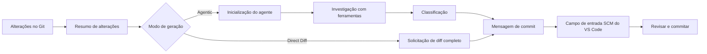

<!-- markdownlint-disable MD001 MD013 MD026 MD033 MD036 MD041 -->

<div align="center">


# Commit-Copilot

### Mensagens de commit inteligentes que entendem seu código — não apenas seu diff.

O Commit-Copilot é uma extensão para o VS Code que investiga seu repositório com um agente autônomo de IA em múltiplas etapas, classifica as alterações utilizando regras rigorosas de Conventional Commits e escreve mensagens de commit refinadas diretamente no controle de código-fonte (Source Control).

Funciona perfeitamente com os principais LLMs na nuvem (Gemini, OpenAI, Anthropic Claude, DeepSeek), modelos locais do Ollama com foco em privacidade e endpoints personalizados (formatos compatíveis com OpenAI e Anthropic).

[](https://marketplace.visualstudio.com/items?itemName=JeremySu0818.commit-copilot)
[](https://open-vsx.org/extension/JeremySu0818/commit-copilot)
[](https://open-vsx.org/extension/JeremySu0818/commit-copilot)
[](#requisitos)
[](#desenvolvimento)
[](#classificação-de-conventional-commits)
[](../../LICENSE)

**Investigação agêntica · 9 provedores integrados · Endpoints personalizados · Suporte local ao Ollama · 20 idiomas**

<p align="center">
  <b>Traduções:</b>
  <a href="https://github.com/JeremySu0818/Commit-Copilot#readme">English</a> |
  <a href="https://github.com/JeremySu0818/Commit-Copilot/blob/main/docs/readme/README-zh-tw.md">繁體中文</a> |
  <a href="https://github.com/JeremySu0818/Commit-Copilot/blob/main/docs/readme/README-zh-cn.md">简体中文</a> |
  <a href="https://github.com/JeremySu0818/Commit-Copilot/blob/main/docs/readme/README-ja.md">日本語</a> |
  <a href="https://github.com/JeremySu0818/Commit-Copilot/blob/main/docs/readme/README-ko.md">한국어</a> |
  <a href="https://github.com/JeremySu0818/Commit-Copilot/blob/main/docs/readme/README-de.md">Deutsch</a> |
  <a href="https://github.com/JeremySu0818/Commit-Copilot/blob/main/docs/readme/README-fr.md">Français</a> |
  <a href="https://github.com/JeremySu0818/Commit-Copilot/blob/main/docs/readme/README-es.md">Español</a> |
  <a href="https://github.com/JeremySu0818/Commit-Copilot/blob/main/docs/readme/README-pt-br.md">Português (Brasil)</a> |
  <a href="https://github.com/JeremySu0818/Commit-Copilot/blob/main/docs/readme/README-ru.md">Русский</a> |
  <a href="https://github.com/JeremySu0818/Commit-Copilot/blob/main/docs/readme/README-it.md">Italiano</a> |
  <a href="https://github.com/JeremySu0818/Commit-Copilot/blob/main/docs/readme/README-nl.md">Nederlands</a> |
  <a href="https://github.com/JeremySu0818/Commit-Copilot/blob/main/docs/readme/README-pl.md">Polski</a> |
  <a href="https://github.com/JeremySu0818/Commit-Copilot/blob/main/docs/readme/README-tr.md">Türkçe</a> |
  <a href="https://github.com/JeremySu0818/Commit-Copilot/blob/main/docs/readme/README-vi.md">Tiếng Việt</a> |
  <a href="https://github.com/JeremySu0818/Commit-Copilot/blob/main/docs/readme/README-id.md">Bahasa Indonesia</a> |
  <a href="https://github.com/JeremySu0818/Commit-Copilot/blob/main/docs/readme/README-hu.md">Magyar</a> |
  <a href="https://github.com/JeremySu0818/Commit-Copilot/blob/main/docs/readme/README-cs.md">Čeština</a> |
  <a href="https://github.com/JeremySu0818/Commit-Copilot/blob/main/docs/readme/README-hi.md">हिन्दी</a> |
  <a href="https://github.com/JeremySu0818/Commit-Copilot/blob/main/docs/readme/README-ar.md">العربية</a>
</p>

</div>

---

## Por que o Commit-Copilot?

A maioria das ferramentas de commit por IA envia um diff bruto para um modelo esperando obter um bom resumo de uma linha.

O Commit-Copilot adota uma abordagem totalmente diferente.

Ele começa com metadados leves de alterações e permite que um agente autônomo decida o que precisa inspecionar: diffs, conteúdo de arquivos, símbolos, referências, padrões em todo o projeto e commits recentes. Somente após compreender a alteração a fundo, ele classifica e gera a mensagem.

| Capacidade                                               | Ferramentas básicas de diff-para-prompt | Commit-Copilot |
| -------------------------------------------------------- | :-------------------------------------: | :------------: |
| Lê o diff completo imediatamente                         |                   Sim                   |    Opcional    |
| Investiga seletivamente arquivos relevantes              |                   Não                   |      Sim       |
| Compreende a estrutura do código                         |                Limitado                 |      Sim       |
| Encontra referências de símbolos via LSP                 |                   Não                   |      Sim       |
| Pesquisa relações ocultas de strings/configurações       |                   Não                   |      Sim       |
| Aprende com o estilo de commits recentes                 |                Raramente                |      Sim       |
| Utiliza análise precisa baseada no índice do Git (stage) |                Raramente                |      Sim       |
| Suporta fluxos de agentes nativos e locais               |                Limitado                 |      Sim       |
| Aplica limites rígidos para tipos de commit              |            Depende do modelo            |      Sim       |
| Nunca adiciona ao stage sem consentimento                |                  Varia                  |      Sim       |

> [!TIP]
> Use o modo **Agentic** para máxima precisão e contexto. Use o modo **Direct Diff** quando a velocidade for mais importante que a investigação profunda.

---

## Destaques principais

<table>
<tr>
<td width="50%" valign="top">

<h3>Agente consciente do repositório</h3>

O agente começa com nomes de arquivos, tipos de alterações, contagem de linhas e estrutura do projeto — e então escolhe autonomamente as ferramentas necessárias para compreender a alteração.

</td>
<td width="50%" valign="top">

<h3>Precisão no índice do Git</h3>

Para alterações no stage, as ferramentas do repositório priorizam o conteúdo do índice do Git. A análise de referências LSP utiliza uma área de trabalho temporária reconstruída a partir do estado no stage.

</td>
</tr>
<tr>
<td width="50%" valign="top">

<h3>Projetado para múltiplos provedores</h3>

Use Google Gemini, OpenAI, Anthropic, xAI, Groq, OpenRouter, DeepSeek, Alibaba Qwen, Ollama ou qualquer endpoint personalizado compatível.

</td>
<td width="50%" valign="top">

<h3>Conventional Commits rigorosos</h3>

O prompt suporta todos os 11 tipos de Conventional Commits e aplica regras de classificação hierárquicas com limites explícitos. Escopo, corpo, rodapé e Gitmoji são configuráveis de forma independente.

</td>
</tr>
<tr>
<td width="50%" valign="top">

<h3>Fluxo de trabalho com agentes para modelos locais</h3>

Os modelos do Ollama podem utilizar as mesmas ferramentas de investigação através do protocolo de ferramentas de texto integrado do Commit-Copilot — mesmo sem suporte nativo a Tool Calling.

</td>
<td width="50%" valign="top">

<h3>Fluxo de trabalho seguro focado em revisão</h3>

O Commit-Copilot escreve o resultado no campo de entrada do Source Control. Você mantém o controle total sobre stage, edição e o commit final.

</td>
</tr>
</table>

---

## Sumário

- [Como funciona](#como-funciona)
- [Ferramentas do agente](#ferramentas-do-agente)
- [Recursos](#recursos)
- [Provedores suportados](#provedores-suportados)
- [Requisitos](#requisitos)
- [Instalação](#instalação)
- [Configuração](#configuração)
- [Uso](#uso)
- [Classificação de Conventional Commits](#classificação-de-conventional-commits)
- [Detecção de alterações](#detecção-de-alterações)
- [Localização](#localização)
- [Segurança e privacidade](#segurança-e-privacidade)
- [Desenvolvimento](#desenvolvimento)
- [Testes](#testes)
- [Perguntas frequentes (FAQ)](#perguntas-frequentes-faq)
- [Como contribuir](#como-contribuir)
- [Licença](#licença)

---

## Como funciona



### Fluxo de trabalho Agentic

1. **Coletar metadados de alterações**
   O Commit-Copilot reúne nomes de arquivos, tipos de alterações, contagem de linhas e uma árvore de estrutura do projeto.

2. **Inicializar o agente**
   O modelo recebe o resumo e as instruções operacionais para geração autônoma do commit. O conteúdo do diff bruto não é incluído inicialmente.

3. **Investigar com ferramentas**
   O agente inspeciona seletivamente o repositório, solicitando apenas o contexto que julgar útil.

4. **Classificar a alteração**
   Regras ordenadas por prioridade determinam o tipo de commit. Quando a inclusão de escopo está ativada, o agente também seleciona o módulo ou área afetada.

5. **Gerar a mensagem**
   A mensagem final é gravada no campo de entrada do Source Control para revisão e edição.

> [!NOTE]
> Quando a **Geração híbrida** está ativada, o texto existente no Source Control é tratado como rascunho de referência para vocabulário e intenção. Instruções contidas nesse rascunho não podem substituir as regras de geração.

### Fluxo de trabalho Direct Diff

O Direct Diff pula o ciclo de investigação e envia o diff completo para o modelo selecionado em uma única solicitação. É mais rápido, está disponível para todos os provedores e é ideal para alterações simples ou evidentes.

---

## Ferramentas do agente

O agente pode combinar as seguintes ferramentas ao longo de várias etapas de investigação:

| Ferramenta             | Finalidade                                                                                                                  |
| ---------------------- | --------------------------------------------------------------------------------------------------------------------------- |
| `get_diff`             | Obtém o diff exato e completo para um arquivo ou múltiplos arquivos solicitados.                                            |
| `read_file`            | Lê o conteúdo do arquivo, opcionalmente em um intervalo de linhas. A análise no stage prioriza o conteúdo do índice do Git. |
| `get_file_outline`     | Retorna informações estruturais como funções, classes e exportações.                                                        |
| `find_references`      | Utiliza o Language Server Protocol do VS Code para localizar referências sintáticas a símbolos.                             |
| `get_recent_commits`   | Lê as mensagens de commit recentes para aprender e seguir o estilo existente do projeto.                                    |
| `search_code`          | Pesquisa no workspace por strings ou padrões que apenas os imports não revelam.                                             |
| `write_commit_message` | Envia a mensagem de commit estruturada final.                                                                               |

As integrações com Gemini, Anthropic e rotas compatíveis com OpenAI usam chamadas de ferramentas estruturadas nativas. O Ollama utiliza um protocolo de texto equivalente que suporta chamadas em lote, IDs de chamada atribuídos pela aplicação, resultados estruturados, tratamento de erros por chamada e envio final.

`get_diff` aceita um único `path` ou um array `paths` não vazio. Solicitações de múltiplos arquivos reduzem as viagens de ida e volta do agente, retornando o diff completo e exato de cada arquivo solicitado; nenhum conteúdo é resumido ou omitido.

A geração agêntica pode opcionalmente exigir a cobertura completa de diffs. Quando ativada nas Configurações, a chamada a `write_commit_message` é rejeitada até que cada arquivo alterado de um diff Git válido tenha sido coberto por uma solicitação `get_diff` bem-sucedida (individual ou em lote). Esta opção vem desativada por padrão para preservar o desempenho e o consumo de tokens.

---

## Recursos

### Geração e análise

- **Modos de geração Agentic e Direct Diff**
- **Número máximo de passos do agente configurável**
- **Ciclo de investigação cancelável a qualquer momento**
- **Tentativas automáticas (retry)** para falhas temporárias de APIs remotas e limites de taxa (Rate Limits)
- **Pesquisa de padrões em todo o projeto** para variáveis de ambiente, nomes de eventos, chaves de configuração e outras relações textuais
- **Radar de impacto de referências LSP** para análise de símbolos sensível à sintaxe
- **Inspeção de commits recentes** para seguir as convenções do projeto
- **Geração híbrida** usando o texto existente no SCM como rascunho de referência seguro

### Comportamento consciente do Git

- Detecta cinco estados do repositório: somente no stage (Staged), somente sem stage (Unstaged), misto (Mixed), sem stage + não rastreados, e somente não rastreados (Untracked-only)
- Solicita confirmação antes de adicionar arquivos não rastreados ao stage
- Nunca adiciona arquivos ao stage automaticamente sem consentimento explícito
- Prioriza o conteúdo do índice do Git ao inspecionar arquivos no stage
- Cria um snapshot temporário da área de trabalho no stage para análise de referências LSP
- Atualiza a visualização principal em tempo real conforme o estado do repositório muda

### Controles de saída do commit

Ative ou desative de forma independente:

- **Escopo** (Scope)
- **Corpo** (Body)
- **Rodapé** (Footer / Breaking Changes)
- **Prefixo Gitmoji**

Valores padrão:

| Elemento |   Padrão   |
| -------- | :--------: |
| Escopo   |  Ativado   |
| Corpo    |  Ativado   |
| Rodapé   | Desativado |
| Gitmoji  | Desativado |

### Integração com o VS Code

Inicie o Commit-Copilot a partir de:

- A **Barra de Atividades (Activity Bar)**
- O ícone de varinha mágica na **barra de navegação do Source Control (SCM)**
- A **Paleta de Comandos (Command Palette)**

As mensagens geradas são inseridas diretamente na caixa de entrada padrão do Source Control, onde podem ser revisadas e editadas antes do commit.

### Validação de provedores e gerenciamento de modelos

- As chaves de API são validadas diretamente no endpoint real do provedor antes de serem salvas
- Erros específicos de autenticação, cota e conexão do provedor são exibidos com orientações práticas
- OpenRouter, Alibaba Qwen, Ollama e provedores personalizados podem obter listas de modelos dinamicamente
- Ollama e provedores personalizados permitem adicionar ou remover manualmente IDs de modelos se a descoberta automática estiver incompleta
- Provedores personalizados aceitam formatos de API compatíveis com OpenAI e Anthropic

---

## Provedores suportados

| Provedor            | Destaques                                                                            |
| ------------------- | ------------------------------------------------------------------------------------ |
| **Google Gemini**   | Ferramentas estruturadas nativas e múltiplas gerações de modelos Gemini              |
| **OpenAI**          | Modelos de raciocínio, uso geral, compactos e a série GPT-5                          |
| **Anthropic**       | Famílias completas Claude Haiku, Sonnet, Opus e Fable                                |
| **xAI Grok**        | Variantes do Grok convencionais e com raciocínio                                     |
| **Groq**            | Modelos hospedados ultrarrápidos MiniMax, Qwen e `gpt-oss`                           |
| **OpenRouter**      | Acesso dinâmico a modelos compatíveis com filtragem por suporte a ferramentas        |
| **DeepSeek**        | Variantes Chat, Reasoner (R1) e V4                                                   |
| **Alibaba Qwen**    | Integração DashScope com descoberta dinâmica de modelos                              |
| **Ollama**          | Modelos locais com descoberta dinâmica e protocolo de ferramentas de texto integrado |
| **Custom Provider** | Endpoints personalizados compatíveis com os formatos de API OpenAI ou Anthropic      |

<details>
<summary><strong>Ver as famílias de modelos listadas pelo Commit-Copilot</strong></summary>

### Google Gemini

- Gemini 2.5 Flash-Lite, Flash e Pro
- Gemini 3 Flash
- Gemini 3.1 Flash-Lite e Pro
- Gemini 3.5 Flash-Lite e Flash
- Gemini 3.6 Flash
- Gemini 3.7 Flash

### OpenAI

- o3 e o3-mini
- o4-mini
- GPT-4o mini e GPT-4o
- GPT-4.1 nano, mini e GPT-4.1
- GPT-5 nano, mini e GPT-5
- GPT-5.1
- GPT-5.2
- GPT-5.4 nano, mini e GPT-5.4
- GPT-5.5
- GPT-5.6 Luna, Terra e Sol

### Anthropic

- Claude Sonnet 4 e Opus 4
- Claude Opus 4.1
- Claude Haiku, Sonnet e Opus 4.5
- Claude Sonnet e Opus 4.6
- Claude Opus 4.7
- Claude Opus 4.8
- Claude Sonnet 5, Opus 5 e Fable 5

### xAI Grok

- Grok 4.20, com e sem raciocínio
- Grok 4.3
- Grok 4.5
- Grok 4.6

### Groq

- `gpt-oss-20B`
- `gpt-oss-120B`
- `gpt-oss-safeguard-20B`
- MiniMax M2.7
- Qwen 3.6 27b

### DeepSeek

- DeepSeek Chat
- DeepSeek R1 / Reasoner
- DeepSeek V4 Flash e Pro

> [!IMPORTANT]
> A disponibilidade de modelos depende do provedor, conta, região, endpoint e catálogo ativo do provedor. As listas para OpenRouter, Qwen, Ollama e provedores personalizados podem ser descobertas dinamicamente.

</details>

---

## Requisitos

- **VS Code** `1.91.0` ou mais recente
- **Git**, disponível através da extensão Git integrada do VS Code
- Pelo menos um dos seguintes:
  - Uma chave de API válida para um provedor remoto suportado
  - Uma instância do Ollama local ou remota acessível
  - Credenciais para um endpoint personalizado compatível

Para desenvolvimento:

- **Node.js** `20+`
- **npm**

---

## Instalação

Instale o Commit-Copilot a partir de um dos marketplaces abaixo:

- [**Visual Studio Code Marketplace**](https://marketplace.visualstudio.com/items?itemName=JeremySu0818.commit-copilot)
- [**Open VSX Registry**](https://open-vsx.org/extension/JeremySu0818/commit-copilot)

Após a instalação, abra um repositório Git no VS Code e clique no ícone do **Commit Copilot** na Barra de Atividades.

---

## Configuração

### Configuração básica

1. Abra a visualização do **Commit Copilot** na Barra de Atividades.
2. Selecione um provedor de API.
3. Insira a chave de API do provedor ou a URL do host do Ollama.
4. Selecione **Salvar**.
5. Aguarde a validação das credenciais em tempo real.
6. Escolha um modelo assim que a seleção estiver disponível.

> [!IMPORTANT]
> Na geração com o Ollama, a extensão executa automaticamente `ollama pull` para o modelo selecionado antes de cada geração e exibe o progresso na área de notificações. Isso garante que o modelo esteja disponível e atualizado, mas pode baixar novamente camadas mesmo se o modelo já existir localmente.

### Opções

| Opção                                 | Padrão     | Descrição                                                                                                                    |
| ------------------------------------- | ---------- | ---------------------------------------------------------------------------------------------------------------------------- |
| **Modo**                              | Agentic    | `Agentic` executa um ciclo de investigação em múltiplas etapas. `Direct Diff` envia o diff completo em uma única requisição. |
| **Geração híbrida**                   | Desativado | Usa o texto existente no SCM como rascunho de referência, isolando-o estritamente das instruções do prompt.                  |
| **Número Máximo de Passos do Agente** | `0`        | Limite máximo de iterações para chamadas de ferramentas. Defina como `0` para ilimitado.                                     |
| **Incluir Escopo**                    | Ativado    | Exige um escopo de Conventional Commits no assunto quando ativado.                                                           |
| **Incluir Corpo**                     | Ativado    | Exige uma seção descritiva no corpo da mensagem quando ativado.                                                              |
| **Incluir Rodapé**                    | Desativado | Exige uma seção de rodapé quando ativado (ex.: Breaking Changes); informações sem evidência nunca são inventadas.            |
| **Incluir Gitmoji**                   | Desativado | Requer exatamente um prefixo Gitmoji mapeado quando ativado.                                                                 |
| **Idioma da Extensão**                | Auto       | Segue o idioma de exibição do VS Code, a menos que seja fixado manualmente.                                                  |
| **Idioma da mensagem de commit**      | Inglês     | Controla de forma independente o idioma do assunto, corpo e rodapé gerados.                                                  |

### Provedor personalizado

Para adicionar um endpoint compatível com OpenAI ou Anthropic:

1. Abra as configurações do provedor.
2. Selecione **+ Adicionar Provedor...**.
3. Escolha o formato da API (`OpenAI-compatible` ou `Anthropic-compatible`).
4. Insira um nome de exibição e a URL Base da API.
5. Salve o provedor.
6. Insira e valide a chave de API.
7. Selecione um modelo descoberto ou adicione um ID de modelo através de **Gerenciar modelos...**.

Para endpoints compatíveis com a Anthropic, o limite de tokens de saída (`max_tokens`) também pode ser configurado.

---

## Uso

### Método A: Barra de Atividades (Activity Bar)

1. Abra a visualização do **Commit Copilot**.
2. Confirme que o repositório contém alterações no stage, sem stage ou não rastreadas.
3. Clique em **Gerar Mensagem de Commit**.
4. Responda a eventuais perguntas sobre seleção ou stage de alterações.

### Método B: Controle de Código-Fonte (Source Control)

1. Abra o Source Control com `Ctrl+Shift+G` (macOS: `Cmd+Shift+G`).
2. Clique no ícone de varinha mágica do Commit-Copilot na barra de navegação.

### Método C: Paleta de Comandos (Command Palette)

1. Abra a Paleta de Comandos:
   - Windows/Linux: `Ctrl+Shift+P`
   - macOS: `Cmd+Shift+P`
2. Execute **Commit-Copilot: Gerar Mensagem de Commit**.

### Revisar e commitar

A mensagem gerada aparece diretamente no campo de entrada do Source Control.

Você pode editá-la livremente e, em seguida, fazer o commit com o botão padrão do VS Code.

---

## Classificação de Conventional Commits

O Commit-Copilot suporta os 11 tipos de Conventional Commits:

| Tipo       | Uso pretendido                                               |
| ---------- | ------------------------------------------------------------ |
| `feat`     | Introduz um novo recurso visível para o usuário              |
| `fix`      | Corrige um bug ou comportamento incorreto                    |
| `docs`     | Altera exclusivamente a documentação                         |
| `style`    | Altera a formatação sem afetar o comportamento do código     |
| `refactor` | Reestrutura o código sem adicionar recursos ou corrigir bugs |
| `perf`     | Melhora o desempenho ou consumo de recursos                  |
| `test`     | Adiciona ou atualiza testes                                  |
| `build`    | Altera o sistema de build ou dependências externas           |
| `ci`       | Altera configurações de integração ou entrega contínua       |
| `chore`    | Realiza tarefas de manutenção não cobertas por outro tipo    |
| `revert`   | Reverte um commit anterior                                   |

A saída segue rigorosamente a sintaxe de Conventional Commits:

```text
type(scope): descrição concisa

Corpo explicativo descrevendo o que mudou e por quê.
```

Dependendo da sua configuração, escopo, corpo, rodapé e Gitmoji podem ser obrigatórios ou omitidos. A primeira linha é limitada a 72 caracteres e recomenda-se mantê-la abaixo de 50.

---

## Detecção de alterações

O Commit-Copilot reconhece cinco estados do repositório:

| Cenário                        | Comportamento                                                            |
| ------------------------------ | ------------------------------------------------------------------------ |
| **Somente no stage (Staged)**  | Utiliza o diff no stage e ferramentas conscientes do índice do Git       |
| **Somente sem stage**          | Analisa as alterações atuais na árvore de trabalho (Working Tree)        |
| **Alterações mistas (Mixed)**  | Pergunta interativamente qual conjunto de alterações processar           |
| **Sem stage + não rastreados** | Apresenta opções contextuais para incluir os arquivos                    |
| **Apenas não rastreados**      | Oferece a opção de adicionar os novos arquivos ao stage e gerar o commit |

Nenhum arquivo é adicionado ao stage automaticamente sem sua confirmação explícita.

---

## Localização

A interface da extensão pode seguir automaticamente o idioma do VS Code ou ser fixada em um dos 20 idiomas suportados:

<table>
<tr>
<td><a href="README-ar.md">العربية</a></td>
<td><a href="README-cs.md">Čeština</a></td>
<td><a href="README-de.md">Deutsch</a></td>
<td><a href="../../README.md">English</a></td>
</tr>
<tr>
<td><a href="README-es.md">Español</a></td>
<td><a href="README-fr.md">Français</a></td>
<td><a href="README-hi.md">हिन्दी</a></td>
<td><a href="README-hu.md">Magyar</a></td>
</tr>
<tr>
<td><a href="README-id.md">Bahasa Indonesia</a></td>
<td><a href="README-it.md">Italiano</a></td>
<td><a href="README-ja.md">日本語</a></td>
<td><a href="README-ko.md">한국어</a></td>
</tr>
<tr>
<td><a href="README-nl.md">Nederlands</a></td>
<td><a href="README-pl.md">Polski</a></td>
<td><a href="README-pt-br.md">Português (Brasil)</a></td>
<td><a href="README-ru.md">Русский</a></td>
</tr>
<tr>
<td><a href="README-tr.md">Türkçe</a></td>
<td><a href="README-vi.md">Tiếng Việt</a></td>
<td><a href="README-zh-cn.md">简体中文</a></td>
<td><a href="README-zh-tw.md">繁體中文</a></td>
</tr>
</table>

O **idioma da mensagem de commit** é configurado separadamente do idioma da interface da extensão, permitindo que você use a interface em português e gere commits em inglês.

---

## Segurança e privacidade

- As chaves de API são armazenadas de forma criptografada no **Secret Storage do VS Code**
- As chaves são validadas diretamente no endpoint do provedor antes de serem salvas
- O Commit-Copilot nunca adiciona arquivos ao stage sem consentimento explícito
- A geração híbrida trata o texto existente no SCM como rascunho não confiável para evitar ataques de Prompt Injection
- As solicitações a provedores remotos incluem apenas metadados, diffs ou arquivos selecionados durante a investigação
- Com o Ollama, a inferência do modelo permanece inteiramente no seu ambiente local

> [!CAUTION]
> Revise a política de privacidade e tratamento de dados do provedor selecionado antes de enviar código proprietário ou confidencial para uma API remota.

---

## Desenvolvimento

### Instalar dependências

```bash
npm install
```

### Compilar para desenvolvimento

```bash
npm run compile
```

Para compilação contínua em tempo real (TypeScript e esbuild no modo watch):

```bash
npm run watch
```

### Empacotar um VSIX

```bash
npm run build
```

O script de build instala as dependências, executa o pipeline de empacotamento do VS Code e gera um arquivo de instalação `.vsix`.

### Verificar a qualidade do código

Executar o linter:

```bash
npm run lint
```

Formatar arquivos de código-fonte:

```bash
npm run format
```

Verificar a formatação sem modificar arquivos:

```bash
npm run check-format
```

---

## Testes

Executar a suite completa de testes unitários:

```bash
npm test
```

Isso executa:

1. `npm run test:build`
2. `node --test --test-concurrency=1 "out/test/**/*.test.js"`

A cobertura de testes atual inclui:

- Todas as ferramentas do agente:
  - `get_diff`
  - `read_file`
  - `get_file_outline`
  - `find_references`
  - `get_recent_commits`
  - `search_code`
- Loops de agentes com chamadas estruturadas nativas
- Loops de agentes com protocolo de texto para Ollama
- Chamadas em lote e esquemas de ferramentas localizados
- Recuperação de respostas malformadas do modelo
- Envio final de ferramentas
- Despacho de ferramentas através de `executeToolCall`
- Análise e construção de contexto
- Utilitários de snapshot de workspace para o estado no stage
- Comportamento de repetições automáticas
- Mensagens de erro localizadas
- Comportamento dos provedores na visualização principal
- Gerenciamento de modelos personalizados
- Gerenciadores de estado

---

## Perguntas frequentes (FAQ)

<details>
<summary><strong>O Commit-Copilot realiza o commit automaticamente?</strong></summary>

Não. Ele apenas escreve a mensagem gerada no campo de entrada do Source Control. Você pode revisá-la, editá-la e fazer o commit manualmente.

</details>

<details>
<summary><strong>O agente recebe meu repositório inteiro?</strong></summary>

No modo Agentic, o agente recebe inicialmente apenas os metadados das alterações e a árvore de arquivos rastreados — não o conteúdo de todos os arquivos. Posteriormente, solicita de forma direcionada diffs, arquivos, referências ou buscas conforme a necessidade. O modo Direct Diff envia o diff completo selecionado em uma única requisição.

</details>

<details>
<summary><strong>Os modelos do Ollama podem usar ferramentas de agente sem Tool Calling nativo?</strong></summary>

Sim. O Commit-Copilot inclui um protocolo de ferramentas de texto exclusivo que oferece aos modelos do Ollama acesso ao mesmo fluxo de investigação em múltiplas etapas.

</details>

<details>
<summary><strong>O que significa Número Máximo de Passos do Agente = 0?</strong></summary>

Remove o limite de iterações de chamadas a ferramentas. Qualquer valor positivo restringe a quantidade de passos de investigação que o agente pode executar antes de produzir a mensagem final.

</details>

<details>
<summary><strong>Posso usar um endpoint que não seja integrado nativamente?</strong></summary>

Sim. Adicione-o como um provedor personalizado compatível com OpenAI ou Anthropic e, em seguida, obtenha dinamicamente ou configure manualmente seus IDs de modelo.

</details>

<details>
<summary><strong>Por que o Ollama baixa (pull) o modelo a cada execução?</strong></summary>

A extensão executa intencionalmente `ollama pull` antes de cada geração para garantir que o modelo selecionado esteja presente localmente e atualizado. Dependendo do cache local, isso pode verificar ou baixar novamente as camadas do modelo.

</details>

---

## Como contribuir

Contribuições da comunidade são muito bem-vindas!

Um fluxo de trabalho recomendado para contribuições:

1. Crie uma branch específica para sua alteração.
2. Faça as modificações necessárias.
3. Execute o linter, checagem de formatação e os testes.
4. Descreva claramente a motivação e as alterações no Pull Request.
5. Adicione testes relevantes para as alterações de comportamento.

Antes de enviar:

```bash
npm run lint
npm run check-format
npm test
```

Para relatórios de bugs, inclua o provedor, modelo, modo de geração, estado das alterações do Git, logs relevantes e etapas confiáveis de reprodução. Nunca inclua chaves de API ou código confidencial do repositório.

---

## Licença

O Commit-Copilot é disponibilizado sob a [Licença MIT](../../LICENSE).

---

<div align="center">

Criado para desenvolvedores que exigem mensagens de commit com contexto — sem adivinhações.

</div>
