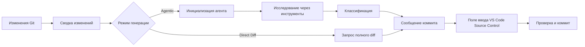

<!-- markdownlint-disable MD001 MD013 MD026 MD033 MD036 MD041 -->

<div align="center">


# Commit-Copilot

### Агентная генерация сообщений коммитов, понимающая ваш код, а не только diff.

Commit-Copilot — это расширение для VS Code, которое исследует ваш репозиторий с помощью многошагового автономного ИИ-агента, классифицирует изменения по строгим правилам Conventional Commits и записывает выверенные сообщения коммитов напрямую в панель Source Control.

Расширение безупречно работает с ведущими облачными LLM (Gemini, OpenAI, Anthropic Claude, DeepSeek), локальными моделями Ollama с акцентом на конфиденциальность и любыми пользовательскими эндпоинтами (совместимыми с форматами OpenAI и Anthropic).

[](https://marketplace.visualstudio.com/items?itemName=JeremySu0818.commit-copilot)
[](https://open-vsx.org/extension/JeremySu0818/commit-copilot)
[](https://open-vsx.org/extension/JeremySu0818/commit-copilot)
[](#требования)
[](#разработка)
[](#классификация-conventional-commits)
[](../../LICENSE)

**Агентное исследование · 9 встроенных провайдеров · Пользовательские эндпоинты · Поддержка локальной Ollama · 20 языков**

<p align="center">
  <b>Translations:</b>
  <a href="https://github.com/JeremySu0818/Commit-Copilot#readme">English</a> |
  <a href="https://github.com/JeremySu0818/Commit-Copilot/blob/main/docs/readme/README-zh-tw.md">繁體中文</a> |
  <a href="https://github.com/JeremySu0818/Commit-Copilot/blob/main/docs/readme/README-zh-cn.md">简体中文</a> |
  <a href="https://github.com/JeremySu0818/Commit-Copilot/blob/main/docs/readme/README-ja.md">日本語</a> |
  <a href="https://github.com/JeremySu0818/Commit-Copilot/blob/main/docs/readme/README-ko.md">한국어</a> |
  <a href="https://github.com/JeremySu0818/Commit-Copilot/blob/main/docs/readme/README-de.md">Deutsch</a> |
  <a href="https://github.com/JeremySu0818/Commit-Copilot/blob/main/docs/readme/README-fr.md">Français</a> |
  <a href="https://github.com/JeremySu0818/Commit-Copilot/blob/main/docs/readme/README-es.md">Español</a> |
  <a href="https://github.com/JeremySu0818/Commit-Copilot/blob/main/docs/readme/README-pt-br.md">Português (Brasil)</a> |
  <a href="https://github.com/JeremySu0818/Commit-Copilot/blob/main/docs/readme/README-ru.md">Русский</a> |
  <a href="https://github.com/JeremySu0818/Commit-Copilot/blob/main/docs/readme/README-it.md">Italiano</a> |
  <a href="https://github.com/JeremySu0818/Commit-Copilot/blob/main/docs/readme/README-nl.md">Nederlands</a> |
  <a href="https://github.com/JeremySu0818/Commit-Copilot/blob/main/docs/readme/README-pl.md">Polski</a> |
  <a href="https://github.com/JeremySu0818/Commit-Copilot/blob/main/docs/readme/README-tr.md">Türkçe</a> |
  <a href="https://github.com/JeremySu0818/Commit-Copilot/blob/main/docs/readme/README-vi.md">Tiếng Việt</a> |
  <a href="https://github.com/JeremySu0818/Commit-Copilot/blob/main/docs/readme/README-id.md">Bahasa Indonesia</a> |
  <a href="https://github.com/JeremySu0818/Commit-Copilot/blob/main/docs/readme/README-hu.md">Magyar</a> |
  <a href="https://github.com/JeremySu0818/Commit-Copilot/blob/main/docs/readme/README-cs.md">Čeština</a> |
  <a href="https://github.com/JeremySu0818/Commit-Copilot/blob/main/docs/readme/README-hi.md">हिन्दी</a> |
  <a href="https://github.com/JeremySu0818/Commit-Copilot/blob/main/docs/readme/README-ar.md">العربية</a>
</p>

</div>

---

## Почему Commit-Copilot?

Большинство инструментов генерации коммитов на базе ИИ просто отправляют необработанный diff в модель в надежде получить удачную однострочную сводку.

Commit-Copilot использует принципиально иной подход.

Он начинает с легковесных метаданных изменений, после чего автономный агент сам решает, что именно необходимо изучить: различия (diff), содержимое файлов, символы, ссылки и вызовы, общепроектные шаблоны и историю недавних коммитов. Лишь полностью поняв контекст и суть изменений, расширение классифицирует их и генерирует сообщение.

| Возможность                                       | Базовые инструменты diff-to-prompt | Commit-Copilot |
| ------------------------------------------------- | :--------------------------------: | :------------: |
| Немедленно читает весь diff целиком               |                 Да                 |  Опционально   |
| Выборочно исследует релевантные файлы             |                Нет                 |       Да       |
| Понимает структуру и структуру кода               |            Ограниченно             |       Да       |
| Находит ссылки на символы через LSP               |                Нет                 |       Да       |
| Ищет скрытые строковые связи и конфигурации       |                Нет                 |       Да       |
| Обучается на стиле недавних коммитов              |               Редко                |       Да       |
| Выполняет анализ с учетом индекса Git (staged)    |               Редко                |       Да       |
| Поддерживает локальные модели и агентные процессы |            Ограниченно             |       Да       |
| Применяет строгие границы типов коммитов          |         Зависит от модели          |       Да       |
| Никогда не индексирует файлы без согласия         |             По-разному             |       Да       |

> [!TIP]
> Используйте **Агентный (Agentic)** режим для максимальной точности и понимания контекста. Используйте режим **Direct Diff**, когда скорость важнее глубокого анализа.

---

## Главные преимущества

<table>
<tr>
<td width="50%" valign="top">

<h3>Агент с пониманием репозитория</h3>

Агент начинает с анализа имен файлов, типов изменений, количества строк и структуры проекта, после чего самостоятельно выбирает инструменты, необходимые для полного понимания изменений.

</td>
<td width="50%" valign="top">

<h3>Точность индекса Git</h3>

Для подготовленных (staged) изменений инструменты репозитория читают данные напрямую из индекса Git. Анализ ссылок LSP запускается во временном рабочем пространстве, воссозданном из проиндексированного состояния.

</td>
</tr>
<tr>
<td width="50%" valign="top">

<h3>Поддержка множества провайдеров</h3>

Используйте Google Gemini, OpenAI, Anthropic, xAI, Groq, OpenRouter, DeepSeek, Alibaba Qwen, Ollama или любой совместимый пользовательский эндпоинт.

</td>
<td width="50%" valign="top">

<h3>Строгий Conventional Commits</h3>

Поддерживаются все 11 типов Conventional Commits с приоритетными правилами классификации и четкими границами типов. Scope, Body, Footer и Gitmoji настраиваются независимо.

</td>
</tr>
<tr>
<td width="50%" valign="top">

<h3>Агентный процесс для локальных моделей</h3>

Модели Ollama могут использовать те же инструменты исследования через встроенный текстовый протокол Commit-Copilot — даже при отсутствии нативной поддержки tool-calling.

</td>
<td width="50%" valign="top">

<h3>Безопасный процесс с контролем пользователя</h3>

Commit-Copilot записывает результат прямо в поле ввода Source Control. Вы сохраняете полный контроль над индексацией, редактированием и фиксацией коммита.

</td>
</tr>
</table>

---

## Содержание

- [Как это работает](#как-это-работает)
- [Инструменты агента](#инструменты-агента)
- [Функциональные возможности](#функциональные-возможности)
- [Поддерживаемые провайдеры](#поддерживаемые-провайдеры)
- [Требования](#требования)
- [Установка](#установка)
- [Конфигурация](#конфигурация)
- [Использование](#использование)
- [Классификация Conventional Commits](#классификация-conventional-commits)
- [Обнаружение изменений](#обнаружение-изменений)
- [Локализация](#локализация)
- [Безопасность и конфиденциальность](#безопасность-и-конфиденциальность)
- [Разработка](#разработка)
- [Тестирование](#тестирование)
- [Часто задаваемые вопросы (FAQ)](#часто-задаваемые-вопросы-faq)
- [Участие в разработке](#участие-в-разработке)
- [Лицензия](#лицензия)

---

## Как это работает



### Агентный рабочий процесс (Agentic)

1. **Сбор метаданных об изменениях**
   Commit-Copilot собирает имена файлов, типы изменений, количество измененных строк и дерево структуры проекта.

2. **Инициализация агента**
   Модель получает структурированную сводку и системные инструкции для автономной генерации. Необработанный diff изначально не передается.

3. **Исследование с помощью инструментов**
   Агент выборочно инспектирует репозиторий, запрашивая только ту информацию, которую считает необходимой для понимания задачи.

4. **Классификация изменений**
   Правила с четким приоритетом определяют тип коммита. Если включен вывод Scope, агент также выбирает затронутый модуль или область.

5. **Генерация сообщения**
   Готовое сообщение записывается в поле ввода Source Control для вашей проверки и финального редактирования.

> [!NOTE]
> При включении **Гибридной генерации (Hybrid Generation)** существующий текст в поле Source Control используется как справочный черновик для формулировок и намерений. Любые инструкции внутри этого черновика не могут переопределить правила генерации.

### Рабочий процесс Direct Diff

Режим Direct Diff пропускает цикл исследования и отправляет полный diff выбранной модели в одном запросе. Это быстрее, поддерживается всеми провайдерами и отлично подходит для небольших или очевидных изменений.

---

## Инструменты агента

В ходе многошагового исследования агент может комбинировать следующие инструменты:

| Инструмент             | Назначение                                                                                                         |
| ---------------------- | ------------------------------------------------------------------------------------------------------------------ |
| `get_diff`             | Получает точный и полный diff для одного или нескольких запрошенных файлов.                                        |
| `read_file`            | Читает содержимое файла, опционально в диапазоне строк. При анализе staged-изменений читает данные из Git-индекса. |
| `get_file_outline`     | Возвращает структурную информацию: функции, классы, интерфейсы и экспорты.                                         |
| `find_references`      | Использует Language Server Protocol (LSP) VS Code для поиска синтаксических ссылок на символы.                     |
| `get_recent_commits`   | Читает недавние коммиты, чтобы перенять существующий стиль оформления в репозитории.                               |
| `search_code`          | Выполняет поиск по рабочему пространству для выявления неявных связей, не видимых через импорты.                   |
| `write_commit_message` | Отправляет итоговое структурированное сообщение коммита и завершает сессию.                                        |

Маршруты Gemini, Anthropic и OpenAI-совместимые используют нативные структурированные вызовы функций (tool calling). Ollama использует эквивалентный текстовый протокол с поддержкой пакетных вызовов, идентификаторов со стороны приложения, структурированных результатов, обработки ошибок отдельных вызовов и финальной отправки.

`get_diff` принимает либо один `path`, либо непустой массив `paths`. Пакетные запросы сокращают количество сетевых итераций, возвращая полный и точный diff каждого запрошенного файла без сокращений.

В агентном режиме можно включить обязательное полное покрытие diff. При активации в Настройках вызов `write_commit_message` отклоняется до тех пор, пока каждый измененный файл из валидного diff Git не будет проверен успешным вызовом `get_diff`. По умолчанию эта опция отключена для экономии токенов и ускорения работы.

---

## Функциональные возможности

### Генерация и анализ

- **Режимы Agentic и Direct Diff**
- **Настраиваемый лимит шагов агента (Max Agent Steps)**
- **Возможность отмены процесса исследования в любой момент**
- **Автоматические повторные попытки (retry)** при временных сбоях API и превышении rate limit
- **Межпроектный поиск шаблонов** для переменных окружения, имен событий, ключей конфигурации и строковых зависимостей
- **Радар влияния ссылок LSP** для синтаксического анализа изменений символов
- **Анализ недавних коммитов** для соответствия стилю проекта
- **Гибридная генерация (Hybrid Generation)** с безопасным использованием текста из Source Control как справочного черновика

### Работа с Git

- Определение 5 состояний репозитория: только подготовленные (staged), только неподготовленные (unstaged), смешанные (mixed), с неотслеживаемыми файлами и только неотслеживаемые (untracked-only)
- Запрос подтверждения перед индексацией неотслеживаемых файлов
- Никогда не выполняет автоматическую индексацию без явного согласия
- Чтение содержимого из индекса Git при исследовании staged-файлов
- Создание временного снимка рабочего пространства для корректного анализа ссылок LSP в staged-состоянии
- Обновление панели расширения в реальном времени при изменении состояния репозитория

### Настройка формата коммита

Независимое управление элементами:

- **Scope** (область)
- **Body** (тело сообщения)
- **Footer** (подвал / Breaking Changes)
- **Префикс Gitmoji**

Значения по умолчанию:

| Элемент | По умолчанию |
| ------- | :----------: |
| Scope   |   Включено   |
| Body    |   Включено   |
| Footer  |  Выключено   |
| Gitmoji |  Выключено   |

### Интеграция с VS Code

Запуск Commit-Copilot удобным способом:

- Иконка на **Activity Bar (боковой панели)**
- Кнопка-волшебная палочка в **панели навигации Source Control**
- Команда в **Command Palette**

Сгенерированное сообщение вставляется в стандартное поле ввода Source Control, где его можно просмотреть и отредактировать перед коммитом.

### Валидация провайдеров и управление моделями

- Проверка API-ключей реальным запросом к эндпоинту провайдера перед сохранением
- Наглядные и полезные сообщения об ошибках аутентификации, исчерпании квот и сетевых проблемах
- Динамическое получение списков моделей для OpenRouter, Alibaba Qwen, Ollama и кастомных провайдеров
- Возможность вручную добавлять и удалять идентификаторы моделей для Ollama и кастомных провайдеров
- Поддержка API-форматов, совместимых с OpenAI и Anthropic

---

## Поддерживаемые провайдеры

| Провайдер               | Особенности                                                                    |
| ----------------------- | ------------------------------------------------------------------------------ |
| **Google Gemini**       | Нативные структурированные инструменты и поддержка нескольких поколений Gemini |
| **OpenAI**              | Модели рассуждения (reasoning), универсальные, компактные и серия GPT-5        |
| **Anthropic**           | Семейства Claude Haiku, Sonnet, Opus и Fable                                   |
| **xAI Grok**            | Варианты Grok с поддержкой рассуждений и без нее                               |
| **Groq**                | Высокоскоростной хостинг моделей MiniMax, Qwen и `gpt-oss`                     |
| **OpenRouter**          | Динамический доступ к моделям с фильтрацией по поддержке инструментов          |
| **DeepSeek**            | DeepSeek V4.1 Flash                                                            |
| **Alibaba Qwen**        | Интеграция с DashScope и динамическое обнаружение моделей                      |
| **Ollama**              | Локальные модели, динамический список и встроенный протокол инструментов       |
| **Кастомный провайдер** | Любые эндпоинты, совместимые с OpenAI или Anthropic                            |

<details>
<summary><strong>Просмотреть семейства моделей, поддерживаемые в Commit-Copilot</strong></summary>

### Google Gemini

- Gemini 2.5 Flash-Lite, Flash и Pro
- Gemini 3 Flash
- Gemini 3.1 Flash-Lite и Pro
- Gemini 3.5 Flash-Lite и Flash
- Gemini 3.6 Flash
- Gemini 3.7 Flash
- Gemini 3.8 Flash

### OpenAI

- o3 и o3-mini
- o4-mini
- GPT-4o mini и GPT-4o
- GPT-4.1 nano, mini и GPT-4.1
- GPT-5 nano, mini и GPT-5
- GPT-5.1
- GPT-5.2
- GPT-5.4 nano, mini и GPT-5.4
- GPT-5.5
- GPT-5.6 Luna, Terra и Sol
- GPT-6 Astra

### Anthropic

- Claude Sonnet 4 и Opus 4
- Claude Opus 4.1
- Claude Haiku, Sonnet и Opus 4.5
- Claude Sonnet и Opus 4.6
- Claude Opus 4.7
- Claude Opus 4.8
- Claude Sonnet 5, Opus 5 и Fable 5
- Claude Fable 5.1

### xAI Grok

- Grok 4.20 (с рассуждениями и без)
- Grok 4.3
- Grok 4.5
- Grok 4.6

### Groq

- `gpt-oss-20B`
- `gpt-oss-120B`
- `gpt-oss-safeguard-20B`
- MiniMax M2.7
- Qwen 3.6 27b

### DeepSeek

- DeepSeek V4.1 Flash

> [!IMPORTANT]
> Доступность конкретных моделей зависит от провайдера, вашего аккаунта, региона и каталога API. Списки моделей для OpenRouter, Qwen, Ollama и кастомных провайдеров могут подгружаться динамически.

</details>

---

## Требования

- **VS Code** `1.91.0` или новее
- **Git**, доступный через встроенное расширение Git в VS Code
- Один из следующих вариантов доступа:
  - Действующий API-ключ поддерживаемого удаленного провайдера
  - Доступный локальный или удаленный экземпляр Ollama
  - Учетные данные для совместимого пользовательского эндпоинта

Для разработки:

- **Node.js** `20+`
- **npm**

---

## Установка

Установите Commit-Copilot из любого удобного каталога:

- [**Visual Studio Code Marketplace**](https://marketplace.visualstudio.com/items?itemName=JeremySu0818.commit-copilot)
- [**Open VSX Registry**](https://open-vsx.org/extension/JeremySu0818/commit-copilot)

После установки откройте любой Git-репозиторий в VS Code и нажмите на значок **Commit Copilot** на боковой панели (Activity Bar).

---

## Конфигурация

### Базовая настройка

1. Откройте панель **Commit Copilot** на боковой панели.
2. Выберите провайдера.
3. Введите API-ключ провайдера или URL-адрес хоста Ollama.
4. Нажмите **Сохранить**.
5. Дождитесь проверки учетных данных в реальном времени.
6. Выберите модель из списка доступных.

> [!IMPORTANT]
> При использовании Ollama расширение перед каждой генерацией выполняет команду `ollama pull` для выбранной модели и отображает прогресс в области уведомлений. Это гарантирует актуальность модели, но может повторно загружать слои, даже если модель уже установлена локально.

### Параметры

| Параметр                   | По умолчанию | Описание                                                                                                        |
| -------------------------- | ------------ | --------------------------------------------------------------------------------------------------------------- |
| **Режим генерации**        | Agentic      | `Agentic` выполняет многошаговое исследование. `Direct Diff` отправляет полный diff за один запрос.             |
| **Гибридная генерация**    | Выключено    | Текст в поле Source Control используется как справочный черновик и изолируется от системных инструкций промпта. |
| **Макс. шагов агента**     | `0`          | Максимальное число вызовов инструментов агентом. Укажите `0` для снятия ограничения.                            |
| **Включить Scope**         | Включено     | Требует указания области (Scope) по стандарту Conventional Commits в теме коммита.                              |
| **Включить Body**          | Включено     | Требует подробного описательного тела коммита.                                                                  |
| **Включить Footer**        | Выключено    | Требует блока подвала (например, Breaking Changes); неподтвержденные факты никогда не выдумываются.             |
| **Включить Gitmoji**       | Выключено    | Добавляет ровно один подходящий префикс Gitmoji в тему коммита.                                                 |
| **Язык расширения**        | Авто         | Язык интерфейса расширения. Следует за языком VS Code, если не зафиксирован вручную.                            |
| **Язык сообщений коммита** | Английский   | Управляет языком генерируемой темы, тела и подвала коммита независимо от интерфейса.                            |

### Пользовательский провайдер (Custom Provider)

Чтобы подключить эндпоинт, совместимый с OpenAI или Anthropic:

1. Откройте настройки провайдера в панели.
2. Нажмите **+ Добавить провайдера...**.
3. Выберите формат API (`OpenAI-compatible` или `Anthropic-compatible`).
4. Введите отображаемое имя и базовый URL-адрес API.
5. Сохраните конфигурацию провайдера.
6. Введите и проверьте API-ключ.
7. Выберите модель из полученного списка или добавьте идентификаторы моделей вручную через **Управление моделями...**.

Для Anthropic-совместимых эндпоинтов также можно настроить лимит выходных токенов (`max_tokens`).

---

## Использование

### Способ A: Боковая панель (Activity Bar)

1. Откройте панель **Commit Copilot**.
2. Убедитесь, что в репозитории есть подготовленные, неподготовленные или неотслеживаемые изменения.
3. Нажмите **Сгенерировать сообщение коммита**.
4. При появлении диалогового окна выберите нужный набор файлов.

### Способ B: Панель Source Control

1. Откройте панель Source Control с помощью `Ctrl+Shift+G` (на macOS: `Cmd+Shift+G`).
2. Нажмите на иконку волшебной палочки Commit-Copilot на панели навигации.

### Способ C: Палитра команд (Command Palette)

1. Откройте палитру команд:
   - Windows/Linux: `Ctrl+Shift+P`
   - macOS: `Cmd+Shift+P`
2. Выполните команду **Commit-Copilot: Generate Commit Message**.

### Проверка и коммит

Сгенерированное сообщение появится в стандартном поле ввода Source Control.

Вы можете проверить текст, внести необходимые правки и зафиксировать коммит штатной кнопкой VS Code.

---

## Классификация Conventional Commits

Commit-Copilot строго поддерживает 11 типов Conventional Commits:

| Тип        | Назначение                                                               |
| ---------- | ------------------------------------------------------------------------ |
| `feat`     | Добавление новой функциональности для пользователя                       |
| `fix`      | Исправление ошибки или некорректного поведения                           |
| `docs`     | Изменения исключительно в документации                                   |
| `style`    | Правки форматирования, пробелов и оформления, не влияющие на логику кода |
| `refactor` | Реструктуризация кода без добавления функций и без исправления багов     |
| `perf`     | Улучшение производительности                                             |
| `test`     | Добавление или обновление тестов                                         |
| `build`    | Изменения в системе сборки или внешних зависимостях                      |
| `ci`       | Настройка непрерывной интеграции (CI) и пайплайнов                       |
| `chore`    | Рутинное обслуживание, не подпадающее под другие категории               |
| `revert`   | Откат предыдущего коммита                                                |

Сгенерированный текст строго следует синтаксису Conventional Commits:

```text
type(scope): краткое и емкое описание

Подробное тело коммита с объяснением того, что изменилось и почему.
```

В зависимости от настроек элементы Scope, Body, Footer и Gitmoji могут быть включены или опущены. Первая строка темы ограничена 72 символами (рекомендуется около 50).

---

## Обнаружение изменений

Commit-Copilot распознает 5 состояний репозитория Git:

| Сценарий                                    | Поведение                                                                   |
| ------------------------------------------- | --------------------------------------------------------------------------- |
| **Только подготовленные (Staged only)**     | Использует diff подготовленных изменений и инструменты с учетом Git-индекса |
| **Только неподготовленные (Unstaged only)** | Анализирует изменения в рабочей директории                                  |
| **Смешанные изменения (Mixed)**             | Предлагает выбрать область изменений через диалоговое окно                  |
| **Неподготовленные + неотслеживаемые**      | Предоставляет контекстные варианты обработки                                |
| **Только неотслеживаемые (Untracked only)** | Предлагает проиндексировать новые файлы и сгенерировать коммит              |

Ни один файл не индексируется автоматически без вашего прямого подтверждения.

---

## Локализация

Интерфейс расширения может автоматически следовать за языком VS Code или быть зафиксирован на одном из 20 поддерживаемых языков:

<table>
<tr>
<td><a href="README-ar.md">العربية</a></td>
<td><a href="README-cs.md">Čeština</a></td>
<td><a href="README-de.md">Deutsch</a></td>
<td><a href="../../README.md">English</a></td>
</tr>
<tr>
<td><a href="README-es.md">Español</a></td>
<td><a href="README-fr.md">Français</a></td>
<td><a href="README-hi.md">हिन्दी</a></td>
<td><a href="README-hu.md">Magyar</a></td>
</tr>
<tr>
<td><a href="README-id.md">Bahasa Indonesia</a></td>
<td><a href="README-it.md">Italiano</a></td>
<td><a href="README-ja.md">日本語</a></td>
<td><a href="README-ko.md">한국어</a></td>
</tr>
<tr>
<td><a href="README-nl.md">Nederlands</a></td>
<td><a href="README-pl.md">Polski</a></td>
<td><a href="README-pt-br.md">Português (Brasil)</a></td>
<td><a href="README-ru.md">Русский</a></td>
</tr>
<tr>
<td><a href="README-tr.md">Türkçe</a></td>
<td><a href="README-vi.md">Tiếng Việt</a></td>
<td><a href="README-zh-cn.md">简体中文</a></td>
<td><a href="README-zh-tw.md">繁體中文</a></td>
</tr>
</table>

**Язык сообщения коммита** настраивается отдельно от языка интерфейса расширения, поэтому они могут различаться (например, интерфейс на русском, а коммиты на английском).

---

## Безопасность и конфиденциальность

- API-ключи безопасно сохраняются через **VS Code Secret Storage**
- Ключи проверяются напрямую на эндпоинтах выбранных провайдеров перед сохранением
- Commit-Copilot никогда не индексирует файлы без явного согласия
- Режим гибридной генерации изолирует текст из Source Control как недоверенный справочный материал
- Удаленные запросы содержат только метаданные репозитория, diff или фрагменты файлов, запрошенные агентом
- При использовании локальной Ollama весь вывод и данные остаются исключительно в вашей локальной среде

> [!CAUTION]
> Перед отправкой проприетарного или конфиденциального кода репозитория ознакомьтесь с политикой конфиденциальности выбранного облачного провайдера.

---

## Разработка

### Установка зависимостей

```bash
npm install
```

### Сборка для разработки

```bash
npm run compile
```

Для непрерывной сборки с отслеживанием изменений TypeScript и esbuild:

```bash
npm run watch
```

### Сборка пакета VSIX

```bash
npm run build
```

Скрипт сборки устанавливает зависимости, запускает пайплайн упаковки VS Code и создает готовый `.vsix`-пакет.

### Контроль качества кода

Проверка правил линтера:

```bash
npm run lint
```

Форматирование исходных файлов:

```bash
npm run format
```

Проверка форматирования без изменения файлов:

```bash
npm run check-format
```

---

## Тестирование

Запуск полного набора модульных тестов:

```bash
npm test
```

Команда выполняет:

1. `npm run test:build`
2. `node --test --test-concurrency=1 "out/test/**/*.test.js"`

Текущее покрытие включает:

- Все инструменты агента:
  - `get_diff`
  - `read_file`
  - `get_file_outline`
  - `find_references`
  - `get_recent_commits`
  - `search_code`
- Нативные агентные циклы со структурированными вызовами инструментов
- Агентные циклы текстового протокола Ollama
- Пакетные вызовы и локализованные схемы инструментов
- Восстановление после некорректных ответов модели
- Валидацию финальной отправки сообщения коммита
- Диспетчеризацию вызовов через `executeToolCall`
- Парсинг и формирование контекста
- Утилиты снимков проиндексированного рабочего пространства
- Логику автоматических повторных попыток (retry)
- Локализацию сообщений об ошибках
- Поведение провайдера основного вебвью-представления
- Управление пользовательскими моделями
- Менеджеры состояний

---

## Часто задаваемые вопросы (FAQ)

<details>
<summary><strong>Фиксирует ли Commit-Copilot коммит автоматически?</strong></summary>

Нет. Расширение лишь записывает сгенерированное сообщение в поле ввода Source Control. Вы можете просмотреть его, отредактировать и зафиксировать коммит самостоятельно.

</details>

<details>
<summary><strong>Отправляет ли агент весь мой репозиторий в ИИ?</strong></summary>

В агентном режиме вначале передаются только метаданные изменений и структура отслеживаемых файлов — без содержимого всех файлов. Затем агент точечно запрашивает diff, файлы, ссылки или результаты поиска по мере необходимости. Режим Direct Diff отправляет только полный diff выбранных изменений.

</details>

<details>
<summary><strong>Могут ли модели Ollama использовать инструменты без нативной поддержки tool-calling?</strong></summary>

Да. Commit-Copilot содержит специальный текстовый протокол инструментов, предоставляющий моделям Ollama доступ к полноценному многошаговому процессу исследования.

</details>

<details>
<summary><strong>Что означает «Макс. шагов агента = 0»?</strong></summary>

Значение `0` снимает ограничение на количество шагов вызова инструментов. Любое положительное число задает строгий лимит шагов исследования перед формированием финального сообщения.

</details>

<details>
<summary><strong>Можно ли использовать сторонний эндпоинт, отсутствующий в списке?</strong></summary>

Да. Добавьте его как кастомного провайдера с форматом, совместимым с OpenAI или Anthropic, после чего выберите полученные модели или введите идентификаторы моделей вручную.

</details>

<details>
<summary><strong>Почему Ollama выполняет pull модели перед каждой генерацией?</strong></summary>

Расширение запускает `ollama pull` перед генерацией, чтобы гарантировать наличие и актуальность выбранной модели в вашей системе. В зависимости от локального состояния это может привести к повторной проверке или докачке слоев модели.

</details>

---

## Участие в разработке

Мы приветствуем вклад сообщества в развитие проекта!

Рекомендуемый порядок внесения изменений:

1. Создайте отдельную тематическую ветку.
2. Внесите изменения.
3. Запустите линтер, проверку форматирования и тесты.
4. Понятно опишите мотивацию и логику изменений в Pull Request.
5. Добавьте тесты, покрывающие новые или измененные сценарии поведения.

Перед отправкой изменений выполните:

```bash
npm run lint
npm run check-format
npm test
```

При сообщении об ошибках указывайте используемого провайдера, модель, режим генерации, состояние изменений Git, соответствующие логи и шаги для воспроизведения. Никогда не прикрепляйте API-ключи и конфиденциальные данные репозитория.

---

## Лицензия

Commit-Copilot распространяется под [лицензией MIT](../../LICENSE).

---

<div align="center">

Создано для разработчиков, которым важен контекст коммитов, а не догадки наугад.

</div>
