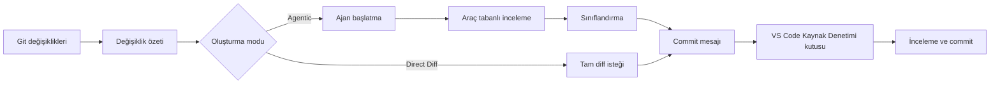

<!-- markdownlint-disable MD001 MD013 MD026 MD033 MD036 MD041 -->

<div align="center">


# Commit-Copilot

### Yalnızca diff'inizi değil, kodunuzun tamamını anlayan ajan (agentic) tabanlı commit mesajı oluşturucu.

Commit-Copilot, çok adımlı otonom bir yapay zeka ajanıyla deponuzu derinlemesine inceleyen, değişiklikleri katı Conventional Commits kurallarına göre sınıflandıran ve kusursuz commit mesajlarını doğrudan Kaynak Denetimi (Source Control) kutusuna yazan bir VS Code eklentisidir.

Önde gelen bulut LLM'leri (Gemini, OpenAI, Anthropic Claude, DeepSeek), gizlilik odaklı yerel Ollama modelleri ve özel uç noktalarla (OpenAI ve Anthropic uyumlu biçimler) sorunsuz çalışır.

[](https://marketplace.visualstudio.com/items?itemName=JeremySu0818.commit-copilot)
[](https://open-vsx.org/extension/JeremySu0818/commit-copilot)
[](https://open-vsx.org/extension/JeremySu0818/commit-copilot)
[](#gereksinimler)
[](#geliştirme)
[](#conventional-commits-sınıflandırması)
[](../../LICENSE)

**Ajan incelemesi · 9 yerleşik sağlayıcı · Özel uç noktalar · Yerel Ollama desteği · 20 dil**

<p align="center">
  <b>Translations:</b>
  <a href="https://github.com/JeremySu0818/Commit-Copilot#readme">English</a> |
  <a href="https://github.com/JeremySu0818/Commit-Copilot/blob/main/docs/readme/README-zh-tw.md">繁體中文</a> |
  <a href="https://github.com/JeremySu0818/Commit-Copilot/blob/main/docs/readme/README-zh-cn.md">简体中文</a> |
  <a href="https://github.com/JeremySu0818/Commit-Copilot/blob/main/docs/readme/README-ja.md">日本語</a> |
  <a href="https://github.com/JeremySu0818/Commit-Copilot/blob/main/docs/readme/README-ko.md">한국어</a> |
  <a href="https://github.com/JeremySu0818/Commit-Copilot/blob/main/docs/readme/README-de.md">Deutsch</a> |
  <a href="https://github.com/JeremySu0818/Commit-Copilot/blob/main/docs/readme/README-fr.md">Français</a> |
  <a href="https://github.com/JeremySu0818/Commit-Copilot/blob/main/docs/readme/README-es.md">Español</a> |
  <a href="https://github.com/JeremySu0818/Commit-Copilot/blob/main/docs/readme/README-pt-br.md">Português (Brasil)</a> |
  <a href="https://github.com/JeremySu0818/Commit-Copilot/blob/main/docs/readme/README-ru.md">Русский</a> |
  <a href="https://github.com/JeremySu0818/Commit-Copilot/blob/main/docs/readme/README-it.md">Italiano</a> |
  <a href="https://github.com/JeremySu0818/Commit-Copilot/blob/main/docs/readme/README-nl.md">Nederlands</a> |
  <a href="https://github.com/JeremySu0818/Commit-Copilot/blob/main/docs/readme/README-pl.md">Polski</a> |
  <a href="https://github.com/JeremySu0818/Commit-Copilot/blob/main/docs/readme/README-tr.md">Türkçe</a> |
  <a href="https://github.com/JeremySu0818/Commit-Copilot/blob/main/docs/readme/README-vi.md">Tiếng Việt</a> |
  <a href="https://github.com/JeremySu0818/Commit-Copilot/blob/main/docs/readme/README-id.md">Bahasa Indonesia</a> |
  <a href="https://github.com/JeremySu0818/Commit-Copilot/blob/main/docs/readme/README-hu.md">Magyar</a> |
  <a href="https://github.com/JeremySu0818/Commit-Copilot/blob/main/docs/readme/README-cs.md">Čeština</a> |
  <a href="https://github.com/JeremySu0818/Commit-Copilot/blob/main/docs/readme/README-hi.md">हिन्दी</a> |
  <a href="https://github.com/JeremySu0818/Commit-Copilot/blob/main/docs/readme/README-ar.md">العربية</a>
</p>

</div>

---

## Neden Commit-Copilot?

Çoğu yapay zeka commit aracı, işlenmemiş ham diff'i modele gönderir ve tek satırlık iyi bir özet çıkarmasını umar.

Commit-Copilot tamamen farklı bir yaklaşım benimser.

Hafif değişiklik meta verileriyle başlar, ardından neyi incelemesi gerektiğine otonom bir ajanın karar vermesine izin verir: diff'ler, dosya içerikleri, semboller, referanslar, proje genelindeki kalıplar ve son commit geçmişi. Ancak değişikliği ve etki alanını tam olarak anladıktan sonra sınıflandırma yapar ve mesajı üretir.

| Yetenek                                        | Temel diff-to-prompt araçları | Commit-Copilot |
| ---------------------------------------------- | :---------------------------: | :------------: |
| Diff'in tamamını anında okur                   |             Evet              |  İsteğe bağlı  |
| İlgili dosyaları seçerek derinlemesine inceler |             Hayır             |      Evet      |
| Kod yapısını ve sembollerini anlar             |            Sınırlı            |      Evet      |
| LSP aracılığıyla sembol referanslarını bulur   |             Hayır             |      Evet      |
| Gizli dize/yapılandırma ilişkilerini arar      |             Hayır             |      Evet      |
| Son commit yazım tarzından öğrenir             |            Nadiren            |      Evet      |
| Git hazırlama dizini (index) odaklı analiz     |            Nadiren            |      Evet      |
| Yerel ve ajan tabanlı iş akışlarını destekler  |            Sınırlı            |      Evet      |
| Katı commit türü sınırlarını uygular           |         Modele bağlı          |      Evet      |
| Onay almadan asla dosyaları hazırlamaz         |           Değişken            |      Evet      |

> [!TIP]
> Doğruluk ve eksiksiz bağlam için **Ajan (Agentic)** modunu kullanın. Hız derin incelemeden daha önemli olduğunda **Doğrudan Diff (Direct Diff)** modunu tercih edin.

---

## Öne Çıkan Özellikler

<table>
<tr>
<td width="50%" valign="top">

<h3>Depo farkındalığına sahip ajan</h3>

Ajan dosya adları, değişiklik türleri, satır sayıları ve proje yapısıyla başlar; ardından değişikliği kavramak için gereken araçları kendisi seçer.

</td>
<td width="50%" valign="top">

<h3>Git hazırlama dizini (Index) hassasiyeti</h3>

Hazırlanan (staged) değişiklikler için araçlar Git dizinindeki içeriği tercih eder. LSP referans analizi, hazırlanan durumdan yeniden oluşturulan geçici bir çalışma alanında çalışır.

</td>
</tr>
<tr>
<td width="50%" valign="top">

<h3>Çoklu sağlayıcı mimarisi</h3>

Google Gemini, OpenAI, Anthropic, xAI, Groq, OpenRouter, DeepSeek, Alibaba Qwen, Ollama veya uyumlu herhangi bir özel uç noktayı kullanın.

</td>
<td width="50%" valign="top">

<h3>Katı Conventional Commits kuralları</h3>

11 Conventional Commit türünün tümünü destekler, öncelik sıralı sınıflandırma kuralları ve açık tür sınırları uygular. Scope, Body, Footer ve Gitmoji bağımsız olarak yapılandırılabilir.

</td>
</tr>
<tr>
<td width="50%" valign="top">

<h3>Yerel model ajan iş akışı</h3>

Ollama modelleri, yerel araç çağırma (tool calling) desteği olmasa bile Commit-Copilot'un yerleşik metin protokolü aracılığıyla aynı inceleme araçlarını kullanabilir.

</td>
<td width="50%" valign="top">

<h3>Güvenli, inceleme odaklı iş akışı</h3>

Commit-Copilot oluşturulan sonucu Kaynak Denetimi giriş kutusuna yazar. Hazırlama, düzenleme ve commit etme üzerinde tam kontrole sahipsiniz.

</td>
</tr>
</table>

---

## İçindekiler

- [Nasıl Çalışır?](#nasıl-çalışır)
- [Ajan Araçları](#ajan-araçları)
- [Özellikler](#özellikler)
- [Desteklenen Sağlayıcılar](#desteklenen-sağlayıcılar)
- [Gereksinimler](#gereksinimler)
- [Kurulum](#kurulum)
- [Yapılandırma](#yapılandırma)
- [Kullanım](#kullanım)
- [Conventional Commits Sınıflandırması](#conventional-commits-sınıflandırması)
- [Değişiklik Algılama](#değişiklik-algılama)
- [Yerelleştirme](#yerelleştirme)
- [Güvenlik ve Gizlilik](#güvenlik-ve-gizlilik)
- [Geliştirme](#geliştirme)
- [Test](#test)
- [Sıkça Sorulan Sorular (SSS)](#sıkça-sorulan-sorular-sss)
- [Katkıda Bulunma](#katkıda-bulunma)
- [Lisans](#lisans)

---

## Nasıl Çalışır?



### Ajan tabanlı (Agentic) iş akışı

1. **Değişiklik meta verilerini toplama**
   Commit-Copilot dosya adlarını, değişiklik türlerini, satır sayılarını ve proje dizin ağacını toplar.

2. **Ajanı başlatma**
   Model, yapılandırılmış özeti ve otonom üretim talimatlarını alır. İlk aşamada ham diff gönderilmez.

3. **Araçlarla inceleme yapma**
   Ajan depoyu seçici olarak inceler ve yalnızca yararlı gördüğü bağlamı talep eder.

4. **Değişikliği sınıflandırma**
   Öncelik sıralı kurallar commit türünü belirler. Scope etkinleştirilmişse, ajan etkilenen modülü veya alanı da seçer.

5. **Mesajı oluşturma**
   Nihai mesaj incelemeniz ve düzenlemeniz için Kaynak Denetimi (Source Control) kutusuna yazılır.

> [!NOTE]
> **Hibrit Oluşturma (Hybrid Generation)** etkinleştirildiğinde, Kaynak Denetimi kutusundaki mevcut metin yalnızca ifade ve niyet için referans taslak olarak kullanılır. Bu taslaktaki talimat benzeri içerikler üretim kurallarını geçersiz kılamaz.

### Doğrudan Diff (Direct Diff) iş akışı

Direct Diff, inceleme döngüsünü atlar ve tam diff'i tek bir istekte seçilen modele gönderir. Daha hızlıdır, her sağlayıcı için kullanılabilir ve küçük veya açık değişiklikler için idealdir.

---

## Ajan Araçları

Ajan, çok adımlı inceleme boyunca aşağıdaki araçları bir arada kullanabilir:

| Araç                   | Amaç                                                                                                                      |
| ---------------------- | ------------------------------------------------------------------------------------------------------------------------- |
| `get_diff`             | İstenen bir veya birden çok dosya için eksiksiz ve kesin diff'i alır.                                                     |
| `read_file`            | Dosya içeriğini (isteğe bağlı olarak satır aralığında) okur. Hazırlanan değişikliklerde Git dizini içeriğini tercih eder. |
| `get_file_outline`     | Fonksiyonlar, sınıflar, arayüzler ve dışa aktarılanlar gibi yapısal bilgileri döndürür.                                   |
| `find_references`      | Sözdizimi duyarlı sembol referanslarını bulmak için VS Code Dil Sunucusu Protokolü'nü (LSP) kullanır.                     |
| `get_recent_commits`   | Deponun mevcut commit stilini öğrenmek için son commit mesajlarını okur.                                                  |
| `search_code`          | Yalnızca import'ların ortaya çıkaramayacağı dize veya kalıpları bulmak için çalışma alanında arama yapar.                 |
| `write_commit_message` | Yapılandırılmış son commit mesajını gönderir ve oturumu tamamlar.                                                         |

Gemini, Anthropic ve OpenAI uyumlu rotalar yerel yapılandırılmış araç çağrılarını (tool calling) kullanır. Ollama; toplu çağrılar, uygulama tarafından atanan çağrı kimlikleri, yapılandırılmış sonuçlar, çağrı bazlı hatalar ve nihai gönderim desteğine sahip eşdeğer bir metin protokolü kullanır.

`get_diff`, tek bir `path` veya boş olmayan bir `paths` dizisini kabul eder. Çoklu dosya istekleri, istenen her dosyanın tam diff'ini eksiksiz döndürürken araç tur sayısını önemli ölçüde azaltır.

Ajan modunda isteğe bağlı olarak tam diff kapsamı zorunlu kılınabilir. Ayarlar'da etkinleştirildiğinde, geçerli bir Git diff'indeki her değiştirilmiş dosya başarılı bir `get_diff` çağrısıyla taranana kadar `write_commit_message` çağrısı reddedilir. Bu ayar, token kullanımını ve süreyi korumak için varsayılan olarak kapalıdır.

---

## Özellikler

### Oluşturma ve analiz

- **Agentic ve Direct Diff modları**
- **Yapılandırılabilir maksimum ajan adım sınırı (Max Agent Steps)**
- **İstendiğinde iptal edilebilir inceleme süreci**
- **Otomatik yeniden deneme (retry)**: Geçici uzak API hataları ve rate limit durumlarında otomatik bekleme ve yeniden deneme
- **Proje genelinde kalıp arama**: Ortam değişkenleri, olay adları, yapılandırma anahtarları ve dize ilişkileri için arama
- **LSP referans etki radarı**: Sembol değişikliklerinin sözdizimsel analizi
- **Son commit incelemesi**: Proje gelenekleriyle kusursuz uyum
- **Hibrit Oluşturma (Hybrid Generation)**: Mevcut SCM metnini güvenli bir referans taslağı olarak kullanma

### Git odaklı davranış

- 5 depo durumunu algılama: Yalnızca hazırlanan (staged), yalnızca hazırlanmayan (unstaged), karışık (mixed), izlenmeyen dosya içeren ve yalnızca izlenmeyen (untracked-only)
- İzlenmeyen dosyaları hazırlamadan önce onay isteme
- Açık onay olmadan asla otomatik hazırlama (stage) yapmama
- Hazırlanan dosyalar incelenirken Git dizini içeriğine öncelik verme
- Hazırlanan durumdaki LSP referans analizi için geçici bir çalışma alanı anlık görüntüsü oluşturma
- Depo durumu değiştikçe ana paneli gerçek zamanlı güncelleme

### Commit çıktısı denetimleri

Aşağıdaki öğeleri bağımsız olarak açıp kapatabilirsiniz:

- **Scope** (Kapsam)
- **Body** (Gövde metni)
- **Footer** (Altbilgi / Breaking Changes)
- **Gitmoji öneki**

Varsayılan Değerler:

| Öğe     | Varsayılan |
| ------- | :--------: |
| Scope   |    Açık    |
| Body    |    Açık    |
| Footer  |   Kapalı   |
| Gitmoji |   Kapalı   |

### VS Code entegrasyonu

Commit-Copilot'u dilediğiniz yerden başlatın:

- **Etkinlik Çubuğu (Activity Bar)** simgesi
- **Kaynak Denetimi (Source Control)** gezinti çubuğundaki sihirli değnek simgesi
- **Komut Paleti (Command Palette)**

Oluşturulan mesajlar, commit öncesinde incelenebilecekleri ve düzenlenebilecekleri standart Kaynak Denetimi kutusuna otomatik yazılır.

### Sağlayıcı doğrulama ve model yönetimi

- API anahtarları kaydedilmeden önce sağlayıcının gerçek uç noktasına karşı doğrulanır
- Kimlik doğrulama, kota ve bağlantı hataları için açıklayıcı ve eyleme geçirilebilir yönlendirmeler sağlanır
- OpenRouter, Alibaba Qwen, Ollama ve özel sağlayıcılar için model listeleri dinamik olarak alınabilir
- Ollama ve özel sağlayıcılar için model kimlikleri manuel olarak eklenebilir ve silinebilir
- Özel sağlayıcılar hem OpenAI uyumlu hem de Anthropic uyumlu API'leri destekler

---

## Desteklenen Sağlayıcılar

| Sağlayıcı          | Öne Çıkan Özellikler                                                 |
| ------------------ | -------------------------------------------------------------------- |
| **Google Gemini**  | Yerel yapılandırılmış araçlar ve birden çok Gemini nesli desteği     |
| **OpenAI**         | Muhakeme (reasoning), genel amaçlı, kompakt ve GPT-5 serisi modeller |
| **Anthropic**      | Claude Haiku, Sonnet, Opus ve Fable aileleri                         |
| **xAI Grok**       | Muhakeme yetenekli ve standart Grok modelleri                        |
| **Groq**           | Yüksek hızlı MiniMax, Qwen ve `gpt-oss` barındırma                   |
| **OpenRouter**     | Araç çağırma filtrelemesiyle geniş model kataloğuna dinamik erişim   |
| **DeepSeek**       | DeepSeek V4.1 Flash                                                  |
| **Alibaba Qwen**   | DashScope entegrasyonu ve dinamik model keşfi                        |
| **Ollama**         | Dinamik model listesi ve yerleşik araç protokolüyle yerel modeller   |
| **Özel Sağlayıcı** | OpenAI veya Anthropic uyumlu herhangi bir özel uç nokta              |

<details>
<summary><strong>Commit-Copilot tarafından listelenen model ailelerini görüntüleyin</strong></summary>

### Google Gemini

- Gemini 2.5 Flash-Lite, Flash ve Pro
- Gemini 3 Flash
- Gemini 3.1 Flash-Lite ve Pro
- Gemini 3.5 Flash-Lite ve Flash
- Gemini 3.6 Flash
- Gemini 3.7 Flash
- Gemini 3.8 Flash

### OpenAI

- o3 ve o3-mini
- o4-mini
- GPT-4o mini ve GPT-4o
- GPT-4.1 nano, mini ve GPT-4.1
- GPT-5 nano, mini ve GPT-5
- GPT-5.1
- GPT-5.2
- GPT-5.4 nano, mini ve GPT-5.4
- GPT-5.5
- GPT-5.6 Luna, Terra ve Sol
- GPT-6 Astra

### Anthropic

- Claude Sonnet 4 ve Opus 4
- Claude Opus 4.1
- Claude Haiku, Sonnet ve Opus 4.5
- Claude Sonnet ve Opus 4.6
- Claude Opus 4.7
- Claude Opus 4.8
- Claude Sonnet 5, Opus 5 ve Fable 5
- Claude Fable 5.1

### xAI Grok

- Grok 4.20 (muhakeme ve standart)
- Grok 4.3
- Grok 4.5
- Grok 4.6

### Groq

- `gpt-oss-20B`
- `gpt-oss-120B`
- `gpt-oss-safeguard-20B`
- MiniMax M2.7
- Qwen 3.6 27b

### DeepSeek

- DeepSeek V4.1 Flash

> [!IMPORTANT]
> Model kullanılabilirliği sağlayıcıya, hesabınıza, bölgenize ve geçerli API kataloğuna bağlıdır. OpenRouter, Qwen, Ollama ve özel sağlayıcı model listeleri dinamik olarak keşfedilebilir.

</details>

---

## Gereksinimler

- **VS Code** `1.91.0` veya daha yeni bir sürüm
- **Git** (VS Code'un yerleşik Git eklentisi aracılığıyla erişilebilir)
- Aşağıdakilerden biri:
  - Desteklenen bir uzak sağlayıcı için geçerli bir API anahtarı
  - Erişilebilir bir yerel veya uzak Ollama örneği
  - Uyumlu bir özel uç nokta için erişim bilgileri

Geliştirme için:

- **Node.js** `20+`
- **npm**

---

## Kurulum

Commit-Copilot'u dilediğiniz platformdan yükleyin:

- [**Visual Studio Code Marketplace**](https://marketplace.visualstudio.com/items?itemName=JeremySu0818.commit-copilot)
- [**Open VSX Registry**](https://open-vsx.org/extension/JeremySu0818/commit-copilot)

Kurulumun ardından VS Code'da bir Git deposu açın ve Etkinlik Çubuğu'ndaki **Commit Copilot** simgesine tıklayın.

---

## Yapılandırma

### Temel Kurulum

1. Etkinlik Çubuğu'ndan **Commit Copilot** görünümünü açın.
2. Bir sağlayıcı seçin.
3. Sağlayıcı API anahtarınızı veya Ollama ana makine URL'sini girin.
4. **Kaydet**'e tıklayın.
5. Gerçek zamanlı kimlik doğrulamasının tamamlanmasını bekleyin.
6. Model seçimi kullanılabilir olduğunda bir model seçin.

> [!IMPORTANT]
> Ollama kullanıldığında, eklenti her oluşturma işleminden önce seçilen model için `ollama pull` çalıştırır ve bildirim alanında ilerlemeyi gösterir. Bu işlem model yerel olarak mevcut olsa bile katmanları yeniden doğrulayabilir.

### Seçenekler

| Seçenek                      | Varsayılan | Açıklama                                                                                              |
| ---------------------------- | ---------- | ----------------------------------------------------------------------------------------------------- |
| **Oluşturma Modu**           | Agentic    | `Agentic` çok adımlı bir inceleme döngüsü yürütür. `Direct Diff` tüm diff'i tek istekte gönderir.     |
| **Hibrit Oluşturma**         | Kapalı     | Kaynak Denetimi metnini referans taslak olarak kullanır ve istem talimatlarından izole eder.          |
| **Maksimum Ajan Adımı**      | `0`        | Ajan araç çağırma adımlarının üst sınırıdır. Sınırsız kullanım için `0` yapın.                        |
| **Kapsamı (Scope) Dahil Et** | Açık       | Etkinleştirildiğinde konuda Conventional Commits kapsamı (Scope) bulunmasını zorunlu kılar.           |
| **Gövdeyi (Body) Dahil Et**  | Açık       | Etkinleştirildiğinde ayrıntılı bir açıklama gövdesi oluşturulmasını gerektirir.                       |
| **Altbilgiyi Dahil Et**      | Kapalı     | Etkinleştirildiğinde altbilgi bölümü üretir (Breaking Changes vb.); asılsız bilgiler asla uydurulmaz. |
| **Gitmoji Dahil Et**         | Kapalı     | Etkinleştirildiğinde konu başlığına tek bir eşleşen Gitmoji öneki ekler.                              |
| **Eklenti Dili**             | Otomatik   | Manuel olarak sabitlenmedikçe VS Code'un görüntüleme dilini takip eder.                               |
| **Commit Mesajı Dili**       | İngilizce  | Oluşturulan konu, gövde ve altbilgi dilini eklenti arayüzünden bağımsız olarak denetler.              |

### Özel Sağlayıcı (Custom Provider)

OpenAI veya Anthropic uyumlu bir uç nokta eklemek için:

1. Sağlayıcı ayarlarını açın.
2. **+ Sağlayıcı Ekle...** seçeneğine tıklayın.
3. API biçimini (`OpenAI-compatible` veya `Anthropic-compatible`) seçin.
4. Görünen adı ve API Temel URL adresini girin.
5. Sağlayıcıyı kaydedin.
6. API anahtarını girip doğrulayın.
7. Alınan model listesinden bir model seçin veya **Modelleri Yönet...** ile manuel model kimliği ekleyin.

Anthropic uyumlu uç noktalar için maksimum çıktı token sınırı (`max_tokens`) da yapılandırılabilir.

---

## Kullanım

### Yöntem A: Etkinlik Çubuğu (Activity Bar)

1. **Commit Copilot** panelini açın.
2. Depoda hazırlanan, hazırlanmayan veya izlenmeyen değişiklikler olduğunu doğrulayın.
3. **Commit Mesajı Oluştur** düğmesine tıklayın.
4. Karışık veya izlenmeyen dosya uyarısı gelirse istediğiniz seçeneği belirleyin.

### Yöntem B: Kaynak Denetimi (Source Control)

1. `Ctrl+Shift+G` (macOS: `Cmd+Shift+G`) ile Kaynak Denetimi'ni açın.
2. Gezinti çubuğundaki Commit-Copilot sihirli değnek simgesine tıklayın.

### Yöntem C: Komut Paleti (Command Palette)

1. Komut Paletini açın:
   - Windows/Linux: `Ctrl+Shift+P`
   - macOS: `Cmd+Shift+P`
2. **Commit-Copilot: Generate Commit Message** komutunu çalıştırın.

### İnceleme ve Commit

Oluşturulan mesaj otomatik olarak Kaynak Denetimi giriş kutusuna yerleştirilir.

Metni inceleyebilir, istediğiniz düzenlemeleri yapabilir ve VS Code'un standart commit düğmesiyle işlemi tamamlayabilirsiniz.

---

## Conventional Commits Sınıflandırması

Commit-Copilot aşağıdaki 11 Conventional Commit türünü katı şekilde uygular:

| Tür        | Kullanım Amacı                                                          |
| ---------- | ----------------------------------------------------------------------- |
| `feat`     | Kullanıcının görebileceği yeni bir özellik veya işlevsellik ekler       |
| `fix`      | Hatalı bir davranışı veya hatayı düzeltir                               |
| `docs`     | Yalnızca dokümantasyon dosyalarında yapılan değişiklikler               |
| `style`    | Kodun mantığını etkilemeyen biçimlendirme, boşluk ve yazım düzeltmeleri |
| `refactor` | Hata düzeltmeyen veya özellik eklemeyen kod yeniden yapılandırmaları    |
| `perf`     | Performansı veya kaynak kullanımını artıran geliştirmeler               |
| `test`     | Test ekleme, güncelleme veya eksik testleri tamamlama                   |
| `build`    | Derleme sistemini veya harici bağımlılıkları etkileyen değişiklikler    |
| `ci`       | Sürekli entegrasyon (CI) ve dağıtım yapılandırmalarındaki değişiklikler |
| `chore`    | Diğer kategorilere girmeyen rutin bakım ve temizlik işleri              |
| `revert`   | Önceki bir commit'i geri alma                                           |

Çıktı mesajı Conventional Commits sözdizimini takip eder:

```text
type(scope): kısa ve öz açıklama

Neyin değiştiğini ve neden değiştiğini açıklayan ayrıntılı gövde metni.
```

Yapılandırmaya bağlı olarak Scope, Body, Footer ve Gitmoji dahil edilebilir veya hariç tutulabilir. İlk satır 72 karakterle sınırlandırılmıştır (yaklaşık 50 karakter önerilir).

---

## Değişiklik Algılama

Commit-Copilot 5 farklı Git depo durumunu tanır:

| Senaryo                                    | Davranış                                                 |
| ------------------------------------------ | -------------------------------------------------------- |
| **Yalnızca hazırlanan (Staged only)**      | Hazırlanan diff'i ve Git dizini odaklı araçları kullanır |
| **Yalnızca hazırlanmayan (Unstaged only)** | Çalışma ağacındaki değişiklikleri inceler                |
| **Karışık değişiklikler (Mixed)**          | Kullanıcıya hangi kümenin işleneceğini sorar             |
| **Hazırlanmayan + izlenmeyen**             | Bağlama uygun işleme seçenekleri sunar                   |
| **Yalnızca izlenmeyen (Untracked only)**   | Yeni dosyaları hazırlamayı ve mesaj üretmeyi önerir      |

Açık onayınız olmadan hiçbir dosya otomatik olarak hazırlanmaz (stage edilmez).

---

## Yerelleştirme

Eklenti arayüzü VS Code dilini otomatik olarak takip edebilir veya desteklenen 20 dilden birine sabitlenebilir:

<table>
<tr>
<td><a href="README-ar.md">العربية</a></td>
<td><a href="README-cs.md">Čeština</a></td>
<td><a href="README-de.md">Deutsch</a></td>
<td><a href="../../README.md">English</a></td>
</tr>
<tr>
<td><a href="README-es.md">Español</a></td>
<td><a href="README-fr.md">Français</a></td>
<td><a href="README-hi.md">हिन्दी</a></td>
<td><a href="README-hu.md">Magyar</a></td>
</tr>
<tr>
<td><a href="README-id.md">Bahasa Indonesia</a></td>
<td><a href="README-it.md">Italiano</a></td>
<td><a href="README-ja.md">日本語</a></td>
<td><a href="README-ko.md">한국어</a></td>
</tr>
<tr>
<td><a href="README-nl.md">Nederlands</a></td>
<td><a href="README-pl.md">Polski</a></td>
<td><a href="README-pt-br.md">Português (Brasil)</a></td>
<td><a href="README-ru.md">Русский</a></td>
</tr>
<tr>
<td><a href="README-tr.md">Türkçe</a></td>
<td><a href="README-vi.md">Tiếng Việt</a></td>
<td><a href="README-zh-cn.md">简体中文</a></td>
<td><a href="README-zh-tw.md">繁體中文</a></td>
</tr>
</table>

**Commit mesajı dili**, eklenti arayüz dilinden bağımsız olarak ayarlanabilir; böylece arayüzü Türkçe kullanırken commit mesajlarınızı İngilizce üretebilirsiniz.

---

## Güvenlik ve Gizlilik

- API anahtarları **VS Code Secret Storage** ile şifrelenerek güvenle saklanır
- Anahtarlar kaydedilmeden önce doğrudan ilgili sağlayıcı uç noktasına karşı doğrulanır
- Commit-Copilot açık onayınız olmadan dosyaları asla hazırlamaz
- Hibrit Oluşturma, Kaynak Denetimi metnini güvenilmeyen referans içerik olarak ele alır
- Uzak istekler yalnızca analiz sırasında seçilen depo meta verilerini, diff'leri veya dosya parçalarını içerir
- Yerel Ollama kullanıldığında tüm çıkarım ve veriler yalnızca kendi ortamınızda kalır

> [!CAUTION]
> Tescilli veya hassas depo kodlarını uzak bir API'ye göndermeden önce seçtiğiniz sağlayıcının veri işleme politikasını gözden geçirin.

---

## Geliştirme

### Bağımlılıkları yükleme

```bash
npm install
```

### Geliştirme için derleme

```bash
npm run compile
```

Sürekli TypeScript ve esbuild derleme takibi için:

```bash
npm run watch
```

### VSIX paketi oluşturma

```bash
npm run build
```

Derleme betiği bağımlılıkları yükler, VS Code paketleme hattını çalıştırır ve `.vsix` dosyasını oluşturur.

### Kod kalitesi

Linter kurallarını denetleme:

```bash
npm run lint
```

Kaynak dosyaları biçimlendirme:

```bash
npm run format
```

Dosyaları değiştirmeden biçimlendirmeyi doğrulama:

```bash
npm run check-format
```

---

## Test

Kapsamlı birim testi paketini çalıştırma:

```bash
npm test
```

Bu komut sırasıyla şunları çalıştırır:

1. `npm run test:build`
2. `node --test --test-concurrency=1 "out/test/**/*.test.js"`

Mevcut test kapsamı şunları içerir:

- Tüm ajan inceleme araçları:
  - `get_diff`
  - `read_file`
  - `get_file_outline`
  - `find_references`
  - `get_recent_commits`
  - `search_code`
- Yerel yapılandırılmış araçlı ajan döngüleri
- Ollama metin protokolü ajan döngüleri
- Toplu çağrılar ve yerelleştirilmiş araç şemaları
- Hatalı yanıt kurtarma mekanizmaları
- Nihai mesaj gönderim doğrulaması
- `executeToolCall` üzerinden araç yönlendirme
- Bağlam ayrıştırma ve oluşturma
- Hazırlanan çalışma alanı anlık görüntü araçları
- Yeniden deneme (retry) davranışı
- Yerelleştirilmiş hata mesajları
- Ana webview sağlayıcı davranışı
- Özel model yönetimi
- Durum yöneticileri

---

## Sıkça Sorulan Sorular (SSS)

<details>
<summary><strong>Commit-Copilot otomatik olarak commit yapar mı?</strong></summary>

Hayır. Oluşturulan mesajı yalnızca Kaynak Denetimi (Source Control) kutusuna yazar. Mesajı inceleyebilir, düzenleyebilir ve kendiniz commit edebilirsiniz.

</details>

<details>
<summary><strong>Ajan tüm depomu yapay zekaya gönderir mi?</strong></summary>

Ajan modunda başlangıçta tüm dosyaların içeriği değil, yalnızca değişiklik meta verileri ve izlenen dosya ağacı gönderilir. Ardından ajan ihtiyaç duydukça belirli diff'leri, dosyaları, referansları veya arama sonuçlarını talep eder. Direct Diff modu ise yalnızca seçilen değişikliklerin tam diff'ini gönderir.

</details>

<details>
<summary><strong>Ollama modelleri yerel tool-calling olmadan araçları kullanabilir mi?</strong></summary>

Evet. Commit-Copilot, Ollama modellerinin aynı çok adımlı inceleme iş akışına erişmesini sağlayan yerleşik bir metin araç protokolü içerir.

</details>

<details>
<summary><strong>Maksimum Ajan Adımı = 0 ne anlama gelir?</strong></summary>

Araç çağırma adım sınırını kaldırır. Pozitif herhangi bir değer, ajanın nihai mesajı üretmeden önce gerçekleştirebileceği inceleme adımı sayısını sınırlar.

</details>

<details>
<summary><strong>Yerleşik olmayan özel bir API uç noktası kullanabilir miyim?</strong></summary>

Evet. OpenAI veya Anthropic uyumlu özel bir sağlayıcı olarak ekleyebilir, ardından modelleri dinamik olarak alabilir veya model kimliklerini manuel olarak girebilirsiniz.

</details>

<details>
<summary><strong>Ollama neden her oluşturmadan önce modeli çekiyor (pull)?</strong></summary>

Eklenti, seçilen modelin sisteminizde mevcut ve güncel olduğundan emin olmak için her oluşturmadan önce `ollama pull` çalıştırır. Yerel duruma bağlı olarak bu durum katmanları yeniden doğrulayabilir veya eksik kısımları indirebilir.

</details>

---

## Katkıda Bulunma

Projeye katkıda bulunmanızdan memnuniyet duyarız!

Önerilen katkı akışı:

1. Amaca yönelik yeni bir dal (branch) oluşturun.
2. Değişikliklerinizi yapın.
3. Lint, biçimlendirme kontrolleri ve testleri çalıştırın.
4. Pull Request'inizde motivasyonunuzu ve değişiklikleri net bir şekilde açıklayın.
5. Davranış değişiklikleri için ilgili testleri ekleyin.

Göndermeden önce çalıştırın:

```bash
npm run lint
npm run check-format
npm test
```

Hata bildirimlerinde lütfen sağlayıcıyı, modeli, oluşturma modunu, Git değişiklik durumunu, ilgili günlükleri ve tekrarlanabilir adımları ekleyin. Asla API anahtarlarını veya gizli depo içeriklerini paylaşmayın.

---

## Lisans

Commit-Copilot, [MIT Lisansı](../../LICENSE) altında sunulmaktadır.

---

<div align="center">

Tahminlere değil, gerçek koda ve bağlama dayalı commit mesajları isteyen geliştiriciler için tasarlandı.

</div>
