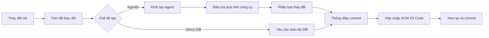

<!-- markdownlint-disable MD001 MD013 MD026 MD033 MD036 MD041 -->

<div align="center">


# Commit-Copilot

### Công cụ tạo thông điệp commit Agentic thực sự hiểu mã nguồn của bạn—không chỉ tóm tắt diff.

Commit-Copilot là một tiện ích mở rộng VS Code sử dụng một tác nhân AI (agent) đa bước để điều tra kho lưu trữ của bạn, phân loại các thay đổi theo các quy tắc Conventional Commits nghiêm ngặt và viết các thông điệp commit hoàn chỉnh trực tiếp vào hộp nhập Kiểm soát nguồn (Source Control).

Nó hoạt động liền mạch với các LLM đám mây hàng đầu (Gemini, OpenAI, Anthropic Claude, DeepSeek), các mô hình Ollama cục bộ ưu tiên quyền riêng tư và các điểm cuối tùy chỉnh (định dạng tương thích OpenAI & Anthropic).

[](https://marketplace.visualstudio.com/items?itemName=JeremySu0818.commit-copilot)
[](https://open-vsx.org/extension/JeremySu0818/commit-copilot)
[](https://open-vsx.org/extension/JeremySu0818/commit-copilot)
[](#yêu-cầu-hệ-thống)
[](#phát-triển)
[](#phân-loại-conventional-commits)
[](../../LICENSE)

**Điều tra Agentic · 9 nhà cung cấp tích hợp · Điểm cuối tùy chỉnh · Hỗ trợ Ollama cục bộ · 20 ngôn ngữ**

<p align="center">
  <b>Bản dịch:</b>
  <a href="https://github.com/JeremySu0818/Commit-Copilot#readme">English</a> |
  <a href="https://github.com/JeremySu0818/Commit-Copilot/blob/main/docs/readme/README-zh-tw.md">繁體中文</a> |
  <a href="https://github.com/JeremySu0818/Commit-Copilot/blob/main/docs/readme/README-zh-cn.md">简体中文</a> |
  <a href="https://github.com/JeremySu0818/Commit-Copilot/blob/main/docs/readme/README-ja.md">日本語</a> |
  <a href="https://github.com/JeremySu0818/Commit-Copilot/blob/main/docs/readme/README-ko.md">한국어</a> |
  <a href="https://github.com/JeremySu0818/Commit-Copilot/blob/main/docs/readme/README-de.md">Deutsch</a> |
  <a href="https://github.com/JeremySu0818/Commit-Copilot/blob/main/docs/readme/README-fr.md">Français</a> |
  <a href="https://github.com/JeremySu0818/Commit-Copilot/blob/main/docs/readme/README-es.md">Español</a> |
  <a href="https://github.com/JeremySu0818/Commit-Copilot/blob/main/docs/readme/README-pt-br.md">Português (Brasil)</a> |
  <a href="https://github.com/JeremySu0818/Commit-Copilot/blob/main/docs/readme/README-ru.md">Русский</a> |
  <a href="https://github.com/JeremySu0818/Commit-Copilot/blob/main/docs/readme/README-it.md">Italiano</a> |
  <a href="https://github.com/JeremySu0818/Commit-Copilot/blob/main/docs/readme/README-nl.md">Nederlands</a> |
  <a href="https://github.com/JeremySu0818/Commit-Copilot/blob/main/docs/readme/README-pl.md">Polski</a> |
  <a href="https://github.com/JeremySu0818/Commit-Copilot/blob/main/docs/readme/README-tr.md">Türkçe</a> |
  <a href="https://github.com/JeremySu0818/Commit-Copilot/blob/main/docs/readme/README-vi.md">Tiếng Việt</a> |
  <a href="https://github.com/JeremySu0818/Commit-Copilot/blob/main/docs/readme/README-id.md">Bahasa Indonesia</a> |
  <a href="https://github.com/JeremySu0818/Commit-Copilot/blob/main/docs/readme/README-hu.md">Magyar</a> |
  <a href="https://github.com/JeremySu0818/Commit-Copilot/blob/main/docs/readme/README-cs.md">Čeština</a> |
  <a href="https://github.com/JeremySu0818/Commit-Copilot/blob/main/docs/readme/README-hi.md">हिन्दी</a> |
  <a href="https://github.com/JeremySu0818/Commit-Copilot/blob/main/docs/readme/README-ar.md">العربية</a>
</p>

</div>

---

## Tại sao nên chọn Commit-Copilot?

Hầu hết các công cụ commit bằng AI chỉ gửi diff thô cho mô hình và hy vọng nhận được một câu tóm tắt một dòng hợp lý.

Commit-Copilot tiếp cận theo một cách hoàn toàn khác biệt.

Nó bắt đầu từ siêu dữ liệu thay đổi gọn nhẹ, sau đó để một tác nhân tự trị quyết định những gì cần kiểm tra sâu: sự khác biệt của từng tệp, nội dung tệp đầy đủ, cấu trúc ký hiệu mã nguồn, tham chiếu cú pháp, các mẫu chuỗi trên toàn bộ dự án và phong cách của các commit gần đây. Chỉ sau khi hiểu thấu đáo ý định và phạm vi ảnh hưởng của thay đổi, nó mới tiến hành phân loại chính xác và tạo thông điệp chất lượng cao.

| Khả năng                                     | Công cụ diff-to-prompt cơ bản | Commit-Copilot |
| -------------------------------------------- | :---------------------------: | :------------: |
| Đọc toàn bộ diff lớn ngay lập tức            |              Có               |    Tùy chọn    |
| Điều tra chọn lọc các tệp liên quan          |             Không             |       Có       |
| Hiểu cấu trúc mã nguồn và outline            |            Hạn chế            |       Có       |
| Tìm kiếm tham chiếu ký hiệu qua LSP          |             Không             |       Có       |
| Tìm kiếm các mối quan hệ chuỗi/cấu hình ẩn   |             Không             |       Có       |
| Học phong cách từ các commit gần đây         |           Rất hiếm            |       Có       |
| Phân tích chính xác theo chỉ mục Git (Index) |           Rất hiếm            |       Có       |
| Hỗ trợ quy trình agent mô hình cục bộ        |            Hạn chế            |       Có       |
| Áp dụng ranh giới loại commit nghiêm ngặt    |       Phụ thuộc mô hình       |       Có       |
| Không bao giờ tự ý stage khi chưa đồng ý     |           Khác nhau           |       Có       |

> [!TIP]
> Sử dụng chế độ **Agentic** để đạt độ chính xác và ngữ cảnh tốt nhất. Sử dụng chế độ **Direct Diff** khi tốc độ quan trọng hơn điều tra chuyên sâu.

---

## Điểm nổi bật

<table>
<tr>
<td width="50%" valign="top">

<h3>Tác nhân nhận biết kho lưu trữ</h3>

Agent bắt đầu với tên tệp, loại thay đổi, số dòng thay đổi và cấu trúc dự án—sau đó tự chủ chọn các công cụ cần thiết để hiểu rõ thay đổi mã nguồn.

</td>
<td width="50%" valign="top">

<h3>Độ chính xác chỉ mục Git</h3>

Đối với các thay đổi đã stage, các công cụ ưu tiên đọc nội dung từ chỉ mục Git (Index). Phân tích tham chiếu LSP được thực hiện trong một không gian làm việc tạm thời tái tạo từ trạng thái staged.

</td>
</tr>
<tr>
<td width="50%" valign="top">

<h3>Đa nhà cung cấp theo thiết kế</h3>

Hỗ trợ Google Gemini, OpenAI, Anthropic Claude, xAI Grok, Groq, OpenRouter, DeepSeek, Alibaba Qwen (Thông Nghĩa Thiên Vấn), Ollama hoặc bất kỳ điểm cuối tương thích tùy chỉnh nào.

</td>
<td width="50%" valign="top">

<h3>Quy tắc Conventional Commits nghiêm ngặt</h3>

Hỗ trợ đầy đủ 11 loại Conventional Commit, áp dụng quy tắc phân loại theo thứ tự ưu tiên và hướng dẫn ranh giới rõ ràng. Scope, Body, Footer và Gitmoji có thể cấu hình độc lập.

</td>
</tr>
<tr>
<td width="50%" valign="top">

<h3>Quy trình Agent cho mô hình cục bộ</h3>

Thông qua giao thức công cụ văn bản tích hợp của Commit-Copilot, ngay cả các mô hình Ollama cục bộ không hỗ trợ Tool Calling gốc cũng có thể thực hiện quy trình điều tra nhiều bước đầy đủ.

</td>
<td width="50%" valign="top">

<h3>Quy trình an toàn, ưu tiên xem lại</h3>

Thông điệp tạo ra được điền vào hộp nhập Kiểm soát nguồn của VS Code. Bạn luôn nắm quyền kiểm soát việc stage, chỉnh sửa và commit cuối cùng.

</td>
</tr>
</table>

---

## Mục lục

- [Cách thức hoạt động](#cách-thức-hoạt-động)
- [Công cụ Agent](#công-cụ-agent)
- [Tính năng](#tính-năng)
- [Nhà cung cấp được hỗ trợ](#nhà-cung-cấp-được-hỗ-trợ)
- [Yêu cầu hệ thống](#yêu-cầu-hệ-thống)
- [Cài đặt](#cài-đặt)
- [Cấu hình](#cấu-hình)
- [Cách sử dụng](#cách-sử-dụng)
- [Phân loại Conventional Commits](#phân-loại-conventional-commits)
- [Phát hiện thay đổi](#phát-hiện-thay-đổi)
- [Bản địa hóa](#bản-địa-hóa)
- [Bảo mật và Quyền riêng tư](#bảo-mật-và-quyền-riêng-tư)
- [Phát triển](#phát-triển)
- [Kiểm thử](#kiểm-thử)
- [Câu hỏi thường gặp (FAQ)](#câu-hỏi-thường-gặp-faq)
- [Đóng góp](#đóng-góp)
- [Giấy phép](#giấy-phép)

---

## Cách thức hoạt động



### Quy trình tạo Agentic

1. **Thu thập siêu dữ liệu thay đổi**
   Commit-Copilot tập hợp danh sách tệp, loại thay đổi, số dòng biến động và cây cấu trúc dự án.

2. **Khởi tạo Agent**
   Mô hình nhận bản tóm tắt có cấu trúc cùng hướng dẫn tạo tự trị. Không gửi nội dung diff thô ban đầu.

3. **Điều tra bằng công cụ**
   Agent tự chủ gọi các công cụ để kiểm tra kho mã, chỉ yêu cầu các ngữ cảnh cần thiết.

4. **Phân loại thay đổi**
   Các quy tắc theo thứ tự ưu tiên xác định loại Conventional Commit. Khi bật Scope, Agent cũng xác định phạm vi hoặc mô-đun bị ảnh hưởng.

5. **Tạo thông điệp commit**
   Thông điệp cuối cùng được viết vào hộp nhập Kiểm soát nguồn (Source Control) để bạn xem lại và tinh chỉnh.

> [!NOTE]
> Khi bật **Tạo kết hợp (Hybrid Generation)**, văn bản hiện có trong hộp nhập SCM chỉ được dùng làm bản nháp tham khảo về từ ngữ và ý định. Các nội dung mang tính chỉ thị trong bản nháp không thể ghi đè quy tắc tạo của hệ thống.

### Quy trình Direct Diff

Chế độ Direct Diff bỏ qua vòng lặp điều tra và gửi toàn bộ diff đến mô hình đã chọn trong một yêu cầu duy nhất. Phương thức này nhanh hơn, khả dụng cho mọi nhà cung cấp và rất hữu ích cho các thay đổi nhỏ hoặc rõ ràng.

---

## Công cụ Agent

Agent có thể kết hợp các công cụ sau qua nhiều bước điều tra:

| Tên công cụ            | Mục đích sử dụng                                                                                |
| ---------------------- | ----------------------------------------------------------------------------------------------- |
| `get_diff`             | Lấy diff chính xác, đầy đủ cho một hoặc nhiều tệp được chỉ định.                                |
| `read_file`            | Đọc nội dung tệp, có thể chọn phạm vi dòng; ưu tiên nội dung chỉ mục Git cho các tệp đã stage.  |
| `get_file_outline`     | Trả về thông tin cấu trúc như hàm, lớp, giao diện và các export.                                |
| `find_references`      | Sử dụng Language Server Protocol (LSP) của VS Code để xác định tham chiếu ký hiệu theo cú pháp. |
| `get_recent_commits`   | Đọc các thông điệp commit gần đây để học phong cách viết hiện có của kho lưu trữ.               |
| `search_code`          | Tìm kiếm chuỗi hoặc mẫu văn bản trên toàn bộ dự án để phát hiện các mối quan hệ ẩn.             |
| `write_commit_message` | Gửi thông điệp commit có cấu trúc cuối cùng và kết thúc điều tra.                               |

Các nhà cung cấp Gemini, Anthropic và OpenAI sử dụng Tool Calling có cấu trúc gốc. Ollama sử dụng giao thức văn bản tương đương với hỗ trợ gọi theo lô, ID do ứng dụng gán, kết quả có cấu trúc, xử lý lỗi từng lời gọi và gửi kết quả cuối cùng.

`get_diff` chấp nhận một `path` đơn lẻ hoặc một mảng `paths` không rỗng. Các yêu cầu đa tệp giúp giảm số lượt gọi công cụ qua lại trong khi vẫn trả về diff chính xác, đầy đủ của mọi tệp được yêu cầu; không có nội dung nào bị tóm tắt hay lược bỏ.

Chế độ Agentic có tùy chọn "Yêu cầu bao phủ diff đầy đủ". Khi được bật trong Cài đặt, lời gọi `write_commit_message` sẽ bị từ chối cho đến khi mọi tệp đã thay đổi đều được kiểm tra diff thành công qua `get_diff` đơn lẻ hoặc theo lô. Tùy chọn này mặc định tắt để duy trì hiệu năng và tiết kiệm token.

---

## Tính năng

### Tạo và phân tích chuyên sâu

- **Hai chế độ tạo Agentic và Direct Diff**
- **Có thể cấu hình số bước Agent tối đa**
- **Vòng lặp điều tra có thể hủy bỏ bất kỳ lúc nào**
- **Cơ chế tự động thử lại**: Tự động hoãn và thử lại khi gặp lỗi API tạm thời hoặc giới hạn tần suất (Rate Limit)
- **Tìm kiếm mẫu chuỗi toàn dự án**: Theo dõi biến môi trường, tên sự kiện, khóa cấu hình và các liên kết ẩn
- **Radar ảnh hưởng tham chiếu LSP**: Phân tích cú pháp chính xác tác động của việc thay đổi ký hiệu
- **Phân tích phong cách commit gần đây**: Tự động học thói quen viết commit của dự án
- **Tạo kết hợp (Hybrid Generation)**: Sử dụng văn bản nhập sẵn làm bản nháp tham khảo an toàn

### Cơ chế nhận biết trạng thái Git

- Nhận diện chính xác 5 trạng thái kho lưu trữ: Đã stage (Staged), Chưa stage (Unstaged), Hỗn hợp (Mixed), Có tệp chưa theo dõi (Untracked), Chỉ có tệp chưa theo dõi (Untracked-only)
- Chủ động hỏi trước khi stage các tệp chưa được theo dõi
- Không bao giờ tự động stage nếu không có sự xác nhận rõ ràng
- Ưu tiên nội dung chỉ mục Git khi kiểm tra các tệp đã stage
- Tạo ảnh chụp không gian làm việc tạm thời cho phân tích tham chiếu LSP ở trạng thái staged
- Tự động cập nhật giao diện bảng điều khiển theo thời gian thực khi trạng thái kho mã thay đổi

### Tùy chỉnh đầu ra Commit

Bật/tắt độc lập từng thành phần:

- **Scope** (Phạm vi)
- **Body** (Nội dung giải thích chi tiết)
- **Footer** (Chân trang / Breaking Changes)
- **Tiền tố Gitmoji**

Giá trị mặc định:

| Thành phần | Trạng thái mặc định |
| ---------- | :-----------------: |
| Scope      |         Bật         |
| Body       |         Bật         |
| Footer     |         Tắt         |
| Gitmoji    |         Tắt         |

### Tích hợp sâu với VS Code

Khởi chạy Commit-Copilot thuận tiện từ:

- Biểu tượng chuyên dụng trên **Thanh hoạt động (Activity Bar)**
- Nút cây đũa thần trên **Thanh điều hướng Kiểm soát nguồn (SCM)**
- **Bảng lệnh (Command Palette)**

Thông điệp tạo ra sẽ tự động điền vào hộp nhập SCM tiêu chuẩn của VS Code để bạn xem lại và chỉnh sửa trước khi commit.

### Xác thực nhà cung cấp và quản lý mô hình

- Xác thực API Key trực tiếp với điểm cuối thực tế của nhà cung cấp trước khi lưu
- Cung cấp hướng dẫn xử lý cụ thể khi gặp lỗi xác thực, vượt hạn mức hoặc lỗi kết nối
- Hỗ trợ lấy danh sách mô hình động cho OpenRouter, Alibaba Qwen, Ollama và nhà cung cấp tùy chỉnh
- Hỗ trợ thêm/xóa ID mô hình thủ công cho Ollama và nhà cung cấp tùy chỉnh
- Nhà cung cấp tùy chỉnh hỗ trợ định dạng tương thích OpenAI và Anthropic

---

## Nhà cung cấp được hỗ trợ

| Nhà cung cấp               | Điểm nổi bật                                                    |
| -------------------------- | --------------------------------------------------------------- |
| **Google Gemini**          | Hỗ trợ công cụ cấu trúc gốc và nhiều thế hệ mô hình Gemini      |
| **OpenAI**                 | Các mô hình suy luận, đa năng, nhỏ gọn và dòng GPT-5            |
| **Anthropic**              | Đầy đủ các dòng Claude Haiku, Sonnet, Opus và Fable             |
| **xAI Grok**               | Các phiên bản Grok suy luận và phi suy luận                     |
| **Groq**                   | Lưu trữ tốc độ cao các mô hình MiniMax, Qwen và `gpt-oss`       |
| **OpenRouter**             | Truy cập danh mục mô hình phong phú kèm bộ lọc Tool Calling     |
| **DeepSeek**               | Các dòng DeepSeek Chat, Reasoner (R1) và V4                     |
| **Alibaba Qwen**           | Tích hợp DashScope với khả năng khám phá mô hình động           |
| **Ollama**                 | Mô hình cục bộ với danh sách động và giao thức công cụ tích hợp |
| **Nhà cung cấp tùy chỉnh** | Hỗ trợ mọi điểm cuối bên thứ ba tương thích OpenAI / Anthropic  |

<details>
<summary><strong>Xem danh sách các dòng mô hình được Commit-Copilot hỗ trợ sẵn</strong></summary>

### Google Gemini

- Gemini 2.5 Flash-Lite, Flash, Pro
- Gemini 3 Flash
- Gemini 3.1 Flash-Lite, Pro
- Gemini 3.5 Flash-Lite, Flash
- Gemini 3.6 Flash
- Gemini 3.7 Flash

### OpenAI

- o3, o3-mini
- o4-mini
- GPT-4o mini, GPT-4o
- GPT-4.1 nano, mini, GPT-4.1
- GPT-5 nano, mini, GPT-5
- GPT-5.1
- GPT-5.2
- GPT-5.4 nano, mini, GPT-5.4
- GPT-5.5
- GPT-5.6 Luna, Terra, Sol

### Anthropic

- Claude Sonnet 4, Opus 4
- Claude Opus 4.1
- Claude Haiku, Sonnet, Opus 4.5
- Claude Sonnet, Opus 4.6
- Claude Opus 4.7
- Claude Opus 4.8
- Claude Sonnet 5, Opus 5, Fable 5

### xAI Grok

- Grok 4.20 (suy luận và phi suy luận)
- Grok 4.3
- Grok 4.5
- Grok 4.6

### Groq

- `gpt-oss-20B`
- `gpt-oss-120B`
- `gpt-oss-safeguard-20B`
- MiniMax M2.7
- Qwen 3.6 27b

### DeepSeek

- DeepSeek Chat
- DeepSeek R1 / Reasoner
- DeepSeek V4 Flash, Pro

> [!IMPORTANT]
> Tính khả dụng thực tế của mô hình phụ thuộc vào nhà cung cấp, quyền tài khoản, khu vực và trạng thái điểm cuối. Danh sách mô hình của OpenRouter, Qwen, Ollama và nhà cung cấp tùy chỉnh có thể được khám phá động.

</details>

---

## Yêu cầu hệ thống

- **VS Code** `1.91.0` trở lên
- **Git** (khả dụng thông qua tiện ích mở rộng Git tích hợp của VS Code)
- Một trong các quyền truy cập sau:
  - API Key hợp lệ cho một nhà cung cấp từ xa được hỗ trợ
  - Phiên bản Ollama đang chạy cục bộ hoặc từ xa
  - Thông tin xác thực cho một điểm cuối tùy chỉnh tương thích

Dành cho phát triển:

- **Node.js** `20+`
- **npm**

---

## Cài đặt

Cài đặt Commit-Copilot từ một trong các kho tiện ích:

- [**Visual Studio Code Marketplace**](https://marketplace.visualstudio.com/items?itemName=JeremySu0818.commit-copilot)
- [**Open VSX Registry**](https://open-vsx.org/extension/JeremySu0818/commit-copilot)

Sau khi cài đặt, mở một kho lưu trữ Git trong VS Code và nhấp vào biểu tượng **Commit Copilot** trên Thanh hoạt động.

---

## Cấu hình

### Thiết lập cơ bản

1. Mở bảng điều khiển **Commit Copilot** từ Thanh hoạt động.
2. Chọn nhà cung cấp mô hình bạn muốn dùng.
3. Nhập API Key hoặc URL máy chủ Ollama.
4. Nhấn **Lưu**.
5. Chờ quá trình xác thực kết nối và chứng chỉ theo thời gian thực hoàn tất.
6. Chọn mô hình cụ thể sau khi xác thực thành công.

> [!IMPORTANT]
> Đối với mô hình Ollama, tiện ích luôn tự động chạy `ollama pull` trước mỗi lần tạo để đảm bảo mô hình luôn sẵn sàng và mới nhất, đồng thời hiển thị tiến trình tải trong vùng thông báo. Quá trình này có thể tải lại các tầng dữ liệu ngay cả khi mô hình đã có sẵn trên máy.

### Tùy chọn cấu hình

| Tùy chọn                       | Mặc định  | Mô tả                                                                                      |
| ------------------------------ | --------- | ------------------------------------------------------------------------------------------ |
| **Chế độ tạo**                 | Agentic   | `Agentic` thực hiện điều tra nhiều bước. `Direct Diff` gửi toàn bộ diff trong một yêu cầu. |
| **Tạo kết hợp**                | Tắt       | Dùng văn bản có sẵn trong SCM làm bản nháp tham khảo và cô lập các chỉ thị khỏi prompt.    |
| **Số bước Agent tối đa**       | `0`       | Giới hạn số lần gọi công cụ trong một lần điều tra. Đặt `0` để không giới hạn.             |
| **Bao gồm Scope**              | Bật       | Yêu cầu có phạm vi Conventional Commits trong dòng chủ đề khi được bật.                    |
| **Bao gồm Body**               | Bật       | Yêu cầu tạo phần nội dung mô tả chi tiết khi được bật.                                     |
| **Bao gồm Footer**             | Tắt       | Yêu cầu tạo chân trang (Breaking Changes, v.v.) khi bật; không bao giờ bịa đặt thông tin.  |
| **Bao gồm Gitmoji**            | Tắt       | Thêm đúng một biểu tượng Gitmoji phù hợp vào đầu chủ đề khi được bật.                      |
| **Ngôn ngữ tiện ích**          | Tự động   | Tự động theo ngôn ngữ hiển thị của VS Code hoặc cố định thủ công theo ý muốn.              |
| **Ngôn ngữ thông điệp commit** | Tiếng Anh | Kiểm soát độc lập ngôn ngữ của chủ đề, nội dung và chân trang commit được tạo.             |

### Nhà cung cấp tùy chỉnh

Để thêm điểm cuối tương thích OpenAI hoặc Anthropic:

1. Mở phần cài đặt nhà cung cấp.
2. Chọn **Thêm nhà cung cấp tùy chỉnh**.
3. Chọn định dạng API (OpenAI-compatible hoặc Anthropic-compatible).
4. Nhập tên hiển thị và API Base URL.
5. Lưu nhà cung cấp.
6. Nhập và xác thực API Key.
7. Chọn mô hình từ danh sách tải về hoặc chọn **Thêm mô hình tùy chỉnh...** để nhập ID mô hình thủ công.

Đối với điểm cuối tương thích Anthropic, bạn cũng có thể cấu hình giá trị token đầu ra tối đa (max_tokens).

---

## Cách sử dụng

### Cách A: Thanh hoạt động (Activity Bar)

1. Mở bảng bên **Commit Copilot**.
2. Đảm bảo kho lưu trữ có các thay đổi đã stage, chưa stage hoặc chưa theo dõi.
3. Nhấp vào **Tạo thông điệp commit (Generate Commit Message)**.
4. Phản hồi các hộp thoại hỏi về việc chọn thay đổi hoặc stage nếu xuất hiện.

### Cách B: Chế độ xem Kiểm soát nguồn (Source Control)

1. Nhấn `Ctrl+Shift+G` (macOS: `Cmd+Shift+G`) để mở Source Control.
2. Nhấp vào biểu tượng cây đũa thần Commit-Copilot trên thanh điều hướng.

### Cách C: Bảng lệnh (Command Palette)

1. Mở Bảng lệnh:
   - Windows/Linux: `Ctrl+Shift+P`
   - macOS: `Cmd+Shift+P`
2. Chạy lệnh **Commit-Copilot: Generate Commit Message**.

### Xem lại và commit

Thông điệp đã tạo sẽ xuất hiện trong hộp nhập của Source Control.

Bạn có thể tự do xem lại, tinh chỉnh câu chữ, sau đó commit bằng nút Commit chuẩn của VS Code.

---

## Phân loại Conventional Commits

Commit-Copilot hỗ trợ nghiêm ngặt 11 loại Conventional Commit sau:

| Loại       | Mục đích sử dụng                                           |
| ---------- | ---------------------------------------------------------- |
| `feat`     | Thêm tính năng hoặc chức năng mới cho người dùng           |
| `fix`      | Sửa lỗi hoặc hành vi không chính xác                       |
| `docs`     | Chỉ thêm hoặc sửa đổi tài liệu                             |
| `style`    | Thay đổi định dạng, khoảng trắng mà không ảnh hưởng logic  |
| `refactor` | Tái cấu trúc mã mà không thêm tính năng mới hay sửa lỗi    |
| `perf`     | Cải thiện hiệu năng hoặc tối ưu tài nguyên                 |
| `test`     | Thêm, cập nhật hoặc bổ sung các ca kiểm thử                |
| `build`    | Thay đổi hệ thống build hoặc các gói phụ thuộc bên ngoài   |
| `ci`       | Thay đổi cấu hình CI/CD và quy trình tự động hóa           |
| `chore`    | Công việc bảo trì định kỳ không thuộc các loại chuyên biệt |
| `revert`   | Hoàn tác một commit đã thực hiện trước đó                  |

Đầu ra tuân thủ cú pháp chuẩn Conventional Commits:

```text
type(scope): mô tả chủ đề ngắn gọn, rõ ràng

Phần thân giải thích chi tiết những gì đã thay đổi và lý do thay đổi.
```

Tùy theo cấu hình, Scope, Body, Footer và Gitmoji có thể được bật hoặc tắt. Dòng chủ đề đầu tiên bị giới hạn tối đa 72 ký tự và lý tưởng nhất là dưới 50 ký tự.

---

## Phát hiện thay đổi

Commit-Copilot nhận diện chính xác 5 trạng thái kho lưu trữ Git:

| Trạng thái phát hiện           | Hành vi xử lý                                      |
| ------------------------------ | -------------------------------------------------- |
| **Chỉ có tệp đã stage**        | Dùng diff đã stage và công cụ nhận biết Index      |
| **Chỉ có tệp chưa stage**      | Phân tích trực tiếp các sửa đổi trong cây làm việc |
| **Hỗn hợp (Mixed)**            | Hiển thị hộp thoại hỏi phạm vi thay đổi cần xử lý  |
| **Chưa stage + Chưa theo dõi** | Đưa ra các tùy chọn theo ngữ cảnh                  |
| **Chỉ có tệp chưa theo dõi**   | Đề xuất stage các tệp mới và tiến hành tạo         |

Không có tệp nào bị tự động stage khi chưa có sự đồng ý rõ ràng của người dùng.

---

## Bản địa hóa

Giao diện người dùng có thể tự động theo dõi ngôn ngữ của VS Code hoặc cố định theo 1 trong 20 ngôn ngữ được hỗ trợ:

<table>
<tr>
<td><a href="README-ar.md">العربية</a></td>
<td><a href="README-cs.md">Čeština</a></td>
<td><a href="README-de.md">Deutsch</a></td>
<td><a href="../../README.md">English</a></td>
</tr>
<tr>
<td><a href="README-es.md">Español</a></td>
<td><a href="README-fr.md">Français</a></td>
<td><a href="README-hi.md">हिन्दी</a></td>
<td><a href="README-hu.md">Magyar</a></td>
</tr>
<tr>
<td><a href="README-id.md">Bahasa Indonesia</a></td>
<td><a href="README-it.md">Italiano</a></td>
<td><a href="README-ja.md">日本語</a></td>
<td><a href="README-ko.md">한국어</a></td>
</tr>
<tr>
<td><a href="README-nl.md">Nederlands</a></td>
<td><a href="README-pl.md">Polski</a></td>
<td><a href="README-pt-br.md">Português (Brasil)</a></td>
<td><a href="README-ru.md">Русский</a></td>
</tr>
<tr>
<td><a href="README-tr.md">Türkçe</a></td>
<td><a href="README-vi.md">Tiếng Việt</a></td>
<td><a href="README-zh-cn.md">简体中文</a></td>
<td><a href="README-zh-tw.md">繁體中文</a></td>
</tr>
</table>

**Ngôn ngữ thông điệp commit** được cấu hình độc lập với ngôn ngữ giao diện của tiện ích mở rộng, cho phép bạn để giao diện tiếng Việt trong khi thông điệp commit tạo ra bằng tiếng Anh.

---

## Bảo mật và Quyền riêng tư

- Tất cả API Key đều được mã hóa và lưu trữ an toàn bằng **VS Code Secret Storage**
- Key được xác thực trực tiếp với điểm cuối của nhà cung cấp trước khi lưu
- Không tự ý stage tệp khi chưa có sự cho phép rõ ràng
- Tạo kết hợp coi văn bản có sẵn trong ô nhập là bản nháp không đáng tin cậy để chống Prompt Injection
- Các yêu cầu từ xa chỉ chứa siêu dữ liệu, diff hoặc nội dung tệp cụ thể được chọn trong quá trình điều tra
- Ollama cục bộ có thể giữ toàn bộ quá trình suy luận hoàn toàn trong môi trường riêng của bạn

> [!CAUTION]
> Hãy xem xét kỹ chính sách xử lý dữ liệu của nhà cung cấp mô hình trước khi gửi mã nguồn nhạy cảm hoặc độc quyền tới API từ xa.

---

## Phát triển

### Cài đặt phụ thuộc

```bash
npm install
```

### Biên dịch phát triển

```bash
npm run compile
```

Biên dịch tự động liên tục với TypeScript và esbuild:

```bash
npm run watch
```

### Đóng gói VSIX

```bash
npm run build
```

Kịch bản build sẽ cài đặt phụ thuộc, chạy quy trình đóng gói VS Code và tạo ra gói cài đặt `.vsix`.

### Kiểm tra chất lượng mã nguồn

Kiểm tra quy tắc Lint:

```bash
npm run lint
```

Định dạng mã nguồn:

```bash
npm run format
```

Kiểm tra định dạng (không sửa đổi tệp):

```bash
npm run check-format
```

---

## Kiểm thử

Chạy toàn bộ bộ kiểm thử đơn vị:

```bash
npm test
```

Lệnh này sẽ thực hiện lần lượt:

1. `npm run test:build`
2. `node --test --test-concurrency=1 "out/test/**/*.test.js"`

Phạm vi kiểm thử hiện tại bao gồm:

- Tất cả công cụ điều tra của Agent:
  - `get_diff`
  - `read_file`
  - `get_file_outline`
  - `find_references`
  - `get_recent_commits`
  - `search_code`
- Vòng lặp Agent gọi công cụ cấu trúc gốc
- Vòng lặp Agent dùng giao thức văn bản Ollama
- Gọi công cụ theo lô và schema công cụ bản địa hóa
- Khả năng phục hồi khi phản hồi bị lỗi định dạng
- Xác thực gửi kết quả công cụ cuối cùng
- Điều phối công cụ qua `executeToolCall`
- Phân tích cú pháp và xây dựng ngữ cảnh
- Tiện ích chụp ảnh không gian làm việc staged
- Cơ chế tự động thử lại
- Thông báo lỗi được bản địa hóa
- Hành vi của Main View Provider
- Quản lý mô hình tùy chỉnh
- Các trình quản lý trạng thái

---

## Câu hỏi thường gặp (FAQ)

<details>
<summary><strong>Commit-Copilot có tự động thực hiện git commit không?</strong></summary>

Không. Tiện ích chỉ điền thông điệp đã tạo vào ô nhập của Source Control. Bạn có thể tự mình xem lại, chỉnh sửa và quyết định thời điểm commit.

</details>

<details>
<summary><strong>Agent có gửi toàn bộ kho mã của tôi lên AI không?</strong></summary>

Trong chế độ Agentic, giai đoạn ban đầu chỉ gửi siêu dữ liệu thay đổi và cây tệp được theo dõi, hoàn toàn không gửi trước toàn bộ nội dung tệp. Sau đó, Agent sẽ gửi yêu cầu chính xác cho diff, nội dung, ký hiệu hoặc tìm kiếm tệp cụ thể theo nhu cầu. Chế độ Direct Diff chỉ gửi toàn bộ diff của các thay đổi được chọn.

</details>

<details>
<summary><strong>Mô hình Ollama không có Tool Calling gốc có dùng được chế độ Agent không?</strong></summary>

Có. Commit-Copilot tích hợp sẵn giao thức công cụ văn bản chuyên dụng, giúp các mô hình Ollama cục bộ thực hiện quy trình điều tra đa bước mượt mà.

</details>

<details>
<summary><strong>Số bước Agent tối đa = 0 có ý nghĩa gì?</strong></summary>

Nghĩa là không giới hạn số lần gọi công cụ. Đặt một số nguyên dương bất kỳ sẽ giới hạn số bước điều tra mà Agent có thể thực hiện trước khi đưa ra kết quả cuối cùng.

</details>

<details>
<summary><strong>Tôi có thể dùng điểm cuối bên thứ ba không tích hợp sẵn không?</strong></summary>

Có. Bạn có thể thêm nó dưới dạng nhà cung cấp tùy chỉnh tương thích OpenAI hoặc Anthropic, sau đó tải về hoặc cấu hình ID mô hình thủ công.

</details>

<details>
<summary><strong>Tại sao Ollama luôn chạy pull trước mỗi lần tạo?</strong></summary>

Tiện ích chủ động chạy `ollama pull` trước mỗi lần tạo để đảm bảo mô hình đã chọn khả dụng và ở phiên bản mới nhất trên máy. Tùy theo trạng thái bộ nhớ đệm cục bộ, điều này có thể kiểm tra lại hoặc tải lại các tầng mô hình.

</details>

---

## Đóng góp

Chúng tôi luôn hoan nghênh sự đóng góp từ cộng đồng!

Quy trình đóng góp đề xuất:

1. Tạo một nhánh tính năng riêng biệt.
2. Thực hiện các thay đổi mã.
3. Chạy Lint, kiểm tra định dạng và kiểm thử đơn vị.
4. Mô tả rõ ràng động cơ và hành vi thay đổi trong Pull Request.
5. Bổ sung các ca kiểm thử phù hợp cho các thay đổi hành vi.

Trước khi gửi PR:

```bash
npm run lint
npm run check-format
npm test
```

Khi báo cáo lỗi, vui lòng cung cấp nhà cung cấp, mô hình, chế độ tạo, trạng thái thay đổi kho mã, nhật ký liên quan và các bước tái hiện. Tuyệt đối không đưa API Key hoặc nội dung mã nguồn nhạy cảm vào báo cáo.

---

## Giấy phép

Commit-Copilot được phát hành theo [Giấy phép MIT](../../LICENSE).

---

<div align="center">

Được xây dựng cho các lập trình viên muốn thông điệp commit có đầy đủ ngữ cảnh—không phải sự phỏng đoán.

</div>
