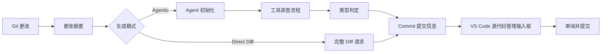

<!-- markdownlint-disable MD001 MD013 MD026 MD033 MD036 MD041 -->

<div align="center">


# Commit-Copilot

### 真正理解代码脉络的 Agentic 提交信息生成工具，而不只是摘要差异。

Commit-Copilot 是一款 VS Code 扩展，通过多步骤自主 AI Agent 深入调查您的仓库、依据严格的约定式提交（Conventional Commits）规范分类更改，并直接将精炼的提交信息写入源代码管理（Source Control）输入框中。

完美支持主流云端大语言模型（Gemini、OpenAI、Anthropic Claude、DeepSeek）、注重隐私的本地 Ollama 模型，以及各类自定义端点（兼容 OpenAI 与 Anthropic API 格式）。

[](https://marketplace.visualstudio.com/items?itemName=JeremySu0818.commit-copilot)
[](https://open-vsx.org/extension/JeremySu0818/commit-copilot)
[](https://open-vsx.org/extension/JeremySu0818/commit-copilot)
[](#系统需求)
[](#开发指南)
[](#约定式提交分类规范)
[](../../LICENSE)

**Agentic 调查 · 9 大内置提供商 · 自定义兼容端点 · 本地 Ollama 支持 · 20 种语言**

<p align="center">
  <b>语言版本：</b>
  <a href="../../README.md">English</a> |
  <a href="README-zh-tw.md">繁體中文</a> |
  <a href="README-zh-cn.md">简体中文</a> |
  <a href="README-ja.md">日本語</a> |
  <a href="README-ko.md">한국어</a> |
  <a href="README-de.md">Deutsch</a> |
  <a href="README-fr.md">Français</a> |
  <a href="README-es.md">Español</a> |
  <a href="README-pt-br.md">Português (Brasil)</a> |
  <a href="README-ru.md">Русский</a> |
  <a href="README-it.md">Italiano</a> |
  <a href="README-nl.md">Nederlands</a> |
  <a href="README-pl.md">Polski</a> |
  <a href="README-tr.md">Türkçe</a> |
  <a href="README-vi.md">Tiếng Việt</a> |
  <a href="README-id.md">Bahasa Indonesia</a> |
  <a href="README-hu.md">Magyar</a> |
  <a href="README-cs.md">Čeština</a> |
  <a href="README-hi.md">हिन्दी</a> |
  <a href="README-ar.md">العربية</a>
</p>

</div>

---

## 为什么选择 Commit-Copilot？

多数 AI Commit 工具仅将未经处理的原始 diff 直接发给模型，期望它能猜出一行恰当的总结。

Commit-Copilot 采取完全不同的做法。

它从轻量级的更改元数据开始，由具备自主决策能力的 Agent 判断需要深入调查哪些信息：文件差异、文件完整内容、代码符号结构、语法引用关联、项目全局字符串模式，以及近期的提交历史风格。唯有在彻底理解更改意图与影响范围后，才会进行精准分类并产出高质量的提交信息。

| 功能特性                               | 传统单次 Diff 工具 | Commit-Copilot |
| -------------------------------------- | :----------------: | :------------: |
| 立即读取完整庞大 Diff                  |         是         |      可选      |
| 选择性深入调查相关文件                 |         否         |       是       |
| 理解代码架构与符号大纲                 |        有限        |       是       |
| 通过 LSP 追踪符号引用与影响范围        |         否         |       是       |
| 搜索跨项目隐含的字符串／配置关联       |         否         |       是       |
| 学习近期 Commit 写作风格               |        极少        |       是       |
| 基于 Git 暂存索引（Index）的精确分析   |        极少        |       是       |
| 支持本地模型与非原生 Tool Calling 流程 |        有限        |       是       |
| 严格遵循约定式提交类型边界             |      依赖模型      |       是       |
| 未经授权绝不自动暂存文件               |      各有不同      |       是       |

> [!TIP]
> 追求最高精确度与完整上下文时，请使用 **Agentic** 模式；在更改单纯且极度追求生成速度时，可切换为 **Direct Diff** 模式。

---

## 核心亮点

<table>
<tr>
<td width="50%" valign="top">

<h3>仓库感知 Agent</h3>

Agent 从文件名、更改类型、行数统计与项目目录结构出发，自主挑选所需的调查工具以彻底理解代码更改。

</td>
<td width="50%" valign="top">

<h3>Git 索引精确度</h3>

针对已暂存（Staged）更改，工具优先从 Git 暂存区（Index）读取文件内容；LSP 引用分析更会在暂存状态重建的临时工作区中进行。

</td>
</tr>
<tr>
<td width="50%" valign="top">

<h3>多元提供商原生支持</h3>

支持 Google Gemini、OpenAI、Anthropic Claude、xAI Grok、Groq、OpenRouter、DeepSeek、Alibaba Qwen（通义千问）、Ollama，或任何自定义兼容端点。

</td>
<td width="50%" valign="top">

<h3>严格的约定式提交规范</h3>

完整支持 11 种约定式提交类型，并具备优先级判定与明确的类型边界指引。Scope、Body、Footer 与 Gitmoji 皆可独立自由开关。

</td>
</tr>
<tr>
<td width="50%" valign="top">

<h3>本地模型专属 Agent 工作流</h3>

通过 Commit-Copilot 内置的文本工具协议，即便是不支持原生 Tool Calling 的 Ollama 本地模型，也能完整执行多步骤调查流程。

</td>
<td width="50%" valign="top">

<h3>安全且以审阅为先的流程</h3>

生成的提交信息会填入 VS Code 源代码管理输入框中，由您全权掌控暂存、编辑与最终提交。

</td>
</tr>
</table>

---

## 目录

- [工作原理](#工作原理)
- [Agent 调查工具](#agent-调查工具)
- [功能特性](#功能特性)
- [支持的提供商](#支持的提供商)
- [系统需求](#系统需求)
- [安装方式](#安装方式)
- [配置说明](#配置说明)
- [使用方法](#使用方法)
- [约定式提交分类规范](#约定式提交分类规范)
- [更改检测机制](#更改检测机制)
- [多语言支持](#多语言支持)
- [安全性与隐私](#安全性与隐私)
- [开发指南](#开发指南)
- [测试](#测试)
- [常见问题（FAQ）](#常见问题faq)
- [贡献指南](#贡献指南)
- [开源许可](#开源许可)

---

## 工作原理



### Agentic 生成工作流

1. **收集更改元数据**
   Commit-Copilot 收集文件清单、更改类型、行数变动与项目目录结构树。

2. **初始化 Agent**
   模型接收结构化摘要与自主生成指引，初始阶段不发送庞大的原始 diff。

3. **使用工具进行调查**
   Agent 根据需求自主调用工具检查代码库，仅获取它认为必要的关键上下文。

4. **判定更改类型**
   根据优先级规则决定 Conventional Commit 类型；若启用 Scope，Agent 也会判断受影响的模块或范围。

5. **生成提交信息**
   最终信息将写入源代码管理（Source Control）输入框中，供开发者审阅与微调。

> [!NOTE]
> 当启用 **混合式生成（Hybrid Generation）** 时，源代码管理输入框现有的草稿文本仅会作为语义与用词的参考依据，草稿中包含的任何提示指令均不会覆盖系统生成规则。

### Direct Diff 工作流

Direct Diff 模式跳过多步骤调查循环，在单次请求中将完整 diff 直接发送至所选模型。生成速度更快，适用于所有提供商与更改单纯明确的场景。

---

## Agent 调查工具

Agent 可在多步骤调查中组合使用以下各项工具：

| 工具名称               | 用途说明                                                            |
| ---------------------- | ------------------------------------------------------------------- |
| `get_diff`             | 获取单一或多个指定文件的完整精确 diff。                             |
| `read_file`            | 读取文件内容，支持指定行号范围；针对暂存更改优先读取 Git 索引内容。 |
| `get_file_outline`     | 获取代码符号大纲（函数、类、接口与导出项等）。                      |
| `find_references`      | 通过 VS Code Language Server Protocol（LSP）定位符号语法引用。      |
| `get_recent_commits`   | 读取近期的 Commit 提交信息以学习并融入项目既有的书写风格。          |
| `search_code`          | 在工作区搜索特定字符串或模式，发掘仅靠 import 无法得知的隐式关联。  |
| `write_commit_message` | 提交最终结构化的 Commit 信息并结束调查。                            |

Gemini、Anthropic 与 OpenAI 兼容端点使用原生结构化 Tool Calling；Ollama 则使用等效的文本工具协议，完整支持批量调用、自定义调用 ID、结构化结果、独立错误处理与最终提交。

`get_diff` 支持单个 `path` 或非空的 `paths` 数组。批量请求可大幅减少工具往返次数，同时返回每个请求文件的完整精确 diff，绝不省略或简化任何内容。

Agentic 模式可选用“要求完整检查所有差异”选项。在设置中启用后，Agent 必须通过单一或批量 `get_diff` 完整查看过所有更改文件的差异后，系统才允许调用 `write_commit_message` 提交。此选项默认关闭以兼顾生成性能与 Token 用量。

---

## 功能特性

### 生成与深度分析

- **Agentic 与 Direct Diff 双生成模式**
- **可自定义最大 Agent 步数上限**
- **随时可中断的调查流程**
- **自动重试机制**：针对可恢复的远端 API 错误与速率限制（Rate Limit）自动延迟重试
- **跨项目字符串模式搜索**：追踪环境变量、事件名称、配置键值等隐式关联
- **LSP 引用影响力雷达**：精确分析代码符号更改之语法影响
- **近期 Commit 风格研判**：自动学习项目提交习惯
- **混合式生成（Hybrid Generation）**：将现有输入文本安全转化为参考草稿

### Git 状态感知机制

- 精确识别五种仓库状态：已暂存（Staged）、未暂存（Unstaged）、混合（Mixed）、含未追踪（Untracked）、仅未追踪（Untracked-only）
- 针对未追踪文件主动询问是否暂存
- 未经用户确认绝不擅自执行暂存操作
- 检查已暂存文件时优先读取 Git 暂存索引内容
- 建立临时暂存工作区快照以支持暂存状态下的 LSP 引用分析
- 仓库状态变动时实时同步更新面板信息

### Commit 输出自定义开关

各区块皆可独立启用或停用：

- **Scope**（影响范围）
- **Body**（详细说明正文）
- **Footer**（页脚信息／Breaking Changes）
- **Gitmoji 前缀**

默认设置：

| 元素区块 | 默认状态 |
| -------- | :------: |
| Scope    |   开启   |
| Body     |   开启   |
| Footer   |   关闭   |
| Gitmoji  |   关闭   |

### VS Code 深度集成

可通过以下方式随时启动 Commit-Copilot：

- **活动栏（Activity Bar）** 专属图标
- **源代码管理（SCM）导航栏** 快捷魔棒按钮
- **命令面板（Command Palette）**

生成的信息会自动填入 VS Code 标准 SCM 输入框中，供提交前审阅与自由修改。

### 提供商验证与模型管理

- 保存前先向提供商真实 API 端点验证 Key 的有效性
- 针对认证失效、配额耗尽或连接异常提供清晰具体的操作引导
- OpenRouter、Alibaba Qwen、Ollama 与自定义提供商支持动态拉取模型列表
- Ollama 与自定义提供商支持手动添加或删除模型 ID
- 自定义提供商支持 OpenAI 兼容与 Anthropic 兼容格式

---

## 支持的提供商

| 提供商               | 亮点介绍                                              |
| -------------------- | ----------------------------------------------------- |
| **Google Gemini**    | 原生结构化工具支持与多代 Gemini 模型                  |
| **OpenAI**           | 推理模型、通用模型、小型模型与 GPT-5 系列             |
| **Anthropic**        | Claude Haiku、Sonnet、Opus 与 Fable 全系列            |
| **xAI Grok**         | 包含推理与非推理版本的 Grok 系列                      |
| **Groq**             | 高速托管之 MiniMax、Qwen 与 `gpt-oss` 开源模型        |
| **OpenRouter**       | 动态访问庞大模型目录，支持 Tool Calling 智能筛选      |
| **DeepSeek**         | DeepSeek Chat、Reasoner（R1）与 V4 系列               |
| **Alibaba Qwen**     | 集成通义千问 DashScope 端点，支持动态模型探索         |
| **Ollama**           | 本地私有模型，支持动态列表与内置文本工具协议          |
| **自定义兼容提供商** | 支持任何兼容 OpenAI 或 Anthropic API 规范的第三方端点 |

<details>
<summary><strong>展开查看 Commit-Copilot 内置支持之模型系列</strong></summary>

### Google Gemini

- Gemini 2.5 Flash-Lite、Flash 与 Pro
- Gemini 3 Flash
- Gemini 3.1 Flash-Lite 与 Pro
- Gemini 3.5 Flash-Lite 与 Flash
- Gemini 3.6 Flash
- Gemini 3.7 Flash

### OpenAI

- o3 与 o3-mini
- o4-mini
- GPT-4o mini 与 GPT-4o
- GPT-4.1 nano、mini 与 GPT-4.1
- GPT-5 nano、mini 与 GPT-5
- GPT-5.1
- GPT-5.2
- GPT-5.4 nano、mini 与 GPT-5.4
- GPT-5.5
- GPT-5.6 Luna、Terra 与 Sol

### Anthropic

- Claude Sonnet 4 与 Opus 4
- Claude Opus 4.1
- Claude Haiku、Sonnet 与 Opus 4.5
- Claude Sonnet 与 Opus 4.6
- Claude Opus 4.7
- Claude Opus 4.8
- Claude Sonnet 5、Opus 5 与 Fable 5

### xAI Grok

- Grok 4.20（含推理与非推理版本）
- Grok 4.3
- Grok 4.5
- Grok 4.6

### Groq

- `gpt-oss-20B`
- `gpt-oss-120B`
- `gpt-oss-safeguard-20B`
- MiniMax M2.7
- Qwen 3.6 27b

### DeepSeek

- DeepSeek Chat
- DeepSeek R1 / Reasoner
- DeepSeek V4 Flash 与 Pro

> [!IMPORTANT]
> 模型的实际可用性取决于提供商、账号权限、地区与端点状态。OpenRouter、Qwen、Ollama 与自定义端点的模型列表可动态获取。

</details>

---

## 系统需求

- **VS Code** `1.91.0` 或更高版本
- **Git**（可通过 VS Code 内置 Git 扩展访问）
- 以下任一服务的访问权限：
  - 支持之远端提供商的有效 API Key
  - 本地或远端运行中的 Ollama 实例
  - 兼容第三方自定义端点的认证凭证

若需进行本地开发：

- **Node.js** `20+`
- **npm**

---

## 安装方式

您可以从以下市场安装 Commit-Copilot：

- [**Visual Studio Code 市场**](https://marketplace.visualstudio.com/items?itemName=JeremySu0818.commit-copilot)
- [**Open VSX 注册表**](https://open-vsx.org/extension/JeremySu0818/commit-copilot)

安装完成后，在 VS Code 打开任意 Git 仓库，并点击活动栏中的 **Commit Copilot** 图标即可开始使用。

---

## 配置说明

### 基本设置

1. 从活动栏打开 **Commit Copilot** 面板。
2. 选择您欲使用的模型提供商。
3. 输入提供商 API Key 或 Ollama 主机 URL。
4. 点击 **保存**。
5. 等待实时凭证连接验证完成。
6. 验证成功后选择具体模型。

> [!IMPORTANT]
> 针对 Ollama 模型，每次生成前扩展均会主动执行 `ollama pull` 以确保模型为最新状态，并在通知区显示进度。这可能会在模型已存在时重新下载层数据。

### 选项配置

| 设置选项            | 默认值  | 说明                                                              |
| ------------------- | ------- | ----------------------------------------------------------------- |
| **生成模式**        | Agentic | `Agentic` 执行多步骤深度调查；`Direct Diff` 则单次发送完整 diff。 |
| **混合式生成**      | 关闭    | 将 SCM 输入框中的现有文本作为参考草稿，同时隔离其中的指令提示。   |
| **最大 Agent 步数** | `0`     | 限制单次调查的最大工具调用次数。设置为 `0` 表示无限制。           |
| **包含 Scope**      | 开启    | 启用时要求在主题中包含 Conventional Commits 的 Scope 范围。       |
| **包含 Body**       | 开启    | 启用时要求生成详尽的更改说明正文。                                |
| **包含 Footer**     | 关闭    | 启用时生成页脚信息（Breaking Changes 等）；绝不捏造无依据的内容。 |
| **包含 Gitmoji**    | 关闭    | 启用时在主题前加上对应的单一 Gitmoji 图标。                       |
| **Extension 语言**  | 自动    | 跟随 VS Code 显示语言，亦可手动固定为特定语言。                   |
| **Commit 消息语言** | 英文    | 独立设置生成的 Commit 信息主题、正文与页脚语言。                  |

### 自定义提供商

若要添加兼容 OpenAI 或 Anthropic API 的端点：

1. 打开提供商设置。
2. 点击 **添加自定义提供商**。
3. 选择 API 格式（OpenAI-compatible 或 Anthropic-compatible）。
4. 输入显示名称与 API Base URL。
5. 保存提供商。
6. 输入并验证 API Key。
7. 从动态获取的列表中选择模型，或点击 **管理模型...** 手动添加模型 ID。

针对 Anthropic 兼容端点，亦可进一步设置最大输出 Token 上限（max_tokens）。

---

## 使用方法

### 方式 A：活动栏面板

1. 打开 **Commit Copilot** 侧边栏面板。
2. 确认仓库中有已暂存、未暂存或未追踪之更改。
3. 点击 **生成 Commit Message**。
4. 如遇更改状态提示（例如存在未追踪文件），依提示选择处理方式。

### 方式 B：源代码管理视图

1. 按下 `Ctrl+Shift+G`（macOS 为 `Cmd+Shift+G`）打开源代码管理（SCM）。
2. 点击导航栏顶部的 Commit-Copilot 魔棒图标。

### 方式 C：命令面板

1. 打开命令面板：
   - Windows/Linux：`Ctrl+Shift+P`
   - macOS：`Cmd+Shift+P`
2. 运行 **Commit-Copilot: Generate Commit Message**。

### 审阅与提交

生成的信息会自动填入源代码管理输入框中。

您可以自由审阅、微调文句，最后通过 VS Code 原生的 Commit 按钮完成提交。

---

## 约定式提交分类规范

Commit-Copilot 严格支持以下 11 种 Conventional Commit 类型：

| 类型名称   | 适用场景                                   |
| ---------- | ------------------------------------------ |
| `feat`     | 新增面向用户的新功能或新特性               |
| `fix`      | 修复错误或异常行为                         |
| `docs`     | 仅新增或修改文档资料                       |
| `style`    | 调整格式排版，不影响代码逻辑与执行行为     |
| `refactor` | 重构代码（既不修复 bug 也不增加新功能）    |
| `perf`     | 改善性能或资源消耗                         |
| `test`     | 新增、修改或补充测试用例                   |
| `build`    | 影响构建系统或外部依赖项的更改             |
| `ci`       | 更改持续集成与持续部署配置                 |
| `chore`    | 日常维护或杂项工作（不属于其他专门类型者） |
| `revert`   | 还原先前的特定提交                         |

输出信息遵循约定式提交标准语法：

```text
type(scope): 简明扼要的主题描述

详细说明更改的动机、核心内容与影响范围的正文。
```

根据设置，Scope、Body、Footer 与 Gitmoji 可自由决定是否包含。首行主题严格限制在 72 字符以内，建议保持在 50 字符左右。

---

## 更改检测机制

Commit-Copilot 能精准识别五种不同的 Git 仓库状态：

| 检测场景                  | 处理行为                                    |
| ------------------------- | ------------------------------------------- |
| **仅已暂存（Staged）**    | 使用暂存区 diff，并通过索引感知工具深入分析 |
| **仅未暂存（Unstaged）**  | 直接分析工作区当前的修改内容                |
| **混合更改（Mixed）**     | 主动弹窗询问用户欲处理的更改范围            |
| **未暂存 + 未追踪**       | 提供情境化处理选项                          |
| **仅未追踪（Untracked）** | 询问是否暂存新文件并开始生成                |

在未取得用户明确确认前，扩展绝不会擅自自动暂存任何文件。

---

## 多语言支持

扩展 UI 面板可自动跟随 VS Code 语言设置，或手动固定为支持的 20 种语言之一：

<table>
<tr>
<td><a href="README-ar.md">العربية</a></td>
<td><a href="README-cs.md">Čeština</a></td>
<td><a href="README-de.md">Deutsch</a></td>
<td><a href="../../README.md">English</a></td>
</tr>
<tr>
<td><a href="README-es.md">Español</a></td>
<td><a href="README-fr.md">Français</a></td>
<td><a href="README-hi.md">हिन्दी</a></td>
<td><a href="README-hu.md">Magyar</a></td>
</tr>
<tr>
<td><a href="README-id.md">Bahasa Indonesia</a></td>
<td><a href="README-it.md">Italiano</a></td>
<td><a href="README-ja.md">日本語</a></td>
<td><a href="README-ko.md">한국어</a></td>
</tr>
<tr>
<td><a href="README-nl.md">Nederlands</a></td>
<td><a href="README-pl.md">Polski</a></td>
<td><a href="README-pt-br.md">Português (Brasil)</a></td>
<td><a href="README-ru.md">Русский</a></td>
</tr>
<tr>
<td><a href="README-tr.md">Türkçe</a></td>
<td><a href="README-vi.md">Tiếng Việt</a></td>
<td><a href="README-zh-cn.md">简体中文</a></td>
<td><a href="README-zh-tw.md">繁體中文</a></td>
</tr>
</table>

**Commit 消息语言** 与扩展 UI 语言相互独立，您可以将界面设为中文，同时让生成的 Commit 消息维持标准英文。

---

## 安全性与隐私

- 所有 API Key 均通过 **VS Code Secret Storage** 安全加密存储
- 保存前直接向提供商端点发起真实验证，确保凭据有效
- 未经用户同意绝不主动暂存文件
- 混合式生成将现有输入框文本视为不可信的参考草稿，防止 Prompt Injection
- 远端请求仅包含调查过程中所选取的代码元数据、diff 或特定文件内容
- 本地 Ollama 可将所有推理完全保留在您的私有环境中

> [!CAUTION]
> 在将专有或机密代码发送给远端 API 前，请务必先审阅所选模型提供商的数据隐私与处理政策。

---

## 开发指南

### 安装依赖包

```bash
npm install
```

### 开发编译

```bash
npm run compile
```

如需进行持续监听编译（TypeScript 与 esbuild）：

```bash
npm run watch
```

### 构建 VSIX 安装包

```bash
npm run build
```

构建脚本将自动安装依赖包、执行 VS Code 打包流程并产出 `.vsix` 安装文件。

### 代码质量检查

执行代码风格检查（Lint）：

```bash
npm run lint
```

格式化代码：

```bash
npm run format
```

验证格式化（不修改文件）：

```bash
npm run check-format
```

---

## 测试

执行完整的单元测试套件：

```bash
npm test
```

测试流程包含：

1. `npm run test:build`
2. `node --test --test-concurrency=1 "out/test/**/*.test.js"`

目前测试覆盖范围包含：

- 所有 Agent 调查工具：
  - `get_diff`
  - `read_file`
  - `get_file_outline`
  - `find_references`
  - `get_recent_commits`
  - `search_code`
- 原生结构化工具 Agent 调查循环
- Ollama 文本工具协议 Agent 调查循环
- 批量工具调用与本地化工具 Schema
- 格式异常响应恢复机制
- 最终工具提交验证
- 通过 `executeToolCall` 进行工具分派
- 上下文解析与构建
- 暂存工作区快照工具
- API 自动重试机制
- 本地化错误信息
- Main View Provider 行为
- 自定义模型管理
- 状态管理器

---

## 常见问题（FAQ）

<details>
<summary><strong>Commit-Copilot 会自动执行 git commit 吗？</strong></summary>

不会。它仅会将生成的提交信息填入 VS Code 源代码管理（SCM）输入框中，您可以亲自审阅、修改并决定何时点击提交。

</details>

<details>
<summary><strong>Agent 会将我的整个项目仓库上传给 AI 吗？</strong></summary>

在 Agentic 模式下，初始阶段仅发送更改元数据与已追踪文件树，绝不会预先发送所有文件内容。随后由 Agent 根据调查需要，针对特定文件的 diff、内容、符号或搜索模式提出精确请求。Direct Diff 模式则仅发送该次选取的完整更改 diff。

</details>

<details>
<summary><strong>Ollama 模型在不具备原生 Tool Calling 时能正常使用 Agent 模式吗？</strong></summary>

可以。Commit-Copilot 内置专属的文本工具协议，使 Ollama 本地模型同样能顺畅执行多步骤工具调查。

</details>

<details>
<summary><strong>最大 Agent 步数设为 0 代表什么？</strong></summary>

代表取消工具调用次数的上限。设置为任何大于 0 的正整数，则会限制 Agent 在产出最终信息前最多可进行的调查步数。

</details>

<details>
<summary><strong>我可以使用未内置的第三方 API 端点吗？</strong></summary>

可以。您可以在设置中将其添加为兼容 OpenAI 或 Anthropic 的自定义提供商，随后动态获取或手动设置其模型 ID。

</details>

<details>
<summary><strong>为什么 Ollama 每次生成前都要执行 pull？</strong></summary>

扩展在每次生成前主动执行 `ollama pull`，是为了确保所选模型在本地可用且处于最新版本状态。依据本地缓存情况，这可能会重新确认或下载模型层。

</details>

---

## 贡献指南

非常欢迎社区参与贡献！

建议的贡献流程如下：

1. 创建独立的功能分支。
2. 进行修改与开发。
3. 执行 Lint、格式化检查与单元测试。
4. 在 Pull Request 中清楚说明修改动机与更改行为。
5. 针对功能与行为变更补充相应的测试用例。

提交 PR 前请确认通过以下检查：

```bash
npm run lint
npm run check-format
npm test
```

若欲报告问题，请务必提供提供商、模型、生成模式、仓库更改状态、相关日志与可复现步骤。请切勿在报告中夹带任何 API Key 或机密项目内容。

---

## 开源许可

Commit-Copilot 采用 [MIT 许可证](../../LICENSE) 开源发布。

---

<div align="center">

专为追求精准脉络、拒绝凭空盲猜的开发者精心打造。

</div>
