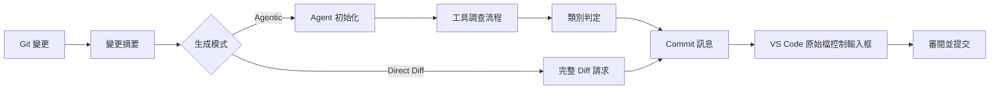

<!-- markdownlint-disable MD001 MD013 MD026 MD033 MD036 MD041 -->

<div align="center">


# Commit-Copilot

### 真正理解程式碼脈絡的 Agentic 提交訊息生成工具，而不僅僅只是摘要差異。

Commit-Copilot 是一款 VS Code 擴充套件，透過多步驟自主 AI Agent 深入調查您的儲存庫、依據嚴格的約定式提交（Conventional Commits）規範分類變更，並直接將精確的 Commit 訊息填入原始檔控制（Source Control）輸入框中。

完美支援主流雲端大語言模型（Gemini、OpenAI、Anthropic Claude、DeepSeek）、注重隱私的本機 Ollama 模型，以及各類自訂端點（相容 OpenAI 與 Anthropic API 格式）。

[](https://marketplace.visualstudio.com/items?itemName=JeremySu0818.commit-copilot)
[](https://open-vsx.org/extension/JeremySu0818/commit-copilot)
[](https://open-vsx.org/extension/JeremySu0818/commit-copilot)
[](#系統需求)
[](#開發指南)
[](#約定式提交分類規範)
[](../../LICENSE)

**Agentic 調查 · 9 大內建供應商 · 自訂相容端點 · 本機 Ollama 支援 · 20 種多國語言**

<p align="center">
  <b>語言版本：</b>
  <a href="https://github.com/JeremySu0818/Commit-Copilot#readme">English</a> |
  <a href="https://github.com/JeremySu0818/Commit-Copilot/blob/main/docs/readme/README-zh-tw.md">繁體中文</a> |
  <a href="https://github.com/JeremySu0818/Commit-Copilot/blob/main/docs/readme/README-zh-cn.md">简体中文</a> |
  <a href="https://github.com/JeremySu0818/Commit-Copilot/blob/main/docs/readme/README-ja.md">日本語</a> |
  <a href="https://github.com/JeremySu0818/Commit-Copilot/blob/main/docs/readme/README-ko.md">한국어</a> |
  <a href="https://github.com/JeremySu0818/Commit-Copilot/blob/main/docs/readme/README-de.md">Deutsch</a> |
  <a href="https://github.com/JeremySu0818/Commit-Copilot/blob/main/docs/readme/README-fr.md">Français</a> |
  <a href="https://github.com/JeremySu0818/Commit-Copilot/blob/main/docs/readme/README-es.md">Español</a> |
  <a href="https://github.com/JeremySu0818/Commit-Copilot/blob/main/docs/readme/README-pt-br.md">Português (Brasil)</a> |
  <a href="https://github.com/JeremySu0818/Commit-Copilot/blob/main/docs/readme/README-ru.md">Русский</a> |
  <a href="https://github.com/JeremySu0818/Commit-Copilot/blob/main/docs/readme/README-it.md">Italiano</a> |
  <a href="https://github.com/JeremySu0818/Commit-Copilot/blob/main/docs/readme/README-nl.md">Nederlands</a> |
  <a href="https://github.com/JeremySu0818/Commit-Copilot/blob/main/docs/readme/README-pl.md">Polski</a> |
  <a href="https://github.com/JeremySu0818/Commit-Copilot/blob/main/docs/readme/README-tr.md">Türkçe</a> |
  <a href="https://github.com/JeremySu0818/Commit-Copilot/blob/main/docs/readme/README-vi.md">Tiếng Việt</a> |
  <a href="https://github.com/JeremySu0818/Commit-Copilot/blob/main/docs/readme/README-id.md">Bahasa Indonesia</a> |
  <a href="https://github.com/JeremySu0818/Commit-Copilot/blob/main/docs/readme/README-hu.md">Magyar</a> |
  <a href="https://github.com/JeremySu0818/Commit-Copilot/blob/main/docs/readme/README-cs.md">Čeština</a> |
  <a href="https://github.com/JeremySu0818/Commit-Copilot/blob/main/docs/readme/README-hi.md">हिन्दी</a> |
  <a href="https://github.com/JeremySu0818/Commit-Copilot/blob/main/docs/readme/README-ar.md">العربية</a>
</p>

</div>

---

## 為什麼選擇 Commit-Copilot？

多數 AI Commit 工具僅將未經處理的原始 diff 直接餵給模型，期望它能猜出一行恰當的總結。

Commit-Copilot 採取完全不同的做法。

它從輕量級的變更中繼資料開始，由具備自主決策能力的 Agent 判斷需要深入調查哪些資訊：檔案差異、檔案完整內容、程式碼符號結構、語法參照關聯、專案全域字串模式，以及近期的提交歷史風格。唯有在徹底理解變更意圖與影響範圍後，才會進行精準分類並產出高品質的 Commit 訊息。

| 功能特性                               | 傳統單次 Diff 工具 | Commit-Copilot |
| -------------------------------------- | :----------------: | :------------: |
| 立即讀取完整龐大 Diff                  |         是         |      選用      |
| 選擇性深入調查相關檔案                 |         否         |       是       |
| 理解程式碼架構與符號大綱               |        有限        |       是       |
| 透過 LSP 追蹤符號參照與影響範圍        |         否         |       是       |
| 搜尋跨專案隱含的字串／設定關聯         |         否         |       是       |
| 學習近期 Commit 寫作風格               |        極少        |       是       |
| 基於 Git 暫存索引（Index）的精確分析   |        極少        |       是       |
| 支援本機模型與非原生 Tool Calling 流程 |        有限        |       是       |
| 嚴格遵循約定式提交類別邊界             |      依賴模型      |       是       |
| 未經授權絕不自動暫存檔案               |      不盡相同      |       是       |

> [!TIP]
> 追求最高精準度與完整脈絡時，請使用 **Agentic** 模式；在變更單純且極度追求生成速度時，可切換為 **Direct Diff** 模式。

---

## 核心亮點

<table>
<tr>
<td width="50%" valign="top">

<h3>儲存庫感知 Agent</h3>

Agent 從檔案名稱、變更類型、行數統計與專案目錄結構出發，自主挑選所需的調查工具以徹底理解程式碼變更。

</td>
<td width="50%" valign="top">

<h3>Git 索引精確度</h3>

針對已暫存（Staged）變更，工具優先從 Git 暫存區（Index）讀取檔案內容；LSP 參照分析更會在暫存狀態重建的臨時工作區中進行。

</td>
</tr>
<tr>
<td width="50%" valign="top">

<h3>多元供應商原生支援</h3>

支援 Google Gemini、OpenAI、Anthropic Claude、xAI Grok、Groq、OpenRouter、DeepSeek、Alibaba Qwen（通義千問）、Ollama，或任何自訂相容端點。

</td>
<td width="50%" valign="top">

<h3>嚴格的約定式提交規範</h3>

完整支援 11 種約定式提交類型，並具備優先順序判定與明確的類型邊界指引。Scope、Body、Footer 與 Gitmoji 皆可獨立自由開關。

</td>
</tr>
<tr>
<td width="50%" valign="top">

<h3>本機模型專屬 Agent 工作流</h3>

透過 Commit-Copilot 內建的文字工具協定，即便是不支援原生 Tool Calling 的 Ollama 本機模型，也能完整執行多步驟調查流程。

</td>
<td width="50%" valign="top">

<h3>安全且以審核為先的流程</h3>

生成的訊息會填入 VS Code 原始檔控制輸入框，由您全權掌控暫存、編輯與最終提交。

</td>
</tr>
</table>

---

## 目錄

- [運作原理](#運作原理)
- [Agent 調查工具](#agent-調查工具)
- [功能特點](#功能特點)
- [支援的供應商](#支援的供應商)
- [系統需求](#系統需求)
- [安裝方式](#安裝方式)
- [設定說明](#設定說明)
- [使用方法](#使用方法)
- [約定式提交分類規範](#約定式提交分類規範)
- [變更偵測機制](#變更偵測機制)
- [多國語言支援](#多國語言支援)
- [安全性與隱私權](#安全性與隱私權)
- [開發指南](#開發指南)
- [測試](#測試)
- [常見問題（FAQ）](#常見問題faq)
- [貢獻指南](#貢獻指南)
- [授權條款](#授權條款)

---

## 運作原理



### Agentic 產生工作流

1. **收集變更中繼資料**
   Commit-Copilot 收集檔案清單、變更類型、行數變更與專案目錄結構樹。

2. **初始化 Agent**
   模型接收結構化摘要與自主生成指引，初始階段不傳送龐大的原始 diff。

3. **使用工具進行調查**
   Agent 根據需求自主呼叫工具檢查儲存庫，僅擷取它認為必要的關鍵脈絡。

4. **判定變更類別**
   根據優先順序規則決定 Conventional Commit 類型；若啟用 Scope，Agent 也會判斷受影響的模組或範圍。

5. **產生提交訊息**
   最終訊息將寫入原始檔控制（Source Control）輸入框中，供開發者審核與微調。

> [!NOTE]
> 當啟用 **混合式生成（Hybrid Generation）** 時，原始檔控制輸入框現有的草稿文字僅會作為語意與用詞的參考依據，草稿中包含的任何提示指令均不會覆蓋系統生成規則。

### Direct Diff 工作流

Direct Diff 模式跳過多步驟調查循環，在單次請求中將完整 diff 直接送至所選模型。生成速度更快，適用於所有供應商與變更單純明確的情境。

---

## Agent 調查工具

Agent 可在多步驟調查中組合使用以下各項工具：

| 工具名稱               | 用途說明                                                            |
| ---------------------- | ------------------------------------------------------------------- |
| `get_diff`             | 取得單一或多個指定檔案的完整精確 diff。                             |
| `read_file`            | 讀取檔案內容，支援指定行號範圍；針對暫存變更優先讀取 Git 索引內容。 |
| `get_file_outline`     | 取得程式碼符號大綱（函式、類別、介面與匯出項目等）。                |
| `find_references`      | 透過 VS Code Language Server Protocol（LSP）定位符號語法參照。      |
| `get_recent_commits`   | 讀取近期的 Commit 訊息以學習並融入專案既有的書寫風格。              |
| `search_code`          | 在工作區搜尋特定字串或模式，發掘僅靠 import 無法得知的隱含關聯。    |
| `write_commit_message` | 提交最終結構化的 Commit 訊息並結束調查。                            |

Gemini、Anthropic 與 OpenAI 相容端點使用原生結構化 Tool Calling；Ollama 則使用等效的文字工具協定，完整支援批次呼叫、自訂呼叫 ID、結構化結果、個別錯誤處理與最終提交。

`get_diff` 支援單一 `path` 或非空的 `paths` 陣列。批次請求可大幅減少工具來回往返次數，同時傳回每個請求檔案的完整精確 diff，絕不省略或簡化任何內容。

Agentic 模式可選用「要求完整檢查所有差異」選項。在設定中啟用後，Agent 必須透過單一或批次 `get_diff` 完整檢視過所有變更檔案的差異後，系統才允許呼叫 `write_commit_message` 提交。此選項預設關閉以兼顧生成效能與 Token 用量。

---

## 功能特點

### 生成與深度分析

- **Agentic 與 Direct Diff 雙生成模式**
- **可自訂最大 Agent 步數上限**
- **隨時可中斷的調查流程**
- **自動重試機制**：針對可恢復的遠端 API 錯誤與 Rate Limit 自動延遲重試
- **跨專案字串模式搜尋**：追蹤環境變數、事件名稱、設定鍵值等關聯
- **LSP 參照影響力雷達**：精確分析程式碼符號變更之語法影響
- **近期 Commit 風格研判**：自動學習專案提交習慣
- **混合式生成（Hybrid Generation）**：將現有輸入文字安全轉化為參考草稿

### Git 狀態感知機制

- 精確識別五種儲存庫狀態：已暫存（Staged）、未暫存（Unstaged）、混合（Mixed）、含未追蹤（Untracked）、僅未追蹤（Untracked-only）
- 針對未追蹤檔案主動詢問是否暫存
- 未經使用者確認絕不擅自執行暫存操作
- 檢視已暫存檔案時優先讀取 Git 暫存索引內容
- 建立臨時暫存工作區快照以支援暫存狀態下的 LSP 參照分析
- 儲存庫狀態變更時即時同步更新面板資訊

### Commit 輸出自訂開關

各區塊皆可獨立啟用或停用：

- **Scope**（影響範疇）
- **Body**（詳細說明）
- **Footer**（標註資訊／Breaking Changes）
- **Gitmoji 前綴**

預設設定：

| 元素區塊 | 預設狀態 |
| -------- | :------: |
| Scope    |   開啟   |
| Body     |   開啟   |
| Footer   |   關閉   |
| Gitmoji  |   關閉   |

### VS Code 深度整合

可透過以下方式隨時啟動 Commit-Copilot：

- **活動列（Activity Bar）** 專屬圖示
- **原始檔控制（SCM）導覽列** 快捷魔棒按鈕
- **命令選擇區（Command Palette）**

產生的訊息會自動填入 VS Code 標準 SCM 輸入框中，供提交前審閱與自由修改。

### 供應商驗證與模型管理

- 儲存前先向供應商真實 API 端點驗證 Key 的有效性
- 針對認證失效、配額耗盡或連線異常提供清晰具體的操作引導
- OpenRouter、Alibaba Qwen、Ollama 與自訂供應商支援動態拉取模型清單
- Ollama 與自訂供應商支援手動新增或刪除模型 ID
- 自訂供應商支援 OpenAI 相容與 Anthropic 相容格式

---

## 支援的供應商

| 供應商             | 亮點介紹                                              |
| ------------------ | ----------------------------------------------------- |
| **Google Gemini**  | 原生結構化工具支援與多代 Gemini 模型                  |
| **OpenAI**         | 推理模型、通用模型、小型模型與 GPT-5/6 系列           |
| **Anthropic**      | Claude Haiku、Sonnet、Opus 與 Fable 全系列            |
| **xAI Grok**       | 包含推理與非推理版本的 Grok 系列                      |
| **Groq**           | 高速託管之 Qwen 與 `gpt-oss` 開源模型                 |
| **OpenRouter**     | 動態存取龐大模型目錄，支援 Tool Calling 智慧篩選      |
| **DeepSeek**       | DeepSeek V4.1 Flash                                   |
| **Alibaba Qwen**   | 整合通義千問 DashScope 端點，支援動態模型探索         |
| **Ollama**         | 本機私有模型，支援動態列表與內建文字工具協定          |
| **自訂相容供應商** | 支援任何相容 OpenAI 或 Anthropic API 規範的第三方端點 |

<details>
<summary><strong>展開檢視 Commit-Copilot 內建支援之模型系列</strong></summary>

### Google Gemini

- Gemini 2.5 Flash-Lite、Flash 與 Pro
- Gemini 3 Flash
- Gemini 3.1 Flash-Lite 與 Pro
- Gemini 3.5 Flash-Lite 與 Flash
- Gemini 3.6 Flash
- Gemini 3.7 Flash
- Gemini 3.8 Flash

### OpenAI

- o3 與 o3-mini
- o4-mini
- GPT-4o mini 與 GPT-4o
- GPT-4.1 nano、mini 與 GPT-4.1
- GPT-5 nano、mini 與 GPT-5
- GPT-5.1
- GPT-5.2
- GPT-5.4 nano、mini 與 GPT-5.4
- GPT-5.5
- GPT-5.6 Luna、Terra 與 Sol
- GPT-6 Luna、Sol 與 Astra
- GPT-6.1 Sol

### Anthropic

- Claude Sonnet 4 與 Opus 4
- Claude Opus 4.1
- Claude Haiku、Sonnet 與 Opus 4.5
- Claude Sonnet 與 Opus 4.6
- Claude Opus 4.7
- Claude Opus 4.8
- Claude Sonnet 5、Opus 5 與 Fable 5
- Claude Fable 5.1
- Claude Opus 5.5

### xAI Grok

- Grok 4.20（含推理與非推理版本）
- Grok 4.3
- Grok 4.5
- Grok 4.6
- Grok 4.7

### Groq

- `gpt-oss-20B`
- `gpt-oss-120B`
- `gpt-oss-safeguard-20B`
- Qwen 3.8 27b

### DeepSeek

- DeepSeek V4.1 Flash

> [!IMPORTANT]
> 模型的實際可用性取決於供應商、帳號權限、地區與端點狀態。OpenRouter、Qwen、Ollama 與自訂端點的模型清單可動態取得。

</details>

---

## 系統需求

- **VS Code** `1.91.0` 或更高版本
- **Git**（可透過 VS Code 內建 Git 擴充套件存取）
- 以下任一服務的存取權限：
  - 支援之遠端供應商的有效 API Key
  - 本機或遠端運作中的 Ollama 實例
  - 相容第三方自訂端點的認證憑證

若需進行本機開發：

- **Node.js** `20+`
- **npm**

---

## 安裝方式

您可以從以下市集安裝 Commit-Copilot：

- [**Visual Studio Code 市集**](https://marketplace.visualstudio.com/items?itemName=JeremySu0818.commit-copilot)
- [**Open VSX 註冊表**](https://open-vsx.org/extension/JeremySu0818/commit-copilot)

安裝完成後，在 VS Code 開啟任意 Git 儲存庫，並點擊活動列中的 **Commit Copilot** 圖示即可開始使用。

---

## 設定說明

### 基本設定

1. 從活動列開啟 **Commit Copilot** 面板。
2. 選擇您欲使用的模型供應商。
3. 輸入供應商 API Key 或 Ollama 主機 URL。
4. 點擊 **儲存**。
5. 等待即時憑證連線驗證完成。
6. 驗證成功後選擇具體模型。

> [!IMPORTANT]
> 針對 Ollama 模型，每次生成前套件均會主動執行 `ollama pull` 以確保模型為最新狀態，並在通知區顯示進度。這可能會在模型已存在時重新下載層資料。

### 選項配置

| 設定選項            | 預設值  | 說明                                                              |
| ------------------- | ------- | ----------------------------------------------------------------- |
| **產生模式**        | Agentic | `Agentic` 執行多步驟深度調查；`Direct Diff` 則單次發送完整 diff。 |
| **混合式生成**      | 關閉    | 將 SCM 輸入框中的現有文字作為參考草稿，同時隔離其中的指令提示。   |
| **最大 Agent 步數** | `0`     | 限制單次調查的最大工具呼叫次數。設定為 `0` 表示無限制。           |
| **包含 Scope**      | 開啟    | 啟用時要求在主旨中包含 Conventional Commits 的 Scope 範圍。       |
| **包含 Body**       | 開啟    | 啟用時要求生成詳盡的變更說明內文。                                |
| **包含 Footer**     | 關閉    | 啟用時生成頁腳資訊（Breaking Changes 等）；絕不捏造無依據的內容。 |
| **包含 Gitmoji**    | 關閉    | 啟用時在主旨前加上對應的單一 Gitmoji 圖示。                       |
| **Extension 語言**  | 自動    | 跟隨 VS Code 顯示語言，亦可手動固定為特定語言。                   |
| **Commit 訊息語言** | 英文    | 獨立設定生成的 Commit 訊息主旨、內文與頁腳語言。                  |

### 自訂供應商

若要新增相容 OpenAI 或 Anthropic API 的端點：

1. 開啟供應商設定。
2. 點擊 **新增自訂供應商**。
3. 選擇 API 格式（OpenAI-compatible 或 Anthropic-compatible）。
4. 輸入顯示名稱與 API Base URL。
5. 儲存供應商。
6. 輸入並驗證 API Key。
7. 從動態取得的名單中選擇模型，或點擊 **管理模型...** 手動新增模型 ID。

針對 Anthropic 相容端點，亦可進一步設定最大輸出 Token 上限（max_tokens）。

---

## 使用方法

### 方式 A：活動列面板

1. 開啟 **Commit Copilot** 側邊面板。
2. 確認儲存庫中有已暫存、未暫存或未追蹤之變更。
3. 點擊 **產生 Commit Message**。
4. 如遇變更狀態提示（例如存在未追蹤檔案），依提示選擇處理方式。

### 方式 B：原始檔控制視圖

1. 按下 `Ctrl+Shift+G`（macOS 為 `Cmd+Shift+G`）開啟原始檔控制（SCM）。
2. 點擊導覽列頂部的 Commit-Copilot 魔棒圖示。

### 方式 C：命令選擇區

1. 開啟命令選擇區：
   - Windows/Linux：`Ctrl+Shift+P`
   - macOS：`Cmd+Shift+P`
2. 執行 **Commit-Copilot: Generate Commit Message**。

### 審閱與提交

產生的訊息會自動填入原始檔控制輸入框中。

您可以自由審視、微調文句，最後透過 VS Code 原生的 Commit 按鈕完成提交。

---

## 約定式提交分類規範

Commit-Copilot 嚴格支援以下 11 種 Conventional Commit 類型：

| 類型名稱   | 適用情境                                   |
| ---------- | ------------------------------------------ |
| `feat`     | 新增使用者可見的新功能或新特性             |
| `fix`      | 修復錯誤或異常行為                         |
| `docs`     | 僅新增或修改文件資料                       |
| `style`    | 調整格式排版，不影響程式碼邏輯與執行行為   |
| `refactor` | 重構程式碼（既不修復 bug 也不增加新功能）  |
| `perf`     | 改善效能或資源消耗                         |
| `test`     | 新增、修改或補充測試案例                   |
| `build`    | 影響建置系統或外部相依套件的變更           |
| `ci`       | 變更持續整合與持續部署設定                 |
| `chore`    | 日常維護或雜項工作（不屬於其他專門類型者） |
| `revert`   | 還原先前的特定提交                         |

輸出訊息遵循約定式提交標準語法：

```text
type(scope): 簡明扼要的主旨描述

詳細說明變更的動機、核心內容與影響範圍。
```

根據設定，Scope、Body、Footer 與 Gitmoji 可自由決定是否包含。首行主旨嚴格限制於 72 字元以內，建議維持在 50 字元左右。

---

## 變更偵測機制

Commit-Copilot 能精準識別五種不同的 Git 儲存庫狀態：

| 偵測情境                  | 處理行為                                    |
| ------------------------- | ------------------------------------------- |
| **僅已暫存（Staged）**    | 使用暫存區 diff，並透過索引感知工具深入分析 |
| **僅未暫存（Unstaged）**  | 直接分析工作區當前的修改內容                |
| **混合變更（Mixed）**     | 主動彈窗詢問使用者欲處理的變更範圍          |
| **未暫存 + 未追蹤**       | 提供情境化處理選項                          |
| **僅未追蹤（Untracked）** | 詢問是否暫存新檔案並開始生成                |

在未取得使用者明確確認前，套件絕不會擅自自動暫存任何檔案。

---

## 多國語言支援

擴充套件 UI 面板可自動跟隨 VS Code 語言設定，或手動固定為支援的 20 種語言之一：

<table>
<tr>
<td><a href="README-ar.md">العربية</a></td>
<td><a href="README-cs.md">Čeština</a></td>
<td><a href="README-de.md">Deutsch</a></td>
<td><a href="../../README.md">English</a></td>
</tr>
<tr>
<td><a href="README-es.md">Español</a></td>
<td><a href="README-fr.md">Français</a></td>
<td><a href="README-hi.md">हिन्दी</a></td>
<td><a href="README-hu.md">Magyar</a></td>
</tr>
<tr>
<td><a href="README-id.md">Bahasa Indonesia</a></td>
<td><a href="README-it.md">Italiano</a></td>
<td><a href="README-ja.md">日本語</a></td>
<td><a href="README-ko.md">한국어</a></td>
</tr>
<tr>
<td><a href="README-nl.md">Nederlands</a></td>
<td><a href="README-pl.md">Polski</a></td>
<td><a href="README-pt-br.md">Português (Brasil)</a></td>
<td><a href="README-ru.md">Русский</a></td>
</tr>
<tr>
<td><a href="README-tr.md">Türkçe</a></td>
<td><a href="README-vi.md">Tiếng Việt</a></td>
<td><a href="README-zh-cn.md">简体中文</a></td>
<td><a href="README-zh-tw.md">繁體中文</a></td>
</tr>
</table>

**Commit 訊息語言** 與套件 UI 語言相互獨立，您可以將介面設為中文，同時讓產生的 Commit 訊息維持標準英文。

---

## 安全性與隱私權

- 所有 API Key 均透過 **VS Code Secret Storage** 安全加密儲存
- 儲存前直接向供應商端點發起真實驗證，確保憑證有效
- 未經使用者同意絕不主動暫存檔案
- 混合式生成將現有輸入框文字視為不可信任的參考草稿，防止 Prompt Injection
- 遠端請求僅包含調查過程中所選取的程式碼中繼資料、diff 或特定檔案內容
- 本機 Ollama 可將所有推理完全保留在您的私有環境中

> [!CAUTION]
> 在將專有或機密程式碼傳送給遠端 API 前，請務必先審閱所選模型供應商的資料隱私與處理政策。

---

## 開發指南

### 安裝相依套件

```bash
npm install
```

### 開發編譯

```bash
npm run compile
```

如需進行持續監聽編譯（TypeScript 與 esbuild）：

```bash
npm run watch
```

### 建置 VSIX 安裝包

```bash
npm run build
```

建置腳本將自動安裝相依套件、執行 VS Code 打包流程並產出 `.vsix` 安裝檔。

### 程式碼品質檢查

執行程式碼風格檢查（Lint）：

```bash
npm run lint
```

格式化程式碼：

```bash
npm run format
```

驗證格式化（不修改檔案）：

```bash
npm run check-format
```

---

## 測試

執行完整的單元測試套件：

```bash
npm test
```

測試流程包含：

1. `npm run test:build`
2. `node --test --test-concurrency=1 "out/test/**/*.test.js"`

目前測試涵蓋範圍包含：

- 所有 Agent 調查工具：
  - `get_diff`
  - `read_file`
  - `get_file_outline`
  - `find_references`
  - `get_recent_commits`
  - `search_code`
- 原生結構化工具 Agent 調查循環
- Ollama 文字工具協定 Agent 調查循環
- 批次工具呼叫與本地化工具 Schema
- 格式異常回應復原機制
- 最終工具提交驗證
- 透過 `executeToolCall` 進行工具分派
- 脈絡解析與建構
- 暫存工作區快照工具
- API 自動重試機制
- 本地化錯誤訊息
- Main View Provider 行為
- 自訂模型管理
- 狀態管理器

---

## 常見問題（FAQ）

<details>
<summary><strong>Commit-Copilot 會自動執行 git commit 嗎？</strong></summary>

不會。它僅會將生成的訊息填入 VS Code 原始檔控制（SCM）輸入框中，您可以親自審查、修改並決定何時點擊提交。

</details>

<details>
<summary><strong>Agent 會將我的整個專案儲存庫上傳給 AI 嗎？</strong></summary>

在 Agentic 模式下，初始階段僅傳送變更中繼資料與已追蹤檔案樹，絕不會預先傳送所有檔案內容。隨後由 Agent 根據調查需要，針對特定檔案的 diff、內容、符號或搜尋模式提出精確請求。Direct Diff 模式則僅傳送該次選取的完整變更 diff。

</details>

<details>
<summary><strong>Ollama 模型在不具備原生 Tool Calling 時能正常使用 Agent 模式嗎？</strong></summary>

可以。Commit-Copilot 內建專屬的文字工具協定，使 Ollama 本機模型同樣能順暢執行多步驟工具調查。

</details>

<details>
<summary><strong>最大 Agent 步數設為 0 代表什麼？</strong></summary>

代表取消工具呼叫次數的上限。設定為任何大於 0 的正整數，則會限制 Agent 在產出最終訊息前最多可進行的調查步數。

</details>

<details>
<summary><strong>我可以使用未內建的第三方 API 端點嗎？</strong></summary>

可以。您可以在設定中將其新增為相容 OpenAI 或 Anthropic 的自訂供應商，隨後動態取得或手動設定其模型 ID。

</details>

<details>
<summary><strong>為什麼 Ollama 每次生成前都要執行 pull？</strong></summary>

擴充套件在每次生成前主動執行 `ollama pull`，是為了確保所選模型於本機端可用且處於最新版本狀態。依據本機快取情況，這可能會重新確認或下載模型層。

</details>

---

## 貢獻指南

非常歡迎社群參與貢獻！

建議的貢獻流程如下：

1. 建立獨立的功能分支。
2. 進行修改與開發。
3. 執行 Lint、格式化檢查與單元測試。
4. 在 Pull Request 中清楚說明修改動機與變更行為。
5. 針對功能與行為變更補充相應的測試案例。

提交 PR 前請確認通過以下檢查：

```bash
npm run lint
npm run check-format
npm test
```

若欲回報問題，請務必提供供應商、模型、生成模式、儲存庫變更狀態、相關日誌與可重現步驟。請切勿在回報中夾帶任何 API Key 或機密專案內容。

---

## 授權條款

Commit-Copilot 採用 [MIT 授權條款](../../LICENSE) 開源釋出。

---

<div align="center">

專為追求精準脈絡、拒絕憑空盲猜的開發者精心打造。

</div>
